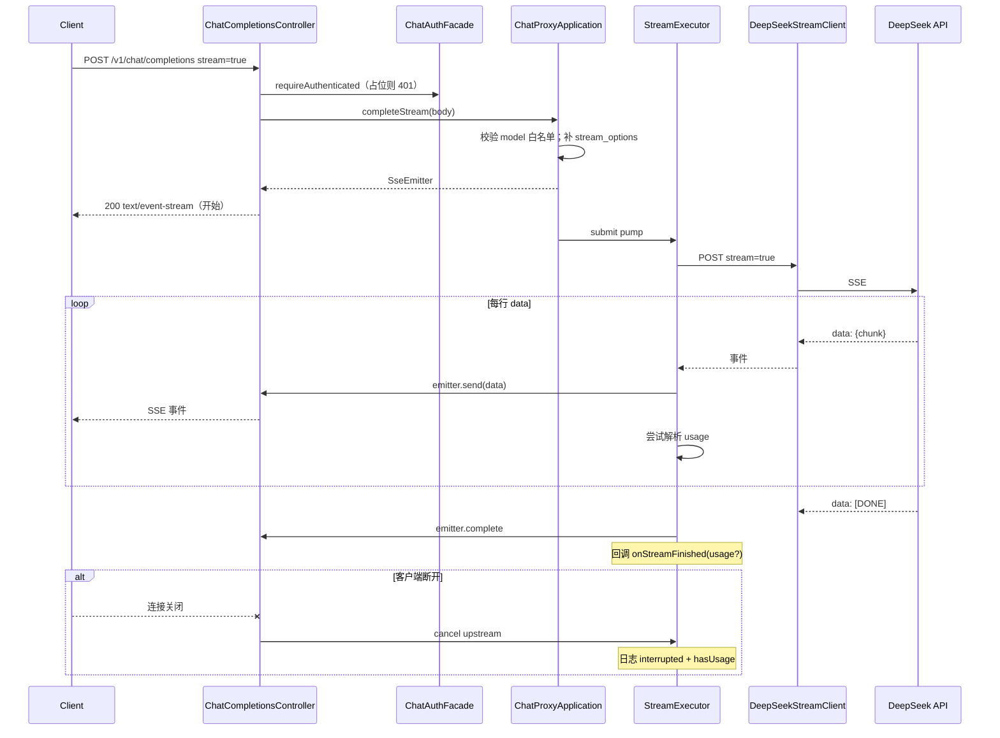

# US-G0-04 流式 SSE 代理设计

> **用户故事**：[../02-用户故事.md](../02-用户故事.md) · US-G0-04  
> **状态**：编码已落地（Mock SSE 单测；HTTP 鉴权占位 401；真上游联调随 G0-08）  
> **范围**：同一入口 `POST /v1/chat/completions` 在 `stream=true` 时透传上游 SSE；解析结束 usage（为 G0-10 预留）；客户端中断可观测；**不含** sk 鉴权、扣费落库  
> **需求映射**：[../01-需求.md](../01-需求.md) FR-PROXY-02/03；结算时机 §7.2（本故事只做到「能拿到 usage / 记录中断」，不扣费）；NFR-03（并发量级参考）  
> **依赖**：US-G0-03（非流式代理、白名单、上游配置、鉴权占位）  
> **后续衔接**：US-G0-08（sk）；US-G0-10（按 usage 扣费与中断结算）  
> **文档位置**：`token-gateway/docs/design/`

---

## 0. 相对 G0-03 / 联调约定

| 项 | 约定 |
|----|------|
| 入口 | **同一** `POST /v1/chat/completions`；按 `stream` 分支，不再返回 `stream_not_supported` |
| 鉴权 | 继续走 `ChatAuthFacade`；G0-08 前占位 **401** `sk_auth_pending`；**无**测试 Key / 免鉴权开关 |
| 联调 | 编码期以 **Mock 上游 SSE** 单测验收；真上游 + 真 sk **与 G0-08（及计费）统一联调** |
| 计费 | 本故事 **不扣费、不写** `token_request_logs` / ledger；但须 **能解析并暂存最终 usage**（及中断时是否已有 usage），供 G0-10 挂接 |

---

## 1. 已确认选型

| 项 | 决定 |
|----|------|
| 响应形态 | OpenAI 兼容 **SSE**（`Content-Type: text/event-stream`） |
| 服务端 API | Spring WebMVC **`SseEmitter`**（与 US-G0-01 选型一致；非 WebFlux） |
| 上游 | 同 G0-03：`POST {baseUrl}/chat/completions`，`Authorization: Bearer DEEPSEEK_API_KEY`，body 含 `stream: true` |
| 出站 HTTP | **`java.net.http.HttpClient`**（或等价可流式读 `InputStream` 的客户端）读响应体按行泵送；**不用**把整包缓冲进内存。G0-03 的 `RestClient` 同步 JSON 路径保留给非流式 |
| 泵送线程 | 独立线程池（如 `token-gateway.upstream.deepseek.stream-executor`）执行「读上游 → `emitter.send`」，避免长期占满 Tomcat 工作线程 |
| usage | 出站时若客户端未带，则 **补全** `stream_options.include_usage=true`（见 §5），以便末包携带 usage，对齐 FR-PROXY-03 / §7.2 |
| 白名单 / model | 复用 G0-03 `ModelWhitelist`；校验失败在 **开流前** 返回 JSON 4xx |
| 超时 | 流式单独配置（连接超时可共用；读/空闲超时更长，见 §6） |
| 中断 | 客户端断开 / emitter 超时 / 错误 → 取消上游读、打可观测日志（含 `requestId`、是否已见 usage） |

---

## 2. 目标与非目标

### 2.1 目标

1. `stream=true` 时上游 SSE **逐事件透传**至客户端，体验接近直连 DeepSeek。  
2. 正常结束可得到最终 **usage**（或明确「无 usage」结果），供后续一次结算。  
3. 流式中断可观测（日志），并区分「已有 usage / 无 usage」（对应 §7.2，本故事只记录语义，不落库扣费）。  
4. 与非流式共用鉴权门面、白名单与上游 Key 配置；不泄露上游 Key / prompt 正文。

### 2.2 非目标

| 不做 | 归属 |
|------|------|
| sk 鉴权 / 临时绕过 | G0-08；本故事不新增旁路 |
| 扣费、账本、`token_request_logs` | US-G0-10 |
| 余额预检 | US-G0-11 |
| WebFlux / 改栈 | 保持 WebMVC |
| 改写 messages / 聚合全文回放 | 仅透传 SSE |
| 多上游 | Out of Scope |

---

## 3. 流程



---

## 4. API 契约

### 4.1 请求

```http
POST /v1/chat/completions HTTP/1.1
Authorization: Bearer sk-xxxxxxxx
Content-Type: application/json

{
  "model": "deepseek-v4-flash",
  "messages": [
    {"role": "user", "content": "Hello"}
  ],
  "stream": true
}
```

| 字段 | 规则 |
|------|------|
| `stream` | `true` → 本故事 SSE 路径；`false` / 缺省 → 仍走 G0-03 非流式 |
| `model` | 同 G0-03，白名单 |
| `stream_options` | 可选；网关出站保证 `include_usage=true`（§5） |
| 鉴权 | 同 G0-03：占位 401，直至 G0-08 |

### 4.2 成功（流式）

- HTTP **200**，`Content-Type: text/event-stream`（及常见 `Cache-Control: no-cache`）。  
- Body：透传上游 SSE 帧（`data: {...}\n\n` … `data: [DONE]\n\n`）。  
- 响应头保留 / 设置 `X-Request-Id`。  
- **不**在流结束后再附一条网关自有 JSON 汇总（客户端按 OpenAI 习惯解析即可）。

### 4.3 开流前错误（JSON，非 SSE）

与 G0-03 一致：401 / 400（`model_*`）/ 503（未配上游 Key）等，在返回 `SseEmitter` **之前**抛出。

### 4.4 开流后错误

| 情况 | 行为 |
|------|------|
| 上游连接失败且尚未向客户端写 SSE | 尽量仍以 JSON/状态码错误返回（实现上若已 commit 响应则只能关流） |
| 上游中途 4xx/5xx 或断连 | 停止泵送；`emitter.completeWithError` 或 complete；**不**把上游 Key 写入事件 |
| 客户端断开 | 取消上游；打 INFO/WARN：`requestId`、`stream=interrupted`、`has_usage=` |

不对客户端发明非标准 SSE error 帧格式（避免破坏 OpenCode 等）；以关流 + 服务端日志为主。

---

## 5. usage 获取策略

OpenAI / DeepSeek 流式默认 chunk **常无** `usage`；需：

```json
"stream_options": { "include_usage": true }
```

| 规则 | |
|------|--|
| 出站规范化 | 在 `stream=true` 的出站 JSON 上：若无 `stream_options` 则创建；设 `include_usage=true`（若客户端已为 true 则保持；若为 false，**仍强制 true**——计费需要，可在设计确认后改为「仅当缺省时补全」；**默认推荐强制 true**） |
| 解析 | 泵送时对每条 `data:` JSON（非 `[DONE]`）尝试读 `usage`；保留**最后一次非空** usage |
| 正常结束 | `[DONE]` 或上游 EOF 后：回调 `StreamFinishContext{ usage, interrupted=false }` |
| 中断 | `interrupted=true`，附带当前已解析到的 usage（可能为 null） |
| G0-10 | 在回调中扣费：有 usage → 扣一次；无 usage → `skipped_no_usage`；本故事回调可为空实现或仅打 debug |

**强制 `include_usage=true` 的产品含义**：对客户端几乎透明（多一个选项），保障网关能结算；若上游忽略该字段，则按「无 usage」路径处理。

---

## 6. 超时、线程与并发

### 6.1 配置扩展（建议）

```yaml
token-gateway:
  upstream:
    deepseek:
      # 已有 connect/read 可用于非流式
      stream-read-timeout: 300s      # 整段流最大读时长（或 idle）
      stream-emitter-timeout: 300s   # SseEmitter 超时
      stream-pool-size: 64           # 泵送线程池（对齐 NFR-03≈50 留余量）
```

具体用「整段 deadline」还是「idle 超时」编码时二选一，文档化即可；推荐 **SseEmitter 超时 + HttpClient 请求超时** 双保险。

### 6.2 线程池

- 有界队列 + 明确拒绝策略（打日志，completeWithError）。  
- 池大小可配；默认 ≥ 50 并发目标。

---

## 7. 类与改动清单（编码）

| 类 / 改动 | 职责 |
|-----------|------|
| `ChatCompletionsController` | 鉴权后：`stream==true` → `completeStream` 返回 `SseEmitter`；否则 `complete` |
| `ChatProxyApplication` | 去掉对 `stream=true` 的 400；新增 `completeStream`；抽出共用 `assertModelAllowed` |
| `DeepSeekStreamClient`（新） | HttpClient 出站流式；按行解析；回调 chunk / finish |
| `StreamPump` / 内部 Runnable | 读流 → `SseEmitter.send(SseEmitter.event().data(...))`；处理 `[DONE]` |
| `StreamFinishListener`（可选接口） | G0-10 实现扣费；G0-04 默认 no-op 或只打结构化日志 |
| `TokenGatewayProperties` | stream 超时与线程池配置 |
| 单测 | Mock 上游返回多行 SSE；断言客户端收到顺序事件、末包 usage、断开时 cancel |

**不要**用 G0-03 `DeepSeekChatClient.postChat` 缓冲整包再假流式。

---

## 8. 安全与隐私

| 项 | 约定 |
|----|------|
| 上游 Key | 仅出站头 |
| Prompt / completion | 不写 AccessLog / INFO；流式泵送日志最多记事件计数、耗时、是否有 usage |
| 鉴权占位 | 与 G0-03 相同，防止未 sk 裸奔上游 |

---

## 9. 与前后故事衔接

| 故事 | 关系 |
|------|------|
| G0-03 | 非流式路径保留；共用白名单、Key、鉴权门面 |
| G0-08 | 替换鉴权后，流式/非流式一并真联调 |
| G0-10 | 实现 `StreamFinishListener`：成功/中断结算规则 §7.2；AT-02 |
| 桌面 / OpenCode | `stream=true` 为默认体验路径之一 |

---

## 10. 验收用例

| # | Given | When | Then |
|---|--------|------|------|
| S1 | Mock 上游多 chunk + `[DONE]`；鉴权测试替身 | `stream=true` 白名单模型 | 收到透传事件并以 DONE 结束 |
| S2 | Mock 末包含 `usage` | 正常结束 | `StreamFinishContext.usage` 非空 |
| S3 | 强制补全 `include_usage` | 出站 body | 含 `stream_options.include_usage=true` |
| S4 | `stream=false` | 同入口 | 仍走非流式 JSON（回归 G0-03） |
| S5 | 非法 model | `stream=true` | 开流前 400，无 SSE |
| S6 | 真实 HTTP、无 G0-08 | 任意 Chat | 401 占位 |
| S7 | 泵送中取消/关闭 emitter | 中断 | 上游读停止；日志含 interrupted；has_usage 正确 |
| S8 | 未配 `DEEPSEEK_API_KEY` | stream | 503（开流前） |

---

## 11. 编码任务清单（确认后）

1. ~~Properties：流式超时、线程池。~~  
2. ~~`DeepSeekStreamClient` + 泵送 + `SseEmitter` 接入 Controller / Application。~~  
3. ~~出站补全 `stream_options.include_usage`；解析 usage；`StreamFinishListener` 钩子。~~  
4. ~~中断取消与日志。~~  
5. ~~单测（Mock SSE）；更新 `home.html` / README。~~  
6. ~~删除 G0-03 的 `stream_not_supported` 分支。~~

---

## 12. 待确认点（若无异议则按默认）

| # | 议题 | 默认 |
|---|------|------|
| Q1 | 客户端显式 `include_usage=false` 时是否仍强制 true | **强制 true**（保障计费） |
| Q2 | 开流后上游错误是否发自定义 SSE error 帧 | **不发**，关流 + 日志 |
| Q3 | 泵送用 HttpClient vs 流式 RestClient | **HttpClient**（控制度更好） |

确认本设计后即可按 §11 编码。
