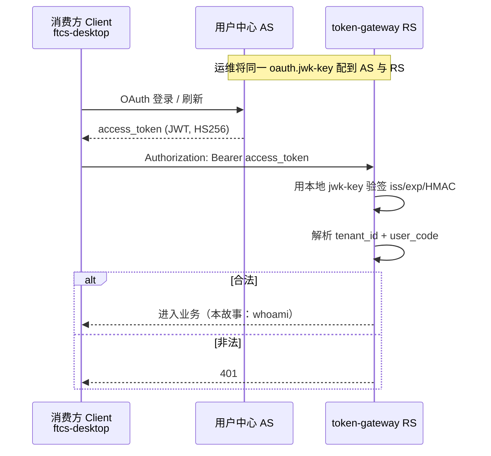

# US-G0-05 作为 RS 校验用户中心 JWT 设计

> **用户故事**：[../02-用户故事.md](../02-用户故事.md) · US-G0-05  
> **状态**：编码已落地（`-Puc-rs` + 共享 `jwk-key` + `UcIdentity` + `GET /v1/auth/whoami`；D-02 待用真实 JWT 抽样最终核对）  
> **范围**：接入 `embed-oauth-resource-starter`、UC JWT 验签、解析身份键、文档化 claim/scope；**不含** provision/rotate、sk 鉴权、health 强制登录  
> **需求映射**：[../01-需求.md](../01-需求.md) §2.4、§4.3；FR-AUTH-01/10；D-01/D-02  
> **依赖**：US-G0-01  
> **参考**：[../reference/user.ai-utills.comREADME.md](../reference/user.ai-utills.comREADME.md)（场景三 RS）  
> **文档位置**：`token-gateway/docs/design/`

---

## 1. 已确认选型

| 项 | 决定 |
|----|------|
| 角色 | token-gateway = 消费方应用的 **OAuth Resource Server**；**不是** OAuth Client，不自建登录 |
| 集成件 | **`embed-oauth-resource-starter`**（父 POM 已管版本 `2.0.3`；server 模块 `-Puc-rs` 引入） |
| AS / Issuer | 默认 `https://user.ai-utills.com`（`com.mfs.user.oauth.issuer`；与 `token-gateway.user-center.issuer-uri` 对齐） |
| 验签 | **仅本地共享密钥 HS256**：配置与 AS 相同的 `com.mfs.user.oauth.jwk-key`（当前 UC **不支持**非对称 / 不以 JWKS 作 RS 验签主路径） |
| Principal | Starter 映射为 **`OAuthBearerPrincipal`**；网关再适配为内部 **`UcIdentity`**（`tenantId` + `userCode`） |
| 保护路径（本故事） | 仅 **UC Bearer** 路径：`/v1/keys/**`、`/v1/auth/**`；Chat / usage **本故事不**用 JWT 保护 |
| 探活 | `/health`、`/actuator/health/**` 仍 **permitAll**（强制登录见 **US-G0-14**） |
| 构建 | 编码验收与联调使用 **`mvn -Puc-rs …`**（需可达 Aliyun RDC）；无 profile 时保持可编译骨架 |

---

## 2. 目标与非目标

### 2.1 目标

1. 携带合法 UC `access_token` 的请求可通过验签，并得到稳定的 `(tenant_id, user_code)`。  
2. 无 Token / 过期 / 伪造 / 签名错误 → **401**。  
3. claim 与 scope 约定写入本设计 + README，对齐 D-01/D-02（编码前用真实 JWT 抽样核对一次）。  
4. 为 US-G0-06（provision/rotate）提供可注入的身份上下文，无需再造验签逻辑。

### 2.2 非目标

| 不做 | 说明 |
|------|------|
| `POST /v1/keys/provision` / `rotate` | US-G0-06 / 07 |
| Chat `sk-` 鉴权 | US-G0-08 |
| 自动建 `token_users` | G0-06（本故事只识别主体，不落户） |
| `/health` 强制 UC JWT | US-G0-14 |
| 注册并列 OAuth Client | FR-AUTH-10 |
| Token 撤销实时生效（introspect） | UC RS 默认验至 `exp`；强撤销另立 |

---

## 3. 信任链与边界



要点（对齐需求 §2.4 / §4.3）：

- 用户 **不必**对网关单独登录；信任链为 UC → Client → RS。  
- 网关 `sk-` 是 RS **另发**的调用凭证（G0-06），**不是**第二次 OAuth。  
- Chat 路径 **禁止**误配成「仅 UC JWT」；本故事保护路径刻意不含 `/v1/chat/**`。

---

## 4. Maven 与进程约束

| 项 | 约定 |
|----|------|
| 依赖 | `token-gateway-server` 继续用 profile **`uc-rs`** 引入 starter；**禁止**同进程引入 `embed-oauth-server-starter`（UC 启动校验会 fail-fast） |
| 仓库 | starter 在 Aliyun RDC；CI/本机需凭证；无凭证时默认 profile 仍可 `package` 骨架 |
| 版本 | 与父 POM `embed-oauth-resource-starter` **2.0.3** 对齐；升级时回归 **共享 jwk-key 验签** 与 Principal API |

编码阶段若团队已稳定有 RDC，可将 starter 改为 **默认依赖**（去掉必须 `-Puc-rs`），设计不强制，由实现时择一并更新 README。

---

## 5. 配置设计

### 5.1 权威配置键（RS Starter）

与 UC 文档对齐，**以 `com.mfs.user.oauth.*` 为准**（勿只配 `token-gateway.user-center` 却不配 starter）：

```yaml
com.mfs.user.oauth:
  issuer: ${UC_ISSUER_URI:https://user.ai-utills.com}
  # 必填：与用户中心 AS 的 com.mfs.user.oauth.jwk-key 完全一致（HS256 共享密钥）
  jwk-key: ${OAUTH_JWK_KEY}
  resource:
    protected-patterns:
      - /v1/keys/**
      - /v1/auth/**
```

| 键 | 说明 |
|----|------|
| `com.mfs.user.oauth.issuer` | 必填（启用 RS 时）；须与 AS 签发 `iss` 一致；含 context-path 时要带前缀 |
| `jwk-key` | **必填**；与 AS **同一** OAuth JWT 签名密钥（HS256）；经环境变量注入，**禁止**提交进仓库 |
| `resource.protected-patterns` | **必须改**：Starter 默认 `/api/**`，本服务 API 在 `/v1/**` |

**密钥约束（当前 UC 能力）**：

- 用户中心现阶段 **不支持非对称密钥**作 access_token 验签主路径；RS **不得**依赖「只配 issuer、靠拉取 JWKS 公钥」作为唯一方案。
- AS 若仍暴露 `/oauth2/jwks`，本网关 **仍以本地 `jwk-key` 为准**；与 AS 密钥不一致会导致全站 UC Bearer 401。
- 轮换密钥时须 **AS 与所有 RS（含本网关）同步更换**；文档/运维清单写明双端同改。

### 5.2 与现有 `token-gateway.user-center.issuer-uri` 关系

| 策略 | 说明 |
|------|------|
| 推荐 | `application.yml` 中两者读同一环境变量 `UC_ISSUER_URI`；文档写清「改一处环境变量即可」 |
| 禁止 | 两处配成不同 issuer 导致难排查 |

### 5.3 本地示例

在 `application-local.yml.example` 增加 RS 段注释示例：`issuer` + `jwk-key: ${OAUTH_JWK_KEY}`（真实密钥勿提交）。README 注明：`mvn -Puc-rs …`、issuer、以及 **必须与 UC 相同的 `OAUTH_JWK_KEY`**。

---

## 6. Security 路径矩阵（G0-05 落地后）

| 路径 | 鉴权 | 故事 |
|------|------|------|
| `GET /health`、`GET /actuator/health/**` | permitAll | G0-01；终态 G0-14 |
| `GET /v1/auth/whoami` | UC JWT | **本故事**（冒烟 / 验收） |
| `POST /v1/keys/**`、`GET /v1/keys` | UC JWT | 路径本故事挂好；业务 G0-06/07/18 |
| `POST /v1/chat/completions`、`GET /v1/usage/me` | 本故事 **不**要求 JWT；G0-08 起 `sk-` | G0-08 / 16 |
| 其余未列入 `protected-patterns` 的路径 | 由 RS 链按 Starter 默认处理（通常匿名可到达，除非另挂 Filter）；**不以**自建 `authenticated()` 兜底 | — |

### 6.1 安全链策略（废弃骨架自建配置）

骨架中曾手写的 `SecurityConfig` **已删除，无兼容包袱**。本故事约定：

| 项 | 决定 |
|----|------|
| 权威安全链 | **仅使用** `embed-oauth-resource-starter` 提供的 Resource Server `SecurityFilterChain`（`-Puc-rs`） |
| 无 Starter 时 | 仅保留 `SkeletonPermitAllSecurityConfig`（`@ConditionalOnMissingClass` RS JWT 配置类）：全放行便于无 RDC 编译；**正式环境必须 `-Puc-rs`** |
| 路径保护 | 一律通过 `com.mfs.user.oauth.resource.protected-patterns` 声明 |
| 后续扩展 | G0-08 的 `sk-` 在 RS 链上以 Filter 等方式接入，**不再**平行维护自建全站链 |

本故事 `protected-patterns`：

```yaml
com.mfs.user.oauth.resource.protected-patterns:
  - /v1/keys/**
  - /v1/auth/**
```

- **不要**把 `/v1/chat/**`、`/v1/usage/**` 配进上述列表（留给 G0-08 `sk-`）。
- 探活：依赖 Starter 对非 protected 路径的默认行为，或按其文档将 `/health`、`/actuator/health/**` 保持可匿名访问；**G0-14** 再改为纳入 UC JWT 保护。
- Chat 在挂上 sk 鉴权之前：不在 protected-patterns 中即对 JWT 链匿名可到达；由 G0-08 补上凭证校验（未实现前可暂时 404/空实现，但不走「假 authenticated」）。

---

## 7. Claim 映射（对齐 D-02）

### 7.1 网关身份键（业务权威）

与表 `token_users` / FR-AUTH-01 一致：

| 业务字段 | 含义 | 库列 |
|----------|------|------|
| `tenantId` | UC 租户 | `token_users.tenant_id` |
| `userCode` | UC 用户编码 | `token_users.user_code` |

唯一主体 = `(tenantId, userCode)`。

### 7.2 JWT / Principal 预期来源

以 UC 共用契约 **`OAuthAccessTokenClaimNames` + `OAuthBearerPrincipal`** 为准（编码时打开依赖源码核对）。设计期约定：

| 业务字段 | 优先读取 | 备注 |
|----------|----------|------|
| `tenantId` | Principal / claim **`tenant_id`** | 与站内信等 AS 窄域描述一致 |
| `userCode` | Principal 上的 **userCode** 访问器，或 claim **`user_code`** | 若仅有 `sub`=内部 userId，**不得**直接当 `user_code` 入库；须确认 AS 是否同时下发 `user_code` |
| （辅助）`sub` | 标准 subject | 可日志/排障，**不是**计费唯一键 |
| （辅助）`aud` | ClientId（如 `ftcs-desktop`） | 可校验来自已知 Client；MVP **不强制**绑死单一 aud |
| `scope` / `scp` | scope 列表 | 供 `@RequireScope`（见 §8） |

### 7.3 适配代码位置

| 类 | 包 | 职责 |
|----|----|------|
| `UcIdentity` | `…server.domain` 或 `…server.security` | 不可变值对象：`tenantId`、`userCode`（可选 `subject`、`clientId`） |
| `UcIdentityResolver` | 同上 | 从 `Authentication` / `OAuthBearerPrincipal` 解析；缺关键 claim → 401 或 403（见下） |
| （可选）`UcIdentityArgumentResolver` | `…server.config` | Controller 注入 `@CurrentUcIdentity` |

**缺 claim 策略**：Token 验签成功但缺少 `tenant_id` 或 `user_code` → **401**（视为不可用身份，避免写入错误账户）。日志只记 requestId + 缺哪类 claim，**不**打 Token 原文。

### 7.4 编码前核对清单（关闭 D-02）

1. 用 `ftcs-desktop` 走真实授权码拿到 access_token。  
2. 解码 payload（本地工具），核对是否存在 `tenant_id`、`user_code`。  
3. 若字段名不同：在 `UcIdentityResolver` 做别名表，并回写本节与需求 §4.3。  
4. 核对完成后把本设计状态改为「D-02 已按抽样 JWT 确认」。

---

## 8. Scope（对齐 D-01）

| 项 | 约定 |
|----|------|
| 原则 | **不新建** OAuth Client；在已有 Client **`ftcs-desktop`**（及其它消费方 Client）上登记 scope |
| 本故事 | 验签为主；scope 校验可先 **宽松**（whoami 不强制 scope），避免阻塞联调 |
| 建议正式 scope（供 G0-06 起启用） | `token-gateway:keys` — 开通/重置/列出 Key |
| 启用方式 | Controller 或方法上 `@RequireScope("token-gateway:keys")`（AND 语义，见 UC README） |
| 编码前 | 在 UC 管理端确认 `ftcs-desktop` 的 `scopes` 是否已含上述值；若沿用其它已有 scope，**改文档而不是改 Client 名** |

缺 scope → **403**（认证已通过）。本故事验收以 **401 验签**为主；403 在挂上 `@RequireScope` 后补测。

---

## 9. 本故事交付的 HTTP 面

为可独立验收，增加轻量接口（**非**长期产品承诺，G0-06 后仍可保留作排障）：

### `GET /v1/auth/whoami`

| 项 | 约定 |
|----|------|
| 鉴权 | UC `access_token` |
| 成功 200 | JSON：`tenantId`、`userCode`（可选 `subject`、`clientId`）；**不**返回余额、不建户 |
| 失败 | 无/坏 Token → 401；缺身份 claim → 401 |

```http
GET /v1/auth/whoami HTTP/1.1
Authorization: Bearer {user_center_access_token}
```

```json
{
  "tenantId": "1",
  "userCode": "u_abc",
  "subject": "…",
  "clientId": "ftcs-desktop"
}
```

`/v1/keys/**` 在本故事只完成 **Security 挂载**；无 Controller 时 401/404 均可，业务响应留给 G0-06。

---

## 10. 包与类清单（编码）

| 类 | 说明 |
|----|------|
| `AuthWhoamiController` | `GET /v1/auth/whoami` |
| `UcIdentity` / `UcIdentityResolver` | 身份适配（反射读 Principal / claim） |
| ~~`SecurityConfig`~~ | **已删除**；无 `-Puc-rs` 时临时 `SkeletonPermitAllSecurityConfig` |
| `application.yml` / `application-local.yml.example` | `com.mfs.user.oauth.*`（含 `jwk-key`）+ protected-patterns |
| README | `-Puc-rs`、共享 jwk-key、whoami 示例、claim / scope 指针 |

---

## 11. 错误与安全

| 场景 | HTTP | 说明 |
|------|------|------|
| 无 Bearer / 畸形 JWT | 401 | Security 默认 |
| 签名错误 / 错 iss / 过期 | 401 | |
| 缺 tenant_id / user_code | 401 | 适配层 |
| scope 不足（启用后） | 403 | |
| 日志 | 禁止打印完整 Token；可记 `clientId`、缺 claim 类型、`requestId`（若 G0-14 未做则至少 logger 消息内不带密钥） |

**撤销边界**（文档化即可）：AS revoke 后，未过期 JWT 仍可能被 RS 接受；与 UC 默认行为一致。

---

## 12. 验收用例

| # | Given | When | Then |
|---|--------|------|------|
| A1 | 有效未过期 access_token（含身份 claim） | `GET /v1/auth/whoami` | 200；body 含正确 `tenantId`/`userCode` |
| A2 | 无 Authorization | 同上 | 401 |
| A3 | 篡改签名或随机串 | 同上 | 401 |
| A4 | 过期 Token | 同上 | 401 |
| A4b | RS `jwk-key` 与 AS 不一致 | 合法 Token 调 whoami | 401 |
| A5 | 配置 `protected-patterns` 含 `/v1/keys/**` | 无 Token 调 `POST /v1/keys/provision` | 401（即使业务未实现） |
| A6 | （文档）Chat 路径 | 确认 **未**列入 JWT protected-patterns | 与 G0-08 不冲突 |
| A7 | README / 本设计 | 查阅 | D-01 建议 scope、D-02 claim 表已写明；抽样 JWT 核对记录可附 |

---

## 13. 编码任务清单

1. ~~`-Puc-rs` 配置 `issuer` + `jwk-key` + `protected-patterns`~~（已写入 `application.yml`；联调需本机 RDC + `OAUTH_JWK_KEY`）  
2. ~~删除骨架 `SecurityConfig`~~；无 Starter 时临时 `SkeletonPermitAllSecurityConfig`  
3. ~~`UcIdentityResolver` + `GET /v1/auth/whoami`~~（含单测）  
4. 用真实 `ftcs-desktop` Token 跑 A1～A5；回写 D-02 核对结果（**待联调**）  
5. 与 UC 确认 D-01 scope（文档已建议 `token-gateway:keys`）  
6. ~~更新 README~~  

---

## 14. 本故事不做 / 后续

| 后续故事 | 衔接点 |
|----------|--------|
| US-G0-06 / 07 | 同 UC JWT；`UcIdentity` → 确保 `token_users` + 按 name 发 sk |
| US-G0-08 | **另一套**鉴权（sk）；勿复用 JWT Filter 挡 Chat |
| US-G0-14 | `/health` 改为 UC JWT |
| US-G0-18 | `GET /v1/keys` 列表 |
