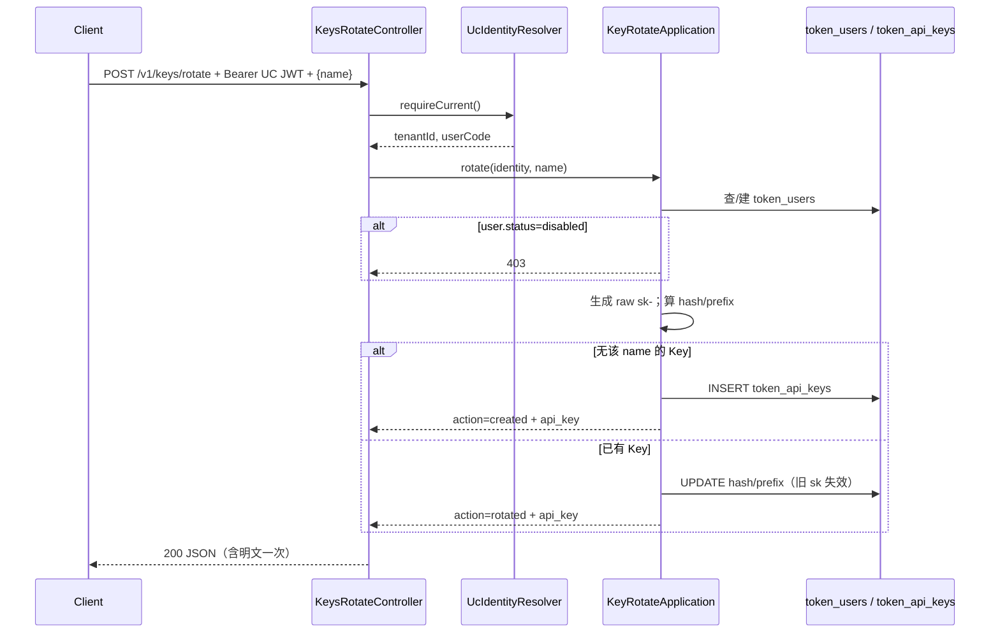

# US-G0-06 按 name 签发 / 重置 Key（rotate）设计

> **用户故事**：[../02-用户故事.md](../02-用户故事.md) · US-G0-06（**已合并原 US-G0-07**）  
> **状态**：编码已落地（单测覆盖生成/哈希/name；联调需 JWT + MySQL + `GATEWAY_KEY_PEPPER` + `OAUTH_JWK_KEY`）  
> **范围**：`POST /v1/keys/rotate`（无则创建 / 有则重置）+ 自动建 `token_users` + Key 明文生成与哈希落库；**不含** Chat sk 鉴权、列表接口、充值  
> **需求映射**：[../01-需求.md](../01-需求.md) FR-AUTH-01～04/07/09；§4.3；§6.1.2；AT-11/14/15  
> **依赖**：US-G0-02（表）；US-G0-05（UC JWT + `UcIdentity`）  
> **文档位置**：`token-gateway/docs/design/`

---

## 0. 相对旧拆分的变更

| 旧约定 | 现约定 |
|--------|--------|
| `provision` + `rotate` 两接口 | **仅** `POST /v1/keys/rotate` |
| 已存在 Key 时 provision 只回元信息 | **不做**；已存在则 **重置并回新明文**（丢 Key 可自助找回） |
| US-G0-07 独立故事 | **并入本故事**；编号 07 空缺保留 |

---

## 1. 已确认选型

| 项 | 决定 |
|----|------|
| 接口 | **`POST /v1/keys/rotate`** |
| 鉴权 | UC `access_token`（RS Starter；路径已在 `protected-patterns`：`/v1/keys/**`） |
| 身份 | `UcIdentityResolver` → `(tenantId, userCode)` |
| 语义 | 确保账户存在；按 `name`：**无行则 INSERT，有行则 UPDATE hash/prefix**；**每次**响应含新明文 |
| 明文格式 | `sk-` + 足够熵的随机串（见 §5）；仅响应体返回一次 |
| 存储 | `token_api_keys.key_hash` = SHA-256 hex（`pepper \|\| raw`）；`key_prefix` 供展示 |
| Pepper | `GATEWAY_KEY_PEPPER`（生产必填）；与 G0-02 §5 / README 一致 |
| 事务 | 建户 + 写 Key **同一事务** |
| 并发 | 依赖 `(tenant_id,user_code)`、`(user_id,name)`、`key_hash` 唯一约束；冲突重试或返回 409（见 §7） |
| 不做 | `provision`；`GET /v1/keys`（US-G0-18）；Chat 鉴权（G0-08） |

---

## 2. 目标与非目标

### 2.1 目标

1. 已登录用户凭 UC JWT + `name` 拿到可用网关 sk（首次开通或丢 Key 重置同一路径）。  
2. 自动创建计费账户（`token_users`），余额默认 0、`status=active`。  
3. 同一用户多 `name` 互不覆盖；重置 A 不影响 B。  
4. 明文永不落库、不写日志。

### 2.2 非目标

| 不做 | 说明 |
|------|------|
| 独立 provision | FR-AUTH-08 |
| 用 sk 调本接口 | 必须 UC JWT |
| Chat / usage 鉴权 | G0-08 / 16 |
| 列表 Key | G0-18（P1） |
| 充值 / 改余额 | 改库运维 G0-15 |
| 禁用账户时仍发新 Key | 账户 `disabled` → **403**（见 §7） |

---

## 3. 流程



---

## 4. API 契约

### 4.1 请求

```http
POST /v1/keys/rotate HTTP/1.1
Authorization: Bearer {user_center_access_token}
Content-Type: application/json

{
  "name": "ftcs-desktop"
}
```

| 字段 | 规则 |
|------|------|
| `name` | 必填；trim 后非空；长度 1～64；仅 `[a-z0-9._-]`（**小写字母**；若客户端传大写，服务端 **先 lower-case** 再校验，或直接 400——实现选定：**先规范化为小写再校验**） |

非法 `name` → **400** + 简短错误码（如 `invalid_name`）。

### 4.2 成功响应 `200`

```json
{
  "action": "created",
  "name": "ftcs-desktop",
  "api_key": "sk-xxxxxxxxxxxxxxxxxxxxxxxxxxxxxxxx",
  "prefix": "sk-xxxx",
  "status": "active",
  "user": {
    "tenant_id": "1",
    "user_code": "u_abc",
    "balance_li": 0,
    "status": "active"
  }
}
```

| 字段 | 说明 |
|------|------|
| `action` | `created` \| `rotated` |
| `api_key` | **明文**；仅此响应 |
| `prefix` | 与库 `key_prefix` 一致，便于 UI 展示（无明文时仍可辨认） |
| `user.balance_li` | 当前账户余额（厘）；新建为 0 |

### 4.3 错误

| HTTP | 场景 |
|------|------|
| 401 | 无/坏 UC JWT；缺 identity claim |
| 400 | `name` 非法或缺失 |
| 403 | 账户 `status=disabled`（运维改库禁用） |
| 409 | 极端唯一冲突重试耗尽（可选；优先事务内重试 1～2 次） |
| 500 | 未配置 `GATEWAY_KEY_PEPPER`（生产启动亦可 fail-fast） |

**本故事不**对「Key 行 status=disabled」单独拦截：rotate **允许**重置并把 `status` 置回 `active`（便于用户自助恢复被误禁用的客户端 Key）。若产品改为「禁用 Key 禁止 rotate」，另开修订。  
账户级 `disabled` 仍 **403**，禁止发 sk。

---

## 5. 明文生成与哈希

| 项 | 约定 |
|----|------|
| 明文 | `sk-` + 32 字节密码学安全随机 → **Base64URL 无填充**（或 hex）；总长适中、字符集 URL 安全 |
| 前缀 | `key_prefix` = 明文前 **10** 字符（含 `sk-`），如 `sk-Ab12Cd` 类；不足则全长 |
| 哈希 | `SHA-256( UTF8(pepper) \|\| UTF8(raw_api_key) )` → 小写 hex 64 字符 |
| Pepper | `GATEWAY_KEY_PEPPER`；空则 **拒绝签发**（本地开发须在 `.env` / local 配置） |
| 日志 | **禁止**打印 `api_key`、pepper、完整 hash 以外的敏感拼接材料；可打 `name`、`action`、`userId`、`requestId` |

工具类建议：`GatewayApiKeyHasher`、`GatewayApiKeyGenerator`（`…server.security` 或 `…server.utils`）。

---

## 6. 应用层步骤（伪代码）

```
identity = UcIdentityResolver.requireCurrent()
name = normalizeAndValidate(req.name)

@Transactional
user = findByTenantAndCode(identity) ?: insertUser(identity, balance=0, status=active)
if user.status == disabled -> 403

raw = generateSk()
hash = sha256(pepper || raw)
prefix = raw.substring(0, min(10, raw.length))

existing = findByUserIdAndName(user.id, name)
if existing == null:
  insert Key(userId, name, hash, prefix, status=active)
  action = created
else:
  update Key set hash, prefix, status=active, updated_at=now
  action = rotated

return Response(action, name, api_key=raw, prefix, status, userView)
```

说明：

- **不删行**重置：原地更新 hash，保留 `id`（便于历史 `token_request_logs.key_id` 仍指向逻辑 Key；旧明文已失效）。  
- 新建用户 **不**写 ledger（余额 0）；充值仍走改库 + 流水（G0-15）。

---

## 7. 并发与唯一约束

| 冲突 | 处理 |
|------|------|
| 两请求同时建同一 `(tenant,user_code)` | 一成功一捕获唯一异常 → 再查复用 |
| 两请求同时建同一 `(user_id,name)` | 同上；或串行化到「先查后写 + 重试」 |
| `key_hash` 碰撞 | 极低概率；重新生成 raw 再写 |

建议：外层捕获唯一冲突后最多再试 2 次；每次进入带 `@Transactional` 的方法（经 Spring 代理，勿同类 `this` 自调），保证每轮独立事务。

---

## 8. 包与类清单（编码）

| 类 | 包 | 职责 |
|----|----|------|
| `KeysRotateController` | `…server.api` | `POST /v1/keys/rotate` |
| `KeyRotateRequest` / `KeyRotateResponse` | `…server.api.dto` | 入出参 |
| `KeyRotateApplication`（或 `KeyRotateService`） | `…server.application` | 用例编排 + 事务 |
| `GatewayApiKeyGenerator` / `GatewayApiKeyHasher` | `…server.security` | 明文与哈希 |
| `TokenUserDbService` / `TokenApiKeyDbService` | `…db.dbservice` | `ServiceImpl` 子类；编程式查询；业务不直接用 Mapper |

Mapper 仅被 DbService 实现类使用；Application 只依赖 DbService。

配置：

| 键 | 说明 |
|----|------|
| `GATEWAY_KEY_PEPPER` / `token-gateway.key.pepper` | 与 env 对齐；Properties 可读 |

`TokenGatewayProperties` 增加 `key.pepper`（`${GATEWAY_KEY_PEPPER:}`）。

---

## 9. 安全与隐私

| 项 | 约定 |
|----|------|
| 传输 | 生产 HTTPS |
| 响应 | 明文仅 JSON 字段 `api_key`；不进 AccessLog message |
| 存储 | 仅 hash + prefix |
| 幽灵用户 | 禁止无 UC 身份建户（必须先过 JWT） |
| Scope | 本故事可与 whoami 一样 **暂不强制** `@RequireScope`；G0-06 联调稳定后可加 `token-gateway:keys`（D-01） |

---

## 10. 与前后故事衔接

| 故事 | 关系 |
|------|------|
| G0-05 | 验签 + `UcIdentity`；`/v1/keys/**` 已保护 |
| G0-08 | Chat 用明文 sk → 同算法算 hash 查表 |
| G0-14 | AccessLog 可记 path=`/v1/keys/rotate`、status、latency；**不**记 body |
| G0-18 | 列表元信息；本故事不实现 |
| 桌面 G1 | 固定 `name=ftcs-desktop` 调本接口；本地持久化 `api_key` |

**客户端注意**：每次成功 `rotate` 都会作废旧 sk。本地已有可用 Key 时勿在每次启动盲目调用；宜「本地无 Key / Chat 401 / 用户点重置」时再调。

---

## 11. 验收用例

| # | Given | When | Then |
|---|--------|------|------|
| K1 | 有效 JWT；该用户无账户 | `rotate` name=a | 200；建户；`action=created`；有 `api_key`；库有 hash |
| K2 | 已有账户；无 name=a | 同上 | 200；`created`；仅新增 Key 行 |
| K3 | 已有 name=a 的 Key | 再 `rotate` name=a | 200；`rotated`；旧明文鉴权失败（G0-08 后验）；新明文可用 |
| K4 | 用户有 name=a 与 name=b | `rotate` a | b 的 hash 不变 |
| K5 | 无 Authorization | `rotate` | 401 |
| K6 | `name` 为空或非法 | `rotate` | 400 |
| K7 | 账户 disabled | `rotate` | 403 |
| K8 | 日志 | 成功 rotate | 无明文 sk 片段 |
| K9 | 未配 pepper | 签发 | 5xx 或启动失败（文档化一种） |

---

## 12. 编码任务清单（确认后）

1. ~~`TokenGatewayProperties` + env：`GATEWAY_KEY_PEPPER`。~~  
2. ~~`GatewayApiKeyGenerator` / `Hasher` + 单测。~~  
3. ~~`KeyRotateApplication` 事务用例。~~  
4. ~~`KeysRotateController` + DTO。~~  
5. ~~README：rotate 示例、pepper、客户端「勿每次启动 rotate」。~~  
6. 手工 / 集成：K1～K7（需真实或测试 JWT + `OAUTH_JWK_KEY`）。

---

## 13. 本故事不做 / 后续

| 后续 | 说明 |
|------|------|
| US-G0-08 | sk 鉴权查 `key_hash` |
| US-G0-18 | `GET /v1/keys` 列表 |
| `@RequireScope("token-gateway:keys")` | D-01 确认后收紧 |
| 禁用单 Key 禁止 rotate | 若运营需要再改 §4.3 |
