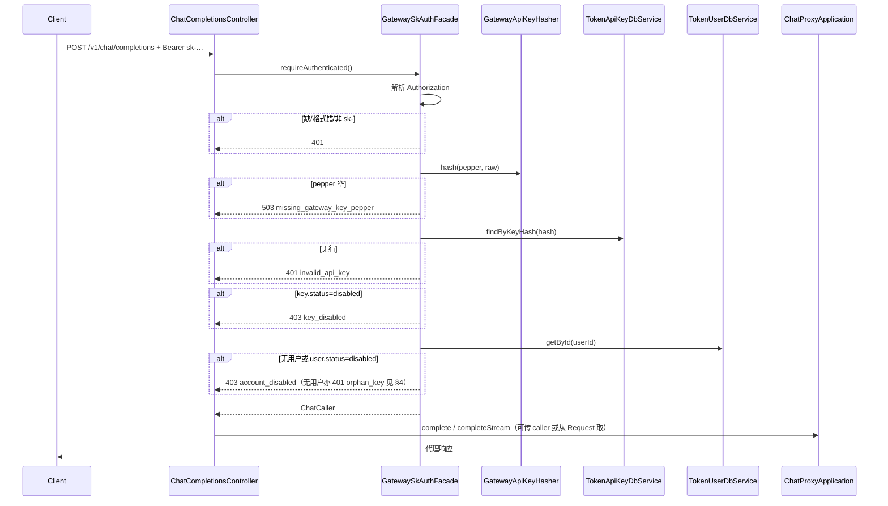

# US-G0-08 Chat 使用 sk- 鉴权设计

> **用户故事**：[../02-用户故事.md](../02-用户故事.md) · US-G0-08  
> **状态**：编码已落地（单测覆盖鉴权分支；联调需 MySQL + pepper + rotate 所得 sk）  
> **范围**：Chat（及可复用的调用方上下文）用网关 `sk-` 鉴权：解析 Bearer → 哈希查 `token_api_keys` → 校验 Key/账户 status → 注入 `ChatCaller`；**替换** G0-03 占位 `PendingChatSkAuthFacade`  
> **需求映射**：[../01-需求.md](../01-需求.md) FR-AUTH-05/06；SEC-01；AT-05；§4.3 / §6.1.1  
> **依赖**：US-G0-02（表）；US-G0-03/04（Chat 入口 + `ChatAuthFacade`）；US-G0-06（pepper、哈希算法、`rotate`）  
> **不做**：扣费（G0-10）；余额预检（G0-11）；`GET /v1/usage/me`（G0-16，可复用本鉴权）；UC JWT 验 Chat  
> **文档位置**：`token-gateway/docs/design/`

---

## 0. 相对占位实现的变更

| G0-03/04 现状 | 本故事 |
|---------------|--------|
| `PendingChatSkAuthFacade` 恒 401 `sk_auth_pending` | **删除或停用**；改为真实 sk 校验 |
| `ChatAuthFacade.requireAuthenticated()` 无返回值 | 改为返回 **`ChatCaller`**（或 void + Request 属性二选一，见 §1；**默认返回 `ChatCaller`**） |
| 无测试 Key / 免鉴权 | **仍禁止**任何旁路开关 |
| Chat **不在** UC JWT `protected-patterns` | **保持**；sk 与 JWT 两套凭证，互不混用 |

---

## 1. 已确认选型

| 项 | 决定 |
|----|------|
| 保护路径 | `POST /v1/chat/completions`（流式/非流式同一入口，已有 Controller 调 Facade） |
| 凭证 | `Authorization: Bearer sk-…`（与 rotate 返回的明文一致） |
| 哈希 | 复用 `GatewayApiKeyHasher`：`SHA-256(UTF8(pepper)\|\|UTF8(raw))` → 小写 hex；pepper=`GATEWAY_KEY_PEPPER` |
| 查库 | `token_api_keys.key_hash` **唯一**查询 → `user_id` + `name` + key `status`；再查 `token_users` |
| 禁用 | Key `status=disabled` 或 User `status=disabled` → **403**（短码区分，见 §4） |
| 无效凭证 | 缺头 / 非 Bearer / 非 `sk-` 前缀 / hash 无行 / pepper 未配 → **401** 或 **503**（pepper，见 §4） |
| 上下文 | 鉴权成功得到 `ChatCaller`：`userId`、`keyId`、`keyName`、`tenantId`、`userCode`（及可选 balance 不在本故事强求） |
| 传递方式 | Controller：`ChatCaller caller = chatAuthFacade.requireAuthenticated()`；另写入 `RequestAttributes`（名如 `chat.caller`）便于 Filter/后续 G0-10 无改签名读取 |
| `last_used_at` | 鉴权成功后 **尽力** 更新 Key 的 `last_used_at`（失败只打 WARN，不阻断 Chat） |
| 日志 | 可打 `keyId` / `keyName` / `userId` / `requestId`；**禁止**打明文 sk、pepper、完整 hash 可选打前 8 位仅排障（默认 **不打 hash**） |
| SEC-01 | 鉴权路径不接触、不返回上游 DeepSeek Key |

---

## 2. 目标与非目标

### 2.1 目标

1. 合法 `sk-` 可进入已实现的 Chat 代理（非流式/流式）。  
2. 非法 Key → 401（AT-05）；账户或 Key 禁用 → 403。  
3. 解析到稳定的用户 + Key 身份，供 G0-10 写 `token_request_logs.key_id` / `key_name`。  
4. 去掉占位 401，使「rotate → Chat」具备统一联调条件（仍可不配上游做鉴权单测）。

### 2.2 非目标

| 不做 | 归属 |
|------|------|
| 扣费 / 写流水 / usage 结算 | US-G0-10 |
| 余额 ≤0 拒绝 | US-G0-11 |
| RPM/TPM | FR-RISK / 后续故事 |
| `GET /v1/usage/me` | US-G0-16（建议复用同一 Facade） |
| UC JWT 调 Chat | 明确拒绝：JWT 不是 `sk-` → 401 |
| 测试 Key / skip-auth | **禁止** |

---

## 3. 流程



说明：本故事 **不强制** 改 `ChatProxyApplication` 签名；Controller 拿到 `ChatCaller` 后写入 Request 即可。G0-10 再从 Request / 显式参数读取。

---

## 4. API / 错误契约

### 4.1 请求头

```http
Authorization: Bearer sk-xxxxxxxxxxxxxxxx
```

| 规则 | |
|------|--|
| 必须 | `Authorization` 存在 |
| 方案 | 大小写不敏感的 `Bearer` + 单个空格 + token |
| token | 必须以 `sk-` 开头（与 G0-06 生成格式一致）；整段 trim |
| 禁止 | 把 UC `access_token` 当 Chat 凭证 |

### 4.2 错误码（HTTP + reason 短码）

| HTTP | 短码 | 场景 |
|------|------|------|
| 401 | `missing_authorization` | 无 Authorization |
| 401 | `invalid_authorization` | 非 Bearer / 空 token |
| 401 | `invalid_api_key` | 非 `sk-` 前缀，或 hash 查无 Key |
| 403 | `key_disabled` | Key `status=disabled` |
| 403 | `account_disabled` | User `status=disabled` |
| 401 | `orphan_key` | （**不对外使用**）Key 存在但无对应用户；对外与无效 Key 一样返回 `401 invalid_api_key`，仅日志 WARN |
| 503 | `missing_gateway_key_pepper` | pepper 未配置（与 rotate 一致） |

**已确认**：孤儿 Key 对外一律 `401 invalid_api_key`（与无效 sk 相同）；服务端日志可 WARN 标明 orphan，便于查脏数据。查 Key 后再查 User 为鉴权必经路径，可接受。

AT-05：错误 Bearer → **401**，且 **不**调用上游、**不**扣费（本故事无扣费逻辑）。

### 4.3 成功

进入代理；响应形态仍由 G0-03/04 决定。鉴权本身无额外响应体字段。

---

## 5. 数据访问

### 5.1 DbService 扩展

`TokenApiKeyDbService`：

```java
public TokenApiKey findByKeyHash(String keyHash) {
  return getOne(new LambdaQueryWrapper<TokenApiKey>()
      .eq(TokenApiKey::getKeyHash, keyHash));
}
```

`TokenUserDbService`：复用 `getById`（IService）即可。

### 5.2 status 比较

与 G0-06 一致：字符串 `active` / `disabled`；比较时建议 `equalsIgnoreCase` 或严格小写——**实现选定：存库小写，比较用 `disabled`.equalsIgnoreCase(status)**。

---

## 6. 类清单（编码）

| 类 | 包 | 职责 |
|----|----|------|
| `ChatCaller` | `…server.security` | 不可变调用方上下文 |
| `ChatAuthFacade` | 同上 | `ChatCaller requireAuthenticated()` |
| `GatewaySkAuthFacade` | 同上 | 真实 sk 实现；`@Component` |
| （删除）`PendingChatSkAuthFacade` | — | 避免双 Bean；测试用 `@TestConfiguration` 提供替身 |
| `AuthorizationBearer`（可选工具） | `…server.security` | 解析 Bearer |
| `TokenApiKeyDbService.findByKeyHash` | `…db.dbservice` | 按 hash 查 Key |

Controller 微调：

```java
ChatCaller caller = chatAuthFacade.requireAuthenticated();
RequestContextHolder...setAttribute("chat.caller", caller, REQUEST);
// 再 complete / completeStream
```

常量：`ChatCaller.REQUEST_ATTR = "chat.caller"`。

---

## 7. 安全与隐私

| 项 | 约定 |
|----|------|
| 明文 sk | 仅内存短暂持有；不算进日志 / AccessLog message |
| 上游 Key | 本路径不涉及（SEC-01） |
| 枚举 | 无效与禁用用 401/403 区分禁用，避免对「是否存在」过度隐藏；无效统一 `invalid_api_key` |
| Timing | DB 唯一索引查询即可；不在应用层对明文做可利用旁路 |
| JWT vs sk | Chat **永不**走 UC JWT protected-patterns |

---

## 8. 与前后故事衔接

| 故事 | 关系 |
|------|------|
| G0-06 | rotate 写入的 hash/pepper 必须与本故事一致；重置后旧 sk → `invalid_api_key` |
| G0-03/04 | 去掉占位后即可统一联调真上游（仍需 `DEEPSEEK_API_KEY`） |
| G0-10 | 从 `ChatCaller` 取 `userId`/`keyId`/`keyName` 写请求日志与扣费 |
| G0-11 | 可在 Facade 之后、代理之前加余额预检 |
| G0-16 | `usage/me` 建议同一 `ChatAuthFacade` |
| 桌面 | `name=ftcs-desktop` rotate 得 sk → Chat Bearer |

**联调顺序建议**：DB + pepper → rotate 得 sk → Chat（可先 Mock 上游或真上游）→ 再 G0-09/10 扣费。

---

## 9. 验收用例

| # | Given | When | Then |
|---|--------|------|------|
| A1 | DB 有 active Key；pepper 正确；明文匹配 | Chat + Bearer sk | 进入代理；`ChatCaller` 字段正确 |
| A2 | 无 Authorization | Chat | 401 `missing_authorization`；不上游 |
| A3 | Bearer 随机串 / UC JWT | Chat | 401 `invalid_api_key` 或 `invalid_authorization` |
| A4 | 正确格式但 hash 不存在（含已 rotate 作废的旧 sk） | Chat | 401 `invalid_api_key` |
| A5 | Key `disabled` | Chat | 403 `key_disabled` |
| A6 | User `disabled`，Key active | Chat | 403 `account_disabled` |
| A7 | 未配 pepper | Chat | 503 `missing_gateway_key_pepper` |
| A8 | 合法 sk + 非白名单 model | Chat | 鉴权过；代理 400 `model_not_allowed`（回归 G0-03） |
| A9 | 日志 | 成功/失败鉴权 | 无明文 sk 片段 |
| A10 | `last_used_at` | A1 成功 | Key 行时间更新（允许异步延迟极短） |

---

## 10. 编码任务清单（确认后）

1. ~~`ChatCaller` + 扩展 `ChatAuthFacade` 返回类型。~~  
2. ~~`GatewaySkAuthFacade`；删除 `PendingChatSkAuthFacade`；单测替身仅测试用。~~  
3. ~~`TokenApiKeyDbService.findByKeyHash`；可选更新 `last_used_at`。~~  
4. ~~`ChatCompletionsController` 写入 Request 属性。~~  
5. ~~单测：解析 Bearer、禁用/无效、hash 命中（Mock DbService）。~~  
6. ~~更新 `home.html` / README。~~  

---

## 11. 已确认点

| # | 议题 | 决定 |
|---|------|------|
| Q1 | 孤儿 Key 对外码 | **`401 invalid_api_key`**（与无效 sk 相同；日志可标 orphan） |
| Q2 | `last_used_at` | 鉴权成功同步尽力更新 |
| Q3 | Facade 返回值 | `ChatCaller requireAuthenticated()` + Request 属性双写 |

确认后即可按 §10 编码。
