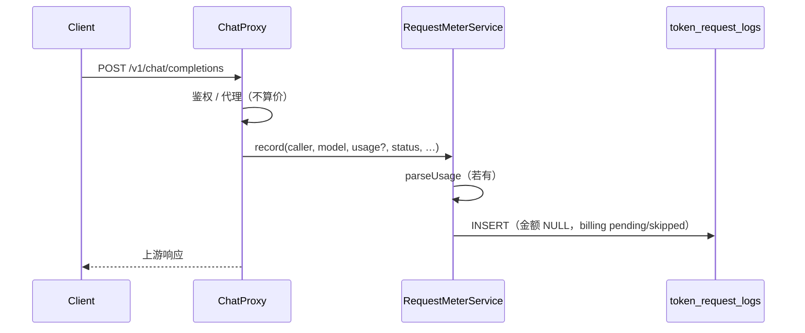
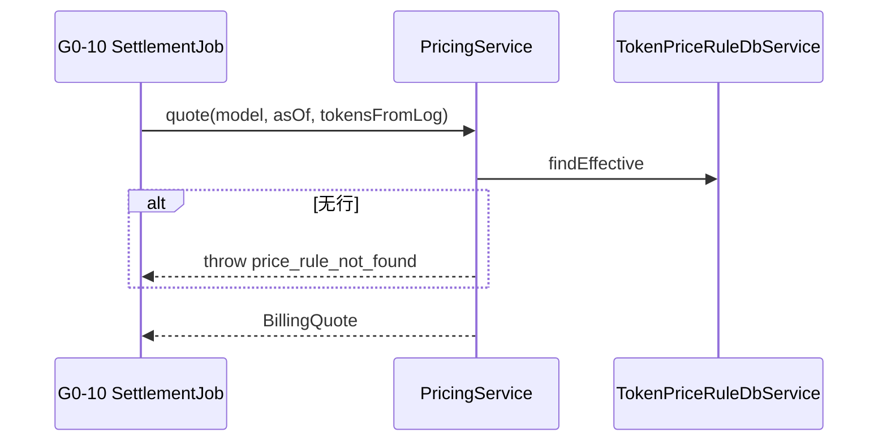

# US-G0-09 价目表、两档计价与请求计量落库设计

> **用户故事**：[../02-用户故事.md](../02-用户故事.md) · US-G0-09  
> **状态**：编码已落地（算价单测 + 请求计量落库；异步扣费见 G0-10）  
> **范围**：（1）价目读取 + §7.1 算价（供异步结算）；（2）Chat 请求路径写 `token_request_logs`（用量/状态，金额为空）；（3）`V1_0_0` 种子价 + 调价运维约定  
> **需求映射**：[../01-需求.md](../01-需求.md) FR-PRICE-01～04/06；FR-METER-01/02/04（请求内）；§7.1；OQ-07；D-03 / D-04  
> **依赖**：US-G0-02；US-G0-03/04；US-G0-08（`ChatCaller`）  
> **不做**：请求内 `quote` / 扣费 / 写流水；异步结算任务（G0-10）；余额预检（G0-11）；公开价目 HTTP API  
> **文档位置**：`token-gateway/docs/design/`

---

## 0. 计费时序（已确认）

| 路径 | 行为 |
|------|------|
| **Chat 请求内** | **绝不**调用 `quote`；**绝不**扣 `balance_li` / 写流水 |
| **请求内落库（本故事）** | 写 `token_request_logs`：身份、model、status、token 用量、延迟等；`revenue_li/cogs_li/margin_li` **NULL**；有 usage → `billing_status=pending`，无 → `skipped_no_usage` |
| **算价能力（本故事）** | `PricingService`；**仅**异步结算与单测调用 |
| **算价 + 扣费（G0-10）** | 定时任务等：扫 `pending` → `quote` → 回填金额 → 扣余额 → 写流水 → `charged` |
| **余额预检** | G0-11；接受透支（OQ-07） |

### 0.1 边界

| 已有 | 本故事 |
|------|--------|
| `token_price_rules` + PO | 取价 + 公式 + usage 解析 |
| 白名单两模型 | **`V1_0_0` 同名种子价** |
| G0-04 usage / 结束钩子 | 解析用量并写请求日志；不调 `quote` |
| G0-08 `ChatCaller` | 填 `user_id` / `key_id` / `key_name` |

---

## 1. 已确认选型（含 Q1～Q4）

| 项 | 决定 |
|----|------|
| **Q1 种子** | 写入既有 **`V1_0_0__init_billing_schema.sql`**（建表后 INSERT）；**不**拆 `V1_0_1` |
| **Q2 缺价** | `resolve` 无行 → **抛** `price_rule_not_found`（结算任务处理） |
| **Q3 缓存** | **每次查库** |
| **Q4 请求日志** | **本故事写 `token_request_logs`**；G0-10 只做异步算价扣费与回填 |
| usage Parser | 本故事（落日志 + 结算复用） |
| 请求内算价 | **禁止**（OQ-07） |
| 对外档 | 两档 `P_in`/`P_out`；缓存输入仍按输入档收费（FR-PRICE-03） |
| COGS | `C_in`/`C_cache`/`C_out` |
| 取价 | `effective_from <= asOf` 最大一行；调价只 INSERT |
| 取整 | `HALF_UP`；允许 `revenue_li=0`（D-04） |

> **Flyway 注意**：若某环境已执行过旧 `V1_0_0`，改脚本会 checksum 失败。开发库可 `repair`/重建；已共享环境需运维对齐（或临时手工 INSERT 种子）。**新环境**以合并后的 `V1_0_0` 为准。

---

## 2. 目标与非目标

### 2.1 目标

1. 取生效价目；按 §7.1 算出 `revenue_li` / `cogs_li` / `margin_li`（异步用）。  
2. Chat 成功/失败/中断后落 `token_request_logs`（计量完整，金额空）。  
3. `V1_0_0` 含 flash/pro 占位种子价。  
4. 调价 INSERT 新版本；已结算金额不回算。

### 2.2 非目标

| 不做 | 归属 |
|------|------|
| 请求内 `quote` / 扣费 | 禁止（OQ-07） |
| 异步结算任务、写 `ledger_entries`、回填金额 | **US-G0-10** |
| 余额预检 | US-G0-11 |
| 结算队列策略细化 / 扣费幂等完备 | US-G0-12（可与 G0-10 同设计） |
| 公开价目 API / 管理端 | 不做 |

---

## 3. 请求计量落库（本故事 · Chat 路径）

### 3.1 触发点

| 场景 | 来源 | `status` | `billing_status` |
|------|------|----------|------------------|
| 非流式成功且有 usage | 代理返回后 | `success` | `pending` |
| 流式正常结束且有 usage | `StreamFinishListener` / 等价钩子 | `success` | `pending` |
| 流式中断且有 usage | 同上 `interrupted=true` | `interrupted` | `pending` |
| 结束但无 usage | 失败或中断 | `error` / `interrupted` | `skipped_no_usage` |
| 代理前失败（鉴权/白名单等） | **可不写**本表（无上游计量）；或写 error 且 `skipped_no_usage`——**默认：鉴权/模型拒绝不写**，减少噪声 |

### 3.2 写入字段

| 字段 | 来源 |
|------|------|
| `request_id` | 网关已有 requestId（G0-14 / MDC）；无则本故事生成 UUID |
| `user_id` / `key_id` / `key_name` | `ChatCaller` |
| `model` | 请求 body |
| `prompt_tokens` 等 | `UsageTokensParser`；无 usage 则 NULL |
| `revenue_li` / `cogs_li` / `margin_li` | **一律 NULL**（G0-10 回填） |
| `latency_ms` / `upstream_status` / `error_summary` | 代理上下文；摘要禁含 prompt 正文 |
| `created_at` | DB 默认；语义 UTC |

### 3.3 写库约定

- `TokenRequestLogDbService.insert`（主键 `request_id`）；同一请求只写一次（流式结束钩子单次）。  
- 写失败：打 ERROR，**不**回滚已返回给客户端的上游响应（尽力落库）；可后续补记策略留给运维。  
- **禁止**在此路径调用 `PricingService.quote` / `resolve`。



---

## 4. 领域模型（算价）

```text
UsageTokens / PriceRuleSnapshot / BillingQuote   （同前）
```

| 方法 | 语义 |
|------|------|
| `resolve(model, asOf)` | 无行 **抛** `PriceRuleNotFoundException` |
| `quote(snapshot, usage)` | 纯函数 |
| `quote(model, asOf, usage)` | resolve + quote |
| `parseUsage(JsonNode)` | 供落日志与结算 |

---

## 5. 公式与取整（§7.1）

```
revenue_li = round_half_up( (I * P_in + O * P_out) / 1_000_000 )
cogs_li    = round_half_up( (I_u * C_in + I_c * C_cache + O * C_out) / 1_000_000 )
margin_li  = revenue_li - cogs_li
```

- 全程 `BigDecimal` + `HALF_UP`；禁止 `double`。  
- 缓存输入：**revenue 用全量 I**；COGS 拆 `I_u`/`I_c`。  
- `I_c > I` 时夹紧并 WARN。

---

## 6. usage 解析

| 源字段 | 映射 |
|--------|------|
| `prompt_tokens` / `completion_tokens` | I / O |
| `prompt_cache_hit_tokens` | I_c |
| `prompt_tokens_details.cached_tokens` | 无 hit 字段时回退 |
| 缺省 | I_c = 0 |

有 usage：存在可解析的非负 prompt 或 completion 字段（皆 0 仍算有 usage）。

---

## 7. 取价查询

```sql
SELECT * FROM token_price_rules
WHERE model = ? AND effective_from <= ?
ORDER BY effective_from DESC LIMIT 1
```



---

## 8. 种子与调价

### 8.1 种子（Q1）

在 **`V1_0_0__init_billing_schema.sql`** 末尾、`token_price_rules` 建表之后 INSERT：

| model | 说明 |
|-------|------|
| `deepseek-v4-flash` | 对齐白名单 |
| `deepseek-v4-pro` | 对齐白名单 |

注释写明参考 USD、假定汇率、抓取日期；`effective_from='2020-01-01 00:00:00.000'`。占位价上线前复核后 **INSERT 新行**，勿改已执行环境的历史种子行语义。

### 8.2 运维

`ops/insert_price_rule_example.sql`；已 `charged` 行的金额不回改。

---

## 9. 类清单（编码）

| 类 | 职责 |
|----|------|
| `UsageTokens` / `PriceRuleSnapshot` / `BillingQuote` | 值对象 |
| `UsageTokensParser` / `PricingCalculator` / `PricingService` | 解析与算价 |
| `PriceRuleNotFoundException` | 缺价（抛） |
| `RequestMeterService`（名可调） | Chat 结束写 `token_request_logs` |
| `TokenPriceRuleDbService.findEffective` | 取价 |
| `TokenRequestLogDbService` | INSERT 日志 |
| 改 `V1_0_0__…sql` | 种子 INSERT |
| 接线 | 非流式完成处 + 流式 `StreamFinishListener`（替换或装饰现有 Logging 钩子） |

Chat **不**注入 `PricingService` 到热路径；可注入 `RequestMeterService`。

---

## 10. 验收用例

| # | Then |
|---|------|
| A1～A10 | 取价 / 公式 / Parser / 种子（同前，缺价为 **抛**） |
| A11 | Chat 成功 → 有 `request_logs` 行；金额 NULL；`billing_status=pending`；**未**调 `quote` |
| A12 | 无 usage 结束 → `skipped_no_usage`；金额 NULL |
| A13 | 流式中断有 usage → `status=interrupted`，`pending` |

---

## 11. 已确认点

| # | 决定 |
|---|------|
| OQ-07 | 请求内绝不算价、不扣费；预检仍做；接受透支 |
| Q1 | 种子进 **`V1_0_0`** |
| Q2 | 缺价 **抛** |
| Q3 | **每次查库** |
| Q4 | **本故事写 `request_logs`**；G0-10 = 异步结算 |

---

## 12. 编码任务清单

1. `TokenPriceRuleDbService.findEffective` + 单测。  
2. Calculator / Parser / `PricingService` + 公式单测（含缓存对比、HALF_UP、缺价抛）。  
3. `TokenRequestLogDbService` + `RequestMeterService`；非流式 + 流式钩子接线。  
4. 单测：落库字段、pending/skipped、Spy 断言未调 `quote`。  
5. 修改 `V1_0_0` 追加种子 INSERT（注释 USD/汇率）；`ops/insert_price_rule_example.sql`。  
6. README：价目、请求只落计量、异步才算价扣费。  
7. 更新用户故事状态为编码已落地（完成时）。

---

## 13. 与前后故事衔接

| 故事 | 关系 |
|------|------|
| G0-02 | 表结构 |
| G0-03/04 | 代理 + usage；本故事挂结束钩子写日志 |
| G0-08 | `ChatCaller` |
| **G0-10** | **仅**异步：`quote` + 扣费 + 回填金额 + 流水（不再负责首次写日志） |
| G0-11 | 余额预检 |
| G0-12 | 幂等与进队规则可并入 G0-10 设计 |

**联调**：种子 → 算价单测 → Chat 落 pending 日志 → G0-10 结算任务扣费。
