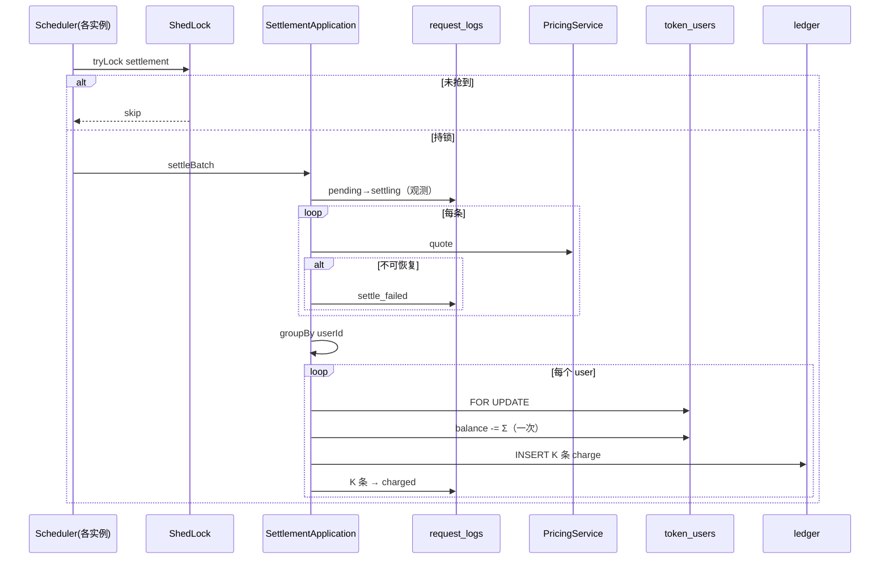

# US-G0-10 异步结算扣费与账本回填设计

> **用户故事**：[../02-用户故事.md](../02-用户故事.md) · US-G0-10  
> **状态**：编码已落地（**ShedLock 调度互斥** + `settling` 观测/回收 + 同用户合并扣减）  
> **范围**：多实例安全地认领 `pending` → 算价 → **按用户合并**一次余额扣减 + 每笔独立 charge 流水与日志回填；失败 `settle_failed`；`request_id` 幂等  
> **需求映射**：[../01-需求.md](../01-需求.md) FR-BILL-03；FR-METER-03/05/06/07；§7.1 / §7.2；OQ-07；S2；AT-01/02/10  
> **依赖**：US-G0-02；US-G0-09  
> **不做**：Chat 热路径算价/扣费；首次写日志（G0-09）；余额预检（G0-11）；人工 topup；公开结算 API；MQ  
> **文档位置**：`token-gateway/docs/design/`

---

## 0. 边界

| 已有 | 本故事 |
|------|--------|
| G0-09：`pending` / `skipped_no_usage`；`PricingService` | 认领并结算 **`pending`** |
| OQ-07：请求内不扣费；接受透支 | `@Scheduled`；**余额允许为负** |
| G0-12 MVP | **并入本故事** |

### 0.1 本期新增产品约束（相对初稿）

| # | 约束 | 设计含义 |
|---|------|----------|
| **多实例** | 本期必须可安全多副本部署 | **调度互斥靠分布式锁**（谁抢到谁跑）；`settling` **保留**供观测与崩溃回收，**不**作为多实例互斥主手段 |
| **合并扣减** | 异步目的含**减少 DB 写** | 同一调度批次内，**同一 `user_id` 的多笔成功报价合并为一次 `token_users` 余额 UPDATE**；每笔请求仍各自写 charge 流水并回填日志（满足 S2「任意一笔可还原」） |

`billing_status` 全集：

| 值 | 含义 | 谁写入 |
|----|------|--------|
| `pending` | 待结算 | G0-09 |
| `settling` | 本轮处理中（观测 / 崩溃回收） | **本故事** |
| `skipped_no_usage` | 无用量，不扣费 | G0-09 |
| `charged` | 已结算（含 revenue=0） | 本故事 |
| `settle_failed` | 不可恢复失败（如缺价） | 本故事 |

---

## 1. 已确认选型

| 项 | 决定 |
|----|------|
| **Q1** | 允许 `balance_li` 为负 |
| **Q2** | 进程内 `@Scheduled` + **分布式锁**（多实例仅一人执行 tick） |
| **Q3** | revenue=0 → charged + **`amount_li=0` 的 charge 行** |
| **Q4** | 缺价等 → **`settle_failed`** |
| **Q5** | ledger **`UNIQUE(request_id)`** |
| **Q6** | G0-12 MVP 并入；故事改为验收/增强 |
| **Q7** | 调度互斥 = **ShedLock（JDBC）**；`settling` 仅观测 + 超时回收 |
| **Q8** | 只合并 `token_users` 写；ledger/日志仍逐笔 |
| 批内标记 | 仍 `pending→settling`（方便查「正在结」），不再依赖 SKIP LOCKED 做多实例互斥 |
| 事务 | **按用户一批**：锁用户 → ≤1 次余额 UPDATE → N 条 charge → N 条日志 `charged` |
| `asOf` | 各日志自己的 `created_at` |
| 用量 | 日志列 → `UsageTokens` |

---

## 2. 目标与非目标

### 2.1 目标

1. 多实例下不双跑调度（**分布式锁**）；不双扣（锁 + `settling` 条件更新 + ledger UNIQUE）。  
2. 同用户多笔在同一事务内：**1 次**用户余额 UPDATE（合并 Σ revenue），**N 次** charge INSERT，**N 次**日志回填。  
3. `pending` → `settling` → `charged` / `settle_failed`（或超时回到 `pending`）；`settling` 便于观测。  
4. `skipped_no_usage` 不进结算；`interrupted`+有用量与 success 同等。

### 2.2 非目标

- 跨批次、跨用户的「超级大事务」合并。  
- 把多笔合并成**一条** ledger（会破坏按 `request_id` 对账与 UNIQUE 语义）。  
- MQ；用 `settling` 替代分布式锁做调度互斥（已否定）。

---

## 3. 多实例：分布式锁 + settling 观测

### 3.1 分工（已确认 Q7）

| 机制 | 职责 |
|------|------|
| **ShedLock（JDBC，表 `token_shedlock`）** | **调度互斥**：各实例都 `@Scheduled`，**仅抢到锁的实例**执行本轮 `settleBatch` |
| **`settling` + owner/claimed_at** | **观测与崩溃回收**：标记本轮正在处理的行；进程崩溃后超时回收为 `pending` |
| **`UNIQUE(request_id)` on ledger** | 最后防线，防异常双写 charge |

### 3.2 批处理流程

```text
1) Scheduler tick → 尝试获取 ShedLock；失败则直接 return
2) 回收超时 settling → pending
3) 选出最多 batch-size 条 pending，UPDATE 为 settling（写 settle_owner / claimed_at）
4) 事务外 quote；不可恢复 → settle_failed
5) 按 user_id 分组 settleUserBatch（合并扣减）
6) 释放锁（ShedLock 到期或方法结束）
```

不依赖 `FOR UPDATE SKIP LOCKED`（降低对 TiDB/引擎差异的要求）；在已持锁前提下普通 `SELECT … LIMIT` + 条件 UPDATE 即可。

### 3.3 库表（写入 `V1_0_0`，未发版不拆增量）

| 变更 | 说明 |
|------|------|
| `settling` / `settle_owner` / `settle_claimed_at` | 观测与回收 |
| `uk_token_ledger_request_id` | Q5 |
| **`token_shedlock`** | ShedLock JDBC 表 |

### 3.4 防双扣层次

| 层 | 机制 |
|----|------|
| 调度 | ShedLock：同时仅一个 tick 进入 |
| 批内标记 | `pending → settling` 条件更新 |
| 回填 | `UPDATE … WHERE settling AND settle_owner=?` |
| 流水 | `UNIQUE(request_id)` |

---

## 4. 同用户合并扣减（Must）

### 4.1 为什么合并

异步结算的目标之一是**减少对 `token_users` 的频繁写锁**。若每笔 log 单独 `SELECT FOR UPDATE` + UPDATE，高 QPS 下同一用户会反复抢同一行。

### 4.2 合并单元

- 输入：本轮认领且 **quote 成功** 的行，按 `user_id` 分组。  
- 同一 `user_id` 一组 → **一个 DB 事务** `settleUserBatch(userId, items[])`。  
- quote 失败已标 `settle_failed` 的行**不进入**该组。

### 4.3 事务内算法

```
BEGIN
  user = SELECT * FROM token_users WHERE id=? FOR UPDATE
  running = user.balance_li
  totalDebit = 0
  按 created_at 升序处理 items:
    revenue = item.quote.revenueLi
    running = running - revenue          // 可为负；revenue 可为 0
    totalDebit += revenue
    准备 ledger: amount_li=-revenue, balance_after_li=running
    准备 log 回填: amounts + charged
  if totalDebit != 0:
    UPDATE token_users SET balance_li = running   // 仅一次
  // totalDebit==0：跳过 users UPDATE，但仍写 N 条 amount=0 的 charge
  INSERT 全部 charge 行
  UPDATE 全部 request_logs → charged（WHERE settling AND owner=me）
  任一行更新数不符 / UNIQUE 冲突 → ROLLBACK
COMMIT
```

| 写操作（同用户 K 笔成功） | 次数 |
|---------------------------|------|
| `token_users` UPDATE | **0 或 1** |
| `token_ledger_entries` INSERT | **K**（含 amount=0） |
| `token_request_logs` UPDATE | **K** |

相对「每笔独立事务」：用户表写从 K 降为 ≤1；流水/日志次数不变（对账需要）。

### 4.4 不合并的内容

- **不**把 K 笔合成一条 ledger。  
- **不**跨 `user_id` 合并。  
- **不**把未认领的历史 pending 无限拖进同一事务（受 batch-size 限制）。

---

## 5. 端到端流程



---

## 6. 调度配置

| 配置 | 默认 | 说明 |
|------|------|------|
| `token-gateway.settlement.enabled` | `true` | |
| `token-gateway.settlement.fixed-delay` | `5s` | |
| `token-gateway.settlement.batch-size` | `50` | |
| `token-gateway.settlement.initial-delay` | `10s` | |
| `token-gateway.settlement.claim-timeout` | `5m` | settling 超时回收 |
| `token-gateway.settlement.instance-id` | 启动 UUID | 写入 settle_owner |
| ShedLock | `lockAtMostFor`≈10m，`lockAtLeastFor`≈4s | 避免锁过短导致重叠 |

| 类 | 职责 |
|----|------|
| `ShedLockConfig` | JDBC `LockProvider`，表 `token_shedlock` |
| `SettlementScheduler` | `@Scheduled` + `@SchedulerLock` |
| `SettlementApplication` | claim→quote→group→txn |
| `SettlementTxnService` | 同用户合并扣减事务 |

---

## 7. 异常

| 情况 | 行为 |
|------|------|
| 缺价 / 用量非法 | 该行 `settle_failed`；同用户其它行仍可合并结算 |
| 用户批事务死锁/超时 | 整组回滚；行保持 `settling`，待超时回收或本实例重试 |
| UNIQUE(request_id) 冲突 | 回滚；ERROR（应极少，认领正常时不应发生） |
| 回收 | `settling AND claimed_at < now - timeout` → `pending`，清空 owner |

---

## 8. 验收用例

| # | Then |
|---|------|
| A1 | 单笔 pending → charged；1 charge；余额正确 |
| A2 | 幂等 / 唯一键：不双扣 |
| A3 | skipped 不进 |
| A4 | interrupted+用量可扣 |
| A5 | 缺价 → settle_failed |
| A6 | revenue=0 → amount_li=0 charge |
| A7 | 余额可扣成负 |
| **A9** | **同用户 3 笔 pending**：一次结算后 users 只体现**一次**合并扣减（Σ）；3 条 charge；3 条 charged；`balance_after` 按时间序递推 |
| **A10** | **两实例同时 tick**：仅一方持 ShedLock 执行；无双扣 |

---

## 9. 编码任务清单

1. Flyway `V1_0_0`：settling 列 + ledger UNIQUE + `token_shedlock`（未发版直接改基线）。  
2. ShedLock JDBC + `@SchedulerLock` 包住 tick。  
3. claim（普通 SELECT + pending→settling）/ reclaim / `settleUserBatch` + 单测。  
4. README：分布式锁 + settling 观测职责分离。

---

## 10. 安全与一致性

- 金额整数厘；**同用户批**内：余额 + 全部 charge + 全部日志回填同事务。  
- S2：每笔日志仍有独立 revenue/cogs/margin 与 charge 行。  
- 调度互斥：ShedLock；行状态：`settling` 可观测。  
- 不接触 sk / 上游 Key。

---

## 11. 已确认点

| # | 决定 |
|---|------|
| Q1～Q6 | 同前 |
| **Q7** | **ShedLock 抢调度锁**；`settling` **保留**作观测与超时回收，**不**作多实例互斥主手段 |
| **Q8** | 只合并用户余额写；ledger/日志逐笔 |

编码已跟进本修订。
