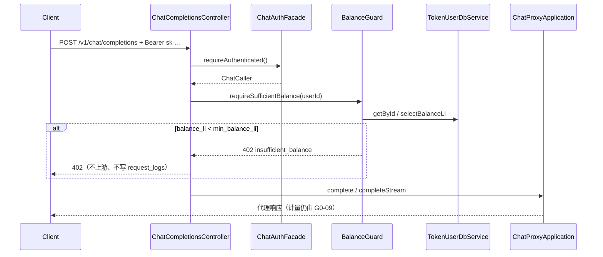

# US-G0-11 余额预检与拒绝设计

> **用户故事**：[../02-用户故事.md](../02-用户故事.md) · US-G0-11  
> **状态**：编码已落地（`BalanceGuard` + Controller 挂载；默认 `min-balance-li=1` → 402）  
> **范围**：Chat 进入 Proxy **之前**按账户 `balance_li` 做预检；不足则拒绝且**不转发上游**；与异步结算透支共存（OQ-07）  
> **需求映射**：[../01-需求.md](../01-需求.md) FR-BILL-04；§7.3；S3；AT-03；OQ-07  
> **依赖**：US-G0-08（`ChatCaller` / sk 鉴权）；US-G0-02（`token_users.balance_li`）  
> **不做**：算价 / 扣费 / 写流水（G0-09/10）；金额预留或冻结；RPM/TPM/日限额（G0-13）；`GET /v1/usage/me`（G0-16）  
> **文档位置**：`token-gateway/docs/design/`

---

## 0. 边界

| 已有 | 本故事 |
|------|--------|
| G0-08：鉴权成功 → `ChatCaller` | 鉴权**之后**、代理**之前**读余额并决定放行/拒绝 |
| G0-10：异步扣费，**允许** `balance_li < 0` | 预检只看**当前**余额；**接受**「预检通过后、结算前」透支 |
| AT-03 | `balance_li <= 0`（或低于阈值）→ 拒绝；不上游；请求内不产生扣费 |

### 0.1 产品已确认（OQ-07 / §7.3）

| # | 约束 | 设计含义 |
|---|------|----------|
| P1 | 请求内绝不算价、不扣费 | 预检**不算**本次请求费用，只看账户余额闸门 |
| P2 | 接受透支 | 不做 reserve / hold；并发多请求可全部通过后再被结算扣成负 |
| P3 | 扣成负后新请求拒绝 | 直至人工充值使余额回到阈值以上 |
| P4 | 账户级余额 | 与 Key 无关；按 `ChatCaller.userId` 查 `token_users` |

---

## 1. 已确认 / 建议选型

| 项 | 决定 |
|----|------|
| **Q1 通过条件** | `balance_li >= min_balance_li`；默认 **`min_balance_li = 1`**（等价于需求「`balance_li > 0` / `<= 0` 拒绝」） |
| **Q2 HTTP** | **`402 Payment Required`** + 短码 **`insufficient_balance`**（与 401 鉴权、403 禁用、429 限流区分） |
| **Q3 挂载点** | `ChatCompletionsController`：鉴权写 `ChatCaller` 之后、`complete` / `completeStream` **之前**调用一次 |
| **Q4 读余额** | 独立 `TokenUserDbService.getById(userId)`（或 `selectBalanceLi`）；**不**把预检塞进 `GatewaySkAuthFacade` |
| **Q5 拒绝时计量** | **不写** `token_request_logs`（未进入代理、无 request 计量语义） |
| **Q6 流式/非流式** | 同一入口、同一预检；拒绝发生在开流之前 |
| **Q7 与 G0-13 顺序** | **Auth → 余额预检 →（日后）限流 → Proxy** |

---

## 2. 目标与非目标

### 2.1 目标

1. `balance_li < min_balance_li`（默认即 `<= 0`）时 Chat 返回 402，**不**调用上游。  
2. `balance_li >= min_balance_li` 时行为与现网一致（继续白名单 / 代理 / 计量落库）。  
3. 透支可发生且被接受：预检通过后结算把余额打成负，**下一笔**新请求被拒。  
4. 短码与日志可观测；**不**泄露上游 Key、明文 sk、完整账本。

### 2.2 非目标

| 不做 | 归属 / 说明 |
|------|-------------|
| 按预估 token 估算费用再拦 | 与 OQ-07「请求内不算价」冲突 |
| 冻结 / 预扣 | MVP 明确不做 |
| 余额查询 API | US-G0-16 |
| 充值 | 运维改库 / 后续故事 |
| 日限额、RPM | US-G0-13 |

---

## 3. 流程



说明：

- 鉴权失败仍走 G0-08 的 401/403/503，**不**做余额查询（或查了也无意义）。  
- 用户行在鉴权时已加载过一次；本故事仍**再读一次余额**，避免把计费闸门耦进鉴权，且拿到更接近代理前的余额。  
- 同请求内鉴权与预检间隔极短；跨请求并发透支由 OQ-07 接受。

---

## 4. API / 错误契约

### 4.1 成功

无额外响应字段；进入既有 Chat 代理。

### 4.2 拒绝

| HTTP | 短码（`reason` / message） | 条件 |
|------|---------------------------|------|
| 402 | `insufficient_balance` | `balance_li < min_balance_li`（含负余额、零余额） |

错误体风格与现有 `ResponseStatusException` 短码一致（与 whoami / rotate / sk 鉴权对齐）。

**禁止**：

- 在错误体中返回当前 `balance_li`（避免辅助探测；余额查询走 G0-16）。  
- 将余额不足映射为 401（与无效 sk 混淆）或 429（留给限流）。

### 4.3 与上游额度 / 限流的区分

| 场景 | HTTP | 短码 | 说明 |
|------|------|------|------|
| **网关用户余额不足** | **402** | `insufficient_balance` | 未出站；客户端应充值 / 查 `usage/me` |
| **上游 DeepSeek 失败**（含其限流/额度） | 多为 **502** | `upstream_error` 等 | 现实现将上游 429 等收成 `upstream_*`；**不会**使用 `insufficient_balance` |
| 日后用户级 RPM（G0-13） | **429** | （另定） | 与 402 余额、502 上游均不同 |

客户端约定：**仅**当 `402` + `insufficient_balance` 时判定「当前用户网关额度用完」。

### 4.4 AT-03

| Given | When | Then |
|-------|------|------|
| 账户 active，`balance_li = 0`（或负） | Chat + 合法 sk | **402** `insufficient_balance`；无上游调用；无请求内扣费；无新 `token_request_logs` |

---

## 5. 配置

```yaml
token-gateway:
  billing:
    # 放行条件：balance_li >= min-balance-li
    # 默认 1 → 拒绝 balance_li <= 0（对齐 FR-BILL-04 / §7.3）
    min-balance-li: 1
```

| 键 | 默认 | 说明 |
|----|------|------|
| `token-gateway.billing.min-balance-li` | `1` | 最低放行余额（厘）。设为 `0` 则仅负余额拒绝（一般不推荐） |

校验：配置值 **`< 0` 视为非法**（启动失败或回落到默认 1——编码时选 **启动校验失败**，避免静默）。

---

## 6. 类清单（编码）

| 类 | 包 | 职责 |
|----|----|------|
| `BalanceGuard` | `…server.billing`（或 `…server.security`） | `void requireSufficientBalance(long userId)` |
| `TokenGatewayProperties.Billing` | `…server.config` | `minBalanceLi` |
| `ChatCompletionsController` | `…server.api` | 鉴权后调用 Guard |
| （可选）`TokenUserDbService.selectBalanceLi` | `…db.dbservice` | 只选 `balance_li`，减少列读取 |

伪代码：

```java
public void requireSufficientBalance(long userId) {
  TokenUser user = tokenUserDbService.getById(userId);
  if (user == null) {
    // 鉴权后理论上不应发生；对外与无效身份对齐，避免 500
    throw new ResponseStatusException(HttpStatus.UNAUTHORIZED, "invalid_api_key");
  }
  long min = properties.getBilling().getMinBalanceLi();
  long balance = user.getBalanceLi() == null ? 0L : user.getBalanceLi();
  if (balance < min) {
    log.info("balance precheck reject userId={} balanceLi={} minBalanceLi={}",
        userId, balance, min);
    throw new ResponseStatusException(HttpStatus.PAYMENT_REQUIRED, "insufficient_balance");
  }
}
```

---

## 7. 与异步结算的关系（透支）

```text
t0  balance=100，预检通过 → Chat 成功 → G0-09 写 pending
t1  再来数笔均可预检通过（仍可能 ≥ min）
t2  G0-10 结算后 balance=-50
t3  新 Chat → 402，直至 topup 使 balance >= min
```

| 现象 | 是否允许 |
|------|----------|
| 预检通过后实际消费 > 当时余额 | **是**（透支） |
| `balance_li` 为负 | **是**（G0-10）；预检拒绝新请求 |
| 拒绝时仍写 charge | **否** |

---

## 8. 安全与可观测

| 项 | 约定 |
|----|------|
| 日志 | INFO：`userId`、`balanceLi`、`minBalanceLi`（拒绝时）；禁止明文 sk |
| 指标（可选增强） | 拒绝次数 counter；MVP 可仅日志 |
| 枚举 | 402 明确表示「要充值」；与 `account_disabled` 403 区分 |

---

## 9. 与前后故事衔接

| 故事 | 关系 |
|------|------|
| G0-08 | 必须先有 `ChatCaller`；预检不替代禁用校验 |
| G0-09/10 | 预检通过后的请求仍只写计量 + 异步扣费；预检失败不产生 pending |
| G0-13 | 插在预检之后；超限 429 |
| G0-16 | 客户端可用 `usage/me` 查余额，理解 402 原因 |
| G0-15 | 人工 topup 后余额恢复，预检重新放行 |

---

## 10. 验收用例

| # | Given | When | Then |
|---|--------|------|------|
| A1 | `balance_li = 1000`，合法 sk | Chat | 进入代理（与现网一致） |
| A2 | `balance_li = 0` | Chat | 402 `insufficient_balance`；无上游 |
| A3 | `balance_li = -1`（结算透支后） | Chat | 402；无上游 |
| A4 | `balance_li = 1`，`min=1` | Chat | 放行 |
| A5 | 非法 sk | Chat | 仍 401（不因预检变成 402） |
| A6 | A2 之后查库 | — | 无新 `token_request_logs`；无新 charge |
| A7 | 流式 `stream=true` 且余额不足 | Chat | 开流前 402；无 SSE |
| A8 | 配置 `min-balance-li=100`，余额 50 | Chat | 402 |

对齐需求 **AT-03**。

---

## 11. 编码任务清单

1. ~~`TokenGatewayProperties.Billing` + `application.yml` 默认值。~~  
2. ~~`BalanceGuard` +（可选）`selectBalanceLi`。~~  
3. ~~`ChatCompletionsController` 挂载预检。~~  
4. ~~单测：A2/A3/A4/A5（Mock DbService）。~~  
5. ~~更新 `home.html` / README。~~  
6. ~~故事状态改为「编码已落地」。~~

---

## 12. 已确认点汇总

| # | 议题 | 决定 |
|---|------|------|
| Q1 | 阈值语义 | `balance_li >= min_balance_li`，默认 min=1 |
| Q2 | HTTP / 短码 | **402** / `insufficient_balance` |
| Q3 | 挂载点 | Controller：Auth 后、Proxy 前 |
| Q4 | 读路径 | 独立查用户余额，不耦进 sk Facade |
| Q5 | 拒绝写日志 | **不写** request_logs |
| Q6 | 透支 | 接受；负余额后拒绝新请求 |
| Q7 | 与限流顺序 | Auth → 余额 → 限流 → Proxy |
