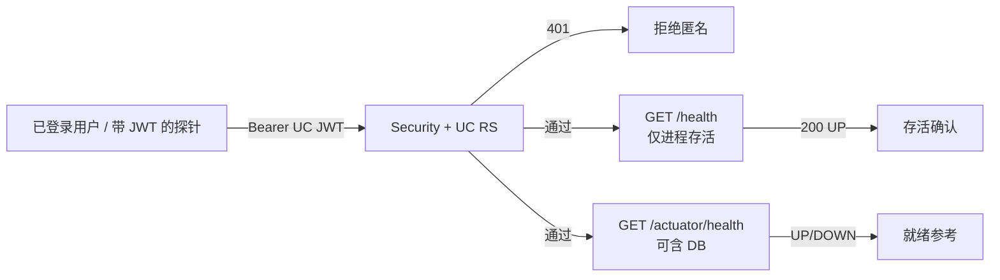
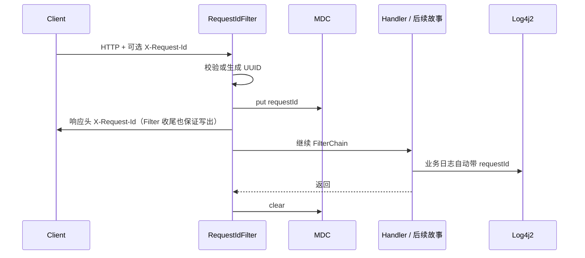

# US-G0-14 健康检查与结构化日志设计

> **用户故事**：[../02-用户故事.md](../02-用户故事.md) · US-G0-14  
> **状态**：详细设计修订中（**排期延后**；依赖 UC JWT 就绪后再编码）  
> **范围**：需登录的 `/health` + 请求级 `request_id` + Log4j2 结构化日志与隐私红线；不含限流 / 计费落库 / Prometheus 全套指标  
> **需求映射**：[../01-需求.md](../01-需求.md) FR-ADMIN-03/04；§6.1 `/health`；§8.2；OQ-04；NFR-06（本故事仅打日志地基）  
> **依赖**：US-G0-01（骨架）；**US-G0-05**（UC JWT 验签，健康检查鉴权复用）  
> **文档位置**：`token-gateway/docs/design/`

---

## 0. 修订说明（相对初稿）

| 原约定 | 现约定 | 原因 |
|--------|--------|------|
| `GET /health` **无鉴权**（permitAll） | **必须携带有效 UC `access_token`**（已登录用户） | 降低公网匿名刷探活打满连接/带宽的风险 |
| 依赖仅 US-G0-01；可与骨架并行 | **依赖 US-G0-05**；**排在计费主路径 / G1 对接之后** | 鉴权能力未就绪前无法闭环；不阻塞演示切片 |

**部署影响**：传统「匿名 HTTP 探活」不再适用。进程守护可用端口探测 / 本机带 Token 的脚本；编排器若要做 HTTP readiness，须注入服务账号 JWT，或仅内网 + 仍要求 Bearer（见 §3.4）。

---

## 1. 已确认选型

| 项 | 决定 |
|----|------|
| 探活路径 | 公网约定 **`GET /health`**（FR-ADMIN-03） |
| **探活鉴权** | **`Authorization: Bearer {UC access_token}`**；无效 / 缺失 → **401**；与 provision 等同属「已登录用户」 |
| 探活语义 | **进程存活（liveness）**：鉴权通过后，只要进程可响应即 `200` + `{"status":"UP"}`，**不**因 DB / 上游短暂不可用而失败 |
| Actuator | `GET /actuator/health` **同样要求 UC JWT**（取消 permitAll）；可作为带鉴权的 readiness 参考（可含 DB） |
| 日志框架 | 已选 **Log4j2**（排除 Logback）；本故事补齐配置与 MDC |
| 日志形态 | **结构化**（推荐 JSON 一行一条）；本地开发可用可读 Pattern，字段键名与生产一致 |
| `request_id` | 服务端在 Filter 最早阶段生成或采纳；写入 **MDC**、响应头 **`X-Request-Id`**；后续计费幂等（G0-10/12）复用同一 ID |
| 隐私 | **禁止**记录 prompt / completion 正文；**禁止**明文 sk / 上游 Key / UC token（OQ-04、§8.2） |

> **不接受**网关 `sk-` 调 `/health`（本期）：健康检查面向「登录运维/登录用户」，与 Chat 长期 Key 分离，避免 sk 泄露后被用于刷探活。若后续要给 Agent 探活，另开故事。

---

## 2. 目标与非目标

### 2.1 目标

1. **已登录用户**可调用 `GET /health` 确认服务存活；匿名调用被拒绝。
2. 任意业务请求（及鉴权失败）日志可按 `request_id` 检索同一条调用链。
3. 应用日志默认结构化，便于集中检索；关键字段稳定、可文档化。
4. 日志与响应均不泄露正文与密钥。

### 2.2 非目标（本故事不做）

| 不做 | 说明 |
|------|------|
| 管理端 / 管理 API | FR-ADMIN-05 Out of Scope |
| Prompt 采样落库或落盘 | OQ-04 |
| 完整指标栈（Prometheus / Grafana） | NFR-06 后续；本故事只保证可观测日志地基 |
| 改 `/health` 为深度依赖检查 | 深度检查留给 actuator readiness，避免误杀进程 |
| 匿名 / 内网免鉴权探活旁路 | 本期不做「第二套免密 `/internal/health`」；若运维强需求另开故事并默认不暴露公网 |
| 改写 `token_request_logs` 表结构 | 属 G0-02 / G0-10 |

---

## 3. 健康检查设计



### 3.1 `GET /health`（契约）

| 项 | 约定 |
|----|------|
| 鉴权 | **必填** UC `access_token`（G0-05 验签）；**取消** Security `permitAll` |
| 成功 | `200`，`Content-Type: application/json`，body：`{"status":"UP"}` |
| 未登录 / Token 无效 | **401**（不返回 UP） |
| 业务语义 | 鉴权通过后 **不**因 DB 失败而返回非 UP |
| 实现 | 沿用 `HealthController`；本故事改 Security 与文档，**不**注入 DataSource 做探测 |

### 3.2 `GET /actuator/health`（带鉴权的就绪参考）

| 项 | 约定 |
|----|------|
| 鉴权 | 与 `/health` 相同（UC JWT） |
| 用途 | 运维/编排在**已持有 Token** 时查看含 DB 等组件状态 |
| 暴露 | 维持 `management.endpoints.web.exposure.include: health,info` |
| 细节 | `show-details: when_authorized` |
| DB | `management.health.db.enabled: true`（G0-02 起有库） |

### 3.3 与骨架（G0-01）的关系

| 阶段 | `/health` 鉴权 |
|------|----------------|
| G0-01～G0-05 前 | 骨架可暂时 `permitAll`，仅便于本地冒烟（**不作为产品终态**） |
| 本故事落地后 | **必须** authenticated（UC JWT）；与需求 §6.1 对齐 |

### 3.4 部署 / 守护建议

匿名高频打 `/health` 的风险通过 **401 + 鉴权** 抑制；仍须注意：

- 持有效 JWT 的调用仍会消耗验签与少量 CPU → 可在后续与 **US-G0-13 限流**叠加（按用户 / IP）。
- 进程是否存活：优先用 **系统级**检测（进程存在、端口监听），不必依赖匿名 HTTP。
- 若编排必须 HTTP 探活：使用短生命周期或服务账号 JWT，存于密钥管理，**禁止**把个人长期 Token 写进公开仓库。

调用示例：

```http
GET /health HTTP/1.1
Authorization: Bearer {user_center_access_token}
```

### 3.5 探活与日志

已认证的 `/health`、`/actuator/health/**` **默认不写访问 INFO 日志**（避免合法探针打爆磁盘）；匿名 401 可用 WARN/DEBUG 限频记录（编码时注意勿刷屏）。

---

## 4. `request_id` 生命周期



### 4.1 生成规则

| 规则 | 说明 |
|------|------|
| 入站头 | 识别 `X-Request-Id`（大小写不敏感，Servlet 已折叠） |
| 采纳条件 | 非空、长度 ≤ 64、仅 `[A-Za-z0-9._-]`；否则 **忽略并服务端生成** |
| 默认生成 | `UUID.randomUUID().toString()`（无花括号，标准连字符形式） |
| 出站头 | **始终**回写 `X-Request-Id: <最终值>`（含 401）；健康检查可跳过访问 INFO，但仍可带 ID |
| 与账本 | G0-10/12 扣费幂等键 = 本 Filter 确定的 `request_id`；**禁止**在业务层另起一套 ID 而不入 MDC |

> 客户端重试：若携带**同一** `X-Request-Id` 且符合采纳规则，网关沿用该 ID，便于幂等（与需求 §7.2「同一 request_id 不重复扣」对齐）。非法头则重新生成，避免注入奇怪字符进库。

### 4.2 MDC 键（稳定契约）

| MDC 键 | 何时写入 | 说明 |
|--------|----------|------|
| `requestId` | Filter 入口 | 必有（含健康检查与 401） |
| `tenantId` | G0-05 鉴权成功后 | 健康检查成功时可写入 |
| `userCode` / `userId` | 鉴权成功后 | 可选 |
| `keyName` | sk 鉴权成功后 | 可选；与 `/health` 无关 |
| `model` | Chat 解析 body 模型字段后 | 可选；**只记模型名，不记 messages** |

本故事编码 **必须**落地 `requestId`；UC 相关 MDC 在 G0-05 已有验签上下文时一并写入。

### 4.3 包位置

| 类 | 包 | 职责 |
|----|----|------|
| `RequestIdFilter` | `…server.config` 或 `…server.web` | OncePerRequestFilter；生成/采纳 ID、MDC、响应头 |
| `RequestIdFilterConfig` | `…server.config` | 注册 Filter，**order 尽量靠前**（早于 Security，便于 401 日志仍带 ID） |
| Security 调整 | `SecurityConfig`（及 G0-05 RS 配置） | **移除** `/health`、`/actuator/health/**` 的 `permitAll`，纳入 authenticated + UC JWT |
| （可选）`MdcTaskDecorator` | 同包 | 若后续有 `@Async`，再补；G0 主路径 Servlet 同步可暂不做 |

---

## 5. 结构化日志设计

### 5.1 配置文件

新增：`token-gateway-server/src/main/resources/log4j2-spring.xml`（或 `log4j2.xml`）。

| 环境 | Appender | 格式建议 |
|------|----------|----------|
| 默认 / 生产 | Console（及可选 RollingFile） | **JSON**（`JsonTemplateLayout` 或 `JsonLayout`） |
| `local` profile | Console | Pattern：时间 + level + `requestId` + logger + msg |

JSON 推荐字段（与 MDC / LogEvent 对齐）：

| 字段 | 来源 |
|------|------|
| `timestamp` | 事件时间（ISO-8601，建议 UTC） |
| `level` | LogLevel |
| `logger` | logger name |
| `message` | 消息文本 |
| `requestId` | MDC |
| `tenantId` / `userId` / `keyName` / `model` | MDC（可空） |
| `thread` | 线程名 |
| `exception` | 有堆栈时 |

检索示例（集中日志）：`requestId:"<uuid>"` 或字段等于查询。

### 5.2 访问 / 业务日志约定

| 类型 | 级别 | 内容示例（消息内或结构化字段） |
|------|------|--------------------------------|
| 请求开始（可选） | DEBUG | method、path、（脱敏后）无 body |
| 请求结束 | INFO | method、path、status、latencyMs |
| 鉴权失败 | WARN | 原因码（invalid_token / expired…），无 token 明文 |
| 业务拒绝 | WARN/INFO | 如 429、余额不足；带 requestId |
| 未预期异常 | ERROR | 异常类 + 摘要；**不**把请求 body 拼进消息 |

实现方式（编码阶段二选一，设计推荐 A）：

- **A.** `CommonsRequestLoggingFilter` **禁用**（易打 body）；自研轻量 `AccessLogFilter` 只记 method/path/status/latency。  
- **B.** 拦截器 + 显式 logger，同样禁止 body。

已认证探活路径：`/health`、`/actuator/**` 从访问 INFO 中排除。

### 5.3 隐私与安全红线（必须测试）

| 禁止 | 做法 |
|------|------|
| prompt / completion 正文 | 不 `log.info("{}", body)`；Chat 代理只记 model、token 计数、status |
| `Authorization` 原文 | 日志中最多 `sk-****` + prefix（若需要）或完全不记 |
| 上游 API Key | 配置项不落日志；异常消息若含密钥需脱敏 |
| UC access_token | 同 Authorization |
| 完整堆栈中的敏感 query | 自定义消息避免拼接 |

对齐需求：**不持久化**正文（库表已无 prompt 列）；应用日志同样遵守 OQ-04。

### 5.4 与 `token_request_logs` 的关系

| 通道 | 用途 |
|------|------|
| 应用日志（本故事） | 实时排障、按 `request_id` 搜调用链 |
| `token_request_logs`（G0-10） | 对账、毛利、按 key 用量；字段见 G0-02 |

两者共享同一 `request_id` 字符串；**不是**互相替代。

---

## 6. 与现有骨架的衔接

| 已有 | 本故事动作 |
|------|------------|
| `HealthController` | 保持响应体契约；鉴权由 Security 承担 |
| `SecurityConfig` 当前放行探活 | **改为**需 UC JWT；与 G0-05 资源服务器配置对齐 |
| `spring-boot-starter-log4j2` | 增加 `log4j2-spring.xml` |
| `application.yml` `logging.level` | 保留包级别；结构化由 log4j2 布局负责 |
| README | 补充：须带 UC Token 的调用方式、进程级探活建议、按 `request_id` 检索、隐私红线 |

---

## 7. 配置键（可选）

| 键 | 默认 | 说明 |
|----|------|------|
| `token-gateway.observability.access-log-enabled` | `true` | 是否打请求结束 INFO |
| `token-gateway.observability.access-log-exclude` | `/health,/actuator/**` | Ant 风格排除 |

非必须；硬编码排除探活亦可，减少配置面。

---

## 8. 验收用例（对齐故事）

| # | Given | When | Then |
|---|--------|------|------|
| H0 | 无 `Authorization` 或 Token 无效 | `GET /health` | **401**；不返回 `status:UP` |
| H1 | 有效 UC JWT；库可连或不可连 | `GET /health` | `200` + `{"status":"UP"}`（不因 DB 失败） |
| H2 | 有效 UC JWT | `GET /actuator/health` | 有 JSON status；DB DOWN 时可为 DOWN |
| H3 | 仅携带网关 `sk-`（无 UC JWT） | `GET /health` | **401**（本期不认 sk） |
| L1 | 任意业务路径（含 401） | 发请求 | 响应含 `X-Request-Id`；日志同行含相同 `requestId` |
| L2 | 请求带合法 `X-Request-Id: client-abc_1` | 处理完成 | 响应与 MDC 使用 `client-abc_1` |
| L3 | 请求带非法头（含空格/过长） | 处理完成 | 服务端新生成 UUID；响应头为新值 |
| L4 | Chat 类请求（代理落地后） | 成功或失败 | 日志**无** messages / 正文片段 |
| L5 | 持 Token 高频探活 | 连续 `GET /health` | 不产生海量 INFO 访问日志 |

---

## 9. 编码任务清单（确认且 G0-05 就绪后）

1. Security：取消探活 `permitAll`；`/health`、`/actuator/health/**` 走 UC JWT。  
2. `RequestIdFilter` + 注册（靠前；finally 清 MDC）。  
3. `log4j2-spring.xml`：生产 JSON + local Pattern；MDC 映射 `requestId`。  
4. 轻量访问日志 Filter（排除探活 INFO）；禁止 body。  
5. README：鉴权探活、进程级守护建议、按 `request_id` 检索、隐私红线。  
6. 验收：H0～H3、L1～L3。

---

## 10. 本故事不做 / 后续

| 不做 | 后续 |
|------|------|
| 匿名内网探活旁路 | 若运维必需，单独故事 + 默认不暴露公网 |
| `sk-` 调健康检查 | 按需另开 |
| 扣费与 `token_request_logs` 写入 | US-G0-10 / 12 |
| 探活专用限流 | 可挂 US-G0-13 |
| 指标导出与告警 | NFR-06；US-G2-03 |
| 管理端看日志 | Out of Scope |
