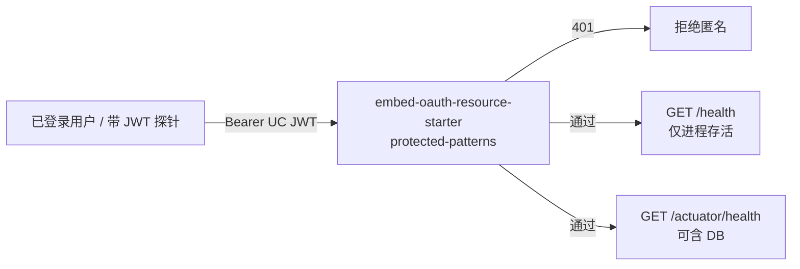
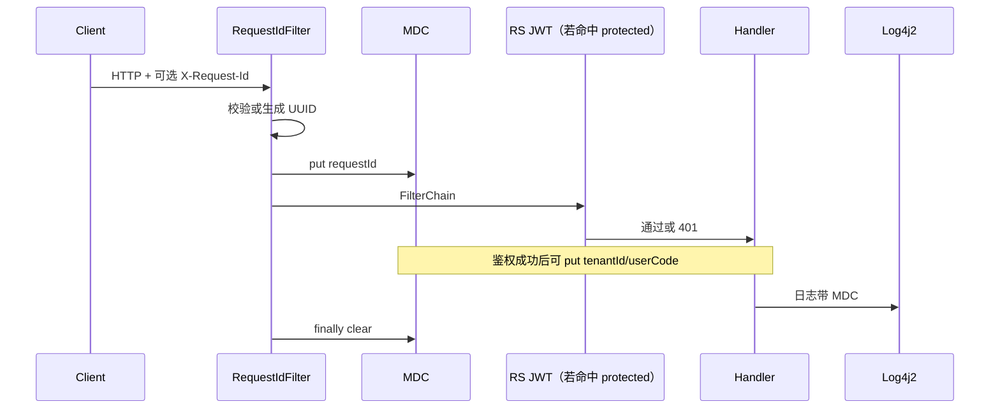

# US-G0-14 健康检查与结构化日志设计

> **用户故事**：[../02-用户故事.md](../02-用户故事.md) · US-G0-14  
> **状态**：编码已落地（`protected-patterns` 含 health；`RequestIdFilter` / 访问日志 / Log4j2；待 `-Puc-rs` 联调 H0～H3）  
> **范围**：UC JWT 保护的 `/health` + 请求级 `request_id` + Log4j2 结构化日志与隐私红线；不含限流 / 计费落库 / Prometheus 全套指标  
> **需求映射**：[../01-需求.md](../01-需求.md) FR-ADMIN-03/04；§6.1 `/health`；§8.2；OQ-04；NFR-06（本故事仅打日志地基）  
> **依赖**：US-G0-01；**US-G0-05**（已编码：RS 链 + 共享 `jwk-key` + `UcIdentity`）  
> **文档位置**：`token-gateway/docs/design/`

---

## 0. 相对前一版的变更（JWT 已接入后）

| 项 | 前一版 | 现约定 |
|----|--------|--------|
| 排期 | 刻意延后到 G1 之后（等 JWT） | **依赖已满足**；可在 G0-05 之后任意插入，**不强制**排在 G1 后 |
| 鉴权实现 | 写「改 SecurityConfig / 取消 permitAll」 | **无自建 SecurityConfig**；在 `com.mfs.user.oauth.resource.protected-patterns` **追加**探活路径（与 G0-05 一致） |
| 身份上下文 | 仅预留 MDC 键名 | 复用已有 **`UcIdentity` / `UcIdentityResolver`** 写入 MDC |
| 无 `-Puc-rs` | 未强调 | 正式环境必须 `-Puc-rs`；无 Starter 时的 `SkeletonPermitAllSecurityConfig` **不能**当作鉴权探活 |

鉴权目标不变：`/health` **必须** UC `access_token`，拒绝匿名刷探活。

---

## 1. 已确认选型

| 项 | 决定 |
|----|------|
| 探活路径 | 公网约定 **`GET /health`**（FR-ADMIN-03）；`HealthController` 保持 `{"status":"UP"}` |
| **探活鉴权** | **UC JWT**（与 AS 相同 `jwk-key` HS256）；经 RS Starter 保护；无效 / 缺失 → **401** |
| 保护声明 | 扩大 `protected-patterns`（见 §3.1）；**不**新建平行安全链 |
| 探活语义 | **进程存活（liveness）**：鉴权通过后不因 DB / 上游失败而返回非 UP |
| Actuator | `GET /actuator/health`、`/actuator/health/**` **同样**纳入 JWT 保护；可作 readiness 参考（可含 DB） |
| 日志框架 | 已有 **Log4j2**；本故事补 `log4j2-spring.xml` + MDC |
| 日志形态 | **Pattern**（对齐参考项目）+ RollingFile / ErrorFile；MDC 带 `requestId` 等 |
| `request_id` | Filter 最早生成或采纳 → MDC + 响应头 **`X-Request-Id`**；G0-10/12 扣费幂等复用 |
| 隐私 | **禁止** prompt/completion 正文；**禁止**明文 sk / 上游 Key / UC token（OQ-04） |
| Chat / usage | **仍不**进 JWT `protected-patterns`（留给 G0-08 `sk-`） |

> **不接受**仅网关 `sk-` 调 `/health`（本期）。

---

## 2. 目标与非目标

### 2.1 目标

1. 已登录用户（有效 UC JWT）可 `GET /health`；匿名 → 401。  
2. 业务请求（含 401）可按 `request_id` 检索同一调用链。  
3. 应用日志结构化；关键 MDC 字段稳定。  
4. 日志不泄露正文与密钥。

### 2.2 非目标

| 不做 | 说明 |
|------|------|
| 管理端 / 管理 API | FR-ADMIN-05 |
| Prompt 采样 | OQ-04 |
| 完整指标栈 | NFR-06 后续 |
| `/health` 深度依赖检查 | 深度看 actuator；liveness 保持轻量 |
| 匿名 / 内网免鉴权旁路 | 本期不做第二套免密探活 |
| 改 `token_request_logs` | G0-02 / G0-10 |

---

## 3. 健康检查设计（对齐 G0-05 RS）



### 3.1 配置变更（编码核心）

当前（G0-05）`application.yml`：

```yaml
com.mfs.user.oauth.resource.protected-patterns:
  - /v1/keys/**
  - /v1/auth/**
```

本故事追加：

```yaml
com.mfs.user.oauth.resource.protected-patterns:
  - /v1/keys/**
  - /v1/auth/**
  - /health
  - /actuator/health
  - /actuator/health/**
```

| 路径 | 鉴权 | 说明 |
|------|------|------|
| `GET /health` | UC JWT | liveness；`HealthController` |
| `GET /actuator/health/**` | UC JWT | readiness 参考；可含 DB |
| `GET /v1/auth/whoami` | UC JWT | 已有（G0-05） |
| `/v1/keys/**` | UC JWT | 已有；业务 G0-06+ |
| `/v1/chat/**`、`/v1/usage/**` | **不**加 JWT | G0-08 `sk-` |

**禁止**为探活再写一套 `SecurityFilterChain`。

### 3.2 `GET /health` 契约

| 项 | 约定 |
|----|------|
| 成功 | `200` + `{"status":"UP"}`（鉴权已过；**不**查库） |
| 未登录 / 坏 Token / 错 `jwk-key` | **401** |
| 仅 `sk-` | **401**（本期） |
| 实现 | 保持现有 `HealthController`；鉴权只靠 patterns |

### 3.3 Actuator

| 项 | 约定 |
|----|------|
| 暴露 | `health,info`（维持） |
| `show-details` | `when_authorized` |
| DB | `management.health.db.enabled: true` |

### 3.4 部署建议

- 进程存活优先：**端口监听 / 进程存在**（不必匿名 HTTP）。  
- 若编排要 HTTP：注入短生命周期或服务账号 JWT；**禁止**把个人 Token 写进仓库。  
- 持 Token 刷探活仍耗验签 CPU → 后续可叠 G0-13 限流。

```http
GET /health HTTP/1.1
Authorization: Bearer {user_center_access_token}
```

### 3.5 探活与访问日志

已认证 `/health`、`/actuator/health/**` **不写**访问 INFO；匿名 401 可用 WARN/DEBUG 并注意限频。

---

## 4. `request_id` 生命周期



### 4.1 生成规则

| 规则 | 说明 |
|------|------|
| 入站头 | `X-Request-Id` |
| 采纳 | 非空、≤ 64、`[A-Za-z0-9._-]`；否则服务端生成 |
| 默认 | `UUID.randomUUID().toString()` |
| 出站 | **始终**回写 `X-Request-Id`（含 401） |
| 账本 | G0-10/12 幂等键 = 此 ID；业务层禁止另起一套不入 MDC |

### 4.2 MDC 键

| MDC 键 | 何时 | 说明 |
|--------|------|------|
| `requestId` | Filter 入口 | **本故事必做** |
| `tenantId` / `userCode` | UC JWT 成功后 | 调用 `UcIdentityResolver`（已有）；探活成功亦可写 |
| `keyName` | G0-08 后 | 本故事只预留 Pattern 占位 |
| `model` | Chat 落地后 | 只记模型名 |

可选：`UcMdcFilter` / 在访问日志 Filter 中，若 `SecurityContext` 已认证则 `resolve` 后写入；缺 claim 的 401 已由 whoami/业务处理，探活只需验签通过。

### 4.3 类位置

| 类 | 包 | 职责 |
|----|----|------|
| `RequestIdFilter` | `…server.web` 或 `…server.config` | 生成/采纳 ID、MDC、响应头；`finally` 清理 |
| `AccessLogFilter`（推荐） | 同上 | method/path/status/latency；排除探活；**禁止 body** |
| （可选）`UcMdcEnricher` | `…server.security` | 认证后补 `tenantId`/`userCode` |

Filter **order 靠前**（早于或紧贴 Security），保证 401 仍带 `requestId`。

---

## 5. 结构化日志

### 5.1 `log4j2-spring.xml`

路径：`token-gateway-server/src/main/resources/log4j2-spring.xml`。  
布局对齐仓库参考 [`docs/reference/log4j2-spring.xml`](../reference/log4j2-spring.xml)，并嵌入 G0-14 MDC。

| 项 | 约定 |
|----|------|
| Console | Pattern（含 `requestId` / `tenantId` / `userCode`） |
| RollingFile | `${logging.file.path}/{app}.log`；按日 + 50MB；archive gzip；`max=30` |
| ErrorFile | 同目录 `{app}-error.log`；`ThresholdFilter=ERROR` |
| APP_NAME | `spring.application.name`（默认 `token-gateway-server`） |
| LOG_PATH | `logging.file.path` / `LOGGING_FILE_PATH`（默认 `logs`） |
| local | 业务包可调 DEBUG；Appender 与生产相同 |

检索：在 `logs/*.log` 中搜 `requestId` 或 Pattern 中的 `[uuid]`。  
（不再以纯 JSON Console 为默认；若集中日志平台需要 JSON，可另加 Appender，不阻塞本故事。）

### 5.2 访问日志约定

| 类型 | 级别 | 内容 |
|------|------|------|
| 请求结束 | INFO | method、path、status、latencyMs |
| 鉴权失败 | WARN | 原因码；无 token 明文 |
| 未预期 | ERROR | 类型 + 摘要；无 body |

禁用 `CommonsRequestLoggingFilter`（易打 body）。

### 5.3 隐私红线

| 禁止 | 做法 |
|------|------|
| prompt / completion | 不记 messages 正文 |
| `Authorization` | 不落日志原文 |
| 上游 Key / UC token | 同左 |

### 5.4 与 `token_request_logs`

应用日志排障；表对账（G0-10）。共享同一 `request_id` 字符串。

---

## 6. 与当前代码衔接

| 已有（仓库现状） | 本故事动作 |
|------------------|------------|
| `HealthController` | 保持 body；靠 patterns 鉴权 |
| `protected-patterns`（keys/auth） | **追加** `/health`、`/actuator/health/**` |
| `UcIdentityResolver` | MDC 富化复用 |
| 已删 `SecurityConfig` | **不恢复**；不靠自建链 |
| `SkeletonPermitAllSecurityConfig` | 仅无 `-Puc-rs`；编码验收以 **有 RS** 为准 |
| log4j2 依赖已在 | 补 XML 布局 |
| README | 鉴权探活示例、进程级守护、`request_id` 检索、隐私 |

同步改 G0-05 设计/README 中「探活仍 permitAll」的过时句（编码时或本文确认后一并改）。

---

## 7. 可选配置

| 键 | 默认 | 说明 |
|----|------|------|
| `token-gateway.observability.access-log-enabled` | `true` | 请求结束 INFO |
| `token-gateway.observability.access-log-exclude` | `/health,/actuator/health/**` | 排除探活访问日志 |

---

## 8. 验收用例

| # | Given | When | Then |
|---|--------|------|------|
| H0 | 无 Authorization / 坏 Token | `GET /health` | **401** |
| H1 | 有效 UC JWT；DB 可或不可 | `GET /health` | `200` + `{"status":"UP"}` |
| H2 | 有效 UC JWT | `GET /actuator/health` | 有 status；DB DOWN 可为 DOWN |
| H3 | 仅 `sk-` | `GET /health` | **401** |
| H4 | `-Puc-rs` + 正确 `OAUTH_JWK_KEY` | 查 `protected-patterns` | 含 health / actuator |
| L1 | 任意路径（含 401） | 请求 | 响应 `X-Request-Id`；日志同 `requestId` |
| L2 | 合法 `X-Request-Id: client-abc_1` | 完成 | MDC/响应沿用 |
| L3 | 非法头 | 完成 | 服务端新 UUID |
| L4 | （代理落地后）Chat | 成功/失败 | 无 messages 正文 |
| L5 | 持 Token 高频探活 | 连续 GET | 无海量 INFO 访问日志 |

---

## 9. 编码任务清单

1. ~~`protected-patterns` 追加 health / actuator~~  
2. ~~`RequestIdFilter`~~  
3. ~~`log4j2-spring.xml`~~  
4. ~~`AccessLogFilter` + UC MDC 富化~~  
5. ~~README~~  
6. 验收 H0～H4、L1～L3（**待 `-Puc-rs` 联调**）  
7. ~~去掉「探活 permitAll」过时描述~~  

---

## 10. 本故事不做 / 后续

| 不做 | 后续 |
|------|------|
| 匿名内网探活旁路 | 另开故事 |
| `sk-` 调 health | 按需 |
| 扣费写 `token_request_logs` | G0-10 / 12 |
| 探活限流 | G0-13 |
| 指标与告警 | NFR-06；G2-03 |
