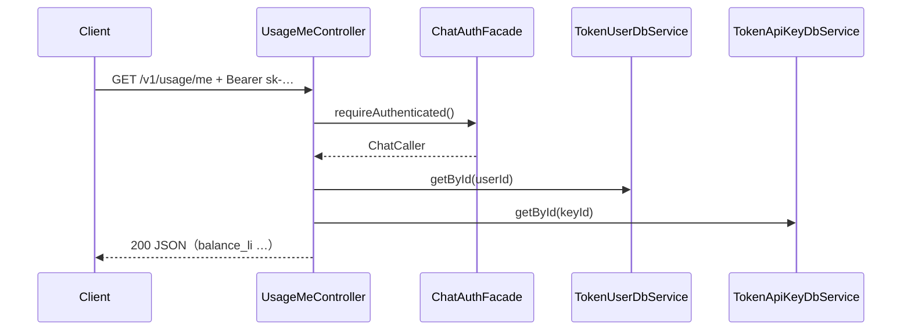

# US-G0-16 查询余额（usage/me）设计

> **用户故事**：[../02-用户故事.md](../02-用户故事.md) · US-G0-16  
> **状态**：编码已落地（`GET /v1/usage/me` 仅余额；无 `today`）  
> **范围**：`GET /v1/usage/me` 用网关 `sk-` 返回**当前账户余额**及身份/Key 摘要  
> **本期收窄**：**不**返回今日用量（`today`）；用量汇总留后续增强（仍属 FR-BILL-05 全量，但不阻塞本故事）  
> **需求映射**：[../01-需求.md](../01-需求.md) FR-BILL-05（余额部分）；§6.1.3（字段子集）  
> **依赖**：US-G0-08（`ChatAuthFacade` / `ChatCaller`）；US-G0-02（`token_users.balance_li`）  
> **不做**：今日用量聚合；按 Key 分解用量；扣费；UC JWT 调本接口；管理端  
> **文档位置**：`token-gateway/docs/design/`

---

## 0. 边界

| 已有 | 本故事 |
|------|--------|
| G0-08：sk → `ChatCaller` | 同一 Facade 保护 `GET /v1/usage/me` |
| G0-06 rotate 响应用户摘要含 `balance_li` | 本接口为 **Chat 侧 sk** 专用查余额（设置页无需 UC JWT） |
| G0-11：402 时客户端需知余额 | 本接口即查询入口；**本路径不做余额预检**（余额为 0 仍应 200） |
| 需求 §6.1.3 含 `today` | **本期省略**；响应不出现 `today` 字段（或编码时用 `@JsonInclude(NON_NULL)` 且永不赋值） |

### 0.1 相对需求的收窄

| 需求原文 | 本期 |
|----------|------|
| 余额 + 今日用量 | **仅余额** + 身份 / 当前 Key 元信息 |
| 可选按 key 分解今日用量 | **不做** |

故事依赖原写「G0-08，G0-10」：查余额**不依赖**异步结算；依赖改为 **G0-08（+ 表结构 G0-02）**。

---

## 1. 已确认 / 建议选型

| 项 | 决定 |
|----|------|
| **Q1 路径** | `GET /v1/usage/me`（与需求一致；路径名保留，即使暂无 usage 汇总） |
| **Q2 鉴权** | 仅 **网关 `sk-`**（`ChatAuthFacade.requireAuthenticated()`）；**不**接 UC JWT |
| **Q3 余额来源** | `token_users.balance_li`（按 `ChatCaller.userId`）；允许为负（G0-10 透支后） |
| **Q4 响应** | 含 `balance_li`、币种元数据、`tenant_id` / `user_code`、当前 Key 的 `name`/`prefix`；**无 `today`** |
| **Q5 预检** | **不**调用 `BalanceGuard` |
| **Q6 UC 保护** | **不**加入 `com.mfs.user.oauth.resource.protected-patterns` |
| **Q7 user_id** | 网关内部数字 ID，JSON 字段 `user_id`（number），与示例字符串 `usr_xxx` 不同——以内部 id 为准 |

---

## 2. 目标与非目标

### 2.1 目标

1. 合法 sk 可查当前账户余额（厘）及调用所用 Key 摘要。  
2. 余额为 0 / 负仍返回 200（便于设置页展示与理解 402）。  
3. 错误码与 Chat sk 鉴权一致（401/403/503）。

### 2.2 非目标

| 不做 | 说明 |
|------|------|
| `today.*` 聚合 | 后续增强：扫 `token_request_logs` / ledger（需约定「日」时区） |
| 公开他人余额 | 仅当前 Key 所属用户 |
| 写库 | 只读；不更新 `last_used_at`（可选：与 Chat 一致更新——**建议不做**，避免设置页轮询刷写） |

---

## 3. 流程



用户行在鉴权时已加载过；本接口再读一次余额，避免把余额塞进 `ChatCaller`，并拿到最新值（结算可能刚扣完）。

---

## 4. API 契约

### 4.1 请求

```http
GET /v1/usage/me
Authorization: Bearer sk-xxxxxxxx
```

无 Query / Body。

### 4.2 成功 200

```json
{
  "user_id": 20,
  "tenant_id": "1",
  "user_code": "u_abc",
  "balance_li": 12340,
  "currency": "CNY",
  "currency_subunit": "li",
  "li_per_yuan": 1000,
  "key": {
    "name": "ftcs-desktop",
    "prefix": "sk-ab12"
  }
}
```

| 字段 | 说明 |
|------|------|
| `user_id` | `token_users.id` |
| `tenant_id` / `user_code` | 账户标识 |
| `balance_li` | 当前余额（厘，可为负） |
| `currency` / `currency_subunit` / `li_per_yuan` | 展示约定；常量 `CNY` / `li` / `1000` |
| `key.name` | 本次鉴权 Key 的 `name` |
| `key.prefix` | `token_api_keys.key_prefix`（展示用） |

**本期禁止**出现 `today` 对象（客户端勿依赖）。

### 4.3 错误

| HTTP | 短码 | 场景 |
|------|------|------|
| 401 | 同 G0-08 | 缺头 / 无效 sk 等 |
| 403 | `key_disabled` / `account_disabled` | 禁用 |
| 503 | `missing_gateway_key_pepper` | pepper 未配 |
| 401 | `invalid_api_key` | 鉴权后用户/Key 行消失（罕见） |

与 Chat 一致；**无 402**（本接口不预检）。

---

## 5. 类清单（编码）

| 类 | 包 | 职责 |
|----|----|------|
| `UsageMeController` | `…server.api` | `GET /v1/usage/me` |
| `UsageMeResponse` | `…server.api.dto` | 出参 DTO |
| `UsageMeApplication`（可选） | `…server.application` | 组响应；Controller 直接组亦可 |

逻辑要点：

```text
caller = chatAuthFacade.requireAuthenticated()
user = userDb.getById(caller.userId) ?: 401
key  = keyDb.getById(caller.keyId)  ?: 用 caller.keyName + prefix="" 降级（或 401）
return UsageMeResponse.from(user, key)
```

`prefix`：优先 DB；若行缺失则仅返回 `name`（或整请求 401——**建议 Key 缺失 → 401 invalid_api_key**）。

---

## 6. 安全

| 项 | 约定 |
|----|------|
| 明文 sk | 不入日志 |
| 余额 | 可打 INFO：`userId` + `balanceLi`（排障）；勿打完整 sk |
| SEC-01 | 不接触上游 DeepSeek Key |

---

## 7. 与前后故事

| 故事 | 关系 |
|------|------|
| G0-08 | 复用鉴权 |
| G0-11 | 402 后客户端调本接口确认余额 |
| G0-10 | 结算后余额变化对本接口立即可见（读库） |
| 后续增强 | 追加 `today`（需定「日」边界：建议 **UTC 自然日** 或配置 `Asia/Shanghai`——单独立项） |

---

## 8. 验收用例

| # | Given | When | Then |
|---|--------|------|------|
| A1 | active 用户余额 12340；合法 sk | GET usage/me | 200；`balance_li=12340`；无 `today` |
| A2 | `balance_li=0` | 同上 | 200；`balance_li=0`（非 402） |
| A3 | `balance_li=-50` | 同上 | 200；`balance_li=-50` |
| A4 | 无 Authorization | 同上 | 401 |
| A5 | 错误 sk | 同上 | 401 |
| A6 | Key disabled | 同上 | 403 |
| A7 | 响应 | A1 | 含 `currency`/`li_per_yuan`；`key.name` 正确 |

---

## 9. 编码任务清单

1. ~~`UsageMeResponse` + Controller（+ 可选 Application）。~~  
2. ~~复用 `ChatAuthFacade`；读 user + key。~~  
3. ~~单测：A1/A2/A4（Mock）。~~  
4. ~~`home.html` / README：接口说明；标明暂无今日用量。~~  
5. ~~故事状态 → 编码已落地。~~

---

## 10. 已确认点汇总

| # | 议题 | 决定 |
|---|------|------|
| Q1 | 路径 | `GET /v1/usage/me` |
| Q2 | 鉴权 | 仅 sk |
| Q3 | 本期范围 | **仅余额**；不做 `today` |
| Q4 | 预检 | 不做 |
| Q5 | 负余额 | 原样返回 |
| Q6 | 依赖 | G0-08 + G0-02（不依赖 G0-10） |
