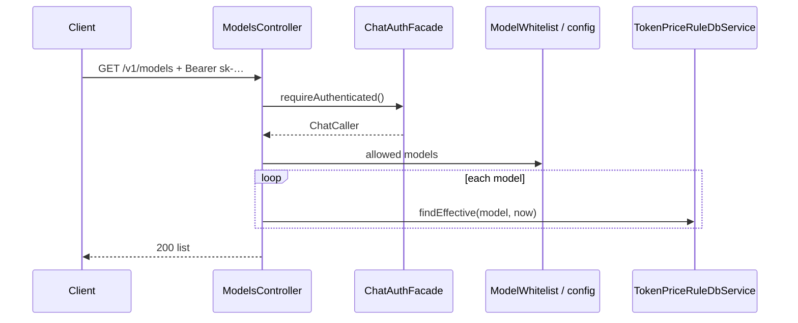

# US-G0-17 GET /v1/models 白名单列表设计

> **用户故事**：[../02-用户故事.md](../02-用户故事.md) · US-G0-17（Should）  
> **状态**：编码已落地（配置白名单 ∩ 有效价目；仅 sk）  
> **范围**：`GET /v1/models` 返回客户端可调用的 DeepSeek 模型列表（已定价 ∩ 配置白名单）  
> **需求映射**：[../01-需求.md](../01-需求.md) FR-PROXY-04；§6.1 接口表  
> **依赖**：US-G0-03（配置白名单 / `ModelWhitelist`）；US-G0-09（`token_price_rules`）；US-G0-08（sk 鉴权，见选型）  
> **不做**：价目金额对外暴露；动态改白名单管理 API；代理逻辑变更  
> **文档位置**：`token-gateway/docs/design/`

---

## 0. 边界

| 已有 | 本故事 |
|------|--------|
| G0-03：`allowed-models` + Chat `model_not_allowed` | 列表与 Chat 放行集合应对齐，避免「列表有、Chat 拒」 |
| G0-09：价目种子 + `findEffective` | FR-PROXY-04「**已定价**」→ 列表须能在价目表解析到有效价 |
| 需求鉴权「网关 Key **或** UC token」 | 见 §1 Q2 |

Chat 仍以 **配置白名单** 拦截出站；本接口只读展示，不替代 Chat 校验。

---

## 1. 已确认 / 建议选型

| 项 | 决定 |
|----|------|
| **Q1 列表来源** | **交集**：`allowed-models` **且** 存在 `effective_from <= now` 的价目行 |
| **Q2 鉴权** | **仅网关 `sk-`**（与 Chat / usage 一致）。需求「或 UC」作**后续增强**，本期不做双凭证，避免 `/v1/models` 进 JWT `protected-patterns` 后 sk 被拒 |
| **Q3 响应形态** | OpenAI 兼容 **`object=list` + `data[]`**（便于现有 SDK）；每项含 `id`（= model 名） |
| **Q4 是否含价** | **不含**单价字段（价目不对外；设置页只需可选 model id） |
| **Q5 排序** | 按 `id` 字典序；稳定即可 |
| **Q6 空列表** | 仍 200 + `data: []`（配置/价目未对齐时便于发现，不 5xx） |
| **Q7 asOf** | `UTC` 当前时间（与计价 `asOf` 习惯一致） |

---

## 2. 目标与非目标

### 2.1 目标

1. 合法 sk 可拉取「能 Chat 且已定价」的模型 id 列表。  
2. 与 G0-03 白名单、G0-09 价目不漂移（交集语义）。  
3. 不泄露上游 Key、不泄露厘价。

### 2.2 非目标

| 不做 | 说明 |
|------|------|
| UC JWT 调 models | 后续若桌面要用 JWT，再加应用层双鉴权 |
| 返回 `input_price_li_per_mTok` 等 | 公开价目另议 |
| 修改 Chat 白名单逻辑 | Chat 仍只读配置 |
| 按用户差异化模型集 | MVP 全局同一列表 |

---

## 3. 列表算法

```text
now = UTC now
configured = token-gateway.upstream.deepseek.allowed-models
result = []
for model in configured (sorted):
  if priceRuleDb.findEffective(model, now) != null:
    result.add(model)
return result
```

| 情况 | 行为 |
|------|------|
| 在白名单、有价 | 出现在列表 |
| 在白名单、无价 | **不出现**（避免引导用户打到结算 `settle_failed`） |
| 有价、不在白名单 | **不出现**（Chat 会 400；与 FR「可调用」一致） |

实现注意：N 次 `findEffective` 对白名单仅 2～数个模型可接受；若白名单变长再改为「一次查出所有有效价 model 再交集」。

---

## 4. 流程



鉴权成功即可；**不**读余额、不预检。

---

## 5. API 契约

### 5.1 请求

```http
GET /v1/models
Authorization: Bearer sk-xxxxxxxx
```

### 5.2 成功 200

```json
{
  "object": "list",
  "data": [
    {
      "id": "deepseek-v4-flash",
      "object": "model",
      "owned_by": "deepseek"
    },
    {
      "id": "deepseek-v4-pro",
      "object": "model",
      "owned_by": "deepseek"
    }
  ]
}
```

| 字段 | 说明 |
|------|------|
| `object` | 固定 `"list"` |
| `data[].id` | 模型 ID（与 Chat `model` 字段一致） |
| `data[].object` | 固定 `"model"` |
| `data[].owned_by` | 固定 `"deepseek"`（展示用） |

可选增强（本期可不做）：`created` unix 时间戳。

### 5.3 错误

与 G0-08 sk 鉴权相同（401/403/503）。无业务 404。

---

## 6. 类清单（编码）

| 类 | 包 | 职责 |
|----|----|------|
| `ModelsController` | `…server.api` | `GET /v1/models` |
| `ModelsListResponse` | `…server.api.dto` | list DTO |
| `ModelsApplication` | `…server.application` | 交集查询 |
| `ModelWhitelist` | 已有 | 可扩展 `Set<String> all()` / `List<String> listSorted()` |

配置读取：优先扩展 `ModelWhitelist` 暴露只读集合，避免 Controller 直读 Properties。

安全：`/v1/models` **不**加入 UC JWT `protected-patterns`。

---

## 7. 与前后故事

| 故事 | 关系 |
|------|------|
| G0-03 | Chat 仍用配置白名单；本列表 ⊆ 配置 |
| G0-09 | 无有效价则不出现在列表 |
| G0-16 | 同 sk；设置页可「拉 models + 查余额」 |
| 调价运维 | 新 model：先配 `allowed-models` + INSERT 价目，再出现在列表 |

---

## 8. 验收用例

| # | Given | When | Then |
|---|--------|------|------|
| A1 | 默认白名单 + V1_0_0 种子价 | GET /v1/models + sk | 200；含 flash 与 pro |
| A2 | 配置追加未定价 model | 同上 | 列表**不含**该 model |
| A3 | 库中有价但移出 allowed-models | 同上 | 列表不含 |
| A4 | 非法 sk | 同上 | 401 |
| A5 | 响应 | A1 | 无价格字段；`id` 与 Chat 可用 model 一致 |
| A6 | 白名单为空 | 同上 | 200；`data: []` |

---

## 9. 编码任务清单

1. ~~`ModelWhitelist` 暴露有序列表。~~  
2. ~~`ModelsApplication`：交集 + DTO。~~  
3. ~~`ModelsController` + sk 鉴权。~~  
4. ~~单测：A1/A2/A4（Mock 价目）。~~  
5. ~~`home.html` / README；故事状态更新。~~

---

## 10. 已确认点汇总

| # | 议题 | 决定 |
|---|------|------|
| Q1 | 来源 | 配置白名单 ∩ 有效价目 |
| Q2 | 鉴权 | **仅 sk**（UC 后续） |
| Q3 | 形态 | OpenAI list |
| Q4 | 价格 | 不对外 |
| Q5 | 空列表 | 200 + `[]` |
