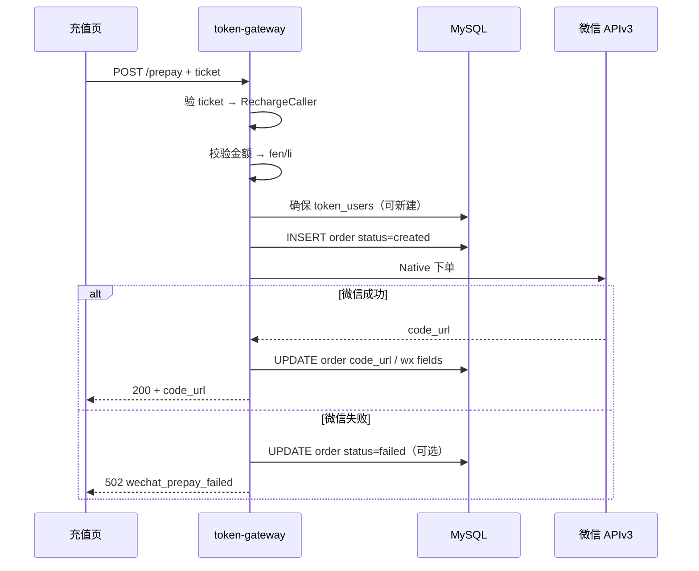
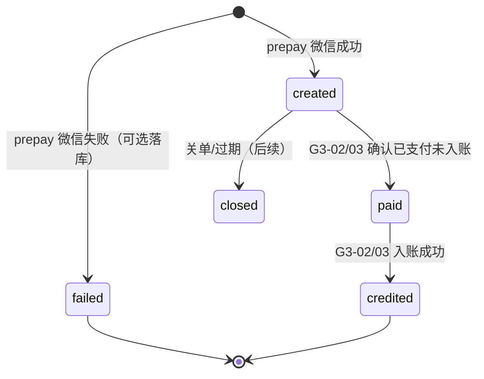

# US-G3-01 创建微信支付单（Native 预下单）设计

> **用户故事**：[../02-用户故事.md](../02-用户故事.md) · US-G3-01  
> **状态**：编码已落地（单测覆盖金额/Filter/prepay；联调需启用 wechat-pay + 商户证书）  
> **范围**：合法金额内创建微信 Native 支付单，返回 `code_url`；落本地订单 `created`；充值 ticket 鉴权。  
> **需求映射**：[../13-微信支付自助充值执行计划.md](../13-微信支付自助充值执行计划.md) D2-1；产品口径已拍板  
> **依赖**：US-G0-02（账本单位/账户）；US-G3-06 §4（recharge ticket）；商户号 / APIv3 证书（`important/`，不进 Git）  
> **不做**：支付成功回调入账（US-G3-02）；查单补单 /「我已支付」（US-G3-03）；充值页 UI（已部分落地）；退款；JSAPI/H5  
> **文档位置**：`token-gateway/docs/design/`

---

## 0. 边界

| 已有 / 并行 | 本故事 |
|-------------|--------|
| G3-06：充值页调 `POST …/prepay` | 本故事实现该 API + 订单表 |
| G3-06：ticket Cookie / Bearer | 本故事实现 **Filter / Resolver**（页内业务 API 共用） |
| G3-02：`notify` 验签入账 | 本故事只预留 `notify_url` 与订单状态机起点；详见 [US-G3-02-微信支付回调幂等入账设计.md](./US-G3-02-微信支付回调幂等入账设计.md) |
| G3-03：查单 sync | 本故事可定义订单查询字段，**实现不阻塞**本故事出门；详见 [US-G3-03-微信支付查单补单设计.md](./US-G3-03-微信支付查单补单设计.md) |
| G0-15：人工 topup | 语义对齐；自助入账仍归 G3-02 |

---

## 1. 已确认选型

| 项 | 决定 |
|----|------|
| **Q1 支付产品** | 微信 **Native 扫码**（APIv3 `POST /v3/pay/transactions/native`） |
| **Q2 鉴权** | **recharge ticket**（Cookie `tg_recharge_ticket` 或 `Authorization: Bearer rt_…`）；**不**用 UC JWT；**不**用 sk |
| **Q3 金额** | 请求用**元**（最多 2 位小数）；服务端强制 `1.00 ≤ amount ≤ 100.00` |
| **Q4 单位换算** | **1 元 = 100 分（微信）= 1000 厘（账本）**；见 §3 |
| **Q5 商品描述** | 固定文案：**官方通道预付费充值**（与进件/页文案一致） |
| **Q6 一单一码** | 每次成功 prepay **新建** `out_trade_no`；改金额 / 重试出码均新单（旧单可随后关闭或留给 G3-02/03） |
| **Q7 账户** | 若尚无 `token_users` 行：prepay 时 **自动建户**（余额 0，对齐 rotate 建户），保证后续入账有 `user_id` |
| **Q8 开关** | `token-gateway.wechat-pay.enabled`；关闭或缺关键配置 → `503 wechat_pay_unavailable` |
| **Q9 AppID** | Native 仍需绑定 AppID；未配置时 prepay **失败**（503），不 mock `code_url` |
| **Q10 SDK** | **微信支付官方 Java SDK**：[`wechatpay-java`](https://github.com/wechatpay-apiv3/wechatpay-java)（Maven `com.github.wechatpay-apiv3:wechatpay-java`）；**禁止**自研签名 HTTP 客户端替代主路径；**验签配置**用 `RSAPublicKeyConfig`（微信支付公钥，新商户无平台证书）；勿再用会拉 `/v3/certificates` 的 `RSAAutoCertificateConfig`（无平台证书时启动 404） |

### 1.1 与早期执行计划差异

执行计划草案曾写「下单用 UC JWT」。**以本设计与 US-G3-06 为准**：浏览器充值页持 ticket；UC JWT 仅用于 `POST /v1/billing/recharge/ticket`。

---

## 2. 目标与非目标

### 2.1 目标

1. 持有效 ticket 的用户可在金额范围内拿到可扫码的 `code_url`。  
2. 本地订单可追溯（`out_trade_no`、金额厘/分、身份、状态）。  
3. 非法金额、无凭证、微信侧失败有明确短码。  
4. 密钥与证书只来自配置 / `important/`，不进仓库。

### 2.2 非目标

| 不做 | 归属 |
|------|------|
| 验签回调、加余额、写 topup | G3-02 |
| 主动查微信订单、补入账 | G3-03 |
| 二维码 UI | G3-06（页已调本 API） |
| 套餐档、优惠券、发票 | — |
| 退款 API | G3-05 / 人工 |

---

## 3. 金额与单位

| 层 | 单位 | 规则 |
|----|------|------|
| 请求体 | 元 | `amount_yuan`：number 或字符串；最多 2 位小数 |
| 校验 | 元 | `1 ≤ x ≤ 100`；非法 → `400 invalid_amount` |
| 微信 `amount.total` | **分** | `fen = round(yuan × 100)`（半入；合法区间仅产生整数分） |
| 账本（本单记录 / 入账用） | **厘** | `li = round(yuan × 1000)`；合法单笔 **1000～100000** 厘 |
| 一致性 | — | 须满足 `li == fen × 10`（因 1 分 = 10 厘）；用「先算分再 `li = fen * 10`」避免双舍入漂移 |

推荐实现：

```text
fen = Money.roundHalfUp(yuan * 100)
li  = fen * 10
assert 100 <= fen <= 10000
```

---

## 4. 鉴权（ticket）

权威约定见 [US-G3-06 §4.6](./US-G3-06-网关托管充值页设计.md)。本故事落地：

1. `RechargeTicketAuthFilter`（或等价 HandlerInterceptor）匹配：  
   - `/v1/billing/wechat/prepay`  
   - （预留）`/v1/billing/wechat/orders/**`、`/v1/billing/wechat/orders/*/sync`  
2. **不**进入 UC RS `protected-patterns`。  
3. 成功：请求属性写入 `RechargeCaller`（已有类可复用）。  
4. 失败：`401` + `invalid_recharge_ticket`。  
5. 校验通过后 `touchLastUsed`。

**禁止**：sk / UC JWT 调 prepay；ticket 调 Chat。

---

## 5. API

### 5.1 预下单

```http
POST /v1/billing/wechat/prepay
Cookie: tg_recharge_ticket=rt_…
Content-Type: application/json
Accept: application/json
```

或：`Authorization: Bearer rt_…`（与 Cookie 二选一；**同时存在时优先 Cookie**，与 G3-06 一致）。

**Body：**

```json
{
  "amount_yuan": 50.00
}
```

| 字段 | 说明 |
|------|------|
| `amount_yuan` | 必填；见 §3 |

**成功 · 200：**

```json
{
  "out_trade_no": "tg2026080514220012345678",
  "code_url": "weixin://wxpay/bizpayurl?pr=…",
  "amount_yuan": "50.00",
  "amount_fen": 5000,
  "amount_li": 50000,
  "expires_in": 7200,
  "status": "created"
}
```

| 字段 | 说明 |
|------|------|
| `out_trade_no` | 网关生成；微信商户订单号 |
| `code_url` | Native 付款码串；页内生成二维码 |
| `expires_in` | 码有效期提示（秒）；默认按微信惯例约 **7200**（以微信文档/返回为准时可写死常量） |
| `status` | 本地订单状态，成功下单后为 `created` |

**错误：**

| HTTP | reason | 场景 |
|------|--------|------|
| 401 | `invalid_recharge_ticket` | 无/坏/过期 ticket |
| 400 | `invalid_amount` | 金额缺失、非数字、超出 1～100、小数位非法 |
| 400 | `invalid_body` | JSON 无法解析 |
| 503 | `wechat_pay_unavailable` | `enabled=false` / 缺 mchId、证书、AppID、notifyUrl、APIv3Key |
| 502 | `wechat_prepay_failed` | 调微信失败（日志含微信 request_id / 错误码，响应仅短码） |
| 500 | `account_provision_failed` | 建户冲突重试耗尽（极少） |

处理步骤（事务边界见 §7）：



### 5.2 订单查询（契约预留，实现可薄）

供充值页轮询 / 成功页展示；**入账仍以 G3-02/03 为准**。

```http
GET /v1/billing/wechat/orders/{outTradeNo}
Cookie: tg_recharge_ticket=…
```

**规则：**

- 须 ticket；且订单的 `(tenant_id, user_code)` 与 ticket 身份一致，否则 `404`（防枚举）。  
- 本故事 MVP：**可读库内状态**即可，不强制调微信。

**200 示例：**

```json
{
  "out_trade_no": "tg…",
  "status": "created",
  "amount_yuan": "50.00",
  "amount_li": 50000,
  "code_url": "weixin://…",
  "credited_li": null,
  "balance_li": null
}
```

`credited` 后由 G3-02 填入 `credited_li` / 可选当前 `balance_li`。

---

## 6. 本地订单表

Flyway 增量建议：`V1_0_2__wechat_pay_orders.sql`（名称以仓库下一版为准）。

```sql
CREATE TABLE token_wechat_pay_orders (
  id                BIGINT       NOT NULL PRIMARY KEY AUTO_INCREMENT,
  out_trade_no      VARCHAR(32)  NOT NULL COMMENT '商户订单号',
  tenant_id         VARCHAR(64)  NOT NULL,
  user_code         VARCHAR(128) NOT NULL,
  user_id           BIGINT       NOT NULL COMMENT 'token_users.id',
  amount_fen        INT          NOT NULL COMMENT '微信分',
  amount_li         BIGINT       NOT NULL COMMENT '账本厘 = fen*10',
  status            VARCHAR(32)  NOT NULL COMMENT 'created|failed|paid|credited|closed',
  code_url          VARCHAR(512) NULL,
  wx_transaction_id VARCHAR(64)  NULL COMMENT '微信支付订单号；入账后填',
  description       VARCHAR(128) NOT NULL,
  notify_url        VARCHAR(512) NOT NULL,
  fail_reason       VARCHAR(256) NULL,
  paid_at           DATETIME(3)  NULL,
  credited_at       DATETIME(3)  NULL,
  created_at        DATETIME(3)  NOT NULL,
  updated_at        DATETIME(3)  NOT NULL,
  UNIQUE KEY uk_out_trade_no (out_trade_no),
  UNIQUE KEY uk_wx_transaction_id (wx_transaction_id),
  KEY idx_user_created (user_id, created_at),
  KEY idx_status_created (status, created_at)
) ENGINE=InnoDB DEFAULT CHARSET=utf8mb4 COLLATE=utf8mb4_bin
  COMMENT='WeChat Native recharge orders';
```

### 6.1 状态（本故事相关）



| 状态 | 含义 | 本故事 |
|------|------|--------|
| `created` | 已拿 `code_url`，待用户付 | **写入** |
| `failed` | 调微信失败 | 可选写入 |
| `paid` / `credited` / `closed` | 支付后生命周期 | **G3-02/03** |

说明：`uk_wx_transaction_id` 在 MySQL 下多个 `NULL` 合法；入账时写入微信 `transaction_id` 做幂等（G3-02）。

### 6.2 `out_trade_no` 生成

- 长度 ≤ 32；字符集满足微信要求（字母数字）。  
- 建议：`tg` + `yyyyMMddHHmmss` + 足够随机（或 snowflake 缩短），保证全局唯一；冲突则重试生成（极少）。  
- **禁止**把 `user_id` 明文拼进可猜测格式。

---

## 7. 事务与一致性

| 步骤 | 事务 |
|------|------|
| 建户（若需要） | 可独立短事务；唯一冲突重试（对齐 KeyRotate） |
| INSERT order `created` | 与调微信：**先插单再调微信**，或「调成功后再插」二选一 |

**推荐（本设计拍板）**：

1. 校验 ticket + 金额 + 配置。  
2. 确保用户。  
3. **先** `INSERT` 订单（`status=created`，`code_url` 空）。  
4. 调微信 Native。  
5. 成功：`UPDATE code_url`；失败：`UPDATE status=failed, fail_reason=…`（截断），返回 502。  

避免「微信已下单、本地无单」导致对账黑洞；若微信成功但本地 UPDATE 失败，依赖 G3-03 查单 + 人工（记录 error 日志含 `out_trade_no`）。

**本故事不写** `token_ledger_entries`、不改 `balance_li`。

---

## 8. 微信 APIv3 集成要点

| 项 | 约定 |
|----|------|
| 接口 | `POST https://api.mch.weixin.qq.com/v3/pay/transactions/native` |
| 认证 | 商户私钥签名；平台证书验应答——由官方 SDK 处理（推荐 `RSAAutoCertificateConfig` 自动拉平台证书） |
| 必填 | `appid`、`mchid`、`description`、`out_trade_no`、`notify_url`、`amount` |
| `notify_url` | 公网 HTTPS，指向未来 `POST /v1/billing/wechat/notify`（G3-02）；本故事配置必填，回调逻辑可未实现 |
| 超时 | 连接/读超时可配；失败映射 `wechat_prepay_failed` |
| 日志 | 打 `out_trade_no`、微信 `Request-ID`、错误 code；**禁止**完整证书、APIv3Key、私钥 |

### 8.1 官方 SDK（已拍板）

| 项 | 约定 |
|----|------|
| 坐标 | `com.github.wechatpay-apiv3:wechatpay-java`（编码时锁定具体版本，建议取 Maven Central 当前稳定版，如 `0.2.x`） |
| 仓库 | [wechatpay-apiv3/wechatpay-java](https://github.com/wechatpay-apiv3/wechatpay-java) |
| 配置 | `RSAPublicKeyConfig`（mchId + 商户私钥 + 商户证书序列号 + apiV3Key + **微信支付公钥路径** + **公钥 ID**） |
| Native | 直连商户：`com.wechat.pay.java.service.payments.nativepay.NativePayService`（**非** partner 包） |
| 封装 | 业务侧仅保留薄适配 `WechatPayClient`，内部调 SDK；**不**再实现 APIv3 签名/验签 |

```xml
<dependency>
  <groupId>com.github.wechatpay-apiv3</groupId>
  <artifactId>wechatpay-java</artifactId>
  <version><!-- 编码时锁定 --></version>
</dependency>
```

证书与密钥文件放 `token-gateway/important/`（已 gitignore），路径由配置指向。

---

## 9. 配置

```yaml
token-gateway:
  wechat-pay:
    enabled: ${GATEWAY_WECHAT_PAY_ENABLED:false}
    mch-id: ${WECHAT_MCH_ID:}
    app-id: ${WECHAT_APP_ID:}
    api-v3-key: ${WECHAT_API_V3_KEY:}          # 32 字节，回调解密用（G3-02）；下单签名主要靠商户私钥
    merchant-serial-no: ${WECHAT_MCH_SERIAL_NO:}
    private-key-path: ${WECHAT_MCH_PRIVATE_KEY_PATH:}  # 如 important/.../apiclient_key.pem
    public-key-path: ${WECHAT_PUBLIC_KEY_PATH:}        # 如 important/pub_key.pem
    public-key-id: ${WECHAT_PUBLIC_KEY_ID:}            # 商户平台显示的 PUB_KEY_ID_…
    notify-url: ${WECHAT_NOTIFY_URL:}          # https://{gateway}/v1/billing/wechat/notify
    description: 官方通道预付费充值
    code-url-expires-in: 7200s                # 响应 expires_in 提示
```

启动校验（当 `enabled=true`）：上述关键项非空（含公钥路径与公钥 ID），否则 **fail-fast**；`RSAPublicKeyConfig` 构建时**不**请求 `/v3/certificates`。

`application-local.yml` / 环境变量配置；**示例文件只留占位，不写真实 mch/key**。

---

## 10. 模块草图

```
RechargeTicketAuthFilter
        │
        ▼
WechatPrepayController  →  WechatPrepayApplication
                                │
                    ┌───────────┼───────────┐
                    ▼           ▼           ▼
              TokenUser    OrderDbService  WechatPayClient
              (ensure)     (insert/update) (Native API)
```

| 类（建议名） | 职责 |
|--------------|------|
| `WechatPayProperties` | 绑定配置 |
| `WechatPayClient` | 封装官方 `NativePayService`；Native 下单 |
| `WechatPrepayApplication` | 金额、建户、落单、调微信 |
| `WechatPrepayController` | HTTP |
| `TokenWechatPayOrder` + Mapper/DbService | 持久化 |
| `RechargeTicketAuthFilter` | ticket → `RechargeCaller` |

---

## 11. 安全与合规

| 项 | 要求 |
|----|------|
| 金额 | 只信服务端；前端校验可绕过 |
| 身份 | 仅 ticket；订单绑定 tenant/user |
| 密钥 | 不进 Git；不进日志 |
| 描述 | 与备案/进件一致「官方通道预付费充值」 |
| 限流（建议） | 同用户每分钟 prepay ≤ N（如 10）；超限 `429`（可 MVP 后做） |
| HTTPS | 生产 notify 与充值页强制 HTTPS |

---

## 12. 测试与验收

| ID | 步骤 | 期望 |
|----|------|------|
| P1 | 有效 ticket + `amount_yuan=50` | 200；有 `code_url`；库 `created`；`amount_li=50000`，`amount_fen=5000` |
| P2 | `amount_yuan=0.5` / `101` / `1.001` | 400 `invalid_amount`；不调微信 |
| P3 | 无 Cookie/Bearer | 401 `invalid_recharge_ticket` |
| P4 | 过期 ticket | 401 |
| P5 | `enabled=false` | 503 `wechat_pay_unavailable` |
| P6 | 微信返回错误（可用 mock） | 502；本地单 `failed`（若落库） |
| P7 | 无 `token_users` 首次 prepay | 自动建户余额 0；订单挂 `user_id` |
| P8 | 日志 | 无私钥 / APIv3Key / 完整 ticket |

联调：真实 ≥1 元小额扫码属 **G3-02 闭环**；本故事可用沙箱/mock 出门，有证书后补真实 Native。

---

## 13. 实现顺序

1. Flyway 订单表 + PO/DbService  
2. `RechargeTicketAuthFilter` + 单测  
3. 金额工具 + `WechatPrepayApplication`（微信 Client 可先 mock）  
4. 真实 APIv3 Native 接线 + local 配置  
5. （可选）`GET …/orders/{outTradeNo}` 只读  
6. 与充值页联调出码  

---

## 14. 开放问题

| # | 问题 | 默认 |
|---|------|------|
| O1 | prepay 失败是否落 `failed` 行 | **落库**，便于排障 |
| O2 | 旧 `created` 单是否自动关 | 本期不关；G3-03/运维再定 |
| O3 | 日累计限额 | 本期不做 |
| O4 | 微信沙箱 vs 生产 | 以商户平台现网配置为准；单测 mock `WechatPayClient`，不 mock 官方 SDK 内部 |
| O5 | SDK 具体版本号 | 编码 PR 锁定 Maven 版本；设计不绑死 patch |

---

## 15. 编码任务清单

1. 评审本设计（鉴权、单位、落单顺序）  
2. `V1_0_2` 订单表  
3. ticket Filter  
4. prepay API + WeChat Client  
5. 配置项与 `important/` 路径约定  
6. P1～P8 单测 / 联调  
7. 更新 `home.html` 将 prepay 从「规划」改为「已落地」（编码完成后）
