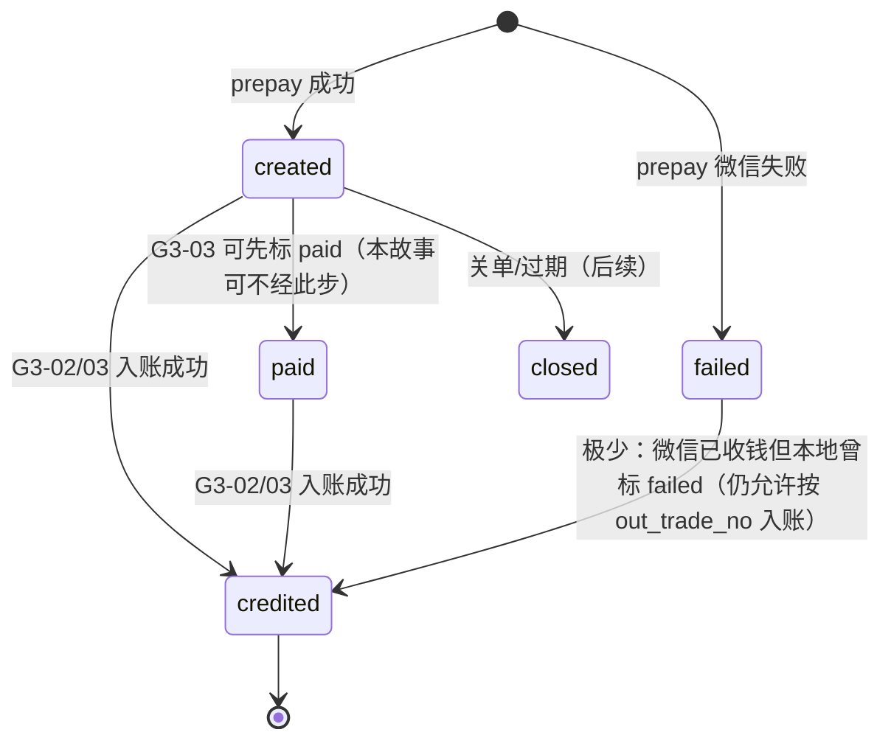
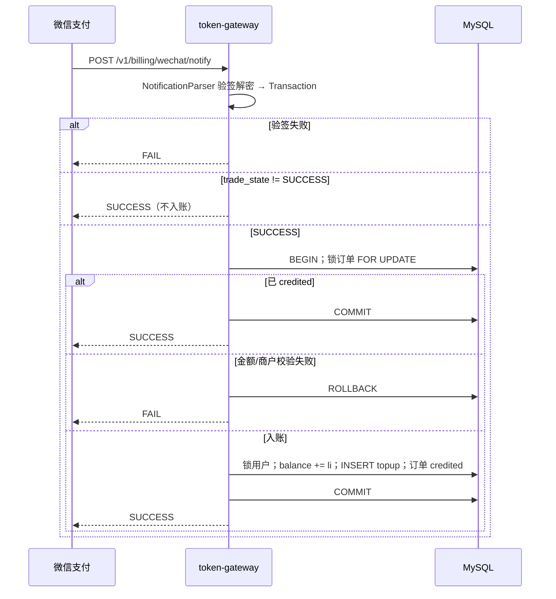

# US-G3-02 支付回调幂等入账设计

> **用户故事**：[../02-用户故事.md](../02-用户故事.md) · US-G3-02  
> **状态**：编码已落地（单测覆盖入账幂等与 notify ACK；联调需公网 HTTPS notify_url + 真实小额支付）  
> **范围**：接收微信支付结果通知；官方 SDK 验签解密；`SUCCESS` 时同事务加余额 + 写 `topup` 流水；订单 → `credited`；幂等防双加。  
> **需求映射**：[../13-微信支付自助充值执行计划.md](../13-微信支付自助充值执行计划.md) D2-3；对齐 US-G0-15 / AT-12 自助版  
> **依赖**：US-G3-01（订单表、`notify_url`、公钥模式 SDK 配置）；US-G0-02（`balance_li` / `token_ledger_entries`）  
> **不做**：主动查微信补单 /「我已支付」（US-G3-03）；充值页轮询 UI；退款；人工 topup SQL（仍归 G0-15）  
> **文档位置**：`token-gateway/docs/design/`

---

## 0. 边界

| 已有 / 并行 | 本故事 |
|-------------|--------|
| G3-01：`token_wechat_pay_orders`、`notify_url` 配置 | 本故事实现 `POST /v1/billing/wechat/notify` + 入账 |
| G3-01：`RSAPublicKeyConfig`（请求签名 + 验应答） | 本故事用同一套公钥 / APIv3Key 做**通知验签解密** |
| G3-03：查单补单 | **共用**本故事入账应用服务（同一幂等路径）；本故事不实现查单；详见 [US-G3-03-微信支付查单补单设计.md](./US-G3-03-微信支付查单补单设计.md) |
| G3-06：充值页轮询订单 | 读库见 `credited`；不直接依赖 notify 响应 |
| G0-15：人工改库 topup | 语义对齐（`type=topup`、同事务）；自助路径 `operator=wechat_pay` |

---

## 1. 已确认选型

| 项 | 决定 |
|----|------|
| **Q1 回调路径** | `POST /v1/billing/wechat/notify`（与下单配置的 `notify-url` 一致） |
| **Q2 鉴权** | **仅微信通知签名**；**不**要 recharge ticket / UC JWT / sk；**不**进 UC RS `protected-patterns`；**不**匹配 `RechargeTicketAuthFilter` |
| **Q3 验签实现** | 官方 SDK `NotificationParser` + 现有 `RSAPublicKeyConfig`（其已实现 `NotificationConfig`）；**禁止**自研验签/AEAD 解密 |
| **Q4 入账条件** | 解密后 `trade_state == SUCCESS` **且** 本地订单金额（分）与通知 `amount.total` **完全一致**；否则**不加余额** |
| **Q4b 其他状态** | **均处理**：按状态尽量推到本地终态（见 §1.2）；中间态不改库；**仅 SUCCESS 才加余额** |
| **Q5 账本** | 同事务：`balance_li += amount_li` + `INSERT ledger type=topup`；`amount_li = amount_fen * 10`（与下单落库一致，不二次用浮点换算） |
| **Q6 订单终态** | `SUCCESS` → `credited`；`CLOSED`/`REVOKED` → `closed`；`PAYERROR` → `failed`；已 `credited` 的 `REFUND` **不**自动扣回（G3-05） |
| **Q7 幂等键** | ① 订单行已是 `credited` → 直接 ACK；② `uk_wx_transaction_id`；③ ledger `request_id = wechat:{transaction_id}`（利用现有 UNIQUE） |
| **Q8 共享入账** | 抽出 `WechatCreditApplication.creditIfPaid(...)`，供本故事 notify 与后续 G3-03 共用 |
| **Q9 应答格式** | 微信约定 JSON：`{"code":"SUCCESS|FAIL","message":"..."}`；**不用**网关业务短码体 `{"reason":...}` |
| **Q10 中间态 `paid`** | 本故事推荐 **单事务** `created|paid|failed` → `credited`（跳过对外可见的「仅 paid」）；`paid` 仍保留给 G3-03/排障；回调路径可同时写 `paid_at` |

### 1.1 与 G3-01 状态机衔接



| 状态 | 本故事行为 |
|------|------------|
| `created` / `paid` / `failed` | 校验通过则可入账 → `credited` |
| `credited` | 幂等成功，ACK `SUCCESS`，**不再**加余额 |
| `closed` | 微信关单/撤销/未入账退款通知关单；ACK `SUCCESS` |

### 1.2 微信 `trade_state` → 本地动作

| 微信 trade_state | 本地动作 | 是否终态 |
|------------------|----------|----------|
| `SUCCESS` | 幂等入账 → `credited` | 是 |
| `CLOSED` / `REVOKED` | 未入账订单 → `closed`（写 `fail_reason`）；已 `credited` 则打 ERROR、不改余额 | 是（关单） |
| `PAYERROR` | 未入账 → `failed` | 是 |
| `REFUND` | 已 `credited`：**不扣余额**，`REFUND_NEEDS_MANUAL`（G3-05）；未入账 → `closed` | 人工/关单 |
| `NOTPAY` / `USERPAYING` / `ACCEPT` | **不改库**（中间态），ACK 停止无意义重试 | 否 |

原则：**只有确认收款才加款**；其余能确定「不会再付成功」的状态，把开放单推到 `closed`/`failed`，避免长期停在 `created`。

---

## 2. 目标与非目标

### 2.1 目标

1. 支付成功后，用户 `balance_li` 增加且有可追溯 `topup` 流水。  
2. 微信重复通知、并发通知不双加。  
3. 验签失败 / 金额不一致 / 未知订单明确拒绝或安全 ACK，且可运维排查。  
4. 入账逻辑可被 G3-03 复用，避免两套幂等。

### 2.2 非目标

| 不做 | 归属 |
|------|------|
| 调微信查单 API | G3-03 |
| 充值页「我已支付」 | G3-03 + G3-06 |
| 退款、部分退款 | G3-05 |
| 修改 prepay / 出码 | G3-01 |
| 信任前端「已支付」直接加款 | **禁止**（红线） |

---

## 3. 金额与单位（复用 G3-01）

| 层 | 规则 |
|----|------|
| 本地订单 | 已存 `amount_fen`、`amount_li`（`li = fen * 10`） |
| 通知 | 使用解密后的 `amount.total`（分）；**必须** `total == order.amount_fen` |
| 入账 | 使用订单上的 `amount_li`（**不**用通知里的元字段再算一遍） |
| 不一致 | **禁止入账**；打 ERROR（含 `out_trade_no`、本地分、通知分） |

---

## 4. API：支付结果通知

```http
POST /v1/billing/wechat/notify
Content-Type: application/json
Wechatpay-Serial: ...
Wechatpay-Nonce: ...
Wechatpay-Timestamp: ...
Wechatpay-Signature: ...
Wechatpay-Signature-Type: WECHATPAY2-SHA256-RSA2048   # 若有则透传 SDK
```

Body：微信加密通知包（`id` / `create_time` / `resource_type` / `event_type` / `resource`…），由 SDK 验签并 AEAD 解密。

### 4.1 成功应答（HTTP 200）

```json
{
  "code": "SUCCESS",
  "message": "成功"
}
```

以下情形均返回上述成功 ACK（停止微信重试）：

| 情形 | 说明 |
|------|------|
| 首次入账成功 | 余额已加 |
| 订单已是 `credited` | 幂等 |
| `trade_state` 中间态（NOTPAY 等） | 不改库；ACK |
| `CLOSED`/`PAYERROR` 等 | 本地推到 `closed`/`failed`；ACK |
| 订单已 `closed` 又来 SUCCESS | 仍允许入账？**默认**：`closed` 拒绝入账（ORDER_CLOSED）；极端需人工 G0-15 |

### 4.2 失败应答（建议 HTTP 500 或 200 + FAIL）

```json
{
  "code": "FAIL",
  "message": "brief reason"
}
```

| 情形 | HTTP（建议） | 说明 |
|------|--------------|------|
| 验签 / 解密失败 | 401 或 500 + FAIL | 微信会重试；日志**禁止**明文 body 整包落盘时可截断 |
| 本地无此 `out_trade_no` | 404 或 500 + FAIL | 可能乱序或配置错环境；需排查 |
| 金额不一致 | 500 + FAIL | **绝不**入账 |
| 入账事务失败（死锁等） | 500 + FAIL | 依赖微信重试 + 监控 |

`message` 仅短英文/短码（如 `signature_invalid`、`amount_mismatch`），勿回传内部堆栈。

### 4.3 与业务 API 异常体的隔离

- `RestExceptionHandler`（`{"reason":...}`）**不要**套在 notify 上；Controller 自行写微信应答体。  
- AccessLog 可记 path/status；**勿**把完整加密包或 APIv3Key 写入日志。

---

## 5. 处理流程



### 5.1 步骤明细

1. 读取请求头 `Wechatpay-*` + raw body 字符串，构造 `RequestParam`。  
2. `NotificationParser.parse(param, Transaction.class)`（或 SDK 推荐的通知资源类型）。  
3. 若 `trade_state != SUCCESS`：打 INFO（`out_trade_no`、state）→ ACK SUCCESS。  
4. 校验配置中的 `mch-id` / `app-id` 与通知一致（不一致 → FAIL）。  
5. 调用 `WechatCreditApplication.creditFromNotify(tx)`：  
   - `SELECT … FOR UPDATE` 按 `out_trade_no`；不存在 → FAIL。  
   - 若 `status == credited`：若 `wx_transaction_id` 为空则补写；返回已完成。  
   - 若 `status == closed`：ERROR 日志 → 视为完成 ACK（不入账）。  
   - 校验 `amount.total == order.amount_fen`。  
   - 写入/校验 `wx_transaction_id`（冲突且非本单 → FAIL）。  
   - `lockById(user_id)`；`balance_li += order.amount_li`；更新用户。  
   - `INSERT ledger`：`type=topup`，`amount_li=+…`，`balance_after_li=新余额`，`request_id=wechat:{transaction_id}`，`operator=wechat_pay`，`note=wechat recharge {out_trade_no}`。  
   - 更新订单：`status=credited`，`wx_transaction_id`，`paid_at`（解析 `success_time`，失败则用 now UTC），`credited_at=now`。  
6. 提交事务 → ACK SUCCESS。

### 5.2 并发

- 同单两路 notify：行锁串行；第二路见 `credited` 幂等返回。  
- 与 G3-03 同时补单：同一 `creditIfPaid` + 行锁；ledger `request_id` UNIQUE 作第二道闸。  
- 若第二路在 INSERT ledger 撞 UNIQUE：事务回滚后重查订单；已 `credited` 则 ACK SUCCESS。

---

## 6. 账本约定（对齐 G0-02 / G0-15）

| 字段 | 自助回调取值 |
|------|----------------|
| `type` | `topup` |
| `amount_li` | **正数**（入账）= `order.amount_li` |
| `balance_after_li` | 加款后余额 |
| `request_id` | `wechat:` + `transaction_id`（≤64；微信单号长度足够） |
| `operator` | 固定 `wechat_pay`（标识非人工） |
| `note` | 建议 `wechat recharge {out_trade_no}`（可截断至 512） |
| `created_at` | UTC |

人工 topup 仍要求可读 `operator`/`note`；自助用固定 operator 便于对账 SQL：

```sql
SELECT SUM(amount_li) FROM token_ledger_entries
 WHERE type = 'topup' AND operator = 'wechat_pay'
   AND created_at >= ? AND created_at < ?;
```

可选：DbService 增加 `TYPE_TOPUP` 与 `insertTopup`（与 `insertCharge` 对称）。

---

## 7. 订单表字段使用（无新迁移则沿用 G3-01）

| 字段 | 回调写入 |
|------|----------|
| `status` | `credited` |
| `wx_transaction_id` | 微信 `transaction_id`（触发 UNIQUE 幂等） |
| `paid_at` | 来自 `success_time`（解析失败用 `credited_at`） |
| `credited_at` | 入账提交时刻（UTC） |
| `fail_reason` | 本路径成功时保持原值；可选在金额失败时写入短因（不改 status） |

**本期不强制**新 Flyway；若编码发现缺索引/字段再追加 `V1_0_3__…`（例如为 `request_id` 前缀查询，非必须）。

---

## 8. 模块草图

```
WechatNotifyController
        │  验签解密（WechatPayClient / NotificationParser）
        ▼
WechatCreditApplication   ◄── 日后 G3-03 查单成功后亦调用
        │
   ┌────┼────┐
   ▼    ▼    ▼
 Order  User  Ledger
 (锁)  (锁)  (topup)
```

| 类（建议名） | 职责 |
|--------------|------|
| `WechatNotifyController` | 读 header/body；调 parser；写微信 ACK；**无** ticket |
| `WechatPayClient`（扩展） | 暴露 `parseNotification(RequestParam) → Transaction`（或独立 `WechatNotifyVerifier`） |
| `WechatCreditApplication` | 幂等入账事务；notify / sync 共用 |
| `TokenWechatPayOrderDbService` | `lockByOutTradeNo`、`markCredited` |
| `TokenLedgerEntryDbService` | `insertTopup` |

`RechargeTicketAuthFilter.matchesProtected`：**不得**匹配 `/v1/billing/wechat/notify`。

---

## 9. SDK 与配置

沿用 G3-01 已落地配置（`enabled`、mch、app、api-v3-key、商户私钥、**微信支付公钥**、public-key-id、notify-url）。

```text
NotificationParser parser = new NotificationParser(rsaPublicKeyConfig);
Transaction tx = parser.parse(requestParam, Transaction.class);
```

| 项 | 约定 |
|----|------|
| 公钥模式 | 与下单相同；`RSAPublicKeyConfig` 兼作 `NotificationConfig` |
| APIv3Key | 回调解密必填（已在 `enabled=true` 启动校验） |
| 开关关闭 | 仍可接收请求：建议直接 FAIL 或 503 体 FAIL，并 ERROR 日志（避免静默丢单）；运维关支付时应同步改商户侧/关公网路由 |

无需新增业务配置项（MVP）。可选后续：`token-gateway.wechat-pay.notify-fail-on-disabled`。

---

## 10. 安全与合规

| 项 | 要求 |
|----|------|
| 信任边界 | 只信验签后的通知；不信查询参数、前端、ticket |
| 金额 | 以本地订单为准交叉校验通知分 |
| 密钥 | 不进 Git / 日志 |
| HTTPS | 生产 `notify_url` 必须公网 HTTPS（已在执行计划勾选） |
| 重放 | 依赖签名时间戳 + 业务幂等（SDK/微信侧）；本地以订单/流水 UNIQUE 兜底 |
| 信息泄露 | ACK `message` 短码；日志打 `out_trade_no` / `transaction_id` / trade_state，不打付款人敏感信息全文 |

---

## 11. 可观测

| 日志 | 级别 | 字段建议 |
|------|------|----------|
| 每次验签成功处理后 | INFO | `out_trade_no`, `trade_state`, `result`（短码） |
| 验签失败 | WARN | 无 body 明文 |
| 入账成功 | INFO | out_trade_no, transaction_id, userId, amount_li, balance_after |
| 金额不一致 / 无订单 | ERROR | 关键 id + 分金额 |

### 11.1 订单上的回调摘要（推荐排障方式）

**不要**依赖完整回调 body 日志。在 `token_wechat_pay_orders` 落库：

| 字段 | 含义 |
|------|------|
| `last_notify_at` | 最近一次**验签成功**的回调时间；`NULL` ≈ 尚未收到过合法回调 |
| `last_notify_trade_state` | 最近一次通知的微信 `trade_state`（如 SUCCESS / NOTPAY / CLOSED） |
| `last_notify_result` | 最近一次本地处理结果（如 `CREDITED` / `IGNORED_NON_TERMINAL`） |
| `notify_count` | 验签成功的回调次数 |

查询示例：

```sql
SELECT out_trade_no, status, last_notify_at, last_notify_trade_state, last_notify_result, notify_count
  FROM token_wechat_pay_orders
 WHERE out_trade_no = ?;
```

`GET /v1/billing/wechat/orders/{outTradeNo}` 同步返回上述字段（ticket 鉴权）。

指标（可后置）：`wechat_notify_total{result=success|idempotent|fail|ignored}`。

---

## 12. 测试与验收

| ID | 步骤 | 期望 |
|----|------|------|
| N1 | Mock 合法 SUCCESS 通知，订单 `created`，金额一致 | 余额 +li；ledger topup；订单 `credited`；ACK SUCCESS |
| N2 | 同一通知再投递一次 | 余额不变；仍 ACK SUCCESS |
| N3 | 验签失败（篡改 signature） | FAIL；余额不变 |
| N4 | `trade_state=NOTPAY` | ACK SUCCESS；余额不变 |
| N5 | 通知金额 ≠ 订单分 | FAIL；余额不变 |
| N6 | 未知 `out_trade_no` | FAIL；无新流水 |
| N7 | 并发双通知（同单） | 仅一笔 topup；两路最终 SUCCESS |
| N8 | ledger `request_id` 已存在且订单已 credited | 幂等成功 |
| N9 | 日志抽样 | 无 APIv3Key / 私钥 / 完整 ticket |

联调：真实小额支付 → 看商户平台通知与库余额（G3-01+02 闭环）；回调丢失场景留给 G3-03。

---

## 13. 实现顺序

1. `WechatPayClient` 增加通知解析（复用已有 `RSAPublicKeyConfig` Bean/实例）。  
2. `WechatCreditApplication` + 订单锁 / topup 写入。  
3. `WechatNotifyController` + 微信 ACK。  
4. 确认 Filter 排除 `/notify`。  
5. N1～N8 单测（parser 可 mock；入账测真实事务或 mock Db）。  
6. 更新 `home.html`：notify 标为已落地（编码完成后）。  
7. 小额真实支付冒烟。

---

## 14. 开放问题

| # | 问题 | 默认 |
|---|------|------|
| O1 | `failed` 单是否允许回调入账 | **允许**（微信已成功时以回调为准） |
| O2 | `closed` 单 | **不入账** + ERROR；人工 G0-15 / 退款流程 |
| O3 | `paid` 是否在回调中单独 UPDATE | **不强制**；与 `credited` 同事务写 `paid_at` 即可 |
| O4 | 通知事件类型过滤 | 仅处理支付成功类（如 `TRANSACTION.SUCCESS`）；其它 ACK SUCCESS 并 INFO |
| O5 | G3-03 入参 | 查单得到的 `Transaction` 同样走 `creditIfPaid`，`source=sync|notify` 仅日志 |

---

## 15. 编码任务清单

1. 评审本设计（验签、幂等、ACK、与 G3-03 共享边界）  
2. 扩展 `WechatPayClient` / 通知解析  
3. `WechatCreditApplication` + Db 锁与 topup  
4. `POST /v1/billing/wechat/notify`  
5. Filter / Security 确认放行且无 ticket  
6. N1～N8 单测  
7. 文档：`home.html`、执行计划勾选 D2-3  

---

## 16. 与相关故事接口约定（供 G3-03）

```text
WechatCreditApplication.CreditResult creditIfPaid(WechatPaidInfo info);

WechatPaidInfo {
  outTradeNo, transactionId, amountFen, successTime, mchId, appId, source
}

CreditResult { ALREADY_CREDITED | CREDITED | REJECTED_AMOUNT | ORDER_MISSING | ORDER_CLOSED | … }
```

G3-03 在微信查单 `trade_state=SUCCESS` 后构造 `WechatPaidInfo` 调用；**禁止**复制一套加余额代码。
