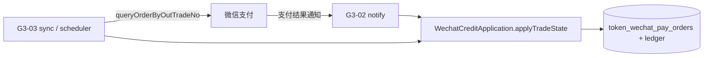
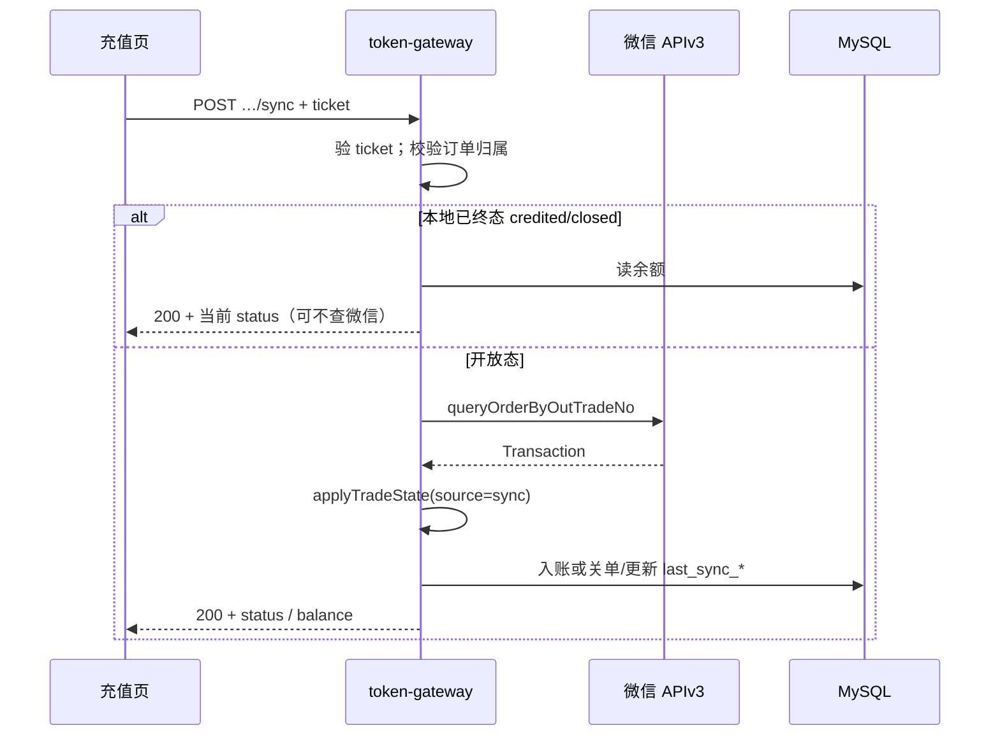

# US-G3-03 查单补单设计

> **用户故事**：[../02-用户故事.md](../02-用户故事.md) · US-G3-03  
> **状态**：已编码（用户 sync + 定时补单）  
> **范围**：主动向微信查单；用户「我已支付」与定时任务补入账；**复用** G3-02 `WechatCreditApplication.applyTradeState` / `creditIfPaid` 幂等路径。  
> **需求映射**：[../13-微信支付自助充值执行计划.md](../13-微信支付自助充值执行计划.md) D2-4  
> **依赖**：US-G3-01（订单、Native SDK）；US-G3-02（入账与终态推进）；US-G3-06（充值页已调 `…/sync`）  
> **不做**：支付回调实现（已 G3-02）；充值页 UI 改版；退款；信任前端「已支付」直接加款  
> **文档位置**：`token-gateway/docs/design/`

---

## 0. 边界

| 已有 / 并行 | 本故事 |
|-------------|--------|
| G3-02：`notify` + `applyTradeState` / `creditIfPaid` | **调用**，不复制加余额逻辑 |
| G3-06：页内 `POST …/orders/{outTradeNo}/sync` + 轻轮询 | 本故事实现该 API；页已接好 |
| G3-01：`GET …/orders/{outTradeNo}` | 只读本地；本故事 sync **会**调微信 |
| G0-10：ShedLock 调度 | 定时补单沿用同一套锁模式 |

---

## 1. 已确认选型

| 项 | 决定 |
|----|------|
| **Q1 用户触发** | `POST /v1/billing/wechat/orders/{outTradeNo}/sync`；**recharge ticket** 鉴权（Cookie / Bearer，与 prepay 相同 Filter） |
| **Q2 系统触发** | 定时任务扫描开放态订单 → 微信查单 → 同一套 `applyTradeState`（`source=scheduler`） |
| **Q3 查单 API** | 官方 SDK `NativePayService.queryOrderByOutTradeNo`（直连商户）；**禁止**自研签名 HTTP |
| **Q4 入账** | 查单得 `trade_state` 后走 **`WechatCreditApplication.applyTradeState(..., source)`**；与回调同幂等 |
| **Q5 未支付** | `NOTPAY` / `USERPAYING` / `ACCEPT`：**不入账**；HTTP 200 + 本地 `status` 仍为开放态；页提示「未检测到支付」 |
| **Q6 短路** | 本地已是 `credited` / `closed`（终态）：**可不调微信**，直接返回当前库状态（含余额摘要） |
| **Q7 身份** | sync 须 ticket；且订单 `(tenant_id, user_code)` 与 ticket 一致，否则 **404**（防枚举） |
| **Q8 限流** | 同 `out_trade_no` 建议 ≥ **3s** 间隔；同身份每分钟 sync ≤ **20**（超限 429）；定时任务不受此限但有 batch 上限 |
| **Q9 过期开放单** | `created`/`paid` 且创建超过 **code-url-expires-in（默认 2h）**：定时任务查单后按微信状态关单/入账；微信仍 `NOTPAY` 则本地标 `closed`（`fail_reason=expired_unpaid`） |
| **Q10 审计字段** | 新增 `last_sync_*`（与 G3-02 的 `last_notify_*` 分开），避免「查单」与「回调」混淆 |

### 1.1 与回调的关系



任一路径先成功入账即可；另一路径幂等为 `ALREADY_CREDITED`。

---

## 2. 目标与非目标

### 2.1 目标

1. 回调丢失或延迟时，用户点「我已支付」或等待页内轮询仍能入账。  
2. 后台定时补单覆盖「付了钱但未点按钮、回调也丢了」的长尾。  
3. 与 G3-02 **同一入账/终态规则**，不双加。  
4. 响应契约对齐现有 `recharge.html`（认 `status === "credited"`）。

### 2.2 非目标

| 不做 | 归属 |
|------|------|
| 改造充值页布局 | G3-06 已接 sync |
| 实现 notify | G3-02 |
| 退款 / 冲正 | G3-05 |
| 用 GET 本地读代替 sync 入账 | GET 仍只读库；入账必须 sync 或 notify |

---

## 3. API：用户触发查单

```http
POST /v1/billing/wechat/orders/{outTradeNo}/sync
Cookie: tg_recharge_ticket=rt_…
Content-Type: application/json
Accept: application/json
```

Body 可空 `{}`（页已如此）。

### 3.1 成功 · 200

与「我已支付」页约定对齐，字段用 snake_case：

```json
{
  "out_trade_no": "tg…",
  "status": "credited",
  "trade_state": "SUCCESS",
  "amount_yuan": "50.00",
  "amount_li": 50000,
  "credited_li": 50000,
  "balance_li": 125000,
  "code_url": "weixin://…",
  "last_notify_at": "…",
  "last_notify_trade_state": "SUCCESS",
  "last_sync_at": "…",
  "last_sync_trade_state": "SUCCESS",
  "last_sync_result": "CREDITED"
}
```

| 字段 | 说明 |
|------|------|
| `status` | **本地**订单状态；页以 `credited` 判成功 |
| `trade_state` | 本次微信查单结果；短路未查微信时可 `null` |
| `credited_li` | 仅当 `status=credited` 时填本单 `amount_li`，否则 `null` |
| `balance_li` | 当前用户余额（厘）；成功页展示用 |

未支付示例：`status=created`，`trade_state=NOTPAY`，`credited_li=null`，仍 200。

### 3.2 错误

| HTTP | reason | 场景 |
|------|--------|------|
| 401 | `invalid_recharge_ticket` | Filter |
| 404 | `order_not_found` | 无单或不属于当前身份 |
| 429 | `sync_rate_limited` | 过频 |
| 503 | `wechat_pay_unavailable` | 支付未启用 / 缺配置 |
| 502 | `wechat_query_failed` | 调微信查单失败（超时、5xx 等） |

### 3.3 处理步骤



**红线**：禁止因前端声称「已支付」而跳过查单直接加款。

---

## 4. 定时补单

### 4.1 配置（建议）

```yaml
token-gateway:
  wechat-pay:
    sync-job:
      enabled: ${GATEWAY_WECHAT_SYNC_JOB_ENABLED:true}  # 仅当 wechat-pay.enabled=true 时实际跑
      fixed-delay: 60s
      initial-delay: 30s
      batch-size: 20
      # 下单后至少等待该时长再扫，给 notify 优先权
      min-age: 2m
      # 只扫最近窗口内的开放单（与码有效期对齐或略长）
      max-age: 48h
      # 超过码有效期仍未付：查单后 NOTPAY → 本地 closed
      expire-unpaid: true
```

多实例：**ShedLock**（对齐结算调度），锁名如 `wechatPaySyncJob`。

### 4.2 候选订单

```text
status IN ('created', 'paid')
AND created_at <= now - min-age
AND created_at >= now - max-age
ORDER BY created_at ASC
LIMIT batch-size
```

可选：优先 `last_sync_at IS NULL` 或 `last_sync_at` 最旧。

### 4.3 单笔逻辑

与用户 sync 相同核心：`queryByOutTradeNo` → `applyTradeState(..., source=scheduler)`。

| 微信状态 | 动作 |
|----------|------|
| `SUCCESS` | 入账 |
| `CLOSED` / `REVOKED` / `PAYERROR` / `REFUND` | 同 G3-02 §1.2 |
| `NOTPAY` 且订单年龄 ≥ `code-url-expires-in` 且 `expire-unpaid=true` | 本地 `closed`，`fail_reason=expired_unpaid` |
| `NOTPAY` 且未过期 | 仅更新 `last_sync_*`，保持 `created` |

查单失败：打 WARN，跳过本单，不中断整批。

---

## 5. SDK 封装

在 `WechatPayClient` 增加：

```text
Transaction queryByOutTradeNo(String outTradeNo)
  → NativePayService.queryOrderByOutTradeNo({ mchid, out_trade_no })
```

失败映射：`ServiceException` / 传输异常 → `WechatQueryException` → API 502 `wechat_query_failed`。

构造 `WechatPaidInfo`（SUCCESS 时）与 notify 相同；`source` 取 `sync` | `scheduler`。

### 5.1 复用 G3-02 时注意

当前 `applyTradeState` 末尾写的是 `last_notify_*`。本故事要求：

| 来源 | 审计字段 |
|------|----------|
| notify | 继续 `last_notify_*` + `notify_count` |
| sync / scheduler | 写 `last_sync_at` / `last_sync_trade_state` / `last_sync_result`（及可选 `sync_count`） |

建议将 `recordAndReturn` 改为按 `source` 分支，或拆 `touchLastNotify` / `touchLastSync`。**业务状态机逻辑不改。**

---

## 6. 库表增量

Flyway 建议：`V1_0_4__wechat_pay_order_sync_audit.sql`

```sql
ALTER TABLE token_wechat_pay_orders
  ADD COLUMN last_sync_at DATETIME(3) NULL COMMENT '最近一次主动查单时间' AFTER notify_count,
  ADD COLUMN last_sync_trade_state VARCHAR(32) NULL COMMENT '最近一次查单 trade_state' AFTER last_sync_at,
  ADD COLUMN last_sync_result VARCHAR(64) NULL COMMENT '最近一次查单本地处理结果' AFTER last_sync_trade_state,
  ADD COLUMN sync_count INT NOT NULL DEFAULT 0 COMMENT '主动查单次数' AFTER last_sync_result;

-- 定时任务扫描辅助（可选）
KEY idx_status_created (status, created_at);  -- G3-01 已有则跳过
```

排障：

```sql
SELECT out_trade_no, status,
       last_notify_at, last_notify_trade_state, notify_count,
       last_sync_at, last_sync_trade_state, sync_count
  FROM token_wechat_pay_orders
 WHERE out_trade_no = ?;
```

---

## 7. 模块草图

```
RechargeTicketAuthFilter（已匹配 /orders/**）
        │
        ▼
WechatBillingController  POST …/sync
        │
        ▼
WechatSyncApplication
   ├─ 归属校验 / 限流 / 终态短路
   ├─ WechatPayClient.queryByOutTradeNo
   └─ WechatCreditApplication.applyTradeState(source=sync|scheduler)
        │
WechatPaySyncScheduler（ShedLock）
   └─ 批选开放单 → 同上
```

| 类（建议） | 职责 |
|------------|------|
| `WechatSyncApplication` | sync API 编排；余额摘要组装 |
| `WechatPaySyncScheduler` | 定时批处理 |
| `WechatPayClient#queryByOutTradeNo` | SDK 查单 |
| `WechatCreditApplication` | 已有；扩展 source → sync 审计字段 |

`RechargeTicketAuthFilter`：路径已含 `/v1/billing/wechat/orders/**`，**无需改**即可保护 sync。

---

## 8. 响应与充值页契约

现有页逻辑（摘要）：

- `status === "credited"` → 成功态；用 `credited_yuan` 或金额态金额，`balance_li/1000` 或 `balance_yuan`  
- 其他 200 → 「未检测到支付」

本 API **保证**：

1. 入账成功时 `status` 必为 `credited`，并带 `balance_li`（及可选 `credited_li`）。  
2. 未支付时仍 200，`status` 为 `created`/`paid` 等非 credited。  
3. 订单已 `closed`/`failed`：200 + 对应 `status`；页可后续增强失败文案（本故事不改页也可先显示「未检测到」——可选小改：`closed`/`failed` 提示通道结束）。  

**建议本故事顺手**：页在 `closed`/`failed` 时进失败态或明确文案（小改 `recharge.html`，非阻塞出门）。

---

## 9. 安全与限流

| 项 | 要求 |
|----|------|
| 信任 | 只信微信查单结果；不信 Body「已支付」标志 |
| 归属 | ticket 身份 = 订单身份 |
| 限流 | 防刷微信 API 与拖垮库 |
| 日志 | `out_trade_no`、`trade_state`、`result`、`source`；无完整敏感包 |
| HTTPS | 生产同域 |

内存限流即可（MVP）；多实例可略放宽，以微信侧限频为准。

---

## 10. 测试与验收

| ID | 步骤 | 期望 |
|----|------|------|
| S1 | 已支付、回调未到；有效 ticket sync | 查微信 SUCCESS → 入账；`status=credited`；`balance_li` 正确 |
| S2 | 再 sync 一次 | 幂等；余额不变；仍 credited |
| S3 | 未支付 sync | 200；status 非 credited；不入账 |
| S4 | 无 ticket / 错身份订单 | 401 / 404 |
| S5 | 本地已 credited 再 sync | 可不调微信；200 credited |
| S6 | Mock 微信查询失败 | 502 `wechat_query_failed` |
| S7 | 过频 sync | 429 |
| S8 | 定时任务：开放单 + SUCCESS | 补入账 |
| S9 | 定时任务：过期仍 NOTPAY | 本地 closed |
| S10 | 与并发 notify 同时 | 仅一笔 topup |

---

## 11. 实现顺序

1. Flyway `last_sync_*`；DbService `touchLastSync`  
2. `WechatPayClient.queryByOutTradeNo`  
3. `applyTradeState` 按 source 写 notify/sync 审计字段  
4. `WechatSyncApplication` + Controller `POST …/sync`  
5. 限流  
6. `WechatPaySyncScheduler` + 配置 + ShedLock  
7. 单测 S1～S7（Client mock）；调度单测可选  
8. 可选：充值页对 `closed`/`failed` 文案  
9. 更新 `home.html`；执行计划勾选 D2-4  

---

## 12. 开放问题

| # | 问题 | 默认 |
|---|------|------|
| O1 | 终态是否仍查微信 | **默认不查**（短路）；运维强制刷新可后加 `?force=1`（本期不做） |
| O2 | `paid` 中间态 | 查单 SUCCESS 仍直接 `credited`；不强制先写 `paid` |
| O3 | 调度与用户 sync 抢同一单 | 行锁 + 幂等，可接受 |
| O4 | sync 是否更新 `last_notify_*` | **否**；只更新 `last_sync_*` |
| O5 | 页轮询间隔 | 保持现有 ~4s；服务端限流兜底 |

---

## 13. 编码任务清单

1. 评审本设计（sync 契约、调度窗口、过期关单、审计字段分离）  
2. `V1_0_4` + Client 查单  
3. sync API + 限流  
4. 定时补单  
5. 单测 / 联调（关 notify 或断公网模拟回调丢失）  
6. 文档与 `home.html`
