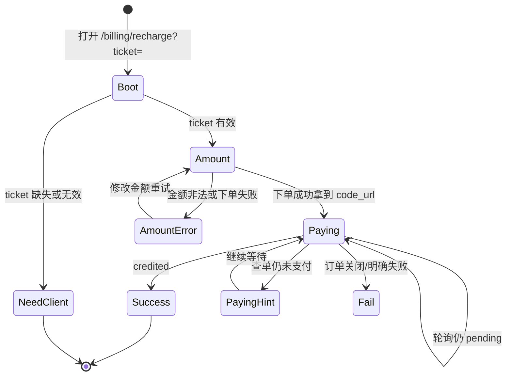

# US-G3-06 网关托管充值页设计

> **用户故事**：[../02-用户故事.md](../02-用户故事.md) · US-G3-06  
> **状态**：详细设计已定稿 · 交互稿五态已出  
> **范围**：Token 网关提供「官方通道预付费充值」Web 页：金额输入、Native 付款码、「我已支付」、成功/失败态；短时登录凭证；**不含**微信下单/回调入账/查单实现细节（归 US-G3-01/02/03）  
> **需求映射**：[../13-微信支付自助充值执行计划.md](../13-微信支付自助充值执行计划.md)；产品口径已拍板  
> **依赖**：US-G3-01（prepay）、US-G3-02（入账结果可查）、US-G3-03（「我已支付」查单）；US-G0-05（UC 身份）  
> **不做**：套餐档位；客户端内嵌支付 UI；自助退款；长效 JWT 挂 URL  
> **交互稿**：[`token-gateway/designs/token-gateway-recharge.pen`](../../designs/token-gateway-recharge.pen)  
> **文档位置**：`token-gateway/docs/design/`

---

## 0. 边界

| 已有 / 并行 | 本故事 |
|-------------|--------|
| G3-01：`POST …/prepay` → `code_url` | 本页调用并展示二维码 |
| G3-02：回调入账 | 本页轮询/查单后展示成功余额 |
| G3-03：查单补单 | 「我已支付」按钮走查单 API |
| G3-04：桌面跳转 | 本页为跳转目标；本故事只定义页本身与 ticket 约定 |
| G0 home.html 静态页先例 | 充值页同属网关静态/同域前端，可独立路由 |

---

## 1. 已确认选型

| 项 | 决定 |
|----|------|
| **Q1 托管方** | **Token 网关**提供充值页（备案域或网关公网 HTTPS） |
| **Q2 产品口径** | 文案固定：**官方通道预付费充值** |
| **Q3 金额** | 用户自填；单笔 **1.00～100.00** 元；无套餐快捷档（可后续加，本故事不做） |
| **Q4 支付形态** | **微信 Native 扫码**；页内展示由 `code_url` 生成的二维码 |
| **Q5 登录** | 短时 **recharge ticket**（由客户端用 UC JWT 换取，或网关签发）；**禁止**把长效 access_token 长期挂在 query |
| **Q6 页面形态** | 单页多状态（见 §3）；桌面宽约 720～960 内容柱；移动端可窄屏（二维码仍居中） |
| **Q7 退款文案** | **不对用户展示**退款/套餐说明（内部人工退款、无套餐为运营决策）；金额范围仅在输入态提示 |
| **Q8 成功后** | 展示入账金额与当前余额（厘→元）；提示可关闭窗口并返回**原接入应用**刷新余额 |

### 1.1 仍依赖并行故事的接口（本页消费，本故事不实现后端）

| 接口（建议名） | 用途 | 归属 |
|----------------|------|------|
| `POST /v1/billing/recharge/ticket` | UC JWT → 短时 ticket | **§4**（已落地） |
| `GET /billing/recharge?ticket=` | 充值页 HTML + Cookie 绑定 | **本故事**（已落地；无独立 session API） |
| `POST /v1/billing/wechat/prepay` | 下单拿 `code_url` | G3-01 |
| `POST /v1/billing/wechat/orders/{outTradeNo}/sync` | 「我已支付」查单 | G3-03 |
| `GET /v1/billing/wechat/orders/{outTradeNo}` | 查订单状态/余额摘要 | G3-01/02 |

---

## 2. 目标与非目标

### 2.1 目标

1. 用户在网关页完成「填金额 → 出码 → 扫码 → 确认/查单 → 看到成功」主路径。  
2. 非法金额、ticket 失效、下单失败、未支付有明确 UI。  
3. 文案与进件/协议一致；支付发生在网关域名下。  
4. 交互稿覆盖主状态，编码不另发明布局。

### 2.2 非目标

| 不做 | 说明 |
|------|------|
| 微信 H5/JSAPI 页内调起 | MVP 仅 Native |
| 发票、优惠券 | — |
| 桌面内嵌 WebView 必选 | G3-04 可选系统浏览器或内嵌窗，本页不关心容器 |
| 完整 UC 登录表单 | 无 ticket 时引导「请从接入方应用重新进入充值」；**不**写死某一客户端品牌 |

---

## 3. 信息架构与页面状态

### 3.1 一屏结构（自上而下）

```
┌─────────────────────────────────────┐
│ Brand · Token 网关                   │
│ 官方通道预付费充值                   │
│ 说明：充值计入账户余额，用于官方模型 │
├─────────────────────────────────────┤
│ [状态区：金额 / 二维码 / 成功 / 错误] │
└─────────────────────────────────────┘
```

**原则**：第一屏一个主任务；无营销卡片堆叠；二维码为支付态唯一视觉锚点。金额范围提示**仅**出现在金额输入态；不在各态页脚重复「套餐 / 退款」说明。

### 3.2 状态机



| 状态 ID | 名称 | 主内容 | 主操作 |
|---------|------|--------|--------|
| S0 | NeedClient | 缺少登录凭证；请从接入方应用重新进入充值 | 无（或链到官网说明） |
| S1 | Amount | 金额输入 + 「微信支付」主按钮；可选展示当前余额 | 提交下单 |
| S2 | Paying | 金额摘要 + 二维码 + 「我已支付」+ 「重新填写金额」 | 查单 / 返回改金额 |
| S3 | Success | 已入账 X 元 · 当前余额 Y 元 | 关闭窗口提示 |
| S4 | Fail / Error | 原因短文案 | 返回金额态重试 |

### 3.3 金额校验（前端 + 以后端为准）

| 规则 | 说明 |
|------|------|
| 单位 | 元，最多 2 位小数 |
| 范围 | `1 ≤ amount ≤ 100` |
| 换算 | 厘 = round(元 × 1000)；与微信「分」换算在 G3-01 定义（1 元 = 100 分 = 1000 厘） |
| 展示 | 仅金额输入态、输入框旁提示「单笔可充 1.00～100.00 元」（不写「不设套餐」） |

### 3.4 交互细则

| 场景 | 行为 |
|------|------|
| 点击「微信支付」 | loading → 调 prepay；成功进入 S2；失败 toast/页内错误，留在 S1 |
| S2 二维码 | 用 `code_url` 生成；展示「请使用微信扫一扫」；`code_url` 过期则提示重新下单 |
| 「我已支付」 | 调 sync/查单；若 `credited` → S3；若仍未支付 → 文案「未检测到支付，请稍后再试」 |
| 可选轻轮询 | S2 每 3～5s 查一次订单状态（上限 N 次），避免用户必点；以 G3-03 为准 |
| 「重新填写金额」 | 关闭当前未支付单（若 API 支持）或仅回 S1 弃用旧码 |

---

## 4. 登录：recharge ticket（详细）

> 本节为 **换票 / 存证 / 校验** 的权威设计；US-G3-04 与后续 prepay/查单均按此实现。  
> 此前仅有提纲，现补齐存储与生命周期。

### 4.1 为何需要

接入方持有 UC `access_token`；充值页在浏览器。禁止把长效 JWT 挂在 URL。网关签发**短时、可吊销、仅用于充值相关 API** 的 ticket。

### 4.2 选型（已拍板）

| 项 | 决定 |
|----|------|
| 形态 | **不透明随机串**（非 UC JWT 复用）；前缀 `rt_` 便于日志识别 |
| 存哪 | **MySQL 表** `token_recharge_tickets`（当前栈无 Redis；与 G0 账本同库） |
| 存什么 | **只存 hash**，明文仅签发响应返回一次（对齐 sk 习惯） |
| 哈希 | `SHA-256(UTF8(pepper) \|\| UTF8(raw_ticket))` → 小写 hex；pepper = `GATEWAY_KEY_PEPPER`（或独立 `RECHARGE_TICKET_PEPPER`，默认复用前者） |
| TTL | **可配置**，默认 **300s**（见 §4.2.1） |
| 使用次数 | **过期前可多次**调用 prepay/查单（用户改金额、重试出码）；**不**一用即焚 |
| 身份 | 行内保存 `tenant_id`、`user_code`；可选缓存网关 `user_id`（若已有 `token_users`） |
| 传递 | ① URL `?ticket=` 仅首次打开；② 服务端校验后 **Set-Cookie** + **302 去掉 query**；③ 页内 API 优先 Cookie，其次 `Authorization: Bearer rt_…` |
| Cookie | 名 `tg_recharge_ticket`；`HttpOnly; Secure; SameSite=Lax; Path=/; Max-Age=与剩余 TTL 一致` |
| RS | `POST /v1/billing/recharge/ticket` 走 **UC JWT** `protected-patterns`；其余 `/v1/billing/wechat/**` **不**进 UC JWT，改走 ticket 过滤器 |

#### 4.2.1 TTL 配置

| 项 | 约定 |
|----|------|
| 配置键 | `token-gateway.billing.recharge-ticket-ttl` |
| 环境变量 | `GATEWAY_RECHARGE_TICKET_TTL`（绑定到上述键） |
| 默认 | `300s`（5 分钟） |
| 格式 | Spring `Duration`（如 `300s`、`10m`、`1h`） |
| 建议范围 | 实现时校验：**不少于 60s，不超过 24h**；越界 **启动 fail-fast** |
| 生效点 | 仅影响**新签发**票的 `expires_at` / 响应 `expires_in`；已发出的票仍按其行内 `expires_at` |
| Cookie Max-Age | 按该票**剩余秒数**，不是配置常量硬编码 |
| 属性类 | `TokenGatewayProperties.Billing.rechargeTicketTtl`（`Duration`） |

```yaml
token-gateway:
  billing:
    min-balance-li: 1
    # 充值短时 ticket 有效期（可 GATEWAY_RECHARGE_TICKET_TTL 覆盖）
    recharge-ticket-ttl: ${GATEWAY_RECHARGE_TICKET_TTL:300s}
```

### 4.3 表结构（Flyway，建议并入未发版迁移或 G3 增量）

```sql
CREATE TABLE token_recharge_tickets (
  id              BIGINT       NOT NULL PRIMARY KEY AUTO_INCREMENT,
  ticket_hash     CHAR(64)     NOT NULL COMMENT 'SHA-256 hex',
  tenant_id       VARCHAR(64)  NOT NULL,
  user_code       VARCHAR(128) NOT NULL,
  user_id         BIGINT       NULL COMMENT 'token_users.id，可空至首次入账/开通',
  expires_at      DATETIME(3)  NOT NULL,
  created_at      DATETIME(3)  NOT NULL,
  last_used_at    DATETIME(3)  NULL,
  revoked_at      DATETIME(3)  NULL COMMENT '主动作废',
  UNIQUE KEY uk_ticket_hash (ticket_hash),
  KEY idx_tenant_user_exp (tenant_id, user_code, expires_at)
) COMMENT='官方通道充值短时 ticket';
```

定期清理：**本期不做定时任务**。过期行仅在校验时拒绝使用；物理删除留给**后续管理端 / 手工运维 SQL**。

### 4.4 签发 API

```http
POST /v1/billing/recharge/ticket
Authorization: Bearer {UC_access_token}
```

**处理**：

1. RS 验 UC JWT → `UcIdentity(tenantId, userCode)`。  
2. 可选限流：同一 `(tenant_id, user_code)` **每小时最多 20 张**（防刷）。  
3. 生成 `raw = "rt_" + Base64URL(32 bytes)`。  
4. `hash = SHA256(pepper || raw)`；插入行，`expires_at = now + ttl`。  
5. 若已存在 `token_users` 对应该身份，写 `user_id`。  
6. 响应（**仅此一次含明文**）：

```json
{
  "ticket": "rt_…",
  "expires_in": 300,
  "expires_at": "2026-08-05T14:22:00.000Z"
}
```

错误：`401` 无/坏 JWT；`429` 超限；`503` pepper 未配。

### 4.5 打开充值页（绑定 Cookie）

```http
GET /billing/recharge?ticket=rt_…
```

1. 无 query：校验 Cookie `tg_recharge_ticket`；有效则渲染金额态（S1），无效/缺失则渲染 S0（缺少登录凭证）。  
2. 有 `ticket` query：按 hash 查表 → 不存在 / `revoked_at` 非空 / `expires_at <= now` → **清除 Cookie** 并 **302** 到 `/billing/recharge`（将显示 S0）。  
3. 有效：`Set-Cookie: tg_recharge_ticket=rt_…`（`HttpOnly; SameSite=Lax; Path=/; Max-Age=剩余秒数`；`Secure` 随请求是否 HTTPS），**302** 到 `/billing/recharge`（无 query），避免 ticket 留在历史。  
4. 服务端在 HTML 中注入 bootstrap：`{"ok":true|false,"expires_in":…,"ticket_ttl_seconds":300,"balance_li":…}`（`ticket_ttl_seconds` 为配置 TTL，用于页内固定文案；有效票时带账户余额厘；无 `token_users` 行则为 `0`），页内据此首屏分态并展示当前余额；**不**依赖独立 `GET /v1/billing/recharge/session`（该接口本期不做；无凭证时业务动作如 prepay 仍返回 `401 invalid_recharge_ticket`）。

静态模板位于 classpath `templates/billing/recharge.html`（非 `static/`，须经本入口注入后输出）。
### 4.6 业务 API 如何验 ticket

对 `prepay` / `sync` / `orders/{id}`：

1. 取凭证：`Authorization: Bearer rt_…` **或** Cookie `tg_recharge_ticket`。  
2. 必须 `rt_` 前缀（避免与 `sk-`、UC JWT 混淆）。  
3. hash 查表；校验未撤销、未过期。  
4. 更新 `last_used_at`。  
5. 得到 `tenant_id` + `user_code`（及可选 `user_id`）写入请求上下文（如 `RechargeCaller`），供入账使用。  
6. 失败 → `401` `invalid_recharge_ticket`。

**禁止**：用 sk 调用换票；用 ticket 调 Chat/models。

### 4.7 作废与安全

| 场景 | 行为 |
|------|------|
| TTL 到期 | 校验失败（`expires_at <= now`）；**不**自动删行 |
| 物理清理 | **不做**进程内定时清理；后续管理端或运维 SQL 手工删过期/已撤销行 |
| 用户再次换票 | **不**强制作废旧票（允许多端）；旧票各自 TTL |
| 运营紧急吊销 | 更新 `revoked_at` |
| 日志 | 只打 `ticket` 前 8 位 + hash 前 8 位；禁止明文 |
| HTTPS | 生产强制；Cookie `Secure` |

### 4.8 类图（逻辑）

```
UcIdentity --签发--> RechargeTicketRow (hash, tenant, userCode, expires)
Browser --Cookie/Bearer--> RechargeTicketAuthFilter --> RechargeCaller
RechargeCaller --用于--> Prepay / Sync / Credit
```

### 4.9 验收（ticket 专项）

| ID | 步骤 | 期望 |
|----|------|------|
| T1 | UC JWT 换票 | 200 + `rt_`；库中仅有 hash |
| T2 | 错误 JWT | 401 |
| T3 | 打开 `?ticket=` 有效 | Set-Cookie + 302 无 query URL；bootstrap `ok=true` 进 S1 |
| T4 | 篡改 / 过期 ticket | bootstrap `ok=false` → S0 |
| T5 | 无 ticket 调 prepay | 401 `invalid_recharge_ticket` |
| T6 | 过期后再调 prepay | 401 |

---

## 5. 前端交付形态

| 项 | 建议 |
|----|------|
| 路径 | `GET /billing/recharge`（静态 `recharge.html` + JS，或同域极简 SPA） |
| 技术 | 与现网 `home.html` 同类：无重型框架亦可；二维码可用轻量 lib（如 `qrcode`）或服务端返回 dataURL |
| 鉴权头 | 页内 fetch 带 ticket |
| CSRF | 同源 Cookie 方案需 SameSite；纯 Bearer ticket 则依赖 HTTPS |
| RS | `/billing/recharge` **静态资源**可不进 JWT `protected-patterns`；**API** `/v1/billing/**` 中 ticket 签发走 UC JWT，prepay 走 ticket 校验（G3-01 设计） |

---

## 6. 文案清单（用户可见）

| 位置 | 文案 |
|------|------|
| 标题 | 官方通道预付费充值 |
| 副文 | 支付成功后余额用于调用官方通道模型；按实际用量扣费。 |
| 金额提示（仅 S1） | 单笔可充 1.00～100.00 元 |
| TTL 提示（S1/S2/S4） | 充值登录凭证约 {ticket_ttl 分钟} 分钟内有效，请尽快完成充值。（取配置 `recharge-ticket-ttl`，页加载时写入，不做倒计时） |
| S0 | 缺少登录凭证。请从已接入 Token 网关的应用重新进入充值；请勿直接收藏或分享本页链接。 |
| 支付中 | 请使用微信扫描二维码完成支付 |
| 成功 | 充值成功，余额已更新。可关闭本页，返回原应用刷新余额。 |

**不对用户展示**（内部决策，勿上页脚/全局提示）：无套餐；退款须人工、3 个工作日 SLA。

---

## 7. 交互稿（Pencil）

文件：`token-gateway/designs/token-gateway-recharge.pen`

| 画板 | 对应状态 |
|------|----------|
| `01 NeedClient · ticket 无效` | S0 |
| `02 Amount · 输入金额` | S1 |
| `03 Paying · 扫码支付` | S2 |
| `04 Success · 充值成功` | S3 |
| `05 Error · 下单失败` | S4 |

视觉：Minimal Ink（白底 + `#0066FF` 主色）；标题 Funnel Sans，正文 Geist。

---

## 8. 验收

| ID | 步骤 | 期望 |
|----|------|------|
| A1 | 无 ticket 打开 | S0 |
| A2 | 有效 ticket，输入 50，下单成功 | S2 出码 |
| A3 | 输入 0.5 / 101 | 前端拦截；即便绕过 API 4xx |
| A4 | 「我已支付」且已入账 | S3 金额与余额正确 |
| A5 | 「我已支付」未付 | 留在 S2，提示未检测到 |
| A6 | 文案含官方通道预付费；金额范围仅在输入态可见；无「不设套餐 / 退款 3 工作日」用户向提示 | 勾选 |
| A7 | 交互稿五态与实现信息架构一致 | 评审勾选 |

---

## 9. 实现顺序（本故事）

1. ~~交互稿五态（Pencil）~~  
2. ~~充值页 + ticket 打开页鉴权（Cookie 绑定；无独立 session API）~~  
3. 对接真实 prepay/查单（等 G3-01/03）  
4. 与接入方（如 G3-04 桌面）联调：换 ticket → 打开 URL（页内文案保持网关中性） 

---

## 10. 开放问题

| # | 问题 | 默认 |
|---|------|------|
| O1 | ~~ticket Cookie vs Bearer~~ | **已定**：首次 URL → Set-Cookie + 去 query；API Cookie 优先、Bearer 亦可 |
| O2 | 成功页是否展示 `user_code` | 可打码展示，便于确认账户 |
| O3 | 是否支持「继续充值」回 S1 | 本期可不做，关闭重开即可 |
| O4 | pepper 是否独立于 Key pepper | 默认复用 `GATEWAY_KEY_PEPPER`；生产可拆 `RECHARGE_TICKET_PEPPER` |

---

## 11. 编码任务清单

1. 交互稿定稿并链到本设计  
2. `recharge.html`（或等价）+ 状态机前端  
3. ticket 签发/校验（可与 G3-01 同 PR）  
4. 对接 prepay / sync API  
5. 验收 A1～A7  
