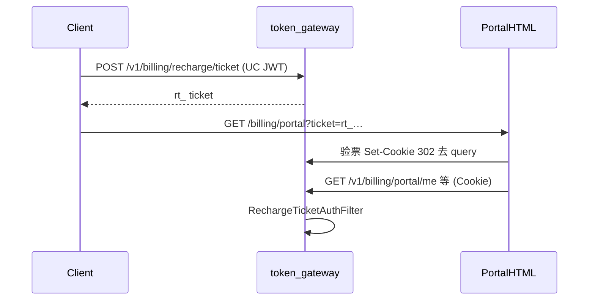

# US-G4-00 用户面板总览设计

> **用户故事**：[../02-用户故事.md](../02-用户故事.md) · Phase G4  
> **状态**：总览（IA / 鉴权 / API 草图）；分故事详设待开  
> **范围**：网关托管用户面板的信息架构、ticket 复用、账本只读 API、API Key 管理与退费客服入口约定  
> **需求映射**：[../14-用户面板执行计划.md](../14-用户面板执行计划.md)  
> **依赖**：US-G3-06（ticket / Cookie）；G0 账本、计量、价目、US-G0-06 rotate；G3 微信订单  
> **不做**：自助退款写库；新建 ticket 体系；sk/JWT 打开面板 URL；运维管理端；无限任意 name 批量签发（仍按名 rotate）  
> **文档位置**：`token-gateway/docs/design/`

---

## 0. 边界

| 已有 | 本总览 |
|------|--------|
| `POST /v1/billing/recharge/ticket` + Cookie `tg_recharge_ticket` | **复用**进入面板 |
| `/billing/recharge` 充值页 | 面板「去充值」同 Cookie 跳转；不合并两页 |
| `GET /v1/usage/me`、`GET /v1/models`（sk） | 面板不用 sk；价目不走 models |
| `POST /v1/keys/rotate`（UC JWT） | 面板提供 **ticket 鉴权** 的等价能力；领域逻辑复用 G0-06 |
| US-G0-18 `GET /v1/keys`（可选） | 面板列表可满足「查 Key 元信息」主路径；G0-18 仍可独立落地 |
| US-G3-05 人工退款 | 面板只弹客服联系方式 |

---

## 1. 已确认选型

| 项 | 决定 |
|----|------|
| **Q1 页路径** | `GET /billing/portal`（及可选 trailing `/`） |
| **Q2 API 前缀** | `/v1/billing/portal/**`，扩展 `RechargeTicketAuthFilter` |
| **Q3 凭证** | 同一 `rt_`；不新建签发 API / 表 |
| **Q4 TTL** | 沿用 `token-gateway.billing.recharge-ticket-ttl`（默认 300s）；超时提示从客户端重进 |
| **Q5 退费** | Modal：电话 `+8617852032649`、邮箱 `mfs1998@qq.com`、公众号二维码 `/qrcode_for_gh.jpg`；文案含人工约 3 个工作日 |
| **Q6 敏感字段** | usage **不**回传 `cogs_li` / `margin_li`；prices **不**回传上游成本列 |
| **Q7 API Key** | 面板区块「API Token」：列表元信息 + 按 `name` 签发/重置；明文仅响应/弹层一次；列表永不回完整 sk |

---

## 2. 入口时序



绑定逻辑对齐充值页：`BillingRechargePageController` 模式（query ticket → Cookie → 无 query 渲染；无效清 Cookie）。

---

## 3. 信息架构

首屏：品牌 +「官方服务」口径短句 + **当前余额** + 区块导航（账户 / API Token / 消费 / 充值 / 价格）+ 「退费」「去充值」。

| 区块 | 展示 | 数据源 |
|------|------|--------|
| 账户 | user_code（可脱敏）、status、balance；**不展示** tenant | `token_users` |
| API Token | name、key_prefix、status、创建/失效时间；操作：签发或重置 | `token_api_keys`；写路径复用 G0-06 |
| 消费 | 时间、模型、tokens、扣费厘、请求状态、billing_status | `token_request_logs` |
| 充值 | 时间、金额、out_trade_no、订单 status | `token_wechat_pay_orders` 为主；可辅以 ledger `topup` |
| 价格 | model、输入/输出单价（厘/百万 Token，页换算元） | `token_price_rules` 当前有效行 |
| 退费 | 按钮 → Modal 联系方式 | 静态 |
| 页脚 | ICP / 公安备案 + 联系方式 | 与充值页一致 |

**API Token 交互要点**：重置前二次确认（旧 Key 立即失效）；成功后弹层展示完整 `sk-…` + 复制；关闭后无法再取回明文。

视觉：延续充值页字体与色板；避免仪表盘式多卡片堆砌。

---

## 4. API 草图

鉴权：Cookie 或 `Authorization: Bearer rt_…`（与 wechat prepay 一致）。失败：`401 invalid_recharge_ticket`。

| 方法 | 路径 | 说明 |
|------|------|------|
| GET | `/billing/portal` | HTML + bootstrap（`ok` / `expires_in` / `balance_li`） |
| GET | `/v1/billing/portal/me` | `{ tenant_id, user_code, status, balance_li, … }` |
| GET | `/v1/billing/portal/usage` | 分页；query：`limit`、`cursor` 或 `before`；默认近 30 天（详设定） |
| GET | `/v1/billing/portal/topups` | 分页；credited 优先 |
| GET | `/v1/billing/portal/prices` | 有效价目列表（仅用户侧两档） |
| GET | `/v1/billing/portal/keys` | Key 元信息列表（无明文、无 hash） |
| POST | `/v1/billing/portal/keys/rotate` | body `{ name }`；语义对齐 `POST /v1/keys/rotate`；返回一次明文 |

无「提交退费」写接口。Key rotate 为面板唯一写路径（账本除外）。

---

## 5. 模块草图

```
BillingPortalPageController     GET /billing/portal
RechargeTicketAuthFilter        + /v1/billing/portal/**
BillingPortalController         me / usage / topups / prices / keys
BillingPortalApplication        只读查询 + 委托 KeyRotate（G0-06）
```

桌面（US-G4-07）：对称 G3-04，`buildPortalPageUrl(ticket)` → `{origin}/billing/portal?ticket=`。

---

## 6. 分故事详设索引

| 故事 | 详设（待开） |
|------|----------------|
| US-G4-01 | 页壳、NeedClient、Filter、bootstrap |
| US-G4-02 | `me` 字段与无账户策略 |
| US-G4-03 | usage 字段白名单、分页、时区 |
| US-G4-04 | topups 以订单还是 ledger 为准 |
| US-G4-05 | 有效价选取规则（与 G0-09 一致） |
| US-G4-06 | Modal 文案与资源路径 |
| US-G4-07 | 宿主跳转与日志掩码 |
| US-G4-08 | keys 列表字段、rotate 复用点、明文一次展示与审计日志 |

---

## 7. 开放问题（详设默认）

| # | 问题 | 默认 |
|---|------|------|
| O1 | usage 时间窗 | 默认 30 天；可 query 放宽上限 90 天 |
| O2 | topups 数据源 | 以 `token_wechat_pay_orders` 为主；人工 topup 可用 ledger 合并展示（详设定） |
| O3 | 面板 TTL 是否加长 | **否**；保持短时凭证 |
| O4 | user_code 脱敏 | 详设定；至少不展示完整 sk |
| O5 | 面板可 rotate 的 name | **本用户全部已有 name + 允许新建约定 name**（与 G0-06 一致）；不开放无约束批量创建 |
| O6 | 是否单独「停用」不换新 | **本期不做**；用 rotate 换新即旧 Key 失效；撤销另开故事 |

---

## 8. 下一步

1. 评审本文 + [14-执行计划](../14-用户面板执行计划.md) + [02 §G4](../02-用户故事.md)  
2. 按 Must 顺序开 US-G4-01～06、US-G4-08 详细设计  
3. 编码与联调（见执行计划阶段 C～E）
