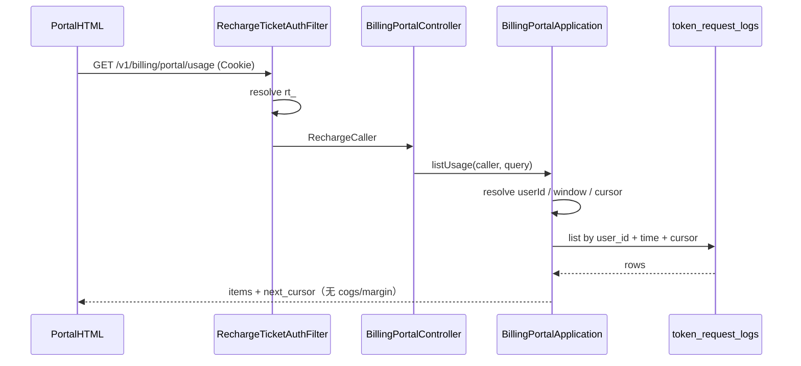

# US-G4-03 Token 消费记录设计

> **用户故事**：[../02-用户故事.md](../02-用户故事.md) · US-G4-03  
> **状态**：编码已落地（单测覆盖换算/游标/时间窗；联调需有效 ticket + request_logs）  
> **范围**：用户面板「消费」区：按 ticket 鉴权分页查询本账户 `token_request_logs`；字段白名单；默认近 30 天；**不**暴露 COGS/毛利。  
> **需求映射**：[../14-用户面板执行计划.md](../14-用户面板执行计划.md) C2；[US-G4-00](./US-G4-00-用户面板总览设计.md) §3～4 / O1  
> **依赖**：US-G4-01（页壳 + `RechargeTicketAuthFilter` 已覆盖 `/v1/billing/portal/**`）；US-G0-09/10（计量落库与结算回填）  
> **不做**：跨用户查询；导出 CSV；按模型/Key 复杂筛选（本期）；实时 SSE；返回 `cogs_li` / `margin_li` / `settle_*` / `cached_tokens`；面板金额用厘展示  
> **文档位置**：`token-gateway/docs/design/`

---

## 0. 边界

| 已有 | 本故事 |
|------|--------|
| `token_request_logs` + `idx_token_req_user_time (user_id, created_at)` | 列表查询走该索引 |
| G0-09：写日志（金额可空）；G0-10：回填 `revenue_li` 等 | 面板只读；对外 **`charge_yuan`** ← `revenue_li / 1000` |
| G4-00 O1：默认 30 天、上限 90 天 | **确认采纳** |
| `GET /v1/usage/me`（sk） | **无关**；面板不用 sk；本接口路径在 portal 下 |
| 面板 HTML「消费」占位 | 本故事补 API + 页内列表渲染 |

---

## 1. 已确认选型

| 项 | 决定 |
|----|------|
| **Q1 路径** | `GET /v1/billing/portal/usage` |
| **Q2 鉴权** | 与 `…/me` 相同：`RechargeTicketAuthFilter`；Cookie / Bearer `rt_`；失败 `401 invalid_recharge_ticket` |
| **Q3 数据源** | 仅 `token_request_logs`；`user_id =` ticket 对应用户 |
| **Q4 扣费字段** | 响应用 **`charge_yuan`**（元，最多 3 位小数）：`revenue_li / 1000`；未结算为 `null`；**不**回传厘字段；**永不**返回 `cogs_li` / `margin_li` |
| **Q5 默认时间窗** | 未传 `from` 时：`created_at >= now - 30d`（UTC） |
| **Q6 时间窗上限** | `from`～`to`（或默认窗）跨度 **≤ 90 天**；超出 → `400 invalid_time_range` |
| **Q7 分页** | **键集分页**：`(created_at DESC, request_id DESC)`；见 §5.2 |
| **Q8 时区** | 库内 UTC；API 时间一律 **ISO-8601 带 `Z`**；页内展示可用浏览器本地时区，旁注「时间按本地显示」即可 |
| **Q9 行过滤** | 默认返回时间窗内**全部** `billing_status`（含 `pending` / `settling`）；不默认隐藏失败行 |
| **Q10 Key 展示** | 回传 `key_name`；**不**回传 `key_id` |
| **Q11 敏感** | **不**回传 `settle_owner` / `settle_claimed_at`；`error_summary` 可回（已无 prompt）；长度页内截断展示 |
| **Q12 Token 展示** | 仅 **输入** `prompt_tokens`、**输出** `completion_tokens`；**不**回传 / 不展示 `cached_tokens` / `uncached_tokens` |

---

## 2. 目标与非目标

### 2.1 目标

1. 持有效 ticket 的用户可分页浏览本人近期模型调用与扣费。  
2. 列表足以核对：何时、何模型、多少 Token、扣了多少、请求/结算状态。  
3. 查询走现有索引，单页可控，短时会话内可多翻几页。  
4. 毛利与上游成本对终端用户不可见。

### 2.2 非目标

| 不做 | 说明 |
|------|------|
| 管理端 / 全站用量 | 非本面板 |
| `cogs_li` / `margin_li` | G4-00 Q6 |
| 按 model / key_name / status 筛选 | 可后续增强；本期靠时间窗 + 翻页 |
| 汇总卡片（今日合计等） | 非本故事；桌面「今日 Token」仍另议 |
| 改库、重试结算 | 运维 / G0-12 |

---

## 3. 用户身份解析

与 [BillingPortalApplication.me](../../token-gateway-server/src/main/java/com/mfs/tokengateway/server/application/BillingPortalApplication.java) 一致：

1. `RechargeCaller` 优先 `userId` → `token_users.id`。  
2. 若 `userId` 空：按 `(tenant_id, user_code)` 查户。  
3. **仍无账户行**：返回 **200 + 空列表**（`items: []`, `next_cursor: null`），不 404。  
4. 只查 `user_id = 解析出的 id`；禁止用 `tenant_id`  alone 扫表。

---

## 4. 字段白名单

### 4.1 列表项（对外）

| JSON 字段 | 来源列 | 说明 |
|-----------|--------|------|
| `request_id` | `request_id` | 客服对账用 |
| `created_at` | `created_at` | ISO-8601 `Z` |
| `model` | `model` | 请求模型 id |
| `key_name` | `key_name` | 如 `ftcs-desktop` |
| `status` | `status` | `success` \| `error` \| `interrupted` |
| `billing_status` | `billing_status` | 见 §4.2 |
| `prompt_tokens` | `prompt_tokens` | 输入 Token；可 null |
| `completion_tokens` | `completion_tokens` | 输出 Token；可 null |
| `charge_yuan` | `revenue_li / 1000` | 用户侧扣费**元**；未结算 **null**；见 §4.4 |
| `error_summary` | `error_summary` | 可 null；失败行可选展示 |

### 4.2 明确禁止回传

`cogs_li`、`margin_li`、`revenue_li`（对外用 `charge_yuan`）、`cached_tokens`、`uncached_tokens`、`key_id`、`user_id`、`settle_owner`、`settle_claimed_at`、`latency_ms`、`upstream_status`（后两者本期不做；若调试需要另开增强）。

### 4.3 `billing_status` 展示文案（页内）

| 值 | 文案 |
|----|------|
| `pending` | 待结算 |
| `settling` | 结算中 |
| `charged` | 已扣费 |
| `skipped_no_usage` | 无用量 |
| `settle_failed` | 结算失败 |

`status` 文案：`success`→成功，`error`→失败，`interrupted`→中断。

### 4.4 金额（元）

- 库内仍为厘；**API / 页面一律用元**，字段名 `charge_yuan`。  
- 换算：`charge_yuan = revenue_li / 1000`（十进制；JSON 用 number，例如 `0.005`、`1.2`）。  
- 页内展示：固定两位小数 + 「元」（如 `0.01 元`）；不足两位可补零。  
- `charge_yuan == null`（未结算）：展示「—」或「待结算」，**不要**显示 `0.00`（与真实扣费 0 元区分；若 `charged` 且 `revenue_li=0` 则显示 `0.00 元`）。  
- **禁止**在面板文案或 JSON 中出现「厘」。

> `billing_status=pending` 时扣费列与状态列口径一致：状态为「待结算」，金额为「—」。`settling` 为「结算中」。

---

## 5. API

### 5.1 请求

```http
GET /v1/billing/portal/usage?limit=20&from=2026-07-07T00:00:00.000Z&to=2026-08-06T07:00:00.000Z&cursor=...
Cookie: tg_recharge_ticket=rt_…
Accept: application/json
```

| Query | 必填 | 规则 |
|-------|------|------|
| `limit` | 否 | 默认 **20**；范围 **1～50**；非法 → `400 invalid_limit` |
| `from` | 否 | ISO-8601；默认 `now - 30d`；须 ≤ `to` |
| `to` | 否 | ISO-8601；默认 **now**；闭区间上界在 SQL 用 `< to` 或 `<= to` 见下 |
| `cursor` | 否 | 上一页响应的 `next_cursor`；首页省略 |

**时间窗校验：**

- 解析失败 → `400 invalid_time_range`  
- `from > to` → 同短码  
- `(to - from) > 90 days` → 同短码  
- 有 `cursor` 时仍须带与首页一致的 `from`/`to`（或省略则用默认窗）；**cursor 不得扩大时间窗**——服务端以请求中的 from/to（或默认）为准过滤，cursor 仅在窗内定位下一页

**`to` 语义（推荐）：** `created_at <= to`（含边界）；首页 `to=now`。

### 5.2 游标

不透明字符串（URL-safe Base64 或简单拼接均可；实现选一种并单测）。

逻辑载荷：

```text
{ "t": "<created_at ISO-8601 Z>", "id": "<request_id>" }
```

下一页条件（降序）：

```sql
AND (
  created_at < :cursor_t
  OR (created_at = :cursor_t AND request_id < :cursor_id)
)
```

排序：

```sql
ORDER BY created_at DESC, request_id DESC
LIMIT :limit
```

若本页条数 `< limit` → `next_cursor = null`；否则取**本页最后一行**编码为 `next_cursor`。

**禁止** offset 分页（深翻跳号、重复/漏行）。

### 5.3 成功响应

```http
HTTP/1.1 200 OK
Content-Type: application/json
```

```json
{
  "items": [
    {
      "request_id": "01J…",
      "created_at": "2026-08-06T06:12:01.123Z",
      "model": "deepseek-chat",
      "key_name": "ftcs-desktop",
      "status": "success",
      "billing_status": "charged",
      "prompt_tokens": 1200,
      "completion_tokens": 340,
      "charge_yuan": 0.005,
      "error_summary": null
    }
  ],
  "next_cursor": "eyJ0IjoiMjAyNi0wOC0wNlQwNjoxMjowMS4xMjNaIiwiaWQiOiIwMUouLi4ifQ",
  "window": {
    "from": "2026-07-07T07:00:00.000Z",
    "to": "2026-08-06T07:00:00.000Z"
  }
}
```

`window`：回显实际生效的时间窗，便于页内展示「近 30 天」。

### 5.4 错误

| HTTP | reason | 场景 |
|------|--------|------|
| 401 | `invalid_recharge_ticket` | Filter / 无 caller |
| 400 | `invalid_limit` | limit 越界 |
| 400 | `invalid_time_range` | from/to/跨度 |
| 400 | `invalid_cursor` | cursor 无法解码或不匹配 |

不引入 UC JWT；**不**加入 `protected-patterns`。

---

## 6. 查询实现要点

### 6.1 DbService

在 `TokenRequestLogDbService`（或 Portal 专用查询）增加例如：

```text
listForPortal(userId, from, to, cursorT, cursorId, limit)
```

- `WHERE user_id = ? AND created_at >= ? AND created_at <= ?` + 游标条件  
- **SELECT 列白名单**（或查出后 DTO 映射时丢弃敏感列）；禁止 `SELECT *` 直出 Controller  

### 6.2 Application

`BillingPortalApplication.listUsage(RechargeCaller, query)`：

1. 解析身份 → `userId`；无户 → 空页。  
2. 规范化 `limit` / `from` / `to` / cursor。  
3. 查 `limit` 行；组装 `BillingPortalUsageResponse`。  
4. 映射 `charge_yuan = revenueLi / 1000.0`（未结算保持 null）；**不**映射 cached / uncached / cogs / margin。

### 6.3 Controller

扩展已有 `BillingPortalController`：

```text
GET /v1/billing/portal/usage
```

从 `@RequestAttribute RechargeCaller` 取身份（与 `me` 相同 `requireCaller`）。

---

## 7. 面板 UI（消费 Tab）

对齐 Pencil / 现网 portal 壳：

1. 切到「消费」→ 按当前时间窗首次 `GET …/usage`。  
2. **时间窗控件**（必有）：分段按钮 **近 7 天 / 近 30 天（默认）/ 近 90 天**；切换后清空列表并以新 `from`/`to` 重新拉取（`to=now`，`from=now-Nd`）；加载中禁用分段。不提供自定义日期选择器（本期）。  
3. **列表**：时间（本地）、模型、输入 Token、输出 Token、扣费（元）、请求状态、结算状态；窄屏可两行。**不**展示缓存命中 Token。  
4. **空态**：「近 N 天暂无消费记录」（N 随所选窗变化）。  
5. **加载更多**：有 `next_cursor` 时底部按钮；追加 `items`，**沿用同一 `from`/`to`**。  
6. **401**：与壳一致，切 NeedClient / 过期文案。  
7. **禁止**展示 COGS、毛利、内部 settle 字段。  
8. 视觉：无多卡片仪表盘；表格感行列表 + 底部分割线即可（与账户摘要 meta-row 同族）。

不强制本故事改 Pencil；若补设计帧，命名 `G4-03 Usage · 消费列表`。

---

## 8. 时序



---

## 9. 模块与文件（建议）

| 层 | 建议 |
|----|------|
| API DTO | `BillingPortalUsageResponse`、`BillingPortalUsageItem` |
| Query | 可用 `@RequestParam` 直接进 Application，或小型 `BillingPortalUsageQuery` |
| Application | `BillingPortalApplication.listUsage` |
| Db | `TokenRequestLogDbService.listForPortal…` |
| 页 | `templates/billing/portal.html` 消费区替换占位 |
| 单测 | 白名单无 cogs/cached；有 `charge_yuan` 无厘字段；游标翻页；默认 30d；跨度 >90 → 400；无户空列表 |

---

## 10. 验收清单

| ID | 步骤 | 期望 |
|----|------|------|
| A1 | 有效 ticket + 有 `charged` 行 | items 含 model / 输入输出 tokens / `charge_yuan`；无 cogs/margin/cached；无「厘」 |
| A2 | 仅有 `pending` 行 | 可见；`charge_yuan` 为 null |
| A3 | 默认无 from | `window` 跨度约 30 天 |
| A4 | `from`～`to` > 90 天 | 400 `invalid_time_range` |
| A5 | 连续两页 cursor | 无重复 `request_id`；顺序时间降序 |
| A6 | 无账户 / 无日志 | 200 + `items: []` |
| A7 | 无效 ticket | 401 |
| A8 | 页内消费 Tab | 有 7/30/90 天窗控件；只显示输入/输出 Token 与元金额；可加载更多；空态正确 |
| A9 | 响应 JSON | 无 `cogs_li` / `margin_li` / `cached_tokens` / `charge_li` / `revenue_li` |

---

## 11. 编码顺序建议

1. DbService 列表查询 + 单测（含游标）。  
2. DTO + Application 映射 `charge_yuan` + 时间窗校验。  
3. Controller 接线。  
4. `portal.html` 消费 Tab。  
5. 联调：真实 Chat → 结算后刷新面板可见扣费。

---

## 12. 开放问题（本详设默认）

| # | 问题 | 默认 |
|---|------|------|
| O1 | 是否按 `billing_status` 筛选 | **否**（本期） |
| O2 | 是否返回 `latency_ms` | **否** |
| O3 | `cached_tokens` | **否**（不回传、不展示；只展示输入/输出） |
| O4 | 扣费单位 | **元**（`charge_yuan`）；不在面板暴露厘 |
| O5 | 时区展示 | 浏览器本地；API 固定 UTC `Z` |
| O6 | 时间窗 UI | **分段：7 / 30 / 90 天**；默认 30；不做自定义日历 |

若产品改为「默认只看已扣费」，再改 Q9 并加 `?billing_status=charged`。
