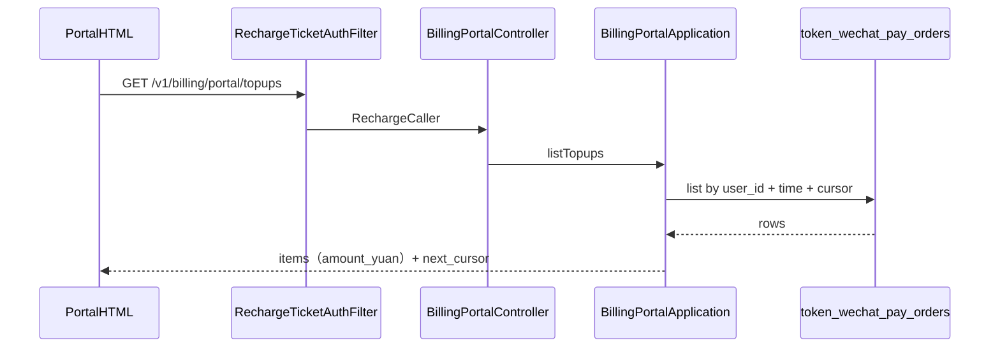

# US-G4-04 充值入账记录设计

> **用户故事**：[../02-用户故事.md](../02-用户故事.md) · US-G4-04  
> **状态**：编码已落地（单测覆盖换算/游标/空户；联调需有效 ticket + 微信订单） 
> **范围**：用户面板「充值」区：按 ticket 鉴权分页查询本账户微信充值订单；金额按**元**展示；时间窗与消费区对齐（默认 30 天 / 上限 90 天）。  
> **需求映射**：[../14-用户面板执行计划.md](../14-用户面板执行计划.md) C2；[US-G4-00](./US-G4-00-用户面板总览设计.md) §3～4 / O2  
> **依赖**：US-G4-01（页壳 + Filter）；US-G3-01/02（`token_wechat_pay_orders` 与入账）；交互对齐 [US-G4-03](./US-G4-03-Token消费记录设计.md)  
> **不做**：跨用户查询；导出；合并展示人工 ledger topup（本期）；退款流水；暴露 `code_url` / `notify_url` / 商户密钥相关字段  
> **文档位置**：`token-gateway/docs/design/`

---

## 0. 边界

| 已有 | 本故事 |
|------|--------|
| `token_wechat_pay_orders` + `idx_user_created (user_id, created_at)` | 列表主数据源与索引 |
| G3-02：成功支付 → `credited` + ledger `type=topup` | 面板以**订单行**为准核对；不读 ledger 防双线不一致 |
| G4-00 O2：订单为主，人工 topup 可合并 | **本期仅订单**；人工调账不进本列表（见 Q3） |
| G4-03：时间窗 / 键集分页 / 元展示 | **复用同一套交互与校验口径** |
| 面板 HTML「充值」占位 | 本故事补 API + 页内列表 |

---

## 1. 已确认选型

| 项 | 决定 |
|----|------|
| **Q1 路径** | `GET /v1/billing/portal/topups` |
| **Q2 鉴权** | 与 `…/me` / `…/usage` 相同：`RechargeTicketAuthFilter`；失败 `401 invalid_recharge_ticket` |
| **Q3 数据源** | **仅** `token_wechat_pay_orders`，`user_id =` 解析出的账户 id。**不**合并 `token_ledger_entries` 人工 topup（避免双源分页与重复：微信入账 ledger `request_id=wechat:{tx}` 与订单一一对应，展示订单即可） |
| **Q4 金额** | 对外 **`amount_yuan`** = `amount_li / 1000`（或等价 `amount_fen / 100`）；**不**回传 `amount_li` / `amount_fen` |
| **Q5 默认时间窗** | 未传 `from`：`created_at >= now - 30d`（UTC） |
| **Q6 时间窗上限** | 跨度 **≤ 90 天**；超出 → `400 invalid_time_range`（短码与 G4-03 一致） |
| **Q7 分页** | 键集：`(created_at DESC, id DESC)`；见 §5.2 |
| **Q8 时区** | 库内 UTC；API 时间 ISO-8601 `Z`；页内本地展示 |
| **Q9 行过滤** | 默认返回时间窗内**全部** `status`（含 `created` / `paid` / `failed` / `closed` / `credited`），便于用户看到未付完/已关闭单 |
| **Q10 排序语义** | 按下单时间 `created_at` 降序（非 `credited_at`），与「我发起的充值」心智一致 |
| **Q11 敏感** | **不**回传 `code_url`、`notify_url`、`tenant_id`、`user_id`、`user_code`；`fail_reason` 仅在失败/关闭类状态回传 |
| **Q12 UI 时间窗** | 与消费区相同：分段 **近 7 / 30（默认）/ 90 天**；不做自定义日历 |

---

## 2. 目标与非目标

### 2.1 目标

1. 用户可分页浏览本人微信充值订单与入账结果。  
2. 能核对：金额（元）、下单/入账时间、订单号、状态。  
3. 查询走 `idx_user_created`；短时会话内可翻页。  

### 2.2 非目标

| 不做 | 说明 |
|------|------|
| 人工 topup / adjust 列表 | 本期不做；运维改库另见 G0-15；用户疑问走客服 |
| 微信退款记录 | G3-05 / 人工 |
| 重新拉起支付（对 `created` 单） | 用户点「去充值」新开单即可 |
| 管理端全站订单 | — |

---

## 3. 用户身份解析

与 [US-G4-03 §3](./US-G4-03-Token消费记录设计.md) / `BillingPortalApplication` 一致：

1. `userId` → `token_users.id`；否则 `(tenant_id, user_code)`。  
2. **无账户行**：`200` + `items: []`，`next_cursor: null`。  
3. 仅 `user_id = ?`；禁止按 tenant 扫全表。

---

## 4. 字段白名单

### 4.1 列表项（对外）

| JSON 字段 | 来源列 | 说明 |
|-----------|--------|------|
| `out_trade_no` | `out_trade_no` | 商户订单号 |
| `created_at` | `created_at` | 下单时间 ISO-8601 `Z` |
| `paid_at` | `paid_at` | 可 null |
| `credited_at` | `credited_at` | 可 null；已入账时有值 |
| `amount_yuan` | `amount_li / 1000` | **元**；number（如 `50`、`12.5`） |
| `status` | `status` | 见 §4.2 |
| `description` | `description` | 商品描述（如「官方服务预付费充值」） |
| `wx_transaction_id` | `wx_transaction_id` | 已入账时可展示；未付可为 null |
| `fail_reason` | `fail_reason` | 仅 `failed` / `closed` 时非空有意义；其它状态可省略或 null |

### 4.2 明确禁止回传

`id`（可用 cursor 内部）、`amount_li`、`amount_fen`、`code_url`、`notify_url`、`tenant_id`、`user_id`、`user_code`、notify/sync 审计列（`last_notify_*` / `last_sync_*` / `notify_count` 等）。

### 4.3 `status` 页内文案

| 值 | 文案 |
|----|------|
| `created` | 待支付 |
| `paid` | 已支付（入账中） |
| `credited` | 已入账 |
| `failed` | 下单失败 |
| `closed` | 已关闭 |

### 4.4 金额（元）

- `amount_yuan = amount_li / 1000`（`BigDecimal`，最多 3 位小数；页内固定两位 +「元」）。  
- 与下单一致：合法单多为整数元或两位小数。  
- **禁止**面板展示「厘」「分」。

---

## 5. API

### 5.1 请求

```http
GET /v1/billing/portal/topups?limit=20&from=…&to=…&cursor=…
Cookie: tg_recharge_ticket=rt_…
Accept: application/json
```

| Query | 必填 | 规则 |
|-------|------|------|
| `limit` | 否 | 默认 **20**；**1～50**；非法 → `400 invalid_limit` |
| `from` | 否 | ISO-8601；默认 `now - 30d` |
| `to` | 否 | ISO-8601；默认 **now**；`created_at <= to` |
| `cursor` | 否 | 上一页 `next_cursor` |

时间窗校验与 G4-03 **相同**（解析失败 / `from > to` / 跨度 > 90 天 → `invalid_time_range`）。  
有 `cursor` 时须保持同一 `from`/`to`（页内切换天数会清空 cursor 重拉）。

### 5.2 游标

载荷：

```text
{ "t": "<created_at ISO-8601 Z>", "id": "<orders.id>" }
```

实现可用 URL-safe Base64：`{t}|{id}`（与 usage 的 `t|request_id` 同套路，**id 为数字字符串**）。

下一页：

```sql
AND (
  created_at < :cursor_t
  OR (created_at = :cursor_t AND id < :cursor_id)
)
ORDER BY created_at DESC, id DESC
LIMIT :limit
```

本页满 `limit` → 以最后一行编码 `next_cursor`；否则 `null`。  
**禁止** offset 分页。

### 5.3 成功响应

```json
{
  "items": [
    {
      "out_trade_no": "tg20260806…",
      "created_at": "2026-08-06T06:00:00.000Z",
      "paid_at": "2026-08-06T06:01:10.000Z",
      "credited_at": "2026-08-06T06:01:11.000Z",
      "amount_yuan": 50.0,
      "status": "credited",
      "description": "官方服务预付费充值",
      "wx_transaction_id": "4200…",
      "fail_reason": null
    }
  ],
  "next_cursor": "…",
  "window": {
    "from": "2026-07-07T07:00:00.000Z",
    "to": "2026-08-06T07:00:00.000Z"
  }
}
```

### 5.4 错误

| HTTP | reason | 场景 |
|------|--------|------|
| 401 | `invalid_recharge_ticket` | 无/无效 ticket |
| 400 | `invalid_limit` | limit 越界 |
| 400 | `invalid_time_range` | from/to/跨度 |
| 400 | `invalid_cursor` | cursor 损坏 |

不加入 UC JWT `protected-patterns`。

---

## 6. 查询实现要点

### 6.1 DbService

在微信订单 DbService（既有 `TokenWechatPayOrderDbService` 或等价）增加：

```text
listForPortal(userId, from, to, cursorCreatedAt, cursorId, limit)
```

- `WHERE user_id = ? AND created_at >= ? AND created_at <= ?` + 游标  
- SELECT 所需列即可；映射层再剥敏感字段  

### 6.2 Application

`BillingPortalApplication.listTopups(caller, limit, from, to, cursor)`：

1. 解析身份；无户 → 空页。  
2. 规范化 limit / 时间窗 / cursor（可与 usage **共用**私有工具方法，避免两套解析）。  
3. 映射 `amount_yuan`；组装 `BillingPortalTopupsResponse`。  

### 6.3 Controller

```text
GET /v1/billing/portal/topups
```

扩展 `BillingPortalController`；`requireCaller` 同 `me`。

---

## 7. 面板 UI（充值 Tab）

对齐消费区：

1. 切到「充值」→ 按当前时间窗首次请求。  
2. **时间窗分段**：近 7 / 30（默认）/ 90 天；切换清空列表并重拉。  
3. **列表行**：金额（元，突出）、状态文案、下单时间（本地）；次行：`out_trade_no`、已入账则 `credited_at`、失败则短 `fail_reason`。  
4. **空态**：「近 N 天暂无充值记录」。  
5. **加载更多**：沿用同一 `from`/`to` + `cursor`。  
6. **401** → NeedClient / 过期。  
7. 页内可保留「去充值」入口（顶栏已有亦可不重复）。  
8. 视觉：同消费区行列表，无卡片堆砌。

可选文案脚注（一行小字）：「本列表为微信支付自助充值；人工调账请联系客服。」

---

## 8. 时序



---

## 9. 模块与文件（建议）

| 层 | 建议 |
|----|------|
| DTO | `BillingPortalTopupsResponse` / `BillingPortalTopupItem` |
| Application | `listTopups`；时间窗/cursor 工具与 usage 共用 |
| Db | `TokenWechatPayOrderDbService.listForPortal…` |
| 页 | `portal.html` 充值 Tab |
| 单测 | 元换算；游标；>90 天 400；无户空列表；响应无 `amount_li`/`code_url` |

---

## 10. 验收清单

| ID | 步骤 | 期望 |
|----|------|------|
| A1 | 有效 ticket + 有 `credited` 单 | 见金额（元）、`out_trade_no`、`credited_at`；状态「已入账」 |
| A2 | 仅有 `created` 未付 | 可见；文案「待支付」；无 `wx_transaction_id` 亦可 |
| A3 | 默认窗 | 约 30 天；UI 默认选中「近 30 天」 |
| A4 | 跨度 > 90 天 | 400 `invalid_time_range` |
| A5 | 两页 cursor | 无重复 `out_trade_no`；`created_at` 降序 |
| A6 | 无账户 / 无订单 | 200 + 空列表 |
| A7 | 无效 ticket | 401 |
| A8 | 页内 | 7/30/90 控件；加载更多；空态 |
| A9 | JSON 抽检 | 无 `amount_li` / `code_url` / `notify_url` / cogs |

---

## 11. 编码顺序建议

1. Db `listForPortal` + 单测。  
2. DTO + `listTopups`（复用时间窗工具）。  
3. Controller。  
4. `portal.html` 充值 Tab（可复用消费区 toolbar/list 样式）。  
5. 联调：prepay → 支付/补单 → 面板见「已入账」。

---

## 12. 开放问题（本详设默认）

| # | 问题 | 默认 |
|---|------|------|
| O1 | 是否合并人工 ledger topup | **否**（本期）；需要时另开故事做「其他入账」分段 |
| O2 | 是否默认只显示 `credited` | **否**；显示全部状态，便于核对未完成单 |
| O3 | 时间字段主展示 | 列表主时间用 `created_at`；`credited` 行额外展示入账时间 |
| O4 | `wx_transaction_id` | **回传**（已入账时）；页内可截断展示 |

若产品改为「只看已入账」，加 query `status=credited` 即可，不改表。
