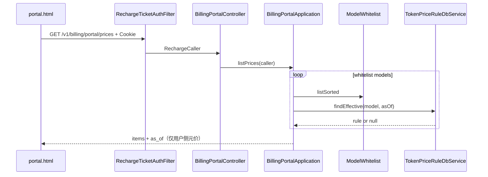

# US-G4-05 模型价格说明设计

> **用户故事**：[../02-用户故事.md](../02-用户故事.md) · US-G4-05  
> **状态**：编码已落地（单测覆盖换算/缺价跳过/白名单顺序；联调需有效 ticket + 价目种子）  
> **范围**：用户面板「价格」区：按 ticket 鉴权返回当前官方通道**可调用模型**的用户侧输入/输出单价；单位对外为**元 / 百万 Token**；**不**暴露上游成本。  
> **需求映射**：[../14-用户面板执行计划.md](../14-用户面板执行计划.md) C2；[US-G4-00](./US-G4-00-用户面板总览设计.md) §3～4 / Q6；[../01-需求.md](../01-需求.md) FR-PRICE-01/05/06  
> **依赖**：US-G4-01（页壳 + Filter）；US-G0-09（`token_price_rules` + `findEffective`）；US-G0-17（白名单 ∩ 有效价，与 `GET /v1/models` 同源口径）  
> **不做**：公开匿名价目 API；管理端调价；返回 COGS 三档；改 `GET /v1/models` 带价；历史价时间轴 / `asOf` 查询；分页；**向用户说明缓存命中如何计费**（故意模糊，面板不写）  
> **后续**：US-G5-04 扩展同一 `…/prices`，追加 `billing_unit=per_call` 的 `tavily.search`（元/次）→ [US-G5-04](./US-G5-04-面板搜索价格展示设计.md)  
> **文档位置**：`token-gateway/docs/design/`

---

## 0. 边界

| 已有 | 本故事 |
|------|--------|
| `token_price_rules` + `TokenPriceRuleDbService.findEffective(model, asOfUtc)` | 取「当前」有效用户侧两档价 |
| `ModelWhitelist` + [US-G0-17](./US-G0-17-models白名单列表设计.md) `ModelsApplication.listAvailable` | **列表范围**与 sk 侧可调用模型对齐：白名单 ∩ 有有效价 |
| `GET /v1/models`（sk，仅 `id`） | **分离**：面板价目走 portal；models **仍不含价** |
| G0-09：库内单位厘/百万 Token；调价只 INSERT | 面板只读最新生效行；脚注说明「已完成请求不回算」 |
| G4-00：prices 不回上游成本；IA 曾写「API 厘、页换元」 | **本故事拍板**：API 直接回 **元**（与 usage `charge_yuan` / topups `amount_yuan` 一致） |
| 面板 HTML「价格」占位 | 本故事补 API + 页内列表 |

---

## 1. 已确认选型

| 项 | 决定 |
|----|------|
| **Q1 路径** | `GET /v1/billing/portal/prices` |
| **Q2 鉴权** | 与 `…/me` / `…/usage` / `…/topups` 相同：`RechargeTicketAuthFilter`；失败 `401 invalid_recharge_ticket` |
| **Q3 列表范围** | **`ModelWhitelist.listSorted()` ∩ `findEffective(model, nowUtc) != null`**，与 G0-17 可调用集合一致。仅有价、不在白名单 → **不展示**；在白名单但缺价 → **跳过**（与 models 一致，不报错） |
| **Q4 取价规则** | 与 G0-09 相同：`WHERE model=? AND effective_from <= asOf ORDER BY effective_from DESC LIMIT 1`；`asOf = now`（UTC） |
| **Q5 对外金额** | **`input_price_yuan_per_mtok` / `output_price_yuan_per_mtok`** = 对应 `*_li_per_mTok / 1000`（`BigDecimal`，最多 3 位小数）；**不**回传厘字段 |
| **Q6 敏感** | **永不**回传 `upstream_input_cost_*` / `upstream_cache_cost_*` / `upstream_output_cost_*`、`id`、内部 snapshot 全量 |
| **Q7 与账户关系** | 价目为**全局目录**，不按用户差异化；无 `token_users` 行仍 **200 + 完整列表**（只要 ticket 有效） |
| **Q8 分页 / asOf** | **不分页**（模型数极少）；**不**提供 `asOf` query（本期只看当前价） |
| **Q9 排序** | 与白名单一致：`listSorted()` 顺序（模型 id 字典序） |
| **Q10 生效时间** | 回传该有效行的 `effective_from`（ISO-8601 `Z`），便于用户理解「现行价自何时起」 |
| **Q11 UI** | 切到「价格」懒加载；表格/行列表；单位文案固定「元 / 百万 Token」；**不**解释缓存计费细节 |

---

## 2. 目标与非目标

### 2.1 目标

1. 持有效 ticket 的用户能看到当前可调用模型的输入/输出用户单价。  
2. 能看到两档用户单价与单位，足以对照消费扣费；**不**展开缓存等内部计费细则。  
3. 不泄露上游成本与毛利。  
4. 与 `GET /v1/models` 可调用集合一致，避免「价目有、Chat 不能调」或反向。

### 2.2 非目标

| 不做 | 说明 |
|------|------|
| 匿名公开价目页 | 仍挂在 portal ticket 下 |
| 在 `GET /v1/models` 塞价格 | G0-17 / 验收明确分离 |
| 历史价查询、调价预告 | 运维 INSERT 新行即可；面板只看当前 |
| 试算器 / 费用估算 | 非本故事 |
| 缓存命中计费说明 | **故意不写**；内部仍按 G0-09 / FR-PRICE-03，面板与 API 文案均不提及 |
| 改价写接口 | G0-15 / ops SQL |

---

## 3. 取价与范围（复用 G0-09 / G0-17）

```text
asOfUtc = now (UTC)
for model in ModelWhitelist.listSorted():
  rule = TokenPriceRuleDbService.findEffective(model, asOfUtc)
  if rule == null: continue
  emit whitelist fields only (user P_in / P_out + effective_from)
```

- **禁止** `SELECT *` 整行序列化给前端。  
- **禁止**调用 `PricingService.quote`（本接口不计量、不算单笔费用）。  
- 缺价模型静默跳过；**不**因个别缺价使整个接口 5xx。  
- 白名单为空 → `items: []`。

与结算热路径关系：结算仍用同一 `findEffective`；面板只是只读投影。G0-09 Q3「每次查库」对本列表同样适用（条目少，可接受）。

---

## 4. 字段白名单

### 4.1 列表项（对外）

| JSON 字段 | 来源 | 说明 |
|-----------|------|------|
| `model` | `model` | 与 Chat / models `id` 一致（如 `deepseek-v4-flash`） |
| `input_price_yuan_per_mtok` | `input_price_li_per_mTok / 1000` | 用户侧输入单价，**元 / 百万 Token** |
| `output_price_yuan_per_mtok` | `output_price_li_per_mTok / 1000` | 用户侧输出单价 |
| `effective_from` | `effective_from` | 本条价目生效时刻 ISO-8601 `Z` |

### 4.2 明确禁止回传

`id`、`created_at`（可选增强，本期不做）、全部 `upstream_*_cost_li_per_mTok`、任何 `*_li_per_mTok` 厘字段、`cogs` / `margin`、tenant/user 相关字段。

### 4.3 金额换算

- 复用 `BillingPortalApplication.liToYuan(Long)`（与 usage/topups 相同：`/1000`，`HALF_UP`，最多 3 位小数）。  
- 种子例（开发环境）：flash 输入 `1200` 厘 → `1.200` 元/百万 Token；输出 `2300` → `2.300`。  
- **禁止**面板展示「厘」。

### 4.4 页内文案

| 位置 | 文案 |
|------|------|
| 列头 | 模型 / 输入 / 输出 / 生效时间 |
| 单位旁注 | 单价单位：元 / 百万 Token |
| 脚注（可选） | 价格变更不影响已完成请求。**不要**写缓存命中、未缓存拆分等口径。 |

---

## 5. API

### 5.1 请求

```http
GET /v1/billing/portal/prices
Cookie: tg_recharge_ticket=rt_…
Accept: application/json
```

无 query 参数（本期）。

### 5.2 响应 `200`

```json
{
  "items": [
    {
      "model": "deepseek-v4-flash",
      "input_price_yuan_per_mtok": 1.2,
      "output_price_yuan_per_mtok": 2.3,
      "effective_from": "2020-01-01T00:00:00Z"
    },
    {
      "model": "deepseek-v4-pro",
      "input_price_yuan_per_mtok": 3.6,
      "output_price_yuan_per_mtok": 7.0,
      "effective_from": "2020-01-01T00:00:00Z"
    }
  ],
  "as_of": "2026-08-06T08:00:00Z"
}
```

| 顶层字段 | 说明 |
|----------|------|
| `items` | 数组；可空 |
| `as_of` | 本次取价所用的 UTC 时刻（与内部 `asOf` 一致），便于排障 |

### 5.3 错误

| 情况 | HTTP | reason |
|------|------|--------|
| 无/无效/过期 ticket | 401 | `invalid_recharge_ticket` |

无 `invalid_time_range` / `invalid_cursor`（本接口无此类参数）。

---

## 6. 实现要点

### 6.1 Application

`BillingPortalApplication.listPrices(RechargeCaller caller)`：

1. `requireCaller` 已由 Controller 保证；本方法**不**强制解析 `token_users`。  
2. `Instant asOf = Instant.now()`；转 `LocalDateTime` UTC。  
3. 遍历 `modelWhitelist.listSorted()`，`findEffective` → `toPriceItem(rule)`。  
4. 组装 `BillingPortalPricesResponse`（`items` + `as_of`）。

注入：`ModelWhitelist`、`TokenPriceRuleDbService`（`BillingPortalApplication` 已有其它 Db；本故事追加）。

可选：抽取与 `ModelsApplication` 共用的「可调用 model 迭代」私有助手，**避免** portal 依赖 sk 向的 `ModelsApplication`（鉴权语义不同）；允许轻微重复循环。

### 6.2 DTO

`BillingPortalPricesResponse` / `BillingPortalPriceItem`：`@JsonInclude` 与既有 portal DTO 风格一致；金额字段用 `BigDecimal`。

### 6.3 Controller

```text
GET /v1/billing/portal/prices
```

扩展 `BillingPortalController`；`requireCaller` 同 `me`。

### 6.4 Db

**不强制**新增 Mapper 方法；复用 `findEffective`。若后续模型变多再考虑「批量取最新价」优化（非本期）。

---

## 7. 面板 UI（价格 Tab）

1. 切到「价格」且尚未加载 → 请求 `/v1/billing/portal/prices`。  
2. **列表**：每行 `model` 突出；右侧或次行展示「输入 x.xx 元」「输出 y.yy 元」；展示 `effective_from` 本地时间。  
3. **空态**：「暂无已定价模型」（白名单空或均缺价；正常生产不应出现）。  
4. **错误**：inline error；`401` → NeedClient。  
5. **无分页 / 无时间窗控件**（与消费/充值区不同）。  
6. 页内固定单位说明；可选「已完成请求不回算」一句；**禁止**缓存计费说明（见 §4.4）。  
7. 视觉：延续 usage 行列表样式，**不用**多卡片仪表盘。

---

## 8. 时序



---

## 9. 文件清单（编码时）

| 层 | 变更 |
|----|------|
| DTO | `BillingPortalPricesResponse` / `BillingPortalPriceItem` |
| Application | `listPrices`；注入 `ModelWhitelist` + `TokenPriceRuleDbService`；`toPriceItem` |
| Controller | `GET …/prices` |
| 单测 | 换算；跳过缺价；不映射 upstream；白名单顺序 |
| UI | `portal.html` 价格 Tab 列表 + 懒加载 |
| 文档 | 本文状态 → 编码已落地；`02` 挂落地说明 |

**不改**：`ModelsController` / `ModelsListResponse`；价目表 schema；`PricingService` 公式。

---

## 10. 验收对照

| ID | 步骤 | 期望 |
|----|------|------|
| A1 | 有效 ticket 调 `…/prices` | 200；含 flash/pro（种子环境）用户侧单价（元） |
| A2 | JSON 抽检 | 无 `upstream_*`、无 `*_li_per_mTok`、无 `cogs`/`margin` |
| A3 | 与 `GET /v1/models`（sk）对比 | 同环境可调用 `id` 集合与 prices `model` 集合一致 |
| A4 | 白名单有、价目无 | 该 model 不出现在 items；接口仍 200 |
| A5 | 无效 ticket | 401 |
| A6 | 页内价格 Tab | 见列表与单位/脚注文案；无「厘」字样 |
| A7 | 执行计划 A4 | 打开价格区仅用户单价 |

---

## 11. 编码顺序建议

1. DTO + `toPriceItem` / `liToYuan` 单测。  
2. `listPrices` + Controller。  
3. `portal.html` 价格 Tab。  
4. 联调：ticket → 价格区与 sk `GET /v1/models` 对照。

---

## 12. 开放问题（本详设默认）

| # | 问题 | 默认 |
|---|------|------|
| O1 | API 用厘还是元 | **元**（`*_yuan_per_mtok`）；覆盖 G4-00 IA「API 厘、页换元」草图 |
| O2 | 是否列出「有价但不在白名单」的模型 | **否**；与可调用集合一致 |
| O3 | 是否展示 `created_at` / 规则 `id` | **否** |
| O4 | 无账户 ticket | **仍返回价目**（目录型接口） |
| O5 | 是否做试算器 | **否** |
| O6 | 是否说明缓存计费 | **否**（故意模糊；与消费区不展示 `cached_tokens` 一致） |

若产品改为「展示全部历史价行」，另开故事；勿在本接口加无边界的全表扫描。
