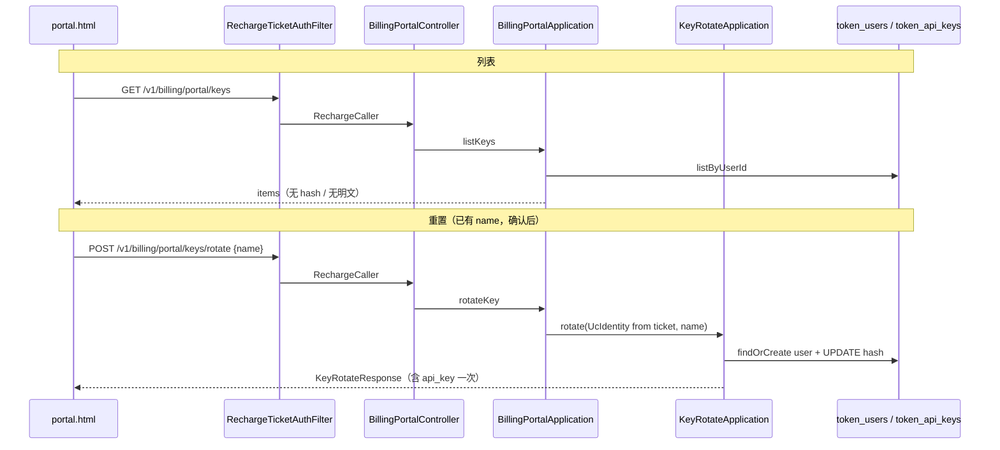

# US-G4-08 面板 API Token 管理设计

> **用户故事**：[../02-用户故事.md](../02-用户故事.md) · US-G4-08  
> **状态**：编码已落地（单测覆盖列表剥 hash / 身份桥接 / 委托 rotate；联调需 ticket + pepper）  
> **范围**：用户面板「API Token」区：按 ticket 鉴权列出本账户 Key **元信息**；按 `name` 签发/重置（语义对齐 [US-G0-06](./US-G0-06-按名签发重置Key设计.md)）；新明文**仅一次**展示。  
> **需求映射**：[../14-用户面板执行计划.md](../14-用户面板执行计划.md) C3；[US-G4-00](./US-G4-00-用户面板总览设计.md) Q7 / O5 / O6；可覆盖 US-G0-18「列 Key」主路径（ticket）；[../01-需求.md](../01-需求.md) FR-AUTH 相关  
> **依赖**：US-G4-01（页壳 + `RechargeTicketAuthFilter` 已覆盖 `/v1/billing/portal/**`）；US-G0-06（`KeyRotateApplication` / hash / pepper / name 规则）  
> **不做**：页内 UC JWT；`GET /v1/keys` JWT 版（G0-18 仍可选独立落地）；单独「停用」不换新；跨用户 / 管理端；日志打印明文或 pepper；无限批量签发  
> **文档位置**：`token-gateway/docs/design/`

---

## 0. 边界

| 已有 | 本故事 |
|------|--------|
| `POST /v1/keys/rotate` + UC JWT + `KeyRotateApplication` | 面板提供 **ticket 鉴权** 等价写路径；**领域逻辑委托**既有 Application，不复制生成/哈希代码 |
| `token_api_keys` + `idx_token_api_keys_user_status (user_id, status)` | 列表查询；新增 `listByUserId` |
| G4-00：列表无明文/无 hash；明文仅弹层一次 | **确认采纳** |
| G4-00 O5 / O6 | 已有 name + 可新建约定 name；**不做**单独停用 |
| US-G0-18 `GET /v1/keys`（可选） | **本期不实现 JWT 列表**；面板 `GET …/portal/keys` 满足列 Key 主路径 |
| 面板 HTML「API Token」占位 | 本故事补 list + rotate UI |

---

## 1. 已确认选型

| 项 | 决定 |
|----|------|
| **Q1 列表路径** | `GET /v1/billing/portal/keys` |
| **Q2 重置路径** | `POST /v1/billing/portal/keys/rotate` |
| **Q3 鉴权** | 与其它 portal API 相同：Cookie / Bearer `rt_`；`401 invalid_recharge_ticket`。**不**要求页内 UC JWT |
| **Q4 写路径复用** | Controller → `BillingPortalApplication.rotateKey(caller, name)` → 构造 `UcIdentity` → **`KeyRotateApplication.rotate(identity, name)`**；成功体 **复用 `KeyRotateResponse`**（字段与 G0-06 一致，含一次 `api_key`） |
| **Q5 name 规则** | 完全复用 `KeyNameRules`：trim → lower-case → `[a-z0-9._-]{1,64}`；非法 `400 invalid_name` |
| **Q6 列表字段** | `name`、`key_prefix`、`status`、`created_at`、`updated_at`、`last_used_at`；**永不**回 `id` / `key_hash` / 明文 |
| **Q7 无账户** | 列表：`200` + `items: []`（不自动建户）。rotate：委托 G0-06，**可自动建** `token_users`（余额 0）后签发 |
| **Q8 作用域** | 仅 ticket 对应 `(tenant_id, user_code)` / `user_id`；禁止按 tenant 扫全表 |
| **Q9 排序** | `name` 升序（稳定、易找） |
| **Q10 分页** | **不分页**（每用户 name 数量预期很少） |
| **Q11 单独停用** | **不做**；重置即旧 sk 失效；Key 行 `disabled` 仍允许 rotate 并置回 `active`（同 G0-06） |
| **Q12 账户 disabled** | rotate → **403 `account_disabled`**（同 G0-06） |
| **Q13 UI** | 列表懒加载；**每行「重置」**；重置前二次确认；成功 Modal 展示明文 + 复制；**本期不提供面板新增** |
| **Q15 面板 rotate 范围** | 仅当该 `name` **已存在** 时允许；否则 `404 key_not_found`（新增仍走桌面 JWT `POST /v1/keys/rotate`） |
| **Q14 审计日志** | 复用 `KeyRotateApplication` 现有 info（`userId`/`name`/`keyId`/`action`）；**禁止**打 `api_key` / pepper / hash |

---

## 2. 目标与非目标

### 2.1 目标

1. 用户在面板看到本账户全部 Key 的可辨识元信息（name / 前缀 / 状态 / 时间）。  
2. 凭短时 ticket 可**重置已有** name，拿到一次明文 `sk-…`；**本期不在面板新增** name。  
3. 旧 Key 立即失效；与桌面 JWT rotate **同一套**生成与落库语义。  
4. 明文与 hash 不对列表、不对日志泄露。

### 2.2 非目标

| 不做 | 说明 |
|------|------|
| `GET /v1/keys`（JWT） | G0-18 可选；本故事不阻塞 |
| 仅停用不换新 | G4-00 O6 |
| 编辑 name / 删除行 | 重置不删行（G0-06）；删除另开 |
| 展示完整历史明文 | 不可能；库无明文 |
| 用 sk 调本接口 | 必须 `rt_` ticket |
| 面板新增 name | **本期不做**；请用客户端 JWT rotate；空态引导回客户端 |

---

## 3. 身份桥接

`KeyRotateApplication` 入参为 `UcIdentity(tenantId, userCode, subject, clientId)`。

面板侧从 `RechargeCaller` 构造：

```text
UcIdentity(
  tenantId = caller.tenantId,
  userCode = caller.userCode,
  subject  = caller.userCode,          // ticket 无 UC sub；用 user_code 占位即可
  clientId = "billing-portal"          // 与真 UC client 区分，便于日志辨认来源
)
```

- **不**经 `UcIdentityResolver`（无 JWT）。  
- 列表优先 `caller.userId` → `token_users.id`；否则 `(tenant_id, user_code)` 查户（与 `BillingPortalApplication` 其它只读一致）。  
- rotate **始终**走 `KeyRotateApplication` 的 findOrCreate，与 JWT 路径行为一致（含并发重试）。

---

## 4. 字段白名单

### 4.1 列表项 `BillingPortalKeyItem`

| JSON 字段 | 来源列 | 说明 |
|-----------|--------|------|
| `name` | `name` | 已规范化小写 |
| `key_prefix` | `key_prefix` | 明文前 10 字符；列表辨认用 |
| `status` | `status` | `active` \| `disabled` |
| `created_at` | `created_at` | ISO-8601 `Z` |
| `updated_at` | `updated_at` | 最近重置/更新；页内可标「最近更新」 |
| `last_used_at` | `last_used_at` | 可 null；有则展示 |

### 4.2 明确禁止回传（列表）

`id`、`user_id`、`key_hash`、完整 `api_key` / `sk-…`。

### 4.3 Rotate 成功响应

**直接返回**既有 `KeyRotateResponse`：

| 字段 | 说明 |
|------|------|
| `action` | `created` \| `rotated` |
| `name` | 规范化后的 name |
| `api_key` | **明文**；仅此响应 |
| `prefix` | 与库 `key_prefix` 一致（G0-06 字段名保持 `prefix`，不在本接口改名） |
| `status` | 通常 `active` |
| `user` | `tenant_id` / `user_code` / `balance_li` / `status`（与 G0-06 一致；面板可选用以刷新余额展示） |

列表用 `key_prefix`、rotate 响应用 `prefix`：历史兼容 G0-06；页内两处各自读取即可。

### 4.4 页内 status 文案

| 值 | 文案 |
|----|------|
| `active` | 可用 |
| `disabled` | 已停用 |

---

## 5. API

### 5.1 列表

```http
GET /v1/billing/portal/keys
Cookie: tg_recharge_ticket=rt_…
Accept: application/json
```

**200**

```json
{
  "items": [
    {
      "name": "ftcs-desktop",
      "key_prefix": "sk-Ab12CdEf",
      "status": "active",
      "created_at": "2026-07-01T02:00:00Z",
      "updated_at": "2026-08-01T10:00:00Z",
      "last_used_at": "2026-08-06T08:00:00Z"
    }
  ]
}
```

无账户或无 Key → `items: []`。

### 5.2 签发 / 重置

```http
POST /v1/billing/portal/keys/rotate
Cookie: tg_recharge_ticket=rt_…
Content-Type: application/json
Accept: application/json

{ "name": "ftcs-desktop" }
```

- Body DTO：**复用** `KeyRotateRequest`（仅 `name`），避免两套校验。  
- 成功 **200**：`KeyRotateResponse`（见 §4.3）。

### 5.3 错误

| HTTP | reason | 场景 |
|------|--------|------|
| 401 | `invalid_recharge_ticket` | 无/坏/过期 ticket |
| 400 | `invalid_name` | name 缺失或非法 |
| 403 | `account_disabled` | 账户禁用 |
| 404 | `key_not_found` | 面板重置时 name 不存在（不开放新增） |
| 500 | `missing_gateway_key_pepper` | 未配置 pepper |

Filter 已匹配 `/v1/billing/portal/**`，**含 POST**；无需改 path 规则。须确认 RS `protected-patterns` **不**误拦 portal（portal 由自有 Filter 鉴权；与既有 `/v1/billing/portal/me` 等相同运维约定）。

---

## 6. 实现要点

### 6.1 Db

`TokenApiKeyDbService.listByUserId(long userId)`：

```text
WHERE user_id = ? ORDER BY name ASC
```

返回全行 PO；Application 映射时剥除 `key_hash`。

### 6.2 Application

`BillingPortalApplication`：

1. **`listKeys(RechargeCaller)`**  
   - 解析 `userId`；无户 → 空列表。  
   - `listByUserId` → `toKeyItem`。  

2. **`rotateKey(RechargeCaller, String rawName)`**  
   - 规范化 name；查本用户是否已有该 Key；**无则 404 `key_not_found`**。  
   - `identity = toUcIdentity(caller)`（§3）。  
   - `return keyRotateApplication.rotate(identity, name)`。  

注入：`TokenApiKeyDbService`、`KeyRotateApplication`。

### 6.3 Controller

```text
GET  /v1/billing/portal/keys
POST /v1/billing/portal/keys/rotate
```

扩展 `BillingPortalController`；`requireCaller` 同其它接口；rotate 接收 `@RequestBody KeyRotateRequest`。

### 6.4 不改动（刻意）

- `KeysRotateController` / G0-06 JWT 路径保持独立。  
- 哈希、生成、事务重试逻辑仍只在 `KeyRotateApplication`。  
- 表结构不变。

---

## 7. 面板 UI（API Token Tab）

1. 切到「API Token」→ 懒加载 `GET …/keys`。  
2. **列表行**：`name` 突出；`key_prefix`；状态文案；时间；行内 **「重置」** 按钮。  
3. **空态**：「尚无 API Token；请先在客户端签发后再回此页重置。」（**无**名称输入框）  
4. **二次确认**：点重置 → Modal：「将使旧 Key 立即失效，是否继续？」确认后再 `POST`。  
5. **成功 Modal**：展示完整 `api_key` +「复制」；提示「关闭后无法再查看明文」。关闭后刷新列表（新 `key_prefix`）。  
6. **401** → NeedClient。  
7. 视觉：延续 portal 行列表；成功 Modal 可复用退费 Modal 样式骨架。  
8. 前端 **禁止**把 `api_key` 写入 `localStorage` / 长久变量；复制后仅留在剪贴板。

---

## 8. 时序



---

## 9. 文件清单（编码时）

| 层 | 变更 |
|----|------|
| Db | `TokenApiKeyDbService.listByUserId` |
| DTO | `BillingPortalKeysResponse` / `BillingPortalKeyItem`；rotate 复用 `KeyRotateRequest` / `KeyRotateResponse` |
| Application | `listKeys` / `rotateKey` / `toUcIdentity` / `toKeyItem`；注入 `KeyRotateApplication` |
| Controller | `GET …/keys`、`POST …/keys/rotate` |
| 单测 | 列表剥 hash；无户空列表；`toUcIdentity` 字段；委托 rotate（mock `KeyRotateApplication`） |
| UI | `portal.html` keys Tab：列表 + 确认 + 明文 Modal |
| 文档 | 本文状态 → 编码已落地；`02` 挂落地说明 |

---

## 10. 验收对照

| ID | 步骤 | 期望 |
|----|------|------|
| A1 | 有效 ticket 调 `GET …/keys` | 200；仅元信息；无 `key_hash` / 无完整 sk |
| A2 | 新 name rotate | `action=created`；明文一次；列表出现该 name |
| A3 | 同 name 再 rotate（确认后） | `action=rotated`；旧 sk 调 chat **401/失败**；新 sk 可用 |
| A4 | 非法 name | 400 `invalid_name` |
| A5 | 账户 disabled | 403 `account_disabled` |
| A6 | 无效 ticket | 401 |
| A7 | 页内关闭明文 Modal 后再找 | 无法再显示完整 sk；列表仅 prefix |
| A8 | 执行计划 A9 / A10 | 列表可见元信息；重置确认与一次明文 |
| A9 | 与 JWT `POST /v1/keys/rotate` | 同 name 互斥同一行；任一路重置均使对方旧明文失效 |

---

## 11. 编码顺序建议

1. Db `listByUserId` + 列表 DTO / `listKeys` + 单测。  
2. `rotateKey` 桥接 + Controller POST。  
3. `portal.html`：列表 → 确认 → 明文 Modal → 刷新。  
4. 联调：ticket 签发 → 复制 sk → `Authorization: Bearer sk-…` 调 chat / models。

---

## 12. 开放问题（本详设默认）

| # | 问题 | 默认 |
|---|------|------|
| O1 | rotate 是否另造 portal 专用响应 DTO | **否**；复用 `KeyRotateResponse` |
| O2 | 列表是否返回 `id` | **否** |
| O3 | 是否实现 JWT `GET /v1/keys` | **否**（G0-18 另做） |
| O4 | 重置是否强制二次确认 | **是** |
| O5 | `subject` / `clientId` 占位值 | `userCode` / `"billing-portal"` |
| O6 | 是否对 portal rotate 加独立限流 | **本期不做** |
| O7 | 面板是否支持新增 name | **否（本期）**；仅行内重置；API 对未知 name 返回 `key_not_found` |

若产品要求「禁用 Key 禁止 rotate」，须同步修订 G0-06，本故事不单方分叉。
