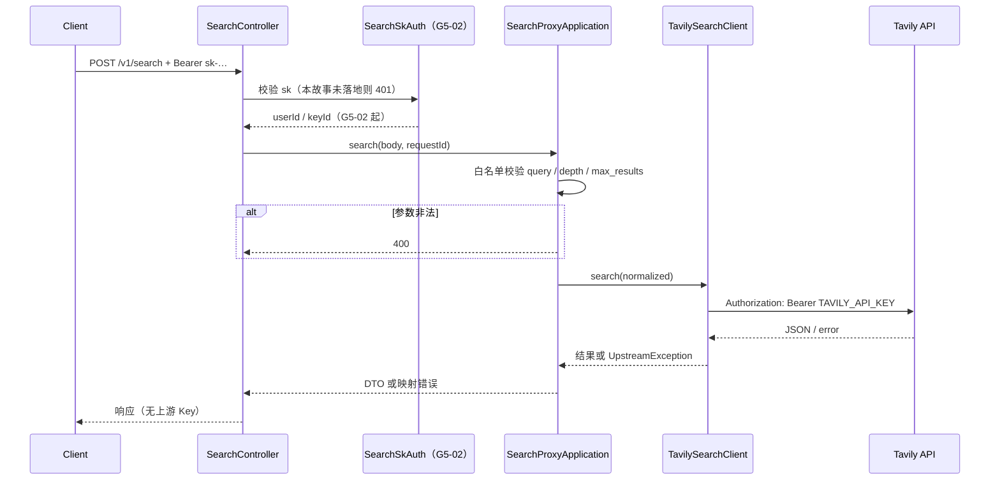

# US-G5-01 Tavily 搜索代理设计

> **用户故事**：[../02-用户故事.md](../02-用户故事.md) · US-G5-01  
> **状态**：编码已落地（单测 Mock 上游 + 参数白名单 + 鉴权占位 401；真 sk 联调随 G5-02）  
> **范围**：`POST /v1/search` → 参数白名单校验 → 转发 Tavily Search → 稳定 JSON 响应 / 错误映射；**不含** sk 鉴权实现、余额预检、按次落账与结算  
> **需求映射**：[../01-需求.md](../01-需求.md) FR-SEARCH-01/05；[US-G5-00](./US-G5-00-搜索中转计费总览设计.md)；执行计划 [../15-Tavily搜索中转计费执行计划.md](../15-Tavily搜索中转计费执行计划.md) C1  
> **依赖**：US-G0-01（骨架、配置、RestClient 模式）  
> **后续衔接**：US-G5-02（sk + 预检）；US-G5-03（摘要落库 + 按次结算）；宿主 MCP 改打网关（docs/15）  
> **文档位置**：`token-gateway/docs/design/`

---

## 0. 相对故事原文的澄清

| 故事原文 / 执行计划措辞 | 本设计约定 |
|-------------------------|------------|
| 「先可无测试 sk 打通转发」 | **取消免鉴权打通**。对齐 [US-G0-03](./US-G0-03-DeepSeek非流式白名单代理设计.md)：不提供 skip-auth / 测试 Key 直通；编码期以 **Mock 上游单测** 验收代理；真 sk + 真上游联调随 **US-G5-02+** |
| 验收含「转发 Tavily」 | 单测 Mock 覆盖出站拼装与响应映射；环境具备 Key 时可手工联调，**不**作为本故事出门必要条件 |
| 鉴权 | 正式契约为网关 `sk-`；**实现归属 US-G5-02**（详设：[US-G5-02](./US-G5-02-搜索鉴权与余额预检设计.md)）。本故事入口在 G5-02 前对未鉴权调用 **统一 401**（见 §4.4；落地后由 G5-02 替换） |
| 计费 / 摘要落库 | **不做**（US-G5-03） |
| 桌面过滤（排除 Google/YouTube 等） | **仍在 MCP** `mapTavilyResults`；网关返回接近上游的 `results[]`，不做宿主业务过滤 |

---

## 1. 已确认选型

| 项 | 决定 |
|----|------|
| **Q1 路径** | `POST /v1/search`（与 Chat 同属 `/v1` + sk 体系） |
| **Q2 上游** | 固定 `POST {baseUrl}/search`；默认 `baseUrl=https://api.tavily.com`；Key = `TAVILY_API_KEY` 仅服务端 |
| **Q3 上游鉴权** | 出站 `Authorization: Bearer {TAVILY_API_KEY}`；**不**在 body 放 `api_key`（避免日志/代理中间件误记） |
| **Q4 请求语义** | **网关自有契约**（白名单字段）；**非**透传任意 Tavily 字段（防 advanced / answer / raw 抬高成本） |
| **Q5 search_depth** | 本期 **仅** `basic`（缺省）；显式其他值 → **400** `search_depth_not_allowed`（冻结 O1） |
| **Q6 max_results** | 整数 **1～10**，缺省 **5**（对齐现 MCP `num_results`；**严于** Tavily 上限 20） |
| **Q7 query** | 必填；trim 后非空；长度 **≤ 400**（对齐 Tavily 建议上限） |
| **Q8 响应** | 网关稳定 DTO（§4.2）；**不**原样透传上游多余字段（answer / images / raw_content 等） |
| **Q9 鉴权** | 本故事 **不实现**；占位 **401**（§4.4）；无绕过配置 |
| **Q10 计费钩子** | 本故事 **不写** `token_request_logs`；Application 预留清晰调用点供 G5-03 |
| **Q11 HTTP 客户端** | Spring **`RestClient`**（同步） |
| **Q12 可观测** | 复用 `requestId` / AccessLog；**禁止** INFO 打 query 全文、结果正文、上游 Key |

---

## 2. 目标与非目标

### 2.1 目标

1. 客户端（最终以 sk）可用稳定 JSON 契约完成一次 Tavily basic 搜索。  
2. 非法参数在出站前拒绝（400），不消耗上游额度。  
3. 上游 Key 仅出站 Authorization 使用，永不进入对客户端响应或日志。  
4. 为 G5-02/03 留出挂载点（鉴权过滤器、余额预检、计量落库）。  
5. 响应形状便于宿主 MCP：`results[].title/url/content` 可直接喂现有 `mapTavilyResults`。

### 2.2 非目标

| 不做 | 归属 |
|------|------|
| sk 校验、账户/Key 禁用、402 预检 | US-G5-02 |
| 临时测试 Key / 跳过鉴权开关 | **明确不做** |
| 按次价目、`token_request_logs`、异步结算 | US-G5-03 |
| 面板价格展示 | US-G5-04 |
| `search_depth=advanced` / 分档计价 | 本期拒绝；后续另开故事 |
| `include_answer` / `include_raw_content` / crawl / extract | Out of Scope |
| 网关侧结果缓存 | 本期不做（桌面本地缓存见宿主 docs/15） |
| 排除域名 / 宿主业务过滤 | MCP 侧保持 |
| 桌面设置 / MCP 改造 | 宿主分册 |

---

## 3. 流程



本故事编码时：`Auth` 为 **拒绝未实现鉴权** 的占位（401）；`App`/`TV` 用单测覆盖。

---

## 4. API 契约

### 4.1 请求

```http
POST /v1/search HTTP/1.1
Authorization: Bearer sk-xxxxxxxx
Content-Type: application/json

{
  "query": "German industrial valve distributors",
  "max_results": 5,
  "search_depth": "basic",
  "language": "en"
}
```

| 字段 | 类型 | 规则 |
|------|------|------|
| `query` | string | **必填**；trim 后非空；长度 1～400；超长 → 400 `query_too_long`；缺失/空 → 400 `query_required` |
| `max_results` | int | 可选，默认 `5`；须 ∈ [1, 10]；否则 400 `max_results_invalid` |
| `search_depth` | string | 可选，默认 `"basic"`；**仅**允许 `"basic"`；其他 → 400 `search_depth_not_allowed` |
| `language` | string | 可选；仅 **回显** 给客户端（便于 MCP 缓存键）；**不**转发上游；长度建议 ≤ 16，超长 → 400 `language_invalid` |
| 其他字段 | — | **拒绝**（400 `field_not_allowed`），含但不限于：`include_answer`、`include_raw_content`、`include_images`、`topic`、`auto_parameters`、`api_key`、`num_results` |

> **`num_results`**：网关契约统一为 `max_results`。宿主 MCP 映射时自行把工具参数 `num_results` → `max_results`，**不要**在网关做双名兼容（避免契约分叉）。

`Authorization`：契约为网关 sk；**G5-02 前占位：无有效鉴权实现 → 401**（§4.4）。

`/v1/search` **不要**加入 UC JWT `protected-patterns`（与 Chat 相同：sk，不是 UC token）。

### 4.2 成功响应

```http
HTTP/1.1 200 OK
Content-Type: application/json
X-Request-Id: …

{
  "query": "German industrial valve distributors",
  "language": "en",
  "search_depth": "basic",
  "max_results": 5,
  "results": [
    {
      "title": "…",
      "url": "https://example.com/…",
      "content": "…",
      "score": 0.87
    }
  ]
}
```

| 字段 | 说明 |
|------|------|
| `query` | 回显客户端 trim 后的 query（**响应可含全文**；**日志/落库禁止**，G5-03 只落摘要） |
| `language` | 请求未传则省略或 `null`（编码二选一，推荐省略） |
| `search_depth` | 实际使用值（本期恒 `basic`） |
| `max_results` | 实际请求上限 |
| `results` | 数组；元素来自上游 `results[]` 投影 |
| `results[].title` | 字符串；缺省用 url 或 `""` |
| `results[].url` | 字符串 |
| `results[].content` | 对应上游 `content`（MCP 再映射为 `snippet`） |
| `results[].score` | 上游有则透传 number；无则省略 |

**明确不返回**：上游 `answer`、`images`、`raw_content`、`response_time`（可选后续作摘要）、任何计费内部字段、上游 Key。

空结果：仍 **200** + `results: []`（不算参数错误；是否计费由 G5-03 定义「上游成功即计次」——建议成功 HTTP + 可解析 body 即计次，与结果条数无关）。

### 4.3 本故事错误

| HTTP | `reason` / 码 | 场景 |
|------|---------------|------|
| 401 | `unauthorized` / `sk_auth_pending` | 鉴权未通过（G5-02 前一律，见 §4.4） |
| 400 | `invalid_json` | Body 非 JSON / 非 object |
| 400 | `query_required` | 缺 query / 空白 |
| 400 | `query_too_long` | 长度 > 400 |
| 400 | `max_results_invalid` | 非整数或不在 1～10 |
| 400 | `search_depth_not_allowed` | 非 `basic` |
| 400 | `language_invalid` | language 非法 |
| 400 | `field_not_allowed` | 出现未开放字段 |
| 503 | `upstream_not_configured` | 未配置 `TAVILY_API_KEY` |
| 502 | `upstream_error` | 上游 4xx/5xx（见 §6；上游 401 **不得**对客户端回 401） |
| 504 | `upstream_timeout` | 读/连超时 |
| 502 | `upstream_unreachable` | 连接失败 |
| 502 | `upstream_invalid_response` | 响应非预期 JSON |

错误体风格与现网一致：`ResponseStatusException` → 短 `reason`（见 `RestExceptionHandler`）。

### 4.4 鉴权占位（无绕过）— **已被 US-G5-02 替换**

> 编码现状：`SearchController` 已挂 `ChatAuthFacade` + `BalanceGuard`；`PendingSearchAuthFacade` / `sk_auth_pending` **已删除**。下文仅保留历史说明。

| 项 | 约定（G5-01 时期） |
|----|------|
| 目的 | 避免「代理已合并、sk 未上」时匿名消耗上游 Tavily 额度 |
| 行为 | G5-02 落地前，`/v1/search` **固定 401** |
| 禁止 | 环境变量/配置打开「免鉴权」「测试 Key 直通」 |
| 开发验证 | **Mock 上游的单测** 覆盖代理链路；真上游 + 真 sk **统一联调**（G5-02+） |
| G5-02 | 替换占位为：与 Chat 同源 sk 解析 → 余额预检 → 再调 `SearchProxyApplication` |

---

## 5. 出站请求拼装

### 5.1 配置

```yaml
token-gateway:
  upstream:
    tavily:
      api-key: ${TAVILY_API_KEY:}
      base-url: ${TAVILY_BASE_URL:https://api.tavily.com}
      connect-timeout: 5s
      read-timeout: 60s
```

| 说明 | |
|------|--|
| 缺 Key | 不出站，503 `upstream_not_configured` |
| base-url | 去尾 `/` 后拼 `/search` |
| 超时 | 搜索通常短于推理；默认读超时 60s 足够 |

挂入现有 `TokenGatewayProperties`（或并列 `TavilyUpstreamProperties`），编码时与 DeepSeek 配置风格一致。

### 5.2 Body（仅网关构造）

```json
{
  "query": "<trimmed>",
  "search_depth": "basic",
  "max_results": <1-10>,
  "include_answer": false,
  "include_raw_content": false
}
```

| 强制 | 说明 |
|------|------|
| `include_answer=false` | 降低成本与响应体积 |
| `include_raw_content=false` | 隐私与体积；与「只落摘要」产品方向一致 |
| 不传 `auto_parameters` | 防止上游自动升为 advanced |

### 5.3 Header

```http
Authorization: Bearer <TAVILY_API_KEY>
Content-Type: application/json
```

---

## 6. 上游错误映射

| 上游情况 | 对客户端 |
|----------|----------|
| 400 / 422 等参数类 | 502 `upstream_error`（客户端已过网关校验；视为上游异常，避免双语义） |
| 401 / 403（Key 无效或欠费） | **502** `upstream_error`（**禁止**回 401，以免与网关 sk 混淆） |
| 429 | 502 `upstream_error`（message 可短码；不把上游 body 原文回传） |
| 5xx | 502 `upstream_error` |
| 超时 | 504 `upstream_timeout` |
| 连接失败 | 502 `upstream_unreachable` |
| 非 JSON / 缺 `results` 数组 | 502 `upstream_invalid_response` |

**绝对禁止**：把 `TAVILY_API_KEY`、完整上游请求头、上游错误原文（可能含账户信息）写进响应或 INFO 日志。DEBUG 可记上游 status + 截断摘要（无 Key）。

---

## 7. 隐私与日志（本故事即生效）

| 允许 | 禁止 |
|------|------|
| `requestId`、latency、上游 HTTP status、`results.size`、`max_results`、`search_depth` | query 全文、任一 result 的 title/url/content、上游 Key |
| AccessLog 路径/状态码 | 把 request body 整包打 INFO |

G5-03 落库时只落摘要；本故事虽不落库，日志口径提前对齐，避免联调期泄露。

---

## 8. 包与类清单（编码）

| 类 | 包 | 职责 |
|----|----|------|
| `SearchController` | `…server.api` | `POST /v1/search` |
| `SearchProxyApplication` | `…server.application` | 校验白名单 → 调客户端 → 映射 DTO / 错误 |
| `TavilySearchClient` | `…server.upstream` | RestClient 出站 |
| `SearchAuthFacade`（占位） | `…server.security` | G5-01：恒 401；G5-02：挂真实 sk + 预检 |
| `SearchRequest` / `SearchResponse`（可选 record/DTO） | `…server.api` 或 `application` | 契约对象；亦可用 `JsonNode` + 手写校验（与 Chat 风格二选一，推荐显式 DTO） |

过滤器 / Security：将 `/v1/search` 与 `/v1/chat/completions` 同等对待（sk 路径，非 UC）。

---

## 9. 单测计划

| ID | 用例 | 期望 |
|----|------|------|
| T1 | 合法 body + Mock 上游 200 | 200；DTO 字段正确；出站 body 含 `include_answer=false` |
| T2 | 缺 query / 空 query | 400 `query_required`；**不出站** |
| T3 | query 401 字符 | 400 `query_too_long`；不出站 |
| T4 | `max_results=0` / `11` / 小数 | 400 `max_results_invalid` |
| T5 | `search_depth=advanced` | 400 `search_depth_not_allowed` |
| T6 | 传入 `include_answer` / `num_results` / `api_key` | 400 `field_not_allowed` |
| T7 | 未配置 Key | 503 `upstream_not_configured` |
| T8 | Mock 上游 401 | 客户端 502 `upstream_error`（非 401） |
| T9 | Mock 超时 | 504 `upstream_timeout` |
| T10 | 无 Bearer / 鉴权占位 | 401；不出站 |
| T11 | 上游返回多余 `answer` | 响应中 **无** `answer` 字段 |
| T12 | 日志断言（可选） | 捕获 appender：无 query 明文、无 Key |

---

## 10. 验收对照

| 故事验收 | 本设计落实 |
|----------|------------|
| `POST /v1/search` 转发 Tavily | §4～§5；单测 Mock |
| 参数白名单 | §4.1 / §5.2 |
| 不回传上游 Key | §4.2 / §6 / §7 |
| 上游错误可理解映射 | §4.3 / §6 |
| （隐含）不匿名打上游 | §4.4 占位 401 |

联调切片（G5-02+）：有效 sk → 真搜索 → 200；见执行计划阶段 E。

---

## 11. 实现顺序建议

1. 配置项 + `TavilySearchClient`（Mock 单测）  
2. `SearchProxyApplication` 校验与 DTO 映射  
3. `SearchController` + 鉴权占位 401  
4. 与 Security / AccessLog 路径对齐  
5. （本故事结束）→ US-G5-02 换真鉴权与预检  

---

## 12. 开放问题（本详设已冻结默认）

| # | 问题 | 冻结 |
|---|------|------|
| D1 | advanced 是否放行 | **否**（400） |
| D2 | 是否透传任意 Tavily 字段 | **否**（白名单） |
| D3 | 网关是否做 URL 排除过滤 | **否**（MCP） |
| D4 | `num_results` 别名 | **不做**；宿主映射 |
| D5 | 空 results 是否 200 | **是** |
| D6 | 免鉴权联调开关 | **不做** |

若评审推翻 D1/D2，须同步改 US-G5-03 计价与 COGS。
