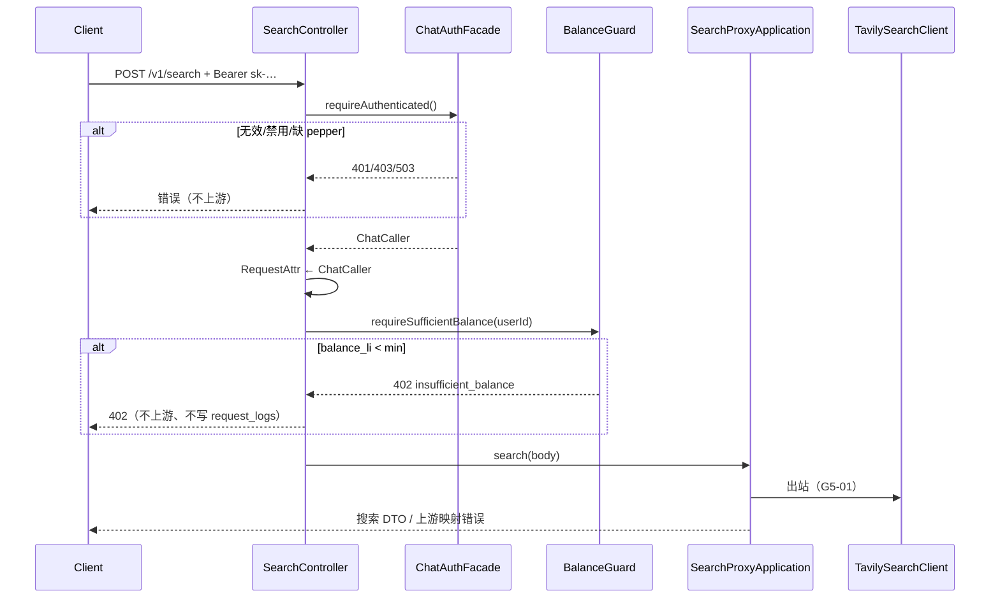

# US-G5-02 搜索鉴权与余额预检设计

> **用户故事**：[../02-用户故事.md](../02-用户故事.md) · US-G5-02  
> **状态**：编码已落地（SearchController 挂 ChatAuthFacade + BalanceGuard；占位已删；单测 T1–T4）  
> **范围**：`POST /v1/search` 挂载与 Chat **同源**的网关 `sk-` 鉴权与余额预检；替换 G5-01 占位 401；不足则 **402** 且**不调上游**  
> **需求映射**：[../01-需求.md](../01-需求.md) FR-SEARCH-02；[US-G5-00](./US-G5-00-搜索中转计费总览设计.md)；[US-G5-01](./US-G5-01-Tavily搜索代理设计.md) §4.4；执行计划 [../15-Tavily搜索中转计费执行计划.md](../15-Tavily搜索中转计费执行计划.md) C2  
> **依赖**：US-G5-01（`SearchController` / `SearchProxyApplication`）；US-G0-08（`ChatAuthFacade` / `GatewaySkAuthFacade` / `ChatCaller`）；US-G0-11（`BalanceGuard`）  
> **后续衔接**：US-G5-03（按次计量落库，可读 `ChatCaller`）；真 sk + 真 Tavily 联调  
> **文档位置**：`token-gateway/docs/design/`

---

## 0. 相对 G5-01 占位的变更

| G5-01 现状 | 本故事 |
|------------|--------|
| `PendingSearchAuthFacade` 恒 401 `sk_auth_pending` | **删除**；不再保留搜索专用鉴权实现 |
| `SearchAuthFacade` 接口（`void requireAuthenticated()`） | **删除**；Controller 直接复用 `ChatAuthFacade`（与 Chat 入口同构） |
| 无余额预检 | 挂 `BalanceGuard.requireSufficientBalance(userId)` |
| 无 `ChatCaller` | 鉴权成功写入 `ChatCaller.REQUEST_ATTR`，供 G5-03 计量使用 |
| 免鉴权 / 测试 Key | **仍禁止** |

---

## 1. 已确认选型

| 项 | 决定 |
|----|------|
| **Q1 鉴权实现** | **复用** `ChatAuthFacade` → `GatewaySkAuthFacade`；**不**复制一套 Search 专用 hasher/查库逻辑 |
| **Q2 凭证** | `Authorization: Bearer sk-…`；短码与 Chat **完全一致**（见 [US-G0-08](./US-G0-08-Chat使用sk鉴权设计.md) §4.2） |
| **Q3 上下文** | 返回并注入 `ChatCaller`（`userId` / `keyId` / `keyName` / `tenantId` / `userCode`） |
| **Q4 传递** | `RequestAttributes` + `ChatCaller.REQUEST_ATTR`（与 `ChatCompletionsController` 相同） |
| **Q5 余额预检** | **复用** `BalanceGuard`；条件 `balance_li >= min-balance-li`（默认 1） |
| **Q6 HTTP 402** | 短码 `insufficient_balance`；错误体 **不**回传 `balance_li` |
| **Q7 顺序** | **Auth → BalanceGuard → SearchProxyApplication.search** |
| **Q8 拒绝时上游** | 鉴权失败 / 402：**禁止**进入 `SearchProxyApplication`（从而不出站 Tavily） |
| **Q9 拒绝时计量** | **不写** `token_request_logs`（与 G0-11 一致；计量属 G5-03，且仅代理路径） |
| **Q10 按次单价预检** | **本期不做**「余额 ≥ 一次搜索价」估算（依赖 G5-03 价目编码）；先与 Chat 同闸门。G5-03 可再收紧（见 §12 O1） |
| **Q11 UC JWT** | `/v1/search` **不**加入 UC `protected-patterns`；JWT 当 Bearer → 按非 `sk-` → `401 invalid_api_key` |
| **Q12 日志** | 鉴权成功可打 `userId`/`keyId`/`keyName`（可沿用 Gateway 现有日志，或改为中性文案 `sk auth ok`）；**禁止** query 全文、明文 sk、Tavily Key |

---

## 2. 目标与非目标

### 2.1 目标

1. 合法官方通道 `sk-` 可调用已落地的搜索代理（在配置 `TAVILY_API_KEY` 时）。  
2. 无效 sk → 401；Key/账户禁用 → 403；与 Chat 短码一致。  
3. `balance_li < min-balance-li` → 402，**不**调 Tavily。  
4. 去掉 `sk_auth_pending`，使「rotate → search」具备统一联调条件。  
5. 为 G5-03 提供与 Chat 相同的 `ChatCaller` 注入点。

### 2.2 非目标

| 不做 | 归属 |
|------|------|
| 按次落库 / 异步结算 / 价目种子 | US-G5-03 |
| 面板搜索价格 | US-G5-04 |
| 改 `GatewaySkAuthFacade` / `BalanceGuard` 内部算法 | 保持 G0-08/11；搜索只挂载 |
| 按搜索单价动态抬高预检阈值 | 本期不做（§12 O1） |
| RPM / 日限额 | FR-RISK / 后续 |
| 桌面 MCP 改造 | 宿主 docs/15 |
| 免鉴权开关 | **禁止** |

---

## 3. 流程



与 Chat 对照：挂载点、短码、预检语义一致；仅下游从 ChatProxy 换成 SearchProxy。

---

## 4. API / 错误契约

### 4.1 请求（相对 G5-01 无变）

```http
POST /v1/search HTTP/1.1
Authorization: Bearer sk-xxxxxxxx
Content-Type: application/json

{ "query": "…", "max_results": 5 }
```

Body 校验仍在 `SearchProxyApplication`（仅预检通过后执行）。

### 4.2 鉴权错误（复用 G0-08）

| HTTP | reason | 场景 |
|------|--------|------|
| 401 | `missing_authorization` | 无 Authorization |
| 401 | `invalid_authorization` | 非 Bearer / 空 token |
| 401 | `invalid_api_key` | 非 `sk-` / hash 无行 / 孤儿用户 |
| 403 | `key_disabled` | Key disabled |
| 403 | `account_disabled` | User disabled |
| 503 | `missing_gateway_key_pepper` | pepper 未配 |

**废止**：`sk_auth_pending`（占位删除后不应再出现）。

### 4.3 余额错误（复用 G0-11）

| HTTP | reason | 场景 |
|------|--------|------|
| 402 | `insufficient_balance` | `balance_li < min-balance-li` |

配置：`token-gateway.billing.min-balance-li`（默认 `1`）。  
**禁止**在 402 响应中返回当前余额。

### 4.4 成功

进入 G5-01 代理；响应形态不变。鉴权/预检本身无额外响应字段。

### 4.5 与上游错误区分

| 场景 | HTTP | reason | 是否出站 |
|------|------|--------|----------|
| 网关 sk 无效 | 401 | `invalid_api_key` 等 | 否 |
| 余额不足 | 402 | `insufficient_balance` | 否 |
| Tavily Key 无效 | 502 | `upstream_error` | 是（已出站） |

---

## 5. Controller 改造（编码要点）

对齐 `ChatCompletionsController`：

```java
@PostMapping("/search")
public ResponseEntity<String> search(@RequestBody(required = false) JsonNode body) {
    ChatCaller caller = chatAuthFacade.requireAuthenticated();
    RequestAttributes attrs = RequestContextHolder.getRequestAttributes();
    if (attrs != null) {
        attrs.setAttribute(ChatCaller.REQUEST_ATTR, caller, RequestAttributes.SCOPE_REQUEST);
    }
    balanceGuard.requireSufficientBalance(caller.getUserId());
    return searchProxyApplication.search(body);
}
```

| 删除 | 说明 |
|------|------|
| `SearchAuthFacade` | 避免与 `ChatAuthFacade` 双门面 |
| `PendingSearchAuthFacade` | 占位完成使命 |
| `SearchControllerTest` 对 `sk_auth_pending` 的断言 | 改为 Mock `ChatAuthFacade` / `BalanceGuard` 的行为用例 |

`SearchProxyApplication`：**本故事可不改签名**（仍只收 body）；G5-03 再从 Request 读 `ChatCaller` 写日志。可选：本故事即把 `caller` 显式传入 `search(body, caller)`——**默认不改签名**，与 G0-08→G0-10 演进一致，减少无关 diff。

---

## 6. 类与 Bean 清单

| 类 | 动作 |
|----|------|
| `SearchController` | 注入 `ChatAuthFacade` + `BalanceGuard`；删 `SearchAuthFacade` |
| `ChatAuthFacade` / `GatewaySkAuthFacade` | **复用，不改** |
| `BalanceGuard` | **复用，不改** |
| `ChatCaller` | **复用**；写入 Request |
| `SearchAuthFacade` / `PendingSearchAuthFacade` | **删除** |
| `SearchProxyApplication` / `TavilySearchClient` | 本故事不改行为 |

Security：`/v1/search` 继续与 Chat 同属 sk 路径（非 UC JWT）。

---

## 7. 单测计划

| ID | 用例 | 期望 |
|----|------|------|
| T1 | Mock Auth 抛 401 `invalid_api_key` | Controller 传播 401；**从不**调 `SearchProxyApplication` |
| T2 | Mock Auth 抛 403 `key_disabled` / `account_disabled` | 403；不调 Proxy |
| T3 | Auth 成功 + BalanceGuard 抛 402 | 402；不调 Proxy |
| T4 | Auth 成功 + 余额通过 | 调用 `searchProxyApplication.search` 一次；Request 上有 `ChatCaller` |
| T5 | （可选集成）真实 `GatewaySkAuthFacade` + 内存/测试 DB | 无效 sk → 401（若环境允许；非出门必须） |

`SearchProxyApplicationTest` / `TavilySearchClientTest`：**保持**，不依赖鉴权。

删除或改写：`SearchControllerTest` 中「占位恒 401 `sk_auth_pending`」用例。

---

## 8. 验收对照

| 故事验收 | 本设计落实 |
|----------|------------|
| 无效 sk → 401 | §4.2 / Q1–Q2 |
| 禁用 → 403 | §4.2 |
| 余额不足 → 402 且不调上游 | §4.3 / Q7–Q8 / T3 |
| 与 Chat 对齐 | 同源 Facade + Guard + 短码 |

联调（本故事出门加强项，非单测必须）：

1. `keys/rotate` 得 sk → `POST /v1/search` 200（需 `TAVILY_API_KEY` + 余额 ≥ min）  
2. 余额置 0 → 402，Tavily 侧无新请求  
3. 错误 Bearer → 401  

---

## 9. 实现顺序建议

1. 改 `SearchController`：挂 `ChatAuthFacade` + `BalanceGuard` + 写 RequestAttr  
2. 删除 `SearchAuthFacade` / `PendingSearchAuthFacade`  
3. 重写 `SearchControllerTest`（T1–T4）  
4. 手工联调清单（可选）  
5. （本故事结束）→ US-G5-03 按次计量  

---

## 10. 安全与隐私

| 项 | 约定 |
|----|------|
| 明文 sk | 仅鉴权瞬时持有；不进日志 |
| query | 鉴权/预检阶段不解析 body（失败路径更不会落库） |
| Tavily Key | 预检失败路径不出站，零泄露面 |
| 余额探测 | 402 不回余额数值 |

---

## 11. 与执行计划「按次单价预检」的关系

执行计划曾写：「预检至少能覆盖 1 次搜索单价」。  

| 方案 | 说明 | 本故事 |
|------|------|--------|
| A | 继续用全局 `min-balance-li`（与 Chat 同） | **采用** |
| B | 读 `tavily.search` 有效价，要求 `balance_li >= 一次用户应收厘` | 依赖 G5-03 价目编码；**顺延 G5-03 或后续增强** |

采用 A 的原因：G5-02 出门不阻塞在价目编码争议上；且默认 `min-balance-li=1` 已挡住零/负余额。若一次搜索价 ≫ 1 厘，透支风险与 Chat 同属 OQ-07 接受范围，由结算后下一笔拒绝收敛。

---

## 12. 开放问题（本详设已冻结默认）

| # | 问题 | 冻结 |
|---|------|------|
| O1 | 是否按搜索单价抬高预检 | **否**（本故事）；G5-03 可再议 |
| O2 | 保留 `SearchAuthFacade` 包装层 | **否**；直接用 `ChatAuthFacade` |
| O3 | 本故事是否改 `SearchProxyApplication` 签名收 caller | **否**；G5-03 从 Request 读取 |
| O4 | Gateway 鉴权成功日志文案是否去 chat 字样 | **可选**；不阻塞功能（可另 PR 改成中性 `sk auth ok`） |

---

## 13. 文档同步（编码时）

- [x] `02-用户故事.md` US-G5-02 详设链接  
- [x] `15` 执行计划 C2 勾选  
- [x] [US-G5-01](./US-G5-01-Tavily搜索代理设计.md) §4.4 标注「已由 G5-02 替换占位」  
- [ ] 宿主 docs/15：失败码 401/402 与网关短码对照可链本文 §4（可选，桌面分册）  
