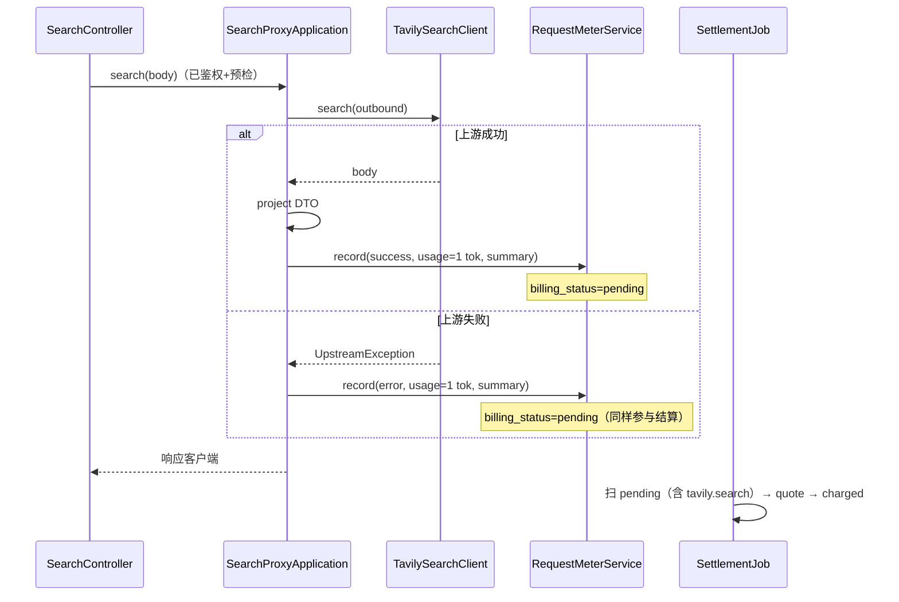

# US-G5-03 搜索按次计量与结算设计

> **用户故事**：[../02-用户故事.md](../02-用户故事.md) · US-G5-03  
> **状态**：编码已落地（方案 A 计量 + V1_0_5 种子；联调需结算 tick）  
> **范围**：搜索成功后写 `token_request_logs`（`model=tavily.search`，**只落摘要**）；价目种子与调价约定；**复用** G0-10 异步结算扣费；**请求内不算价、不扣费**  
> **需求映射**：[../01-需求.md](../01-需求.md) FR-SEARCH-03/04/06/07；FR-PRICE-07；OQ-07/08；[US-G5-00](./US-G5-00-搜索中转计费总览设计.md)；执行计划 [../15-Tavily搜索中转计费执行计划.md](../15-Tavily搜索中转计费执行计划.md) C3  
> **依赖**：US-G5-01/02；US-G0-09（`RequestMeterService` / `PricingService`）；US-G0-10（异步结算）  
> **后续衔接**：US-G5-04（面板「元/次」展示，依赖本故事价目语义）  
> **文档位置**：`token-gateway/docs/design/`

---

## 0. 边界

| 已有 | 本故事 |
|------|--------|
| G5-01/02：`POST /v1/search` + sk + 余额预检 | 代理成功/失败后**计量落库** |
| G0-09：`RequestMeterService.record`；`PricingCalculator` 两档公式 | **复用**落库与算价；搜索用约定编码「伪装」为 1 次用量 |
| G0-10：扫 `pending` → quote → 扣费 → `charged` | **不改**结算任务；搜索行自然进入同一管道 |
| G5-00 O4：按次编码 A/B 二选一 | **本故事冻结为 A**（见 §1） |

---

## 1. 已确认选型（含按次编码冻结）

| 项 | 决定 |
|----|------|
| **Q1 model** | 固定字符串 **`tavily.search`**（伪模型；**不**进 Chat 白名单 / `GET /v1/models`） |
| **Q2 按次编码** | **方案 A**：`prompt_tokens=1`，`completion_tokens=0`，`cached_tokens=0`，`uncached_tokens=1`；价目 `input_price_li_per_mTok` = **`li_per_call × 1_000_000`**；`output_price_li_per_mTok=0`；上游 COGS 同理写入 `upstream_input_cost_li_per_mTok`，其余上游档为 0 |
| **Q3 方案 B** | **不做**（不扩展 `li_per_call` 列、不改 `PricingCalculator` 分支） |
| **Q4 为何选 A** | 零 schema / 零结算改动；与现网 `revenue = round(prompt × P_in / 1e6)` 精确对齐「1 次 → li_per_call」 |
| **Q5 计费点** | 凡已进入出站/代理路径的调用（**成功或失败**）均落库并带按次 usage → `billing_status=pending`，参与异步结算；参数校验 4xx / 鉴权预检失败（未进代理）→ **不写**日志 |
| **Q6 请求内** | **禁止** `PricingService.quote` / 扣余额（OQ-07） |
| **Q7 落库 API** | 复用 `RequestMeterService.record(RequestMeterCommand)`；合成 usage JSON |
| **Q8 摘要** | 复用列 `error_summary` 存**搜索摘要**（成功也写）；**禁止** query / 结果 title/url/content |
| **Q9 种子** | 新 Flyway **`V1_0_5__seed_tavily_search_price.sql`**（**不**改已发 `V1_0_0` checksum） |
| **Q10 调价** | 运维 `INSERT` 新 `effective_from`；提供 `ops/insert_tavily_search_price_example.sql` |
| **Q11 ChatCaller** | 从 `RequestAttributes` / `ChatCaller.REQUEST_ATTR` 读取（G5-02 已注入） |
| **Q12 request_id** | 复用网关 `RequestIds` / MDC；与 Chat 一致 |
| **Q13 面板** | 消费列表自然出现 `tavily.search`；价格 Tab「元/次」属 **US-G5-04**（须按 §3 解码） |

### 1.1 方案 A 数学核对

```text
li_per_call     = 用户侧一次搜索应收（厘）
P_in_stored     = li_per_call * 1_000_000     // 写入 input_price_li_per_mTok
prompt_tokens   = 1
completion      = 0

revenue_li = round_half_up(1 * P_in_stored / 1_000_000) = li_per_call
```

COGS：

```text
cogs_li_per_call = 运维估算上游成本（厘/次）
C_in_stored      = cogs_li_per_call * 1_000_000
uncached_tokens  = 1
cogs_li          = round_half_up(1 * C_in_stored / 1_000_000) = cogs_li_per_call
```

**运维禁忌**：切勿把 DeepSeek「厘/百万 Token」的数量级直接填进 `tavily.search`；必须按「厘/次 × 1e6」编码。

---

## 2. 目标与非目标

### 2.1 目标

1. 每次计费成功的搜索落一条 `token_request_logs`，结算后扣官方余额。  
2. 日志可审计延迟/结果条数/depth/错误摘要，**无**检索隐私明文。  
3. 缺价 → 与 Chat 相同：`settle_failed`，不扣费；运维补价后可改回 `pending`。  
4. 开发/新环境有种子价；已有库靠 Flyway `V1_0_5` 或手工 INSERT。

### 2.2 非目标

| 不做 | 归属 |
|------|------|
| 改 `PricingCalculator` / 结算调度 | 保持 G0-09/10 |
| 扩展价目表列 / request_logs 新列 | 方案 B 已否决 |
| 面板「元/次」展示与 `billing_unit` | US-G5-04 |
| 按搜索单价抬高预检 | G5-02 O1；本故事仍不强制（可选增强见 §12） |
| advanced 分档计价 | 本期仅 basic（G5-01） |
| 桌面 MCP | 宿主分册 |

---

## 3. 价目维护

### 3.1 种子（开发占位）

建议占位（**非生产终价**，上线前复核）：

| 含义 | 值 |
|------|-----|
| 用户侧 | **0 厘/次** = **0 元/次**（种子免费；上线可再 INSERT 调价） |
| 上游 COGS | **60 厘/次** = **6 分/次**（0.06 元） |
| 库内 `input_price_li_per_mTok` | `0` |
| 库内 `output_price_li_per_mTok` | `0` |
| 库内 `upstream_input_cost_li_per_mTok` | `60_000_000` |
| 库内 `upstream_cache/output` | `0` |
| `model` | `tavily.search` |
| `effective_from` | `2020-01-01 00:00:00.000`（UTC 语义，与 flash/pro 种子一致） |

### 3.2 Flyway

`token-gateway-db/.../V1_0_5__seed_tavily_search_price.sql`：

```sql
-- US-G5-03: tavily.search per-call; user 0 li/call; cogs 60 li/call (= 6 fen).
INSERT INTO token_price_rules (
  model,
  input_price_li_per_mTok,
  output_price_li_per_mTok,
  upstream_input_cost_li_per_mTok,
  upstream_cache_cost_li_per_mTok,
  upstream_output_cost_li_per_mTok,
  effective_from,
  created_at
) VALUES (
  'tavily.search',
  0,
  0,
  60000000,
  0,
  0,
  '2020-01-01 00:00:00.000',
  UTC_TIMESTAMP(3)
);
```

若环境可能重复执行，可用「不存在则插入」或依赖 Flyway 版本表只跑一次。

### 3.3 运维调价示例

`ops/insert_tavily_search_price_example.sql`：注释写清  
`input = 厘/次 × 1000000`，并给换算示例。

### 3.4 给 US-G5-04 的解码约定

> 详设：[US-G5-04-面板搜索价格展示设计.md](./US-G5-04-面板搜索价格展示设计.md)

```text
li_per_call   = input_price_li_per_mTok / 1_000_000
yuan_per_call = li_per_call / 1000
              = input_price_li_per_mTok / 1_000_000_000
```

面板展示时 **勿** 把 `tavily.search` 的 `input_price` 当「元/百万 Token」。

---

## 4. 计量落库

### 4.1 流程



写库失败：**只打 ERROR 日志**，不改变已返回客户端的搜索结果（与 Chat 计量一致）。

### 4.2 触发与 billing_status

| 场景 | `status` | usage | `billing_status` |
|------|----------|-------|------------------|
| 上游 2xx + 可投影（含空 results） | `success` | 合成 1 tok | `pending` |
| 上游 4xx/5xx / 超时 / 无效 JSON / 未配置 Key | `error` | 合成 1 tok | `pending` |
| 参数非法（未出站，`validateAndNormalize` 在 try 外抛 RSE） | — | — | **不写** |
| 鉴权/402（Controller，未进 App） | — | — | **不写** |
| try 内 `UpstreamException` / 其它失败 / try 内直接 `ResponseStatusException` | `error` | 合成 1 tok | `pending` |

### 4.3 字段映射

| 列 | 值 |
|----|-----|
| `request_id` | MDC / `RequestIds` |
| `user_id` / `key_id` / `key_name` | `ChatCaller`；缺失则 skip meter（WARN） |
| `model` | `tavily.search` |
| `prompt_tokens` | `1`（仅 pending） |
| `completion_tokens` | `0` |
| `cached_tokens` | `0` |
| `uncached_tokens` | `1` |
| `revenue_li` / `cogs_li` / `margin_li` | **NULL**（结算回填） |
| `latency_ms` | 代理计时 |
| `upstream_status` | 上游 HTTP；失败映射后可记原上游码或空 |
| `error_summary` | **摘要**，见 §4.4 |
| `billing_status` | 成功/失败代理路径均为 `pending`（有 usage） |

### 4.4 摘要格式（隐私）

成功示例：

```text
depth=basic;results=5
```

失败示例：

```text
depth=basic;code=upstream_timeout
```

| 允许 | 禁止 |
|------|------|
| `depth`、`results`（条数）、短 `code`、latency 已在列 | `query` 全文或片段 |
| | 任一 result 的 title / url / content |
| | Tavily / 网关 Key |

实现：专用小函数 `SearchMeterSummaries.build(...)`；长度仍 truncate ≤ 512。

> 字段名 `error_summary` 对成功行语义偏「审计摘要」；**不**为此改列名（避免迁移）。G5-04/面板可原样展示该短串。

### 4.5 合成 usage（喂给现有 Parser）

```json
{
  "prompt_tokens": 1,
  "completion_tokens": 0,
  "prompt_tokens_details": { "cached_tokens": 0 }
}
```

或等价：确保 `UsageTokensParser` 产出 `UsageTokens(1,0,0,1)`。

常量：`SearchBilling.MODEL = "tavily.search"`。

---

## 5. 与异步结算的关系

| 项 | 约定 |
|----|------|
| 结算入口 | **无改动**；`SettlementApplication` 按 `model` + 日志 token 列 `quote` |
| 缺价 | `settle_failed`；需运维确认已 INSERT `tavily.search` 价目 |
| 幂等 | 仍靠 ledger `UNIQUE(request_id)` |
| 消费面板 | `tavily.search` 行显示 `prompt_tokens=1`、扣费元；产品可接受（G5-04 价目区再教育「按次」） |

**不必**为搜索单独开结算任务。

---

## 6. 代码挂载点

| 类 | 改动 |
|----|------|
| `SearchProxyApplication` | 成功/失败分支调用 `RequestMeterService`；读 `ChatCaller`；计时 |
| `SearchBilling`（新，可选） | `MODEL` 常量 + 合成 usage + summary builder |
| `RequestMeterService` | **尽量不改**；若需可加「已解析 UsageTokens」重载——**默认不改**，用 JSON usage |
| `PricingService` / `Settlement*` | **不改** |
| Flyway `V1_0_5` | 种子 |
| `ops/insert_tavily_search_price_example.sql` | 调价模板 |

读取 caller：

```java
ChatCaller caller = null;
RequestAttributes attrs = RequestContextHolder.getRequestAttributes();
if (attrs != null) {
  caller = (ChatCaller) attrs.getAttribute(ChatCaller.REQUEST_ATTR, SCOPE_REQUEST);
}
```

与 Chat 一致；无 caller 则不落库。

---

## 7. 单测计划

| ID | 用例 | 期望 |
|----|------|------|
| T1 | Mock 上游成功 | `record` 被调；model=`tavily.search`；usage→pending；summary 含 `results=`；**无** query |
| T2 | 上游成功 results=[] | 仍 pending（空结果也计次） |
| T3 | Mock 上游 502 | `status=error` 仍带 1 tok usage → pending；参与结算 |
| T4 | 参数非法 | **从不** `record` |
| T5 | 无 ChatCaller | 不抛给客户端；不 insert 或 skip（与 Chat 一致） |
| T6 | PricingCalculator 单测 | `P_in=0` + tokens(1,0,0,1) → `revenue_li=0`；`C_in=60_000_000` → `cogs_li=60` |
| T7 | （可选）摘要 builder | 输入带 query 的错误用法 → 输出仍无 query 子串 |

结算集成：可依赖现有 Settlement 单测 + 一条 `tavily.search` pending fixture（若成本低）。

---

## 8. 验收对照

| 故事验收 | 落实 |
|----------|------|
| `model=tavily.search` | §1 Q1 / §4.3 |
| 按次价目 | §1 Q2 / §3 |
| 只落摘要 | §4.4 |
| 挂异步结算 | §5 |
| 用户侧扣费正确 | T6 + 联调结算后 balance 减 `li_per_call` |
| 运维可 INSERT 调价 | §3.3 |

联调切片（阶段 E）：

1. sk 搜一次 → 日志 `pending` → 等 tick → `charged`，`revenue_li=0`，`cogs_li=60`（种子）  
2. DB 抽检：`error_summary` / 各列 **无** query  
3. 删价目或错 model → `settle_failed`，余额不变  

---

## 9. 实现顺序建议

1. Flyway `V1_0_5` + ops 示例 SQL  
2. `SearchBilling` 常量 / summary / usage 工厂 + 单测 T6/T7  
3. `SearchProxyApplication` 挂 `RequestMeterService`（T1–T5）  
4. 本地联调结算 tick  
5. → US-G5-04 面板解码  

---

## 10. 开放问题（本详设已冻结）

| # | 问题 | 冻结 |
|---|------|------|
| O1 | A vs B | **A** |
| O2 | 空 results / 上游失败是否计费 | **均计费**（代理路径成功与失败都 pending） |
| O3 | 是否改价目表结构 | **否** |
| O4 | 成功行是否占用 `error_summary` | **是**（作摘要） |
| O5 | 预检是否 ≥ 一次搜索价 | **否**（仍用 G5-02 全局 min-balance）；增强可后置 |

---

## 11. 文档同步（编码时）

- [x] `02` US-G5-03 详设链接  
- [x] `15` 执行计划 C3；拍板表写明「编码方案 A」  
- [x] `US-G5-00` O4 改为已冻结 A  
- [x] `01` FR-PRICE-07 可补一句「存储为 li/MTok 列，语义 li/次×1e6」  
- [x] 为 US-G5-04 预留解码公式（本文 §3.4）→ 详设已开 [US-G5-04](./US-G5-04-面板搜索价格展示设计.md) 
