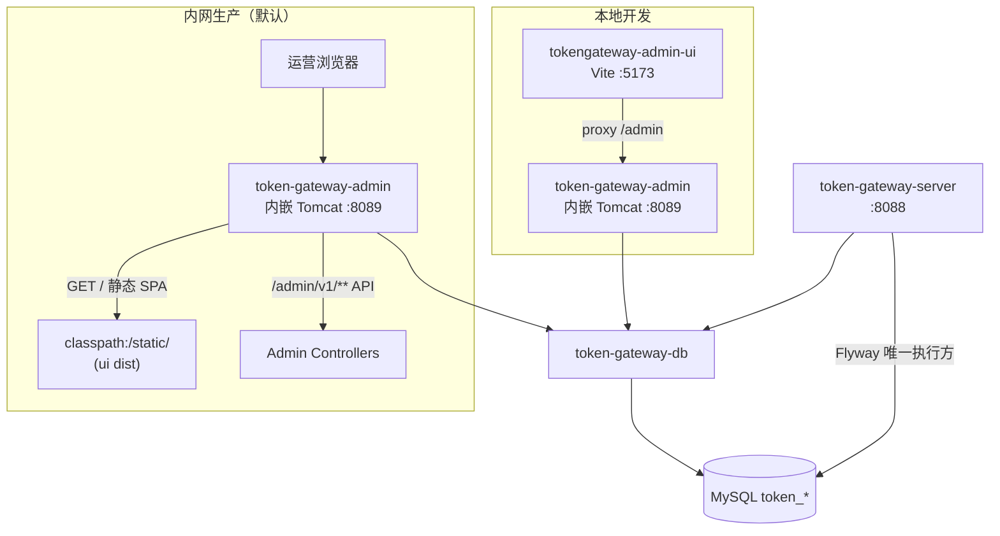

# US-G6-01 Admin 工程骨架与部署设计

> **用户故事**：[../02-用户故事.md](../02-用户故事.md) · US-G6-01  
> **状态**：编码已落地（可启动 Boot + `/admin/v1/health` + CORS + dist 发布包；业务 API / Vue 页归后续故事）  
> **范围**：将 `token-gateway-admin` 从「占位库」升级为**可独立启动**的 Spring Boot 应用：健康检查、共库 DataSource / MyBatis、内网部署约定、打包发布，并**冻结与前端的衔接契约**（API 基址、CORS、开发/生产部署形态）；**不含** Vue 脚手架与业务页面（见 US-G6-08/09），**不含**业务 API（用户/看板/价目等）  
> **需求映射**：执行计划 [../16-管理端执行计划.md](../16-管理端执行计划.md) 阶段 C1；骨架约定 [US-G0-01](./US-G0-01-工程骨架设计.md) §2.3；前端占位 [../../tokengateway-admin-ui/README.md](../../tokengateway-admin-ui/README.md)  
> **依赖**：US-G0-01（模块占位）、US-G0-02（`token_*` 表由 **server** Flyway 维护）  
> **后续衔接**：US-G6-04～07 / 10（运营 API）、US-G6-02/03（看板）、**US-G6-08/09（Vue 大屏与运营面板，须遵守本设计 §3.3）**  
> **文档位置**：`token-gateway/docs/design/`

---

## 0. 相对故事 / 执行计划的澄清

| 原文措辞 | 本设计约定 |
|----------|------------|
| 「只依赖 `token-gateway-db`」 | Maven **直接**依赖仅为 `token-gateway-db` + Boot Web/Actuator/Validation/Log4j2 等基础设施；**禁止**依赖 `token-gateway-server`（避免拉入 Chat/微信/结算/UC RS） |
| 「健康检查」 | `GET /admin/v1/health`（业务探活，**匿名**）+ Actuator `GET /actuator/health`（同样匿名，内网） |
| 「默认不暴露为公网消费 API」 | 进程**不**实现 `/v1/chat`、`/v1/search`、`sk-` 鉴权；部署上默认建议绑定内网地址；**本期无登录**不等于可上公网 |
| 「本期无登录」 | **不**引入 `embed-oauth-resource-starter`；**不**引入消费方 `sk-` Filter；G6-01 **可不引入** `spring-boot-starter-security`（见 §5） |
| 共库 | 与 server **同一 MySQL schema**；表迁移**仍由 server 负责**；admin **默认关闭 Flyway**（见 §4.3） |
| 「前端呢？」 | **页面实现不在本故事**（G6-08/09）；但本故事**必须**定死前后端怎么连（§3.3），避免后端先做成「纯 API 孤岛」再返工 |

---

## 1. 已确认选型

| 项 | 决定 |
|----|------|
| **Q1 进程** | `token-gateway-admin` **独立可执行 Boot**；与 `token-gateway-server` 分端口、分进程部署 |
| **Q2 默认端口** | **`8089`**（server 仍为 `8088`） |
| **Q3 API 前缀** | 管理 HTTP 一律 **`/admin/v1/**`**（本故事仅落地 health） |
| **Q4 探活路径** | `GET /admin/v1/health` → `{"status":"UP"}`；**不**要求 UC JWT / sk |
| **Q5 鉴权** | 本期全匿名（内网信任）；预留 `…admin.config` 供后续登录故事扩展 |
| **Q6 数据库** | 复用 `MYSQL_*` 约定连同一库；`@MapperScan("com.mfs.tokengateway.db.mapper")`；扫描 `com.mfs.tokengateway.db` |
| **Q7 迁移** | admin **`spring.flyway.enabled=false`**；**不**复制 server 的 `TokenFlywayHistoryBootstrap`；上线前须已有 server 跑过迁移 |
| **Q8 监听地址** | 配置项 `server.address`（环境变量 `SERVER_ADDRESS`）；文档默认推荐内网 IP 或部署侧防火墙；本地开发可用 `127.0.0.1` |
| **Q9 前端工程** | 独立目录 **`tokengateway-admin-ui`**（Vue3 + Vite）；**不**进 Maven reactor；只调 admin，**禁止**调 server `/v1/*` |
| **Q10 开发联调** | 本地 **双进程**：Vite `:5173` + admin `:8089`；**优先** Vite `proxy`：`/admin` → `http://127.0.0.1:8089`（同域相对路径，可无 CORS）；admin 仍提供可配 CORS 作兜底（直连 8089 时） |
| **Q11 生产托管** | **采用 Boot 内嵌 Tomcat 同进程托管 SPA**：将 `tokengateway-admin-ui` 的 `dist/` 打进 admin（如 `classpath:/static/`），浏览器只访问 **`:8089`** 即同时拿到页面与 `/admin/v1/**` API。**不依赖** Nginx 拆静态（Nginx 仅作可选外置反代/TLS，非必须） |
| **Q12 UI 路径** | 页面挂在站点根 `/`（`index.html` + assets）；API 仍为 `/admin/v1/**`（与静态资源路径不冲突）。Vue Router 用 **history** 模式时，admin 须提供 **SPA fallback**（非文件、非 `/admin/**`、非 `/actuator/**` → `index.html`） |
| **Q13 UI 环境变量** | `VITE_ADMIN_API_BASE`：开发走 proxy 时为 `''`；**生产打进 jar 后亦为 `''`**（与 API 同 Origin `:8089`） |
| **Q14 CORS** | 可配置；默认含本地 Vite 源。生产同进程同域时 CORS **基本无用**，可收紧/留空 |
| **Q15 打进 jar 的时机** | **已集成**：`tokengateway-admin-ui` 的 Vite `outDir` 指向 `token-gateway-admin/src/main/resources/static/`；`mvn -pl token-gateway-admin package` 默认经 `frontend-maven-plugin` 执行 `npm ci && npm run build`（可用 `-DskipAdminUi=true` 跳过） |
| **Q16 打包** | 启用 `spring-boot-maven-plugin` repackage；**Should**：assembly zip；zip 内为**已含前端静态资源**的 fat jar（待 UI 接入后） |
| **Q17 日志** | Log4j2（与 server 一致，排除默认 logging） |
| **Q18 包名** | 保持 `com.mfs.tokengateway.admin.*`（api / application / domain / config / utils） |

---

## 2. 目标与非目标

### 2.1 目标

1. `mvn -pl token-gateway-admin -am package` 产出可执行 fat jar，可用 `java -jar` 启动。  
2. 配置可达 MySQL 后进程保持运行；MyBatis Mapper / DbService 可注入（为后续故事就绪）。  
3. 匿名访问 `GET /admin/v1/health` 返回 UP（兼作后续 UI 联通探测）。  
4. 明确与 server 的边界：无消费方 API、无 UC RS、无结算调度、无微信/上游 Key 配置义务。  
5. **冻结与 `tokengateway-admin-ui` 的衔接契约**（§3.3）：API 前缀、开发 proxy、**生产 Boot/Tomcat 托管静态**、SPA fallback、CORS、`VITE_ADMIN_API_BASE`。  
6. README / `.env.example` / `application-local.yml.example` 写清启动与内网部署注意点；同步更新 `tokengateway-admin-ui/README.md` 对接说明（仍无脚手架代码亦可）。

### 2.2 非目标

| 不做 | 归属 |
|------|------|
| 用户 / Key / 调账 / 价目 / 看板 API | US-G6-02～07、10 |
| Vue `package.json` / 路由 / 页面 / 图表 | US-G6-08/09 |
| npm build → 拷贝进 `static/` 的自动化 / frontend-maven-plugin | US-G6-08/09（本故事冻结「打进 jar」为目标形态） |
| SPA `index.html` fallback 控制器 | US-G6-08/09（契约见 §3.3；G6-01 可不实现，避免无静态资源时误伤） |
| 强制外置 Nginx 拆静态 | **不做为默认**；运维可自行加反代，非本方案必需 |
| 管理端登录 / RBAC / UC 管理租户 | 后续阶段 |
| Flyway 双写迁移 / 在 admin 改表结构 | 仍由 server + `token-gateway-db` migration |
| 依赖或调用 `token-gateway-server` 内部类 | **禁止**；共享逻辑后续再抽（如 rotate 哈希） |
| `GATEWAY_KEY_PEPPER` / DeepSeek / Tavily / 微信配置 | G6-05 rotate 或与 server 无关；本故事不强制 |
| 公网 TLS 证书申请 | 非编码范围；内网 HTTP 即可（Boot 直接暴露或前挂 TLS 终止均可） |

---

## 3. 架构



> **说明**：Spring Boot Web 默认 **内嵌 Tomcat**；「用 Tomcat 对外暴露前端」即本进程监听 `8089`，同时提供静态页与管理 API，**不必**再单独部署外置 Tomcat 或 Nginx（除非运维另有要求）。

### 3.1 模块变更（相对占位）

| 项 | 现状（占位） | G6-01 目标 |
|----|--------------|------------|
| `pom.xml` description | 「不打包可执行」 | 可执行 Boot 应用 |
| `spring-boot-maven-plugin` | 未启用 | 启用；`mainClass` = Admin 入口 |
| 依赖 | db + web + log4j2 + lombok | + actuator、validation、test；**不加** OAuth RS / security（本期） |
| 源码 | 仅 `package-info` | `TokenGatewayAdminApplication` + `HealthController` + 配置 / CORS |
| resources | 无 | `application.yml`、log4j2、local 示例、`.env.example`；可选 `static/.gitkeep` |
| `tokengateway-admin-ui` | 仅 README 占位 | **本故事只更新 README 对接契约**；不建 `package.json` |

### 3.2 包职责（本故事落地内容）

| 包 | G6-01 |
|----|-------|
| `…admin` | `TokenGatewayAdminApplication` |
| `…admin.api` | `AdminHealthController`（`GET /admin/v1/health`） |
| `…admin.config` | CORS；`AdminProperties`（`cors-allowed-origins` 等） |
| `…admin.application` / `domain` / `utils` | 仍可空（保留 package-info） |

### 3.3 与前端衔接契约（本故事必须冻结）

> **原则**：G6-01 不写 Vue，但后端与部署形状必须让 G6-08/09「接上就能画页面」；**生产默认单 jar（内嵌 Tomcat）同时暴露 UI + API**。

| 契约项 | 约定 |
|--------|------|
| UI 工程位置 | `token-gateway/tokengateway-admin-ui/`（独立 npm；不进父 POM `<modules>`） |
| 唯一后端 | **仅** `token-gateway-admin`；禁止 UI 调用 `token-gateway-server` 的 `/v1/chat`、`/v1/search`、billing portal 等 |
| API 前缀 | 全部业务接口：`/admin/v1/**`（本故事先通 health） |
| 探活给 UI | `GET {apiBase}/admin/v1/health` → UP 即后端可达 |
| 开发 | Vite proxy：`'/admin' -> 'http://127.0.0.1:8089'`；前端请求写相对路径 `/admin/v1/...` |
| **生产（默认）** | `npm run build` → 产物写入 admin 的 `classpath:/static/` → 打进 fat jar；用户访问 `http://{内网}:8089/` 打开管理端，API 同机同域 |
| 静态与 API 共存 | `/`、`/assets/**` 等 = SPA；`/admin/v1/**` = JSON API；`/actuator/**` = 运维探活；**互不抢路径** |
| SPA fallback | history 路由：对「非静态文件且非 `/admin/**`、非 `/actuator/**`」的 GET 返回 `index.html`（**实现归 G6-08/09**） |
| 环境变量 | `VITE_ADMIN_API_BASE=''`（开发 proxy 与生产同域 jar 皆可） |
| 鉴权头 | 本期无；后续若加登录，再扩 `Authorization`（不提前绑 sk/UC JWT） |
| 与 G4 区别 | G4 是 server 托管 Thymeleaf + ticket；Admin UI 是 **运维 SPA 打进 admin jar**，受众与凭证均不同 |
| Nginx | **非必须**；若已有内网入口网关，可反代到 `8089`，但静态不必再拆出去 |

**构建接入示意（G6-08/09，本故事不强制选型插件）**：

```text
tokengateway-admin-ui/          npm run build → dist/
        │
        ▼ copy（脚本或 frontend-maven-plugin）
token-gateway-admin/src/main/resources/static/
        ├── index.html
        └── assets/...
        │
        ▼ spring-boot:repackage
token-gateway-admin-*.jar   ← 内嵌 Tomcat 对外 :8089
```

**G6-08/09 实现时建议目录（与现 README 对齐，可微调）**：

```
tokengateway-admin-ui/
├── package.json
├── vite.config.ts          # proxy /admin → 8089；base: '/'
├── .env.example            # VITE_ADMIN_API_BASE=
├── index.html
└── src/
    ├── api/                # 封装 /admin/v1
    ├── views/              # dashboard + ops/*
    └── router/
```

**Vite proxy 示例（供 G6-08 落地，G6-01 文档引用）**：

```ts
// vite.config.ts（示意）
export default defineConfig({
  base: '/',
  server: {
    port: 5173,
    proxy: {
      '/admin': {
        target: 'http://127.0.0.1:8089',
        changeOrigin: true,
      },
    },
  },
})
```

**生产访问（默认，无 Nginx）**：

```text
http://192.168.x.x:8089/               → 管理端 SPA（内嵌 Tomcat 静态）
http://192.168.x.x:8089/admin/v1/health → API
```

---

## 4. 启动与数据访问

### 4.1 应用入口

```java
@SpringBootApplication(scanBasePackages = {
        "com.mfs.tokengateway.admin",
        "com.mfs.tokengateway.db"
})
@MapperScan("com.mfs.tokengateway.db.mapper")
@ConfigurationPropertiesScan("com.mfs.tokengateway.admin.config")
public class TokenGatewayAdminApplication {
    public static void main(String[] args) {
        SpringApplication.run(TokenGatewayAdminApplication.class, args);
    }
}
```

### 4.2 DataSource

与 server **同一套**环境变量键，降低运维心智负担：

| 键 | 说明 |
|----|------|
| `MYSQL_HOST` / `MYSQL_PORT` / `MYSQL_DATABASE` | JDBC |
| `MYSQL_USER` / `MYSQL_PASSWORD` | 账号 |
| `SERVER_PORT` | 默认 **8089**（admin；勿与 server 8088 混用同一进程配置文件时注意覆盖） |
| `SERVER_ADDRESS` | 可选；绑定网卡 |

`application.yml` 中 `spring.application.name: token-gateway-admin`。

> **注意**：admin 与 server 若同机部署，必须使用**不同** `SERVER_PORT`；可共用同一组 `MYSQL_*`。

### 4.3 Flyway 策略（重要）

| 角色 | Flyway |
|------|--------|
| `token-gateway-server` | **唯一**默认执行方（含 TiDB bootstrap） |
| `token-gateway-admin` | **`spring.flyway.enabled=false`**；**不**引入 flyway 依赖（推荐），避免误开双迁移 |

启动前检查清单：

1. 目标库已存在 `token_users` 等表（server 至少成功启动迁移一次）。  
2. admin 仅读写，不创建 `token_flyway_schema_history`。  
3. 若表缺失：启动可成功但后续业务 API 失败；G6-01 探活**不强制**查表（避免把 DB 抖动当成进程挂死）。Actuator DB health **可开启**（`management.health.db.enabled=true`），便于运维区分「进程活着但库不通」。

### 4.4 为何不依赖 server 模块

- server 带结算调度、微信、上游 Key、UC RS；admin 引入会变成「第二个网关」。  
- 共享用例（如 Key 哈希 rotate）若出现，应下沉到 **新建 shared 模块** 或抽到 `token-gateway-db` 旁的纯 Java 模块——**非本故事**；G6-05 再定。

---

## 5. 安全与网络

### 5.1 本期鉴权

| 路径 | 鉴权 |
|------|------|
| `GET /admin/v1/health` | 匿名 |
| `GET /actuator/health` | 匿名 |
| 后续 `/admin/v1/**` | 仍匿名（直到登录故事）；写操作靠 `operator`/`note` 字段追责（见执行计划） |

**禁止**：把 admin 配成 UC Resource Server，或复用消费方 `sk-` 校验「管理员」。

### 5.2 是否引入 Spring Security

| 方案 | 决定 |
|------|------|
| A. 不引入 security starter | **采用（G6-01）** — 简单；内网 + 无登录阶段足够 |
| B. security + `permitAll` | 留给「管理登录」故事，避免空壳 Filter 链干扰排障 |

### 5.3 内网部署约定

1. 优先通过防火墙 / 安全组 **仅内网 CIDR** 访问 `8089`。  
2. 配置 `SERVER_ADDRESS` 绑内网网卡；避免无意识 `0.0.0.0` + 公网曝光。  
3. 文档与 README 醒目标明：**Admin 不是公网产品面**。  
4. 本故事**不**实现 IP allowlist Filter（可作为后续增强，非 Must）。

### 5.4 CORS（开发兜底；生产同进程可弱化）

```yaml
token-gateway:
  admin:
    cors-allowed-origins:
      - http://127.0.0.1:5173
      - http://localhost:5173
```

`WebMvcConfigurer#addCorsMappings`：对 `/admin/**` 允许上述 origin；方法含 GET/POST/PATCH/OPTIONS；必要时 `allowedHeaders=*`。

| 场景 | CORS 需求 |
|------|-----------|
| 开发 + Vite proxy | 浏览器看的是 `:5173` 同源请求 `/admin`，**通常不需要** CORS |
| 开发 + UI 直连 `http://127.0.0.1:8089` | **需要** CORS（默认白名单覆盖） |
| 生产：UI 已打进 jar，访问 `:8089/` | **同 Origin**，**不需要** CORS；可将白名单置空或仅留调试源 |

### 5.5 前端部署形态对照

| 形态 | 谁服务 HTML/JS | API 如何到达 admin | G6-01 | G6-08/09 |
|------|----------------|-------------------|-------|----------|
| A. 本地 Vite + proxy | Vite | proxy → 8089 | 文档约定 | 实现脚手架 |
| **B. Boot 内嵌 Tomcat 托管 SPA（默认生产）** | admin `classpath:/static/` | 同进程同域 `:8089` | 冻结契约；可选 `static/.gitkeep` | npm build 拷贝进 jar + SPA fallback |
| C. 外置 Nginx 拆静态 | Nginx | `/admin/` 反代 | 非默认 | 仅运维可选，非产品必选 |

**默认选 A（开发）+ B（生产）**。B 即「前端打包结果打进 admin，由内嵌 Tomcat 对外暴露」。

---

## 6. 配置清单

### 6.1 文件

| 文件 | 说明 |
|------|------|
| `token-gateway-admin/src/main/resources/application.yml` | 端口 8089、datasource、flyway.enabled=false、actuator、cors 默认 |
| `application-local.yml.example` | 本地复制为 `application-local.yml`（gitignore 同 server 约定） |
| `.env.example` | `MYSQL_*`、`SERVER_PORT`、`SERVER_ADDRESS` |
| `log4j2-spring.xml` | 可参照 server 精简；滚动文件可选 |

### 6.2 关键默认（建议稿）

```yaml
server:
  port: ${SERVER_PORT:8089}
  # address: ${SERVER_ADDRESS:}   # 不设则 Boot 默认；生产建议显式内网 IP

spring:
  application:
    name: token-gateway-admin
  datasource:
    url: jdbc:mysql://${MYSQL_HOST:127.0.0.1}:${MYSQL_PORT:3306}/${MYSQL_DATABASE:token_gateway}?useUnicode=true&characterEncoding=utf-8&serverTimezone=Asia/Shanghai
    username: ${MYSQL_USER:root}
    password: ${MYSQL_PASSWORD:}
    driver-class-name: com.mysql.cj.jdbc.Driver
  flyway:
    enabled: false

management:
  endpoints:
    web:
      exposure:
        include: health,info
  health:
    db:
      enabled: true

token-gateway:
  admin:
    cors-allowed-origins:
      - http://127.0.0.1:5173
      - http://localhost:5173
```

---

## 7. API 契约（本故事唯一业务接口）

### 7.1 `GET /admin/v1/health`

**请求**：无鉴权头要求。

**响应** `200`：

```json
{
  "status": "UP"
}
```

可选扩展（非 Must）：`"service":"token-gateway-admin"`。

**说明**：不查上游、不强制查库；进程能应答即 UP。库连通性看 `/actuator/health`。

### 7.2 错误体（预留约定，供后续故事）

后续 `/admin/v1/**` 建议统一：

```json
{
  "error": "snake_case_code",
  "message": "human readable",
  "request_id": "optional"
}
```

G6-01 可不实现全局 `@ControllerAdvice`；若实现空壳亦可，方便 G6-04 起复用。

---

## 8. 构建与发布

### 8.1 本地

```bash
cd token-gateway
mvn -pl token-gateway-admin -am -DskipTests package
java -jar token-gateway-admin/target/token-gateway-admin-*-SNAPSHOT.jar
# 或
# mvn -pl token-gateway-admin -am spring-boot:run

curl.exe -s http://127.0.0.1:8089/admin/v1/health
# {"status":"UP"}
```

Windows PowerShell：`-D` 参数建议 `mvn --% …`。

### 8.2 Maven 插件

- `spring-boot-maven-plugin`：`mainClass=com.mfs.tokengateway.admin.TokenGatewayAdminApplication`  
- **Should**：复制 server 的 `maven-assembly-plugin` 模式，产物 `token-gateway-admin-<ver>-dist.zip`（jar 改名为 `token-gateway-admin.jar` + `start.sh`/`stop.sh`）

### 8.3 与 server / UI 并行部署

| 进程 / 面 | 端口（默认） | 公网 | 职责 |
|-----------|--------------|------|------|
| server | 8088 | 可以（消费方 / 充值页） | RS + 计费 |
| admin | 8089 | **否**（内网） | 运维 API + **托管管理端 SPA**（内嵌 Tomcat） |
| admin-ui（仅开发） | 5173 | **否** | Vite 热更新；生产不单独部署 |

---

## 9. 验收标准

| ID | 步骤 | 期望 |
|----|------|------|
| V1 | `mvn -pl token-gateway-admin -am -DskipTests package` | BUILD SUCCESS；存在可执行 jar |
| V2 | 配置有效 `MYSQL_*` 后启动 | 进程不退出；日志无 Flyway migrate |
| V3 | `GET http://127.0.0.1:8089/admin/v1/health` | 200 + `status=UP`；无 Token |
| V4 | `GET /actuator/health` | 200；库可达时 db 组件 UP |
| V5 | 依赖树 / POM | **无** `token-gateway-server`、**无** `embed-oauth-resource-starter` |
| V6 | 端口 | 默认 8089；与 8088 可同机并存 |
| V7 | CORS 配置存在 | `AdminProperties` / yml 含 `cors-allowed-origins`；OPTIONS `/admin/v1/health` 对 `http://127.0.0.1:5173` 不拒（若测 CORS） |
| V8 | 前端契约文档 | `tokengateway-admin-ui/README.md` 写明：只调 admin、`/admin/v1`、proxy、**生产打进 jar / Tomcat 同域**、`VITE_ADMIN_API_BASE` |
| V9 | 父 README / admin 启动说明 | 标明内网、Flyway 归属、开发双进程、生产单 jar 含 UI |

---

## 10. 编码任务清单（实现顺序）

1. 更新 `token-gateway-admin/pom.xml`：description、actuator、validation、test、boot plugin（+ 可选 assembly）。  
2. 新增 `TokenGatewayAdminApplication`、`AdminHealthController`、CORS/`AdminProperties`。  
3. 新增 `application.yml`、local 示例、`.env.example`、log4j2。  
4. 更新 `package-info` 文案（去掉「本期不实现/不打包」）。  
5. （可选）assembly + start/stop 脚本。  
6. 更新 `tokengateway-admin-ui/README.md`：对接契约（§3.3），仍可不建脚手架。  
7. 冒烟：V1～V9。  
8. 文档：父 `README.md`、执行计划阶段 C 勾选（编码完成后）。

---

## 11. 开放问题

| ID | 项 | 倾向 |
|----|----|------|
| O1 | admin 是否允许临时 `flyway.enabled=true` | **默认禁止**；应急仍用 server |
| O2 | health 是否纳入 DB ping | 业务 health 不强制；actuator db 开启即可 |
| O3 | 全局异常体是否本故事落地 | Could；不阻塞出门 |
| O4 | assembly zip 是否 Must | **Should**；至少 fat jar Must |
| O5 | 与 US-G6-00 总览 | G6-00 未出时，以本设计 + 执行计划为准；G6-00 补齐后交叉链接 |
| O6 | 生产是否 Boot 托管 SPA | **已拍板：默认是**（内嵌 Tomcat；见 Q11） |
| O7 | UI history 模式 base path | **`base: '/'`**，挂在 `:8089/` 根路径 |
| O8 | 是否必须外置 Nginx | **否**；可选网关反代到 8089 |

---

## 12. 文档同步（本详设评审通过后）

| 文档 | 动作 |
|------|------|
| [02-用户故事.md](../02-用户故事.md) US-G6-01 | 增加「详细设计」链接（已可链） |
| [16-管理端执行计划.md](../16-管理端执行计划.md) | 阶段 B 中 US-G6-01 标详设已写 |
| [US-G0-01](./US-G0-01-工程骨架设计.md) §2.3 | 注明「可执行化见 US-G6-01」 |
| `tokengateway-admin-ui/README.md` | **补对接契约**（本轮随详设一起改） |
| `token-gateway-admin` / 父 README | 启动说明 + UI 联调一句 |

---

## 13. 本故事不做 / 后续

| 不做 | 后续 |
|------|------|
| 运营与看板 API | US-G6-02～07、10 |
| Vue 脚手架、路由、大屏/运营页、dist 打进 jar、SPA fallback | US-G6-08/09（**须遵守 §3.3；生产形态 = Boot/Tomcat 托管**） |
| 管理登录 | 后续 Phase |
| 抽共享 rotate/调账领域模块 | 随 G6-05/07 需要时再开 |
