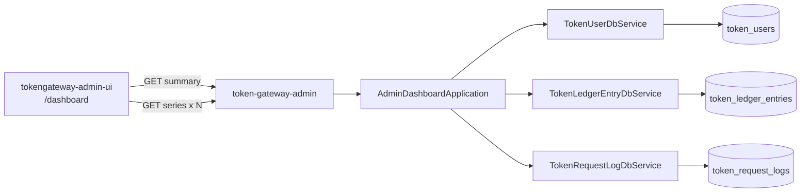

# US-G6-02 运营大屏看板设计

> **用户故事**：[../02-用户故事.md](../02-用户故事.md) · US-G6-02 / US-G6-03 / US-G6-08（前端契约）  
> **状态**：编码已落地（summary/series + `/dashboard` 四卡两图；待联调验收）  

> **范围**：`token-gateway-admin` **只读**聚合：用户增长、充值、消费、活跃的 KPI 摘要与日序列；`/dashboard` 大屏页布局 / 轮询 / 空态契约（覆盖 US-G6-08 Must）  
> **需求映射**：执行计划 [../16-管理端执行计划.md](../16-管理端执行计划.md) §指标与领域口径、阶段 C8 / D；交互参考 [`../designs/token-gateway-admin.pen`](../designs/token-gateway-admin.pen) · `screen/Dashboard`  
> **依赖**：US-G6-01  
> **后续衔接**：日汇总表（性能恶化时）；G2 毛利/经营分析大屏（非本故事）  
> **文档位置**：`token-gateway/docs/design/`  
> **说明**：执行计划中的 US-G6-03（充值/消费/活跃）与本文件同文；不再单独维护空壳 `US-G6-03-*.md` / `US-G6-08-*.md`。

---

## 0. 相对执行计划 / Pencil 的澄清

| 原文措辞 | 本设计约定 |
|----------|------------|
| 「今日 / 近 7 / 近 30」 | 按 **Asia/Shanghai** 业务日切（见 Q3）；非 UTC 日历日 |
| Pencil「今日充值 (USD)」等 | **纠正为人民币元**；库内仍为厘 |
| Pencil「较昨日 +x%」 | Should：`summary` 带回昨日对照字段；缺数据则副文案隐藏 |
| 「可与 02 同文拆章」 | 本文件合并 G6-02 + G6-03 API + G6-08 UI Must |
| O3 adjust | 主充值 KPI **不含** `adjust`；可选副字段 `adjust_*`（Should） |
| 实时推送 | **不做** WebSocket；HTTP 轮询 60s |

---

## 1. 已确认选型

| 项 | 决定 |
|----|------|
| **Q1 进程与前缀** | 仅 admin：`GET /admin/v1/dashboard/summary`、`GET /admin/v1/dashboard/series`；**禁止**挂到 server |
| **Q2 鉴权** | 内网匿名；只读；无 operator/note |
| **Q3 日切时区** | **Asia/Shanghai**。「今日」= 上海日历日 `[dayStart, dayEnd)` 映射为 UTC `Instant` 窗查询；库内 `DATETIME(3)` 按 UTC 语义存储（与既有约定一致） |
| **Q4 金额** | ledger 厘；API 同时回 `*_li` + `*_yuan`（`li/1000`，HALF_UP 三位）；UI **禁止**写「厘」「USD」 |
| **Q5 充值口径** | `token_ledger_entries.type = 'topup'`；金额 `SUM(amount_li)`（充正）；**不含** `adjust` |
| **Q6 消费口径** | `type = 'charge'`；展示额 = `SUM(ABS(amount_li))`（库内 charge 为负）；**不以** `token_request_logs` 的 `pending` 当已消费 |
| **Q7 用户增长** | `token_users.created_at`：今日 / 近 7 日 / 近 30 日新增人数；`total` = 全表计数（含 disabled） |
| **Q8 活跃** | **DAU** = 上海「今日」窗内 `token_request_logs` 去重 `user_id`；**WAU** = 近 7 个业务日窗内去重 `user_id`；**不用**「余额>0」 |
| **Q9 聚合实现** | MVP **直查**；贴合索引 `idx_token_ledger_type_time`、`idx_token_req_user_time`、用户 `created_at`；**不做**日汇总表 |
| **Q10 series 窗** | 默认近 **30** 个上海日历日（含今日）；`days` 仅允许 `7` 或 `30`；非法 → 400 |
| **Q11 series 形态** | 单 `metric` 单序列；充值 vs 消费图由前端 **并行两次** `series`（`topup` + `charge`） |
| **Q12 补齐空日** | series 响应须覆盖窗内每一天；无数据日 `value_*=0` / `count=0` / `users=0`（按 metric） |
| **Q13 错误体** | `{code,message}`；复用 `AdminApiException` |
| **Q14 刷新** | 前端默认 **60s** 轮询 summary + 两张图所需 series；无 WebSocket |
| **Q15 图表库** | 引入 **echarts**（admin-ui）；体积可接受；禁止另起经营分析依赖 |
| **Q16 model 占比** | **Could**；本期不做 |
| **Q17 副指标 adjust** | Should：`summary.topup` 可附 `adjust_today_amount_yuan`（仅展示，不进主卡大数字） |
| **Q18 曾 topup 用户数** | Could；本期不做 |

---

## 2. 目标与非目标

### 2.1 目标

1. 运营打开 `/dashboard` 可见四类 KPI（用户 / 充值 / 消费 / 活跃）合法数字或 0。  
2. 可见近 30 日用户增长折线，以及充值 vs 消费双序列图。  
3. 数字可与「上海日切」手写 SQL 抽样对齐（时区已文档化）。  
4. 页面定时刷新；失败时保留上次成功数据并提示。

### 2.2 非目标

| 不做 | 归属 |
|------|------|
| WebSocket / SSE 推送 | 明确不做 |
| 毛利 / 命中率经营大屏 | G2 / 后续 |
| 日汇总物化表 | 性能恶化后再开 |
| 按 model 饼图 / 排行 | Could |
| 管理端登录 | 后续 |
| 依赖 `token-gateway-server` | **禁止** |
| 改 ledger / 结算 | 只读 |

---

## 3. 架构



### 3.1 包职责

| 类 | 职责 |
|----|------|
| `AdminDashboardController` | `/admin/v1/dashboard/*` |
| `AdminDashboardApplication` | 上海日切窗计算、聚合编排、元数据回显 |
| DbService 增补 | `countUsersCreatedBetween`、`sumLedgerByTypeBetween`、`countDistinctUsersWithRequestsBetween`、按日 group 系列查询（可用 Mapper `@Select`） |
| DTO | `AdminDashboardSummaryResponse`、`AdminDashboardSeriesResponse` |

---

## 4. 业务日与时间窗

记 `ZoneId ZH = Asia/Shanghai`。

| 符号 | 定义 |
|------|------|
| `today` | `LocalDate.now(ZH)` |
| 今日窗 | `[today.atStartOfDay(ZH), today.plusDays(1).atStartOfDay(ZH))` → UTC Instant |
| 昨日窗 | 今日窗整体平移 −1 日 |
| 近 7 日窗 | `[today.minusDays(6).atStartOfDay(ZH), today.plusDays(1).atStartOfDay(ZH))`（含今日共 7 日） |
| 近 30 日窗 | 同理 `minusDays(29)` |
| series 第 i 日 | `day = today.minusDays(days-1-i)`，点的查询窗为该日 `[start, nextStart)` |

响应中：

- `timezone` 固定 `"Asia/Shanghai"`  
- `as_of`：生成响应时的 `Instant`（UTC ISO-Z）  
- `windows.today|d7|d30`：各窗 `from`/`to`（ISO-Z，半开区间的 to）

SQL 谓词统一：`created_at >= :from AND created_at < :to`（UTC 存贮比较）。

---

## 5. 指标定义（可对账）

### 5.1 用户增长

| 字段 | SQL 语义 |
|------|----------|
| `total` | `COUNT(*) FROM token_users` |
| `today_new` | `created_at` ∈ 今日窗 |
| `d7_new` / `d30_new` | 近 7 / 30 日窗 |
| `yesterday_new`（Should） | 昨日窗 |
| series `user_growth` | 按上海日 `DATE(CONVERT_TZ(created_at,'+00:00','+08:00'))` 或应用层按日切窗循环/一次 GROUP（实现可选）；点值 = 日新增人数 → 字段 `users` |

> 实现注意：若 MySQL 未开 `CONVERT_TZ` 表，**优先应用层按日窗聚合**或 `created_at` 与预计算 UTC 边界比较后在 Java 归桶，避免依赖 mysql 时区表。

### 5.2 充值（topup）

| 字段 | 语义 |
|------|------|
| `today_amount_li` / `_yuan` | `SUM(amount_li) WHERE type='topup' AND created_at∈今日` |
| `today_count` | 同上 `COUNT(*)` |
| `d7_*` / `d30_*` | 近 7 / 30 日窗 |
| series | 日 `SUM(amount_li)` → `value_li`/`value_yuan`；日笔数 → `count` |

### 5.3 消费（charge）

同充值结构；过滤 `type='charge'`；金额用 `SUM(ABS(amount_li))`（或 `-SUM(amount_li)` 因约定为负）。

### 5.4 活跃

| 字段 | 语义 |
|------|------|
| `dau` | 今日窗 `COUNT(DISTINCT user_id)` on `token_request_logs` |
| `wau` | 近 7 日窗去重 `user_id` |
| `wau_ratio` | `wau / total`（total=0 则 `null`）；前端可展示「占比」 |
| series `dau` | 每日去重用户数 → `users` |

---

## 6. API

### 6.1 Summary

```http
GET /admin/v1/dashboard/summary
```

无必填 Query。

**200 示例（字段名冻结；数值示意）：**

```json
{
  "timezone": "Asia/Shanghai",
  "as_of": "2026-08-09T14:00:00Z",
  "windows": {
    "today": { "from": "2026-08-08T16:00:00Z", "to": "2026-08-09T16:00:00Z" },
    "d7": { "from": "…", "to": "…" },
    "d30": { "from": "…", "to": "…" }
  },
  "users": {
    "total": 1284,
    "today_new": 12,
    "yesterday_new": 8,
    "d7_new": 40,
    "d30_new": 120
  },
  "topup": {
    "today_amount_li": 3420500,
    "today_amount_yuan": 3420.5,
    "today_count": 15,
    "d7_amount_li": 0,
    "d7_amount_yuan": 0,
    "d7_count": 0,
    "d30_amount_li": 0,
    "d30_amount_yuan": 0,
    "d30_count": 0,
    "adjust_today_amount_li": 0,
    "adjust_today_amount_yuan": 0
  },
  "charge": {
    "today_amount_li": 1186300,
    "today_amount_yuan": 1186.3,
    "today_count": 320,
    "d7_amount_li": 0,
    "d7_amount_yuan": 0,
    "d7_count": 0,
    "d30_amount_li": 0,
    "d30_amount_yuan": 0,
    "d30_count": 0
  },
  "active": {
    "dau": 90,
    "wau": 426,
    "wau_ratio": 0.332
  }
}
```

`adjust_*` 为 Should；编码时可先回 0 或省略（`NON_NULL`）。

### 6.2 Series

```http
GET /admin/v1/dashboard/series?metric=user_growth&days=30
```

| Query | 必填 | 规则 |
|-------|------|------|
| `metric` | 是 | `user_growth` \| `topup` \| `charge` \| `dau`；非法 → 400 `validation_error` |
| `days` | 否 | 默认 `30`；仅 `7` / `30` |

**200 示例：**

```json
{
  "timezone": "Asia/Shanghai",
  "metric": "topup",
  "days": 30,
  "from": "…Z",
  "to": "…Z",
  "points": [
    {
      "day": "2026-07-11",
      "value_li": 10000,
      "value_yuan": 10,
      "count": 1,
      "users": null
    }
  ]
}
```

| metric | 使用字段 |
|--------|----------|
| `user_growth` | `users`（日新增）；`value_*`/`count` 可省略或 null |
| `topup` / `charge` | `value_li` / `value_yuan` / `count` |
| `dau` | `users`（日活） |

`points.length` **必须**等于 `days`，按 `day` 升序。

### 6.3 错误

| HTTP | code | 场景 |
|------|------|------|
| 400 | `validation_error` | metric/days 非法 |
| 500 | `internal_error` | 查询失败 |

---

## 7. 前端契约（US-G6-08 Must）

| 项 | 约定 |
|----|------|
| 路由 | `/dashboard`（已有）；改造 [`DashboardView.vue`](../../tokengateway-admin-ui/src/views/DashboardView.vue) |
| 布局 | 对齐 Pencil：页头「运营大屏」+ 副标题；**MetricsRow** 四卡；**ChartsRow** 左「近 N 日用户增长」、右「近 N 日充值 vs 消费」 |
| 四卡主数字 | ① `users.total`（副：今日新增 / 较昨日）；② `topup.today_amount_yuan`（副：今日笔数）；③ `charge.today_amount_yuan`（副：今日笔数）；④ `active.wau`（副：今日 DAU 与占比） |
| 文案 | **元**；禁止 USD / 厘 |
| 图 | echarts；左：`metric=user_growth`；右：并行 `topup`+`charge` 双折线/柱 |
| 默认 `days` | 30；可不做切换控件（Should：7/30 切换） |
| 刷新 | `setInterval` 60s；页可见时跑；`visibilitychange` 可暂停（Should） |
| 失败 | 保留上次成功数据 + 顶栏/卡片错误提示；初次失败显示空态说明 |
| 空数据 | 全 0 合法；图为平线/空柱，不报错 |
| 健康检查 | 可降为页脚小字或去掉；**不以** health 占主内容 |

### 7.1 API client

建议 `src/api/dashboard.ts`：`fetchDashboardSummary()`、`fetchDashboardSeries({ metric, days })`。

---

## 8. 验收用例

| ID | 步骤 | 期望 | 优先级 |
|----|------|------|--------|
| T1 | GET summary 空库 | 各计数/金额 0；`timezone=Asia/Shanghai` | Must |
| T2 | 插入今日（上海）topup + 昨日 topup | `today_amount` 仅含今日；d7 含两日 | Must |
| T3 | 仅有 adjust、无 topup | 主 topup 金额 0；若回 adjust 副字段则可见 | Must |
| T4 | charge 负额流水 | `charge.today_amount_yuan` 为正展示 | Must |
| T5 | 今日有请求日志 | `dau≥1`；series `dau` 今日点 `users≥1` | Must |
| T6 | series `days=30` | 恰好 30 点；含无数据日 0 | Must |
| T7 | `metric=bogus` / `days=15` | 400 | Must |
| T8 | 对照手写 SQL（同窗） | 与 summary/series 一致 | Must（A3） |
| T9 | UI 打开 /dashboard | 四卡 + 两图；无 USD 文案 | Must（A2） |
| T10 | 断后端后轮询 | 保留上次数据 + 错误提示 | Should |

---

## 9. 编码任务清单

1. ~~DbService / Mapper：用户新增计数、ledger 按 type 汇总与按日序列、request 去重活跃与按日 DAU。~~  
2. ~~`AdminDashboardApplication`：上海日切窗 + summary/series；单测假时钟或固定 `Clock`。~~  
3. ~~Controller + DTO。~~  
4. ~~admin-ui：`dashboard.ts` + 改造 `DashboardView`（echarts）；60s 轮询。~~  
5. ~~更新 `02` / `16` 状态为编码已落地。~~

---

## 10. 开放问题（残留）

| ID | 项 | 倾向 |
|----|----|------|
| O1 | CONVERT_TZ 可用性 | **应用层归桶**优先，不依赖 mysql 时区表 |
| O2 | 卡片是否展示 d7/d30 切换 | MVP 主数字用「今日」；d7/d30 可放卡内小字或悬停 |
| O3 | disabled 用户是否计入 total | **计入**（全量账户）；活跃仍看请求 |
| O4 | series 是否合并 finance | **否**；双请求 |

---

## 11. 文档同步

| 文档 | 动作 |
|------|------|
| [02-用户故事.md](../02-用户故事.md) G6-02/03/08 | 挂本详设链接；状态详设待评审 |
| [16-管理端执行计划.md](../16-管理端执行计划.md) | G6-02/03/08 链到本文；O2 时区标已拍板 Asia/Shanghai |
| 本文 | 编码完成后 →「编码已落地」 |

---

## 12. 一句话冻结

**大屏 = 上海业务日切的四类只读 KPI + 日序列；充值只计 topup、消费只计 ledger charge；summary/series 双接口；前端四卡两图、echarts、60s 轮询；不做推送与日汇总表。**
