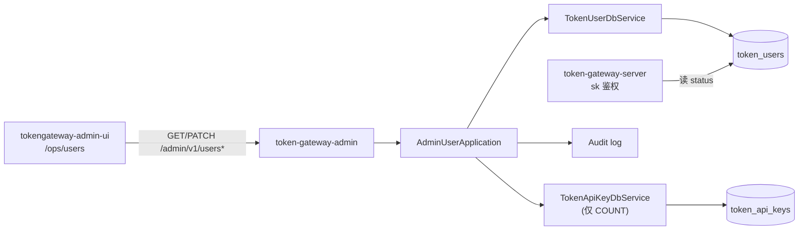
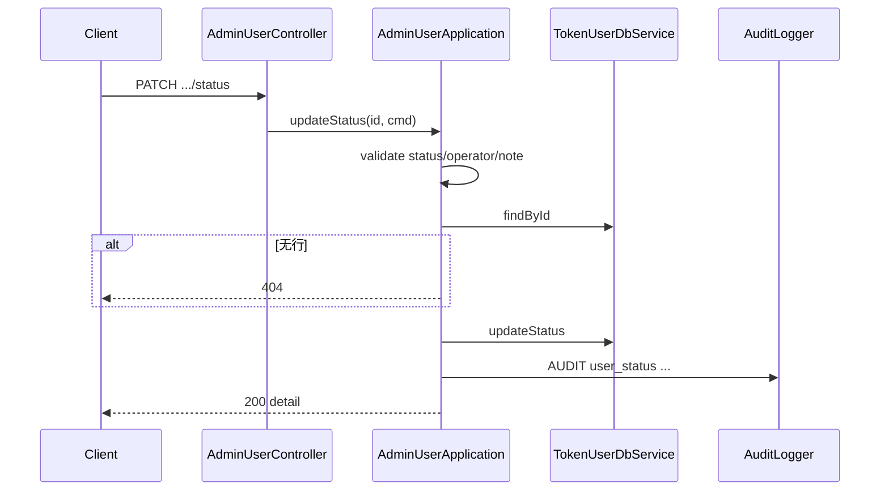

# US-G6-04 用户管理设计

> **用户故事**：[../02-用户故事.md](../02-用户故事.md) · US-G6-04  
> **状态**：编码已落地（列表 / 详情 / 启停；单测通过；运营页已对接）  
> **范围**：`token-gateway-admin` 提供计费账户**列表 / 详情 / 启停**；读写共库 `token_users`；**禁止**物理删除；**不含** Key 启停、调账、消费查询（见 G6-05/06/07）  
> **需求映射**：执行计划 [../16-管理端执行计划.md](../16-管理端执行计划.md) 阶段 C2 / A4～A5；[../01-需求.md](../01-需求.md) 账户 `status`；鉴权行为对齐 server `GatewaySkAuthFacade`  
> **依赖**：US-G6-01（admin 可启动、共库、`/admin/v1`、错误体风格可复用 G6-10）  
> **后续衔接**：US-G6-05（Key）、US-G6-06（消费）、US-G6-07（充值/调账）、US-G6-09（用户列表/详情页）  
> **交互参考**：[`../designs/token-gateway-admin.pen`](../designs/token-gateway-admin.pen) · `screen/Users`、`screen/UserDetail`  
> **文档位置**：`token-gateway/docs/design/`

---

## 0. 相对故事 / 执行计划的澄清

| 原文措辞 | 本设计约定 |
|----------|------------|
| 「查询用户」 | `GET /admin/v1/users` 分页；可按 `user_code` / `tenant_id` / `status` 筛选 |
| 「详情含余额与状态」 | `GET /admin/v1/users/{id}` 回传 `token_users` 全字段 + 厘/元余额；可选 Key 计数摘要 |
| 「启用/禁用」 | `PATCH /admin/v1/users/{id}/status`，仅 `active` ↔ `disabled` |
| 「无物理删除」 | **不提供** DELETE；产品禁止硬删账户行（执行计划 O5） |
| 「处理停用与排障」 | 禁用后该账户下 sk 鉴权失败：server 返回 **403** `account_disabled`（非 401；纠正执行计划 A6 笔误） |
| 写操作追责 | `operator` + `note` **必填**；落审计日志；**不改表**加列（对齐 G6-10 Q7） |

---

## 1. 已确认选型

| 项 | 决定 |
|----|------|
| **Q1 进程与前缀** | 仅 `token-gateway-admin`；路径 `/admin/v1/users*`；**禁止**挂到 server |
| **Q2 鉴权** | 内网匿名（同 G6-01）；写路径靠 `operator`/`note` + 审计日志 |
| **Q3 标识** | 路径与主键一律用 **`token_users.id`（BIGINT）**；列表展示 `tenant_id` + `user_code` |
| **Q4 状态枚举** | 仅允许 **`active`** / **`disabled`**（大小写敏感，与库注释一致，写入前 `trim` 后全小写校验） |
| **Q5 启停副作用** | **只改** `token_users.status`；**不**级联改 `token_api_keys.status`（Key 行可仍为 active；账户级拦截已足够，见 server 鉴权顺序） |
| **Q6 禁用后行为** | 已有 sk 调 Chat/Search → **403** `account_disabled`；`POST /v1/keys/rotate` 亦 **403**（US-G0-06）；恢复 `active` 后无需 rotate 即可恢复（Key 未禁时） |
| **Q7 审计** | PATCH 必填 `operator`、`note`；INFO 审计日志含 `user_id`、旧/新 status、operator、note、client IP；表内不存 |
| **Q8 分页** | `page`（从 1）+ `size`（默认 **20**，最大 **100**）；响应含 `total` / `page` / `size` |
| **Q9 搜索** | `q`：对 `user_code` **或** `tenant_id` 做 **前后缀模糊**（`LIKE %q%`，`utf8mb4_bin` 下大小写敏感）；另可精确 `status`；可选精确 `tenant_id` / `user_code` 覆盖 `q` |
| **Q10 排序** | 默认 `id DESC`（新账户靠前）；本期不做多列排序参数 |
| **Q11 详情摘要** | 详情 **Should** 附带：`key_total` / `key_active` / `key_disabled`（扫 `token_api_keys`）；**不**内嵌 Key 明文/hash；完整 Key 列表归 G6-05 |
| **Q12 限额字段** | `rpm_limit` / `tpm_limit` / `daily_limit_li`：**只读展示**；本期**不提供**改限额 API |
| **Q13 建户** | Admin **不**创建 `token_users`（仍由 G0-06 rotate / 业务路径自动建）；无「新增用户」入口 |
| **Q14 错误体** | 与 G6-10 一致：`{ "code", "message" }`；复用 `AdminRestExceptionHandler`；业务异常可抽公共 `AdminApiException`（编码时将 G6-10 价目异常收敛或并列） |
| **Q15 金额展示** | API 同时回 `balance_li` 与 `balance_yuan`（`li/1000`，HALF_UP 三位小数，同门户习惯） |
| **Q16 幂等** | PATCH 目标 status **等于**当前 → **200** 回详情态，不报错；仍要求合法 body（含 operator/note），并打审计「noop」可选（倾向：**仍记一条审计**，便于证明操作意图） |

---

## 2. 目标与非目标

### 2.1 目标

1. 运营可按关键字/状态翻页查找计费账户，见余额与状态。  
2. 运营可打开单用户详情，见账户字段与 Key 数量摘要。  
3. 运营可将账户在 `active`/`disabled` 间切换，并留下可追责审计。  
4. 为 G6-05/06/07/09 提供稳定的 `user_id` 入口契约。

### 2.2 非目标

| 不做 | 归属 |
|------|------|
| Key 列表 / 启停 / rotate | US-G6-05 |
| ledger / request_logs 分页 | US-G6-06；调账 US-G6-07 |
| Vue 用户页完整交互 | US-G6-09（契约见 §7；可与本 API 短并行） |
| 物理删除用户 / 清空余额 | **禁止** |
| 改 `rpm`/`tpm`/`daily_limit` | 后续故事 |
| Admin 手工建户 / 改 `tenant_id`/`user_code` | 禁止（身份键来自 UC） |
| 依赖 `token-gateway-server` 模块 | **禁止**；只共库 |
| 管理端登录 | 后续阶段 |

---

## 3. 架构



### 3.1 包职责（建议）

| 包 / 类 | 职责 |
|---------|------|
| `…admin.api.AdminUserController` | HTTP 映射 |
| `…admin.api.dto` | 列表/详情/PATCH 请求响应 |
| `…admin.application.AdminUserApplication` | 查询、启停编排 |
| `…db…TokenUserDbService` | 增补分页查询、`updateStatus` |
| `…db…TokenApiKeyDbService` | 已有则复用；增补 `countByUserIdGrouped`（或简单 list+内存计） |

### 3.2 与 server 边界

- admin **只改库字段**；不调用 server HTTP、不发事件。  
- 鉴权侧每次查库读 `status`（无本地长期缓存假设）；禁用后下一笔 sk 请求即生效。  
- 不修改 G0-06 / sk Filter 代码（行为已满足）。

---

## 4. 数据模型

### 4.1 `token_users`（只读约定 + status 可写）

| 列 | API | 说明 |
|----|-----|------|
| `id` | 是 | 主键 |
| `tenant_id` | 是 | UC 租户 |
| `user_code` | 是 | UC 用户码 |
| `balance_li` | 是 | 余额厘；G6-04 **只读**（改余额仅 G6-07） |
| `status` | 是 | `active` / `disabled`；本故事可写 |
| `rpm_limit` / `tpm_limit` / `daily_limit_li` | 是 | 只读；null=默认 |
| `created_at` / `updated_at` | 是 | UTC 语义；JSON 用 Instant |

### 4.2 启停 SQL（示意）

```sql
UPDATE token_users
SET status = ?, updated_at = UTC_TIMESTAMP(3)
WHERE id = ?;
```

**禁止**：`DELETE FROM token_users`；**禁止**本故事 `UPDATE balance_li`。

### 4.3 DbService 增补（建议）

```java
Page<TokenUser> pageUsers(String q, String status, String tenantIdExact,
                          String userCodeExact, int page, int size);
boolean updateStatus(long userId, String newStatus);
```

分页用 MyBatis-Plus `Page` 即可。

---

## 5. HTTP API

基址：admin `:8089`。

### 5.1 `GET /admin/v1/users`

**Query**

| 参数 | 默认 | 说明 |
|------|------|------|
| `page` | `1` | ≥1 |
| `size` | `20` | 1～100 |
| `q` | — | 模糊匹配 `user_code` 或 `tenant_id` |
| `status` | — | `active` / `disabled`；非法 → 400 |
| `tenant_id` | — | 精确匹配（若传则优先于 `q` 的租户侧） |
| `user_code` | — | 精确匹配 |

**响应 200（示意）**

```json
{
  "page": 1,
  "size": 20,
  "total": 1284,
  "items": [
    {
      "id": 42,
      "tenant_id": "tenant_acme",
      "user_code": "u_91bb04",
      "balance_li": 2450000,
      "balance_yuan": "2450.000",
      "status": "active",
      "created_at": "2026-06-01T10:12:00.000Z",
      "updated_at": "2026-08-09T18:40:00.000Z"
    }
  ]
}
```

列表项可不带限额三字段（详情再给），以减负；**Must** 含余额与状态。

### 5.2 `GET /admin/v1/users/{id}`

- 不存在 → **404** `user_not_found`  
- 成功 → 全字段 + Key 计数摘要：

```json
{
  "id": 42,
  "tenant_id": "tenant_acme",
  "user_code": "u_91bb04",
  "balance_li": 2450000,
  "balance_yuan": "2450.000",
  "status": "active",
  "rpm_limit": null,
  "tpm_limit": null,
  "daily_limit_li": null,
  "created_at": "...",
  "updated_at": "...",
  "key_total": 3,
  "key_active": 2,
  "key_disabled": 1
}
```

### 5.3 `PATCH /admin/v1/users/{id}/status`

**Body**

```json
{
  "status": "disabled",
  "operator": "zhangsan",
  "note": "滥用投诉停用"
}
```

| 校验 | 结果 |
|------|------|
| `status` 非 active/disabled | 400 `validation_error` |
| 缺 operator/note | 400 `validation_error` |
| 用户不存在 | 404 `user_not_found` |
| 成功 | **200** + 详情同 `GET /users/{id}` |

### 5.4 明确不提供

| 方法 | 说明 |
|------|------|
| `DELETE /admin/v1/users/{id}` | 禁止 |
| `POST /admin/v1/users` | 禁止建户 |
| `PATCH` 改余额 / 限额 / 身份键 | 禁止（余额走 G6-07） |

---

## 6. 应用层行为

### 6.1 启停时序



### 6.2 审计日志格式（建议）

```
AUDIT user_status operator={} note={} user_id={} user_code={} tenant_id={}
  from_status={} to_status={} noop={} client={}
```

### 6.3 与 sk 鉴权一致性（验收口径）

server `GatewaySkAuthFacade` 顺序（摘要）：Key 存在 → Key 非 disabled → User 非 disabled → …  
故：

| 操作 | 期望 |
|------|------|
| 账户 `disabled`，Key 仍 `active` | Chat/Search → **403** `account_disabled` |
| 账户改回 `active` | 同 sk **恢复可用**（无需 rotate） |
| 仅禁 Key、账户仍 active | 归 G6-05；本故事不测 Key 路径为主 |

---

## 7. 与前端（US-G6-09）契约

> 本故事可不实现 Vue；下列约束供 G6-09 / Pencil `screen/Users`、`UserDetail` 对齐。编码阶段若先做页，须遵守本节。

| 项 | 约定 |
|----|------|
| 路由 | 列表 `/ops/users`；详情 `/ops/users/:id` |
| 列表 | 搜索框（`q`）、状态筛选、分页；列：user_code、tenant、余额（元）、状态、时间；行点击进详情 |
| 详情 | 展示余额、状态、限额、Key 计数；**启停**主按钮 |
| 启停交互 | 确认对话框；必填 operator、note；成功 Toast 后刷新 |
| 禁止 | 「删除用户」、直接改余额入口（调账入口可链到 G6-07 页，本故事可不做） |
| 金额 | 展示元；接口以厘为准 |

---

## 8. 验收用例

对齐执行计划 A4/A5，并细化：

| ID | 步骤 | 期望 |
|----|------|------|
| U1 | `GET /users` 无参 | 分页结构正确；`total`≥0；项含 balance/status |
| U2 | `q=某 user_code 片段` | 命中对应用户 |
| U3 | `status=disabled` | 仅禁用账户 |
| U4 | `GET /users/{id}` | 全字段；Key 计数与库一致 |
| U5 | `GET` 不存在 id | 404 `user_not_found` |
| U6 | PATCH → `disabled`（operator/note 齐） | DB status=disabled；审计日志有 |
| U7 | 禁用后用该用户 sk 调 `/v1/chat` 或 `/v1/search` | **403** `account_disabled` |
| U8 | PATCH → `active` | DB 恢复；同 sk 可再调通（Key 未禁时） |
| U9 | PATCH 缺 note | 400 |
| U10 | PATCH 非法 status | 400 |
| U11 | PATCH 相同 status | 200；不报错 |
| U12 | 无 DELETE 映射 | 404/405 |

单测：Application（筛选、启停、404）；Controller MockMvc；DbService 分页 SQL 可用 Mockito。

---

## 9. 编码任务清单

1. `TokenUserDbService` 分页查询 + `updateStatus`。  
2. Key 计数查询（DbService 或轻量 SQL）。  
3. DTO + `AdminUserApplication` + `AdminUserController`。  
4. 审计日志；复用/抽取异常与 `AdminRestExceptionHandler`。  
5. 单测覆盖 U1～U6、U9～U11。  
6. README 补用户 API 一节。  
7. 编码完成后：更新 `02` / `16` 状态勾选。

---

## 10. 开放问题（本详设后残留）

| ID | 项 | 倾向 |
|----|----|------|
| O1 | 列表是否返回限额三字段 | **默认否**（详情有即可） |
| O2 | `q` 是否对 `id` 数字精确命中 | **可**：若 `q` 全数字则额外 `OR id=?` |
| O3 | 启停是否强制二次确认仅 UI | **是**；API 无二次令牌 |
| O4 | 禁用时是否建议同时禁全部 Key | **本期否**；账户级已拦截；批量禁 Key 归 G6-05 产品增强 |

---

## 11. 文档同步（详设评审通过后）

| 文档 | 动作 |
|------|------|
| [02-用户故事.md](../02-用户故事.md) US-G6-04 | 增加「详细设计」链接 |
| [16-管理端执行计划.md](../16-管理端执行计划.md) | 阶段 B US-G6-04 标详设已写；A6 注明账户禁用为 **403** `account_disabled` |
| US-G6-09（待写） | 引用本设计 §5 / §7 |
| `token-gateway-admin/README.md` | 编码时补 API 表 |

---

## 12. 本故事不做 / 后续

| 不做 | 后续 |
|------|------|
| Key / 消费 / 调账 API 与页 | G6-05/06/07/09 |
| 改限额、建户、删户 | 另开故事或运维 SQL（删户仍不推荐） |
| 登录鉴权 | 后续阶段 |

---

## 13. 已拍板摘要（评审可用）

1. **列表 + 详情 + PATCH status**；主键 `token_users.id`。  
2. **无物理删除、无建户、无改余额**。  
3. 启停必填 **operator/note**，审计日志，不改表结构。  
4. 禁用后 sk → **403** `account_disabled`；启用后原 Key 可恢复。  
5. 详情可带 **Key 计数**；完整 Key 管理归 G6-05。
