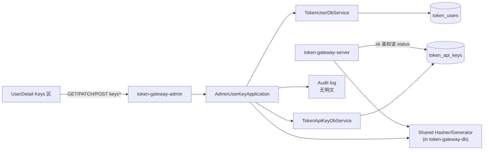
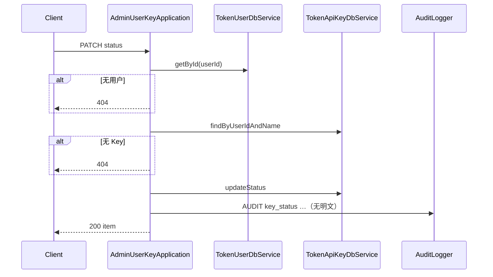
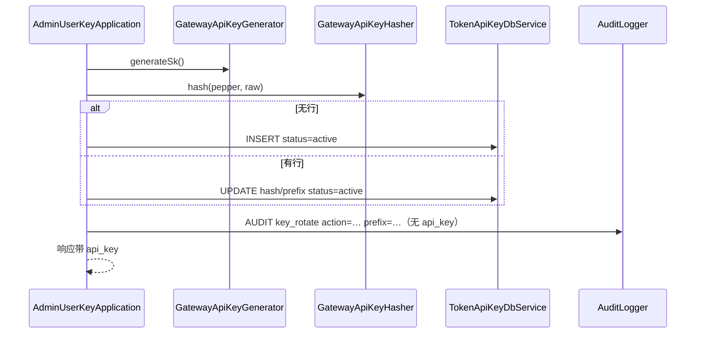

# US-G6-05 用户 API Key 管理设计

> **用户故事**：[../02-用户故事.md](../02-用户故事.md) · US-G6-05  
> **状态**：编码已落地（待联调验收）  
> **范围**：`token-gateway-admin` 按用户列出 Key、启停 Key；**Should** 强制 rotate（明文仅一次）；**永不**回传 `key_hash` / 完整 sk（除 rotate 响应）；替代 `ops/disable_key_by_name.sql`  
> **需求映射**：执行计划 [../16-管理端执行计划.md](../16-管理端执行计划.md) 阶段 C4 / A6、A10、A11；哈希约定 [US-G0-06](./US-G0-06-按名签发重置Key设计.md)；鉴权 [GatewaySkAuthFacade](../../token-gateway-server/src/main/java/com/mfs/tokengateway/server/security/GatewaySkAuthFacade.java)  
> **依赖**：US-G6-01、US-G6-04（`user_id` 入口）；US-G0-06（生成/哈希语义）  
> **后续衔接**：US-G6-09（用户详情内 Key 区）；应急 SQL 降级为应急  
> **交互参考**：[`../designs/token-gateway-admin.pen`](../designs/token-gateway-admin.pen) · `screen/UserDetail` · KeysCard  
> **文档位置**：`token-gateway/docs/design/`

---

## 0. 相对故事 / 执行计划的澄清

| 原文措辞 | 本设计约定 |
|----------|------------|
| 「查看 Key」 | `GET /admin/v1/users/{id}/keys`：`name` / `prefix` / `status` / 时间；**无** hash、无全文 sk |
| 「启用/禁用」 | `PATCH …/keys/{name}/status`：`active` ↔ `disabled` |
| 「可选强制轮换」 | `POST …/keys/{name}/rotate` 为 **Should**（执行计划 O4）；Must 出门可不含 rotate，但详设冻结契约与抽共享方案 |
| 「禁用后消费方 401」 | **纠正为 403** `key_disabled`（与现网 `GatewaySkAuthFacade` 一致；同 G6-04 对账户禁用的口径修正） |
| 「禁止哈希分叉」 | rotate **不得**在 admin 复制一份 hasher；须抽到双方可依赖的共享模块（见 Q12） |
| 写操作追责 | 启停 / rotate 均必填 `operator` + `note`；审计日志；不改表加列 |

---

## 1. 已确认选型

| 项 | 决定 |
|----|------|
| **Q1 进程与前缀** | 仅 admin；路径挂在 **`/admin/v1/users/{userId}/keys*`**；禁止挂到 server `/v1/*` |
| **Q2 鉴权** | 内网匿名；写路径 `operator`/`note` + 审计 |
| **Q3 用户定位** | 路径 `userId` = `token_users.id`；用户不存在 → **404** `user_not_found` |
| **Q4 Key 定位** | 路径 `{name}` = `token_api_keys.name`（URL 解码后 **lower-case**，规则同 G0-06）；不存在 → **404** `key_not_found` |
| **Q5 列表字段** | `id`、`name`、`prefix`（=`key_prefix`）、`status`、`created_at`、`updated_at`、`last_used_at`；**禁止**序列化 `key_hash` |
| **Q6 状态枚举** | 仅 `active` / `disabled`；写入前 trim + 小写 |
| **Q7 启停副作用** | **只改**该 Key 行 `status`；不改账户 status；不改其它 name |
| **Q8 禁用后行为** | 该 sk 调 Chat/Search → **403** `key_disabled`；同用户其它 active Key 不受影响；账户仍 `active` |
| **Q9 启用后行为** | 原 sk（hash 未变）立即恢复可用；**无需** rotate |
| **Q10 幂等启停** | 目标 status 已是当前 → **200** + 当前项；仍记审计（`noop=true`） |
| **Q11 rotate 优先级** | **Should**；Must 验收以列表 + 启停为准（A6/A10）；A11 可选 |
| **Q12 哈希复用（拍板）** | 编码 rotate 前，将 `GatewayApiKeyHasher` + `GatewayApiKeyGenerator` **下沉到 `token-gateway-db`**（或极小 `token-gateway-crypto` 模块，优先 **db 包**以免新模块膨胀）；server 改为依赖共享类；admin **禁止** Maven 依赖 `token-gateway-server` |
| **Q13 rotate Pepper** | admin 使用与 server 相同配置键：`token-gateway.key.pepper` ← `GATEWAY_KEY_PEPPER`；未配置则 rotate → **500** `pepper_not_configured`（启停不受影响） |
| **Q14 rotate 语义** | 对该 `userId`+`name`：**已有行**则 UPDATE `key_hash`/`key_prefix`/`status=active`；**无行**则 INSERT（运维可为已存在用户补发某 name）；响应含明文一次 + `action=created\|rotated` |
| **Q15 rotate vs 账户 disabled** | **允许**在账户 `disabled` 时强制 rotate（与用户自助 G0-06 不同：运维可先换钥再启用账户）；审计标明 `account_status` |
| **Q16 rotate vs Key disabled** | 允许；rotate 后 **status 置回 `active`**（对齐 G0-06） |
| **Q17 明文安全** | 响应 JSON 含 `api_key`；**禁止**打进应用日志 / 审计日志；审计只记 `user_id`/`name`/`action`/`prefix`/`operator` |
| **Q18 物理删除** | **不提供** DELETE Key 行 |
| **Q19 错误体** | `{code,message}`；复用 `AdminApiException` / `AdminRestExceptionHandler` |
| **Q20 name 校验** | 同 G0-06：1～64；`[a-z0-9._-]`；路径段先 decode 再 lower-case |

---

## 2. 目标与非目标

### 2.1 目标

1. 运营在用户详情上下文中查看该用户全部命名 Key（前缀可辨认）。  
2. 运营可禁用/启用单个 Key，替代 `ops/disable_key_by_name.sql`。  
3.（Should）运营可强制 rotate，旧 sk 立即失效，新明文仅一次。  
4. 哈希/生成算法与 G0-06 **单源**，无分叉。

### 2.2 非目标

| 不做 | 归属 |
|------|------|
| 用户自助 `POST /v1/keys/rotate` 改造 | 仍 G0-06 / G4 面板 |
| Admin 依赖 server 模块 | **禁止** |
| 列表回 hash / 历史明文 | **禁止** |
| 批量禁用户下全部 Key | Could；本期按 name 单条 |
| 改 Key `name`、物理删行 | 禁止 |
| 管理端登录 | 后续阶段 |
| Vue 完整五页 | US-G6-09；本 API 可供用户详情增量接入 |

---

## 3. 架构



### 3.1 包职责（建议）

| 类 | 职责 |
|----|------|
| `AdminUserKeyController` | `/admin/v1/users/{userId}/keys` |
| `AdminUserKeyApplication` | 列表、启停、rotate 编排 |
| `TokenApiKeyDbService` | `listByUserId`（已有）、`updateStatus`、`save/update` hash |
| `GatewayApiKeyHasher` / `Generator` | **迁入 db（或 crypto）**；server/admin 共用 |
| DTO | 列表项、启停请求、rotate 响应（含一次性 `api_key`） |

### 3.2 与 G6-04 / G0-06 边界

| 能力 | G6-04 | G6-05 | G0-06 |
|------|-------|-------|-------|
| 账户启停 | ✅ | — | — |
| Key 计数摘要 | ✅（已有） | 列表补全 | — |
| Key 启停 | — | ✅ Must | — |
| 用户自助 rotate | — | — | ✅ |
| 运营强制 rotate | — | ✅ Should | — |

---

## 4. 数据模型

### 4.1 `token_api_keys`（可写 status / hash）

| 列 | 列表 API | rotate |
|----|----------|--------|
| `id` | 是 | — |
| `user_id` | 不回（已在路径） | — |
| `name` | 是 | 路径 |
| `key_prefix` | 是 → `prefix` | 更新 |
| `key_hash` | **永不回** | 更新 |
| `status` | 是 | rotate 后 `active` |
| `created_at` / `updated_at` / `last_used_at` | 是 | — |

### 4.2 DbService 增补（建议）

```java
boolean updateStatus(long userId, String name, String status);
TokenApiKey requireByUserIdAndName(long userId, String name); // null → 上层 404
```

`listByUserId` 已存在（G4-08 / G6-04 计数复用）。

---

## 5. HTTP API

### 5.1 `GET /admin/v1/users/{userId}/keys`

- 用户不存在 → 404 `user_not_found`  
- 无 Key → **200** `items: []`  

```json
{
  "user_id": 42,
  "items": [
    {
      "id": 7,
      "name": "ftcs-desktop",
      "prefix": "sk-Ab12CdEf",
      "status": "active",
      "created_at": "2026-06-01T10:12:00.000Z",
      "updated_at": "2026-08-01T09:00:00.000Z",
      "last_used_at": "2026-08-09T18:40:00.000Z"
    }
  ]
}
```

排序：`name ASC`（与面板一致）。

### 5.2 `PATCH /admin/v1/users/{userId}/keys/{name}/status`

**Body**

```json
{
  "status": "disabled",
  "operator": "zhangsan",
  "note": "客户端疑似泄露，先禁该 name"
}
```

| 结果 | HTTP |
|------|------|
| 成功 / noop | 200 + 单条 Key 视图（同列表项） |
| 非法 status / 缺 operator·note | 400 |
| 无用户 / 无 Key | 404 |

### 5.3 `POST /admin/v1/users/{userId}/keys/{name}/rotate`（Should）

**Body**

```json
{
  "operator": "zhangsan",
  "note": "客服确认丢钥，运营代发"
}
```

**成功 200**

```json
{
  "action": "rotated",
  "user_id": 42,
  "name": "ftcs-desktop",
  "prefix": "sk-Xy98...",
  "status": "active",
  "api_key": "sk-……明文仅此一次……"
}
```

| 错误 | code（建议） |
|------|----------------|
| 无 pepper | 500 `pepper_not_configured` |
| 无用户 | 404 `user_not_found` |
| name 非法 | 400 `invalid_name` |
| hash 唯一冲突耗尽 | 409 `key_hash_conflict` |

无行时 `action=created`（INSERT）；有行 `action=rotated`。

### 5.4 明确不提供

| 方法 | 说明 |
|------|------|
| `DELETE …/keys/{name}` | 禁止物理删 |
| `GET` 回 hash | 禁止 |
| 全局「所有用户 Key」列表 | 本期不做；一律挂在 user 下 |

---

## 6. 应用层行为

### 6.1 启停



### 6.2 强制 rotate（Should）



### 6.3 审计格式（建议）

```
AUDIT key_status operator={} note={} user_id={} name={} from={} to={} noop={} client={}
AUDIT key_rotate operator={} note={} user_id={} name={} action={} prefix={} account_status={} client={}
```

### 6.4 共享下沉步骤（rotate 编码前门禁）

1. 将 `GatewayApiKeyHasher`、`GatewayApiKeyGenerator`（及单测）移到 `token-gateway-db` 合适包（如 `…db.security`）。  
2. server 改 import，确认 G0-06 / 鉴权单测全绿。  
3. admin 引入 pepper 配置 + rotate。  
4. **禁止**在 admin 内再写一份 SHA-256 拼接逻辑。

---

## 7. 与前端契约（G6-09 / 用户详情增量）

| 项 | 约定 |
|----|------|
| 位置 | 用户详情页「API Key」卡片（Pencil KeysCard） |
| 列表 | 展示 name、prefix、status、last_used；无 hash |
| 操作 | 每行「禁用/启用」；可选「强制轮换」 |
| 启停 | 确认框 + operator/note |
| 轮换 | 二次确认；成功弹窗展示明文 +「仅显示一次」+ 复制按钮；关闭后不可再查 |
| 禁止 | 编辑 name、删除行、展示 hash |

---

## 8. 验收用例

| ID | 步骤 | 期望 | 优先级 |
|----|------|------|--------|
| K1 | `GET …/keys` 有数据 | 见 name/prefix/status；JSON 无 `key_hash`/`api_key` | Must |
| K2 | 无 Key 用户 | `items: []` | Must |
| K3 | PATCH → disabled | DB status=disabled；审计有 | Must |
| K4 | 禁用后该 sk 调 Chat/Search | **403** `key_disabled` | Must |
| K5 | PATCH → active | 同 sk 恢复 | Must |
| K6 | 缺 note | 400 | Must |
| K7 | 错误 name | 404 `key_not_found` | Must |
| K8 |（可选）rotate | 旧 sk 401/invalid；新明文一次；库 hash 变；status=active | Should |
| K9 | rotate 响应后再次 GET | 仅见新 prefix；无明文 | Should |
| K10 | 无 DELETE | 无成功删路径 | Must |

---

## 9. 编码任务清单

1. Must：`updateStatus` + `AdminUserKeyApplication` 列表/启停 + Controller + 单测。  
2. 前端：用户详情挂 Key 表与启停（可与 Must 同 PR）。  
3. Should：Hasher/Generator 下沉 db → server 改依赖 → admin rotate + pepper 配置 + 单测。  
4. `ops/disable_key_by_name.sql` 头注释改为应急。  
5. 更新 README / `02` / `16` 状态。

---

## 10. 开放问题（残留）

| ID | 项 | 倾向 |
|----|----|------|
| O1 | rotate 是否允许「创建尚不存在的 name」 | **是**（`action=created`），便于运维补客户端 |
| O2 | 共享类放 db 还是独立 crypto 模块 | **优先 db**；若污染域模型再拆 |
| O3 | 禁用 Key 后用户自助 rotate 是否仍允许 | **仍允许**（G0-06 不变）；与运营强制 rotate 并存 |
| O4 | Must 是否捆绑 rotate | **否**（O4 执行计划）；详设先冻结契约 |

---

## 11. 文档同步（详设评审通过后）

| 文档 | 动作 |
|------|------|
| [02-用户故事.md](../02-用户故事.md) US-G6-05 | 详设链接；验收口径改为 403 |
| [16-管理端执行计划.md](../16-管理端执行计划.md) | 阶段 B 标详设已写；A6 确认 Key 为 403 |
| [US-G0-06](./US-G0-06-按名签发重置Key设计.md) | 补一句：运营强制 rotate 见 US-G6-05；hasher 将下沉共享 |
| [US-G6-04](./US-G6-04-用户管理设计.md) | 非目标表已指向本故事 |
| `ops/disable_key_by_name.sql` | 应急注释 |

---

## 12. 本故事不做 / 后续

| 不做 | 后续 |
|------|------|
| 登录后按角色限制谁能 rotate | 鉴权阶段 |
| Key 用量排行 / 全局 Key 检索 | 看板或另故事 |

---

## 13. 已拍板摘要（评审可用）

1. **Must**：按用户列 Key + 启停；无 hash；禁用 → **403** `key_disabled`。  
2. **Should**：强制 rotate；明文一次；hasher/generator **抽共享**，禁止分叉。  
3. 写操作一律 **operator/note** + 审计（审计不含明文）。  
4. **不**物理删 Key；**不**依赖 server 模块。
