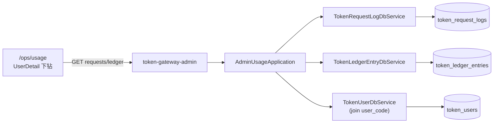

# US-G6-06 用户消费管理设计

> **用户故事**：[../02-用户故事.md](../02-用户故事.md) · US-G6-06  
> **状态**：编码已落地（待联调验收）  
> **范围**：`token-gateway-admin` **只读**查询 `token_request_logs`（计量/结算态）与 `token_ledger_entries`（默认 `type=charge` 消费流水）；支持按用户/时间/模型/`billing_status` 筛选；替代日常「查账」SQL  
> **需求映射**：执行计划 [../16-管理端执行计划.md](../16-管理端执行计划.md) 阶段 C5 / A9、A12；计量 [US-G0-09](./US-G0-09-价目表与两档计价设计.md) / 结算 [US-G0-10](./US-G0-10-异步结算扣费设计.md)；用户面板对照 [US-G4-03](./US-G4-03-Token消费记录设计.md)  
> **依赖**：US-G6-01、US-G6-04（`user_id` / `user_code` 入口）  
> **后续衔接**：US-G6-07（充值/调账写路径与 `topup`/`adjust` 展示主场）；US-G6-03（看板聚合）；US-G6-09（`/ops/usage` 页）  
> **交互参考**：[`../designs/token-gateway-admin.pen`](../designs/token-gateway-admin.pen) · `screen/Usage`（消费明细）  
> **文档位置**：`token-gateway/docs/design/`

---

## 0. 相对故事 / 执行计划 / Pencil 的澄清

| 原文措辞 | 本设计约定 |
|----------|------------|
| 「按用户/时间查看消费流水与请求日志」 | **两套只读列表**：① `token_request_logs`（排障主视图，含 `billing_status`）；② `token_ledger_entries` 且默认 `type=charge`（对账金额） |
| 「可见 billing_status」 | 请求列表/详情必回；可按状态筛选（含 `settle_failed`） |
| 执行计划路径草图 | 同时提供 **按用户** `…/users/{id}/requests|ledger` 与 **全局** `…/requests|ledger`（`user_id` 可选）；UI `/ops/usage` 走全局 + 筛选项 |
| Pencil「导出 CSV」 | **Could**（本期可不做）；Must 以可查分页为准（A9） |
| Pencil「金额 USD」文案 | **纠正为人民币元**（厘÷1000）；库内仍为厘 |
| Pencil「今日合计」底栏 | **Should**：列表响应带回 `total`；可选轻量 `summary`（窗内笔数/消费额）；非 Must |
| 与 G4-03 | G4 = 本人 ticket、隐藏 COGS/毛利；G6 = 跨用户、内网可看更多排障字段；**禁止**复制分叉查询逻辑时可抽 DbService 共用 |

---

## 1. 已确认选型

| 项 | 决定 |
|----|------|
| **Q1 进程与前缀** | 仅 admin；`/admin/v1/requests*`、`/admin/v1/ledger*`；禁止挂到 server `/v1/*` |
| **Q2 鉴权** | 内网匿名；本故事 **无写路径**（无 operator/note） |
| **Q3 双数据源** | **Must**：request_logs + ledger(`charge`)；二者经 `request_id` 关联下钻 |
| **Q4 主 UI 数据源** | `/ops/usage` **以 request_logs 为主表**（对齐 Pencil：模型/用量/`billing_status`）；ledger 作「消费流水」Tab 或侧栏 |
| **Q5 金额口径** | 消费额以 ledger `charge.amount_li`（负）与 request `revenue_li`（正、用户侧扣费）对照；**不以** `pending` 当已消费（与执行计划看板口径一致） |
| **Q6 金额展示** | API 同时回 `*_li` + `*_yuan`（`li/1000`，HALF_UP 三位小数，复用 `AdminMoney`）；**禁止**对外写「厘」进 UI 文案 |
| **Q7 COGS / 毛利** | 列表 **默认不强制**（A9）；详情 **Should** 回 `cogs_li`/`margin_li`（及 yuan）；前端可用开关「显示成本」 |
| **Q8 时间窗** | 未传 `from`：默认 **近 7 天**（UTC，`created_at >= now-7d`）；`from`～`to` 跨度 **≤ 90 天** → 否则 400 `invalid_time_range` |
| **Q9 分页** | `page`（从 1）+ `size`（默认 **20**，最大 **100**）+ `total`；与 G6-04 一致。深翻页性能恶化时再改键集（开放 O2） |
| **Q10 排序** | request / ledger 均默认 `created_at DESC`；request 次键 `request_id DESC`；ledger 次键 `id DESC` |
| **Q11 筛选（request）** | 可选：`user_id`、`q`（`user_code` 模糊 **或** `request_id` 精确优先）、`model`、`billing_status`、`key_name`、`status`（success/error/interrupted）、`from`/`to` |
| **Q12 筛选（ledger）** | 可选：`user_id`、`type`（默认 **`charge`**；允许 `topup`/`adjust`/`all` 只读浏览）、`request_id`、`from`/`to`；`operator` 精确筛（Should） |
| **Q13 按用户路径** | `GET /admin/v1/users/{id}/requests`、`…/ledger` ≡ 全局接口强制 `user_id={id}`；用户不存在 → **404** `user_not_found` |
| **Q14 详情** | `GET /admin/v1/requests/{requestId}`：单条计量 + 若有则挂 `ledger_charge` 摘要；无行 → 404 `request_not_found` |
| **Q15 敏感字段** | **永不**回 prompt/completion 全文（表内本无）；`error_summary` 可回；`settle_owner` / `settle_claimed_at` 仅详情 Should（排障 `settle_failed`） |
| **Q16 Token 列** | 列表回 `prompt_tokens` / `completion_tokens`；`cached_tokens`/`uncached_tokens` 仅详情 Should |
| **Q17 搜索按次** | `model=tavily.search` 自然出现；UI 可将用量提示为「按次」（`prompt_tokens=1`）；不单独子系统 |
| **Q18 写/重试结算** | **禁止**；改 `billing_status`、补价后重扫属运维/G0 增强，不在本故事 |
| **Q19 CSV 导出** | **Could**；若做：同源筛选、上限行数（如 5000）、同步下载；不阻塞 Must |
| **Q20 错误体** | `{code,message}`；复用 `AdminApiException` / `AdminRestExceptionHandler` |
| **Q21 时区** | 库 UTC；API `Instant`/`…Z`；UI 本地展示 |

---

## 2. 目标与非目标

### 2.1 目标

1. 运营可在 `/ops/usage` 跨用户翻页查看近期请求计量与结算态，快速定位 `settle_failed` / 异常 `error_summary`。  
2. 运营可按用户从详情下钻同一套数据。  
3. 运营可核对 `charge` 流水金额与请求 `revenue` 是否对齐（经 `request_id`）。  
4. 替代日常「查 `token_request_logs` / `token_ledger_entries`」SQL。

### 2.2 非目标

| 不做 | 归属 |
|------|------|
| 人工 topup / adjust 写路径 | US-G6-07 |
| 看板 KPI / 日趋势图 | US-G6-02/03 |
| 用户面板本人消费 | US-G4-03 |
| 改结算态 / 强制重算 | 运维应急或后续故事 |
| 实时 SSE / 推送 | 不做 |
| 管理端登录 | 后续阶段 |
| 依赖 `token-gateway-server` | **禁止**；查询落 `token-gateway-db` |

---

## 3. 架构



### 3.1 包职责（建议）

| 类 | 职责 |
|----|------|
| `AdminUsageController` | `/admin/v1/requests`、`/admin/v1/ledger` |
| `AdminUserUsageController`（或同 Controller） | `/admin/v1/users/{id}/requests|ledger` |
| `AdminUsageApplication` | 时间窗规范化、筛选、DTO 映射、join user |
| `TokenRequestLogDbService` | 增补 `pageForAdmin(...)` |
| `TokenLedgerEntryDbService` | 增补 `pageForAdmin(...)` |
| DTO | 列表项、详情、分页壳 |

### 3.2 与 G4-03 / G6-07 边界

| 能力 | G4-03 | G6-06 | G6-07 |
|------|-------|-------|-------|
| 本人 request 列表 | ✅ | — | — |
| 跨用户 request / charge | — | ✅ | — |
| 看 `billing_status` | ✅（本人） | ✅ | — |
| 看 COGS/毛利 | ❌ | Should 详情 | — |
| topup/adjust 写入 | — | — | ✅ |
| 只读浏览 topup 行 | — | 可选（ledger `type`） | 主场 |

---

## 4. 数据模型与索引

### 4.1 `token_request_logs`（只读）

| 列 | 列表 | 详情 |
|----|------|------|
| `request_id` | ✅ | ✅ |
| `user_id` | ✅ | ✅ |
| `key_name` | ✅ | ✅ |
| `key_id` | — | Should |
| `model` / `status` / `billing_status` | ✅ | ✅ |
| `prompt_tokens` / `completion_tokens` | ✅ | ✅ |
| `cached_tokens` / `uncached_tokens` | — | Should |
| `revenue_li` | ✅（+ yuan） | ✅ |
| `cogs_li` / `margin_li` | 默认不回 | Should |
| `latency_ms` / `upstream_status` | Should | ✅ |
| `error_summary` | ✅（可截断展示） | ✅ |
| `settle_owner` / `settle_claimed_at` | — | Should |
| `created_at` | ✅ | ✅ |

### 4.2 `token_ledger_entries`（只读）

| 列 | 列表 |
|----|------|
| `id` / `user_id` / `type` | ✅ |
| `amount_li` / `balance_after_li` | ✅（+ yuan） |
| `request_id` | ✅（charge 通常有；topup/adjust 可空） |
| `note` / `operator` | ✅（charge 多为空） |
| `created_at` | ✅ |

`type` 枚举：`charge` | `topup` | `adjust`（与 G0-02 一致）。

### 4.3 索引（已有，查询须贴合）

| 场景 | 倾向索引 |
|------|----------|
| 按用户 + 时间 | `idx_token_req_user_time` / `idx_token_ledger_user_time` |
| 全局按时间 + type | `idx_token_ledger_type_time` |
| 按 `billing_status` + 时间 | `idx_token_req_billing_time` |
| 按 model + 时间 | `idx_token_req_model_time` |

`q=user_code`：先查 `token_users` 得 id 再滤；`q=request_id`：精确等值优先（疑似 ULID/UUID 形态时）。

### 4.4 DbService 增补（建议）

```text
IPage<TokenRequestLog> pageForAdmin(AdminRequestQuery q, int page, int size);
TokenRequestLog findByRequestId(String requestId);

IPage<TokenLedgerEntry> pageForAdmin(AdminLedgerQuery q, int page, int size);
```

分页实现对齐 G6-04：安全整型 `LIMIT offset,size`（无 jsqlparser 插件依赖）。

---

## 5. HTTP API

### 5.1 `GET /admin/v1/requests`

**Query**

| 参数 | 说明 |
|------|------|
| `user_id` | 可选 |
| `q` | 可选；`user_code` LIKE 或 `request_id` 精确 |
| `model` | 可选精确（含 `tavily.search`） |
| `billing_status` | 可选；枚举见下 |
| `key_name` | 可选精确 |
| `status` | 可选：`success`/`error`/`interrupted` |
| `from` / `to` | ISO-8601；缺省见 Q8 |
| `page` / `size` | 分页 |

`billing_status` 合法值：`pending` | `settling` | `charged` | `skipped_no_usage` | `settle_failed`。

**200**

```json
{
  "page": 1,
  "size": 20,
  "total": 18422,
  "window": {
    "from": "2026-08-02T12:00:00.000Z",
    "to": "2026-08-09T12:00:00.000Z"
  },
  "items": [
    {
      "request_id": "01J…",
      "created_at": "2026-08-09T10:12:01.123Z",
      "user_id": 42,
      "user_code": "u_91bb04",
      "tenant_id": "tenant_acme",
      "key_name": "ftcs-desktop",
      "model": "deepseek-v4-flash",
      "status": "success",
      "billing_status": "charged",
      "prompt_tokens": 1200,
      "completion_tokens": 340,
      "revenue_li": 5,
      "revenue_yuan": "0.005",
      "latency_ms": 820,
      "error_summary": null
    }
  ]
}
```

### 5.2 `GET /admin/v1/requests/{requestId}`

**200**：上表字段全集 + Should 成本/缓存/settle_* + 可选：

```json
"ledger_charge": {
  "id": 9001,
  "amount_li": -5,
  "amount_yuan": "-0.005",
  "balance_after_li": 2449995,
  "created_at": "2026-08-09T10:12:02.000Z"
}
```

无关联 charge 时 `ledger_charge: null`（pending / settle_failed 常见）。

### 5.3 `GET /admin/v1/ledger`

**Query**：`user_id`、`type`（默认 `charge`；`all` 表示不限）、`request_id`、`operator`、`from`/`to`、`page`/`size`。

**200**

```json
{
  "page": 1,
  "size": 20,
  "total": 120,
  "window": { "from": "…", "to": "…" },
  "items": [
    {
      "id": 9001,
      "user_id": 42,
      "user_code": "u_91bb04",
      "tenant_id": "tenant_acme",
      "type": "charge",
      "amount_li": -5,
      "amount_yuan": "-0.005",
      "balance_after_li": 2449995,
      "balance_after_yuan": "2449.995",
      "request_id": "01J…",
      "note": null,
      "operator": null,
      "created_at": "2026-08-09T10:12:02.000Z"
    }
  ]
}
```

### 5.4 按用户别名

| 方法 | 等价 |
|------|------|
| `GET /admin/v1/users/{id}/requests` | `GET /admin/v1/requests?user_id={id}` + 用户存在校验 |
| `GET /admin/v1/users/{id}/ledger` | `GET /admin/v1/ledger?user_id={id}` + 用户存在校验 |

### 5.5 明确不提供

| 方法 | 说明 |
|------|------|
| PATCH/POST 结算态 | 禁止 |
| 强制重算 / 补扣 | 禁止 |
| CSV（Must） | Could，见 Q19 |

---

## 6. 应用层行为

### 6.1 时间窗

```text
to   = 请求 to 或 now(UTC)
from = 请求 from 或 to - 7d
若 to < from 或 (to - from) > 90d → 400 invalid_time_range
```

响应回显 `window`，便于 UI「当前筛选窗口」提示。

### 6.2 `q` 解析（建议）

1. trim；空则忽略。  
2. 若整串匹配「像 request_id」（长度≥8 且无空白）→ 先 `request_id = q`；命中则直接该行（仍受时间窗？**倾向：精确 request_id 时放宽时间窗**，避免客服贴 id 却因默认 7 天漏掉——拍板：**精确 request_id 查询忽略 from/to**）。  
3. 否则按 `user_code LIKE %q%` 解析出 user_id 集合（上限如 200 个 id，超出 400 `query_too_broad`）。

### 6.3 Join 用户展示

列表批量 `IN user_id` 查 `token_users` 填 `user_code`/`tenant_id`；缺失用户（脏数据）则码字段 null，不 500。

### 6.4 金额映射

- `revenue_yuan` ← `revenue_li`；未结算 `revenue_li == null` → yuan **null**（UI「—」，勿显示 0.00）。  
- ledger `amount_yuan` ← `amount_li`（charge 为负）。

---

## 7. 与前端契约（G6-09 / `/ops/usage`）

对齐 Pencil `screen/Usage`，口径修正如下：

| Pencil | 本设计 |
|--------|--------|
| 筛选：user_code / request_id、模型、结算、日期 | ✅ 对接 §5.1 |
| 表列：时间、用户、模型、用量、金额、状态、请求 ID | ✅；金额列用 **元**（非 USD） |
| 状态色：已结算/结算中/失败 | 映射 `charged` / `settling` / `settle_failed`（另有 pending、skipped 用中性色） |
| 导出 CSV | Could |
| 底栏今日合计 | Should：可用当前 `total` + 可选 summary；「今日」须标注时区 |

**交互**

1. 默认近 7 天、结算=全部。  
2. 行点击 → 抽屉/详情页调 `GET …/requests/{id}`（见 COGS、settle_*、关联 charge）。  
3. 用户详情「查看消费」→ `/ops/usage?user_id=` 预填。  
4. 第二 Tab「消费流水」→ `GET …/ledger?type=charge`（同筛选用户/时间）。  
5. **无**改状态按钮。

---

## 8. 验收用例

| ID | 步骤 | 期望 | 优先级 |
|----|------|------|--------|
| U1 | `GET /requests` 默认窗 | 近 7 天分页；含 `billing_status`；有 `user_code` | Must |
| U2 | `billing_status=settle_failed` | 仅失败行 | Must |
| U3 | `GET /ledger` 默认 | 仅 `type=charge`；金额为负厘/元 | Must |
| U4 | `users/{id}/requests` 无用户 | 404 `user_not_found` | Must |
| U5 | 精确 `q=request_id` | 命中且不受默认 7 天漏查 | Must |
| U6 | 跨度 >90 天 | 400 `invalid_time_range` | Must |
| U7 | 详情含关联 charge | `ledger_charge.amount_li` 与 `-revenue_li` 一致（已 charged） | Must |
| U8 | 与 G4 对照 | 同用户本人面板可见行 ⊆ admin 可见 | Must（A12） |
| U9 | 详情见 cogs/margin | 内网可查 | Should |
| U10 | CSV | 可选 | Could |

---

## 9. 编码任务清单

1. DbService：`pageForAdmin`（request + ledger）+ 单测时间窗/筛选。  
2. `AdminUsageApplication` + Controller + DTO。  
3. 前端 `/ops/usage`：筛选项 + 请求表 + 详情抽屉 + ledger Tab（可与 API 同 PR 或跟 G6-09）。  
4. 文档状态同步。

---

## 10. 开放问题（残留）

| ID | 项 | 倾向 |
|----|----|------|
| O1 | 默认时间窗 7 天 vs 30 天 | **7 天**（运营排障更贴近期；可一键切 30） |
| O2 | 高量后是否改键集分页 | MVP 用 page/size；恶化再改 |
| O3 | 全局 ledger 是否默认隐藏 topup | **默认 type=charge**；`all` 可看 |
| O4 | CSV 是否进本故事 | **Could**；不挡验收 |
| O5 | summary「今日合计」是否独立 API | 先做列表 `total`；汇总可复用 G6-03 |

---

## 11. 文档同步（详设评审通过后）

| 文档 | 动作 |
|------|------|
| [02-用户故事.md](../02-用户故事.md) US-G6-06 | 挂详设链接 |
| [16-管理端执行计划.md](../16-管理端执行计划.md) | 阶段 B 标详设已写；故事节补链接 |
| [US-G4-03](./US-G4-03-Token消费记录设计.md) | 补一句：跨用户管理端见 US-G6-06 |
| [US-G6-04](./US-G6-04-用户管理设计.md) | 非目标已指向本故事 |

---

## 12. 本故事不做 / 后续

| 不做 | 后续 |
|------|------|
| 登录后按角色限制看 COGS | 鉴权阶段 |
| 按 model 饼图 | G6-03 |
| 自动告警 settle_failed | G2 / 运维 |

---

## 13. 已拍板摘要（评审可用）

1. **Must**：跨用户 / 按用户查询 **request_logs**（含 `billing_status`）与 **ledger charge**；默认近 7 天、最大 90 天；page 分页。  
2. **主 UI**：`/ops/usage` 以请求计量为主；流水为辅；金额用**元**。  
3. **只读**：不改结算态；COGS/毛利详情 Should、列表不强制。  
4. **精确 request_id 查询忽略默认时间窗**，避免客服漏查。  
5. CSV / 今日合计栏为 Could/Should，不挡 A9。
