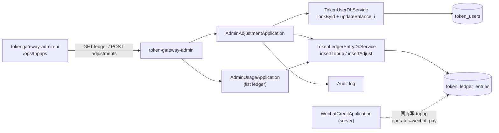

# US-G6-07 用户充值与调账设计

> **用户故事**：[../02-用户故事.md](../02-用户故事.md) · US-G6-07  
> **状态**：编码已落地（单测通过；`/ops/topups` 列表 + 调账；待联调验收）  
> **范围**：`token-gateway-admin` 提供 **人工 `topup` / `adjust` 写路径**（同事务改 `balance_li` + 写 `token_ledger_entries`），以及充值/调账流水只读列表（复用并扩展 G6-06 ledger 查询）；替代日常 `ops/topup_example.sql` / US-G0-15 改库  
> **需求映射**：执行计划 [../16-管理端执行计划.md](../16-管理端执行计划.md) 阶段 C3 / A7～A8；账本 [US-G0-02](./US-G0-02-计费库表与厘单位设计.md) §7；改库约定 US-G0-15；微信入账对照 [US-G3-02](./US-G3-02-微信支付回调幂等入账设计.md)（**不改**回调）  
> **依赖**：US-G6-01、US-G6-04（`user_id` 入口）；只读列表可复用 US-G6-06 的 `GET /admin/v1/ledger*`  
> **后续衔接**：US-G6-03（看板 topup KPI，主图不含 adjust）；US-G6-09（`/ops/topups` 页）  
> **交互参考**：[`../designs/token-gateway-admin.pen`](../designs/token-gateway-admin.pen) · `screen/Topups`  
> **文档位置**：`token-gateway/docs/design/`

---

## 0. 相对故事 / 执行计划 / Pencil 的澄清

| 原文措辞 | 本设计约定 |
|----------|------------|
| 「查看充值记录」 | `/ops/topups` 以 ledger 为主表；默认看 **`credits` = `topup` + `adjust`**（不含 `charge`）；可筛单类型 / operator / 来源 |
| 「人工 topup/adjust」 | 唯一写入口：`POST /admin/v1/users/{id}/adjustments`；**禁止**只改余额不写流水 |
| 「与微信 topup 可区分」 | 微信入账 `operator=wechat_pay`（G3-02 已固定）；人工禁止冒充该值；列表回 `source=wechat\|manual` |
| 「替代 topup SQL」 | 日常走 admin；`ops/topup_example.sql` 降为应急；语义与 SQL 示例一致 |
| 执行计划 A8「不过扣成负」 | **本故事写路径**：`balance_after_li < 0` → **400** `balance_would_be_negative`（与 G0-02「应用保证 ≥0」对齐；**不**改变 G0-10 charge 可扣负的既有行为） |
| 微信自助单笔 1～100 元 | **不**套用到人工调账；人工可更大额（见 Q11 防呆上限） |
| Pencil「导出」等 | **Could**；Must 以分页可查 + 调账成功为准 |

---

## 1. 已确认选型

| 项 | 决定 |
|----|------|
| **Q1 进程与前缀** | 仅 admin；写路径 `/admin/v1/users/{id}/adjustments`；列表复用 `/admin/v1/ledger*`；**禁止**挂到 server |
| **Q2 鉴权** | 内网匿名；写路径 `operator`/`note` **必填** + INFO 审计日志（同 G6-04/05/10） |
| **Q3 事务** | `@Transactional` + `TokenUserDbService.lockById`（`SELECT … FOR UPDATE`）→ 算新余额 → `updateBalanceLi` → `INSERT` ledger；对齐 `WechatCreditApplication` |
| **Q4 type 语义** | `topup`：人工/客服**充值**，`amount_li` **必须 > 0**；`adjust`：**调账纠错**，`amount_li ≠ 0`（可正可负） |
| **Q5 符号** | ledger `amount_li` **充正扣负**（G0-02）；`balance_after_li` = 锁后余额 + `amount_li` |
| **Q6 负余额** | 本写路径：**拒绝**结果余额 &lt; 0；已为负的账户仍允许 **正额** topup/adjust 以回正 |
| **Q7 禁用账户** | `status=disabled` **仍允许**调账（客服补救/退费扣回）；不自动改 status |
| **Q8 列表数据源** | **账本主场**：只读 `token_ledger_entries`（credits）；**订单辅表**见 [US-G6-11](./US-G6-11-充值页微信订单联动设计.md)（`token_wechat_pay_orders`，含未入账单） |
| **Q9 列表默认** | `/ops/topups` → `GET /admin/v1/ledger?type=credits`（`topup`∪`adjust`）；时间窗默认近 **7** 天、最大 **90** 天（同 G6-06） |
| **Q10 金额入参** | body 二选一：`amount_li`（整数厘）**或** `amount_yuan`（十进制元）；**禁止**同时传且不一致；优先建议 UI 传元 |
| **Q11 金额上限** | 单笔 `|amount_li|` ≤ **100_000_000**（10 万元）；超出 → 400 `amount_too_large`（防呆，非产品套餐） |
| **Q12 金额下限** | `topup`：`amount_li ≥ 1`；`adjust`：`|amount_li| ≥ 1`（禁止 0） |
| **Q13 operator 保留字** | 人工请求 **禁止** `operator` 等于 `wechat_pay`（大小写不敏感 trim 后）→ 400 `reserved_operator` |
| **Q14 request_id** | 人工流水 **`request_id=null`**（与 G0 UNIQUE + 多 NULL 约定一致）；**禁止**客户端传入 |
| **Q15 来源展示** | 响应增补只读字段 `source`：`operator==wechat_pay` → `wechat`；否则（且 type∈topup/adjust）→ `manual`；`charge` 可空或不在本页 |
| **Q16 分页/排序** | 同 G6-06：`page`/`size`/`total`；`created_at DESC, id DESC` |
| **Q17 幂等** | **无**业务幂等键（人工可连点两笔）；UI 提交中禁用按钮；依赖 operator/note 审计追责 |
| **Q18 错误体** | `{code,message}`；复用 `AdminApiException` |
| **Q19 共享代码** | 余额更新/锁用户复用 `token-gateway-db` 已有方法；ledger 增 `insertAdjust`；**禁止**依赖 server 模块或复制微信入账类 |
| **Q20 审计** | INFO：`user_id`、type、amount_li、balance_before/after、operator、note、client IP、ledger id |

---

## 2. 目标与非目标

### 2.1 目标

1. 运营可在 `/ops/topups` 翻页查看 topup/adjust（含微信 `wechat_pay` 入账），并区分来源。  
2. 运营可对指定用户做人工充值或调账，**同事务**余额与流水一致，留下 operator/note。  
3. 从用户详情可带 `user_id` 下钻到充值页或直接打开调账表单。  
4. 日常替代 `ops/topup_example.sql`；G0-15 仅保留应急。

### 2.2 非目标

| 不做 | 归属 |
|------|------|
| 改微信回调 / 查单入账逻辑 | G3-02/03 |
| 调微信退款 API / 自助退款 | G3-05 |
| 看板 KPI / 日趋势 | US-G6-03（主充值 KPI **不含** adjust，O3） |
| 消费 charge 写/重算 | G0-10；只读见 G6-06 |
| 用户面板合并人工 topup | G4-04 本期仍仅订单 |
| 管理端登录 / RBAC | 后续 |
| 依赖 `token-gateway-server` | **禁止** |

---

## 3. 架构



### 3.1 包职责（建议）

| 包 / 类 | 职责 |
|---------|------|
| `…admin.api.AdminAdjustmentController` | `POST …/adjustments` |
| `…admin.api.dto` | 请求/响应 DTO |
| `…admin.application.AdminAdjustmentApplication` | 校验、事务编排、审计 |
| `…db…TokenLedgerEntryDbService` | 增补 `insertAdjust`；列表支持 `type=credits`（IN topup,adjust） |
| `…admin.application.AdminUsageApplication` | 扩展 `type` 解析（`credits`）；列表 item 填 `source`（Should，本故事顺带） |

### 3.2 与 server / 微信边界

- admin **不调用** server HTTP、不发支付。  
- 微信入账继续只在 server；admin 只读看到其 ledger 行。  
- 锁用户粒度与微信入账相同，避免并发双写丢更新。

---

## 4. 数据模型

### 4.1 `token_ledger_entries`（写约定）

| 列 | 人工 topup/adjust | 微信 topup（只读对照） |
|----|-------------------|------------------------|
| `type` | `topup` 或 `adjust` | `topup` |
| `amount_li` | 入参；充正扣负 | `+amount` |
| `balance_after_li` | 锁后新余额 | 同左 |
| `request_id` | **NULL** | `wechat:{transaction_id}` |
| `operator` | 请求必填；≠ `wechat_pay` | `wechat_pay` |
| `note` | 请求必填；≤512 | `wechat recharge {out_trade_no}` |
| `created_at` | UTC now | UTC |

### 4.2 `token_users.balance_li`

- 本故事可写；G6-04 详情只读展示。  
- 更新必须与 ledger **同事务**。

### 4.3 写路径伪代码

```text
@Transactional
lock user by id
if missing → 404 user_not_found
validate type / amount / operator / note
before = balance_li ?? 0
after  = before + amount_li
if after < 0 → 400 balance_would_be_negative
updateBalanceLi(id, after)
INSERT ledger (type, amount_li, balance_after_li=after, operator, note, request_id=null)
audit log
return { ledger_id, balance_li, balance_yuan, … }
```

对齐现有示例：

```sql
-- ops/topup_example.sql（应急）；产品路径由 Application 等价实现
START TRANSACTION;
UPDATE token_users SET balance_li = balance_li + ?, updated_at = UTC_TIMESTAMP(3) WHERE id = ?;
INSERT INTO token_ledger_entries (…) SELECT id, 'topup', ?, balance_li, ?, ?, UTC_TIMESTAMP(3) FROM token_users WHERE id = ?;
COMMIT;
```

---

## 5. API 契约

### 5.1 `POST /admin/v1/users/{id}/adjustments`

**Path**：`id` = `token_users.id`（不存在 → 404 `user_not_found`）。

**Body**

```json
{
  "type": "topup",
  "amount_yuan": "10.000",
  "operator": "ops:alice",
  "note": "客服补救：微信已付未入账核对后补入"
}
```

或：

```json
{
  "type": "adjust",
  "amount_li": -5000,
  "operator": "ops:bob",
  "note": "对账纠错：多入 5 元扣回"
}
```

| 字段 | 规则 |
|------|------|
| `type` | 必填；仅 `topup` \| `adjust`（trim，小写） |
| `amount_li` / `amount_yuan` | 恰一有效；yuan→li：`×1000`，**必须整厘**（有超出厘精度的小数 → 400 `invalid_amount`） |
| `operator` | 必填；trim；1～128；禁止 `wechat_pay` |
| `note` | 必填；trim；1～512 |

**200**

```json
{
  "user_id": 42,
  "user_code": "u_91bb04",
  "tenant_id": "tenant_acme",
  "ledger_id": 9002,
  "type": "topup",
  "amount_li": 10000,
  "amount_yuan": "10.000",
  "balance_before_li": 0,
  "balance_before_yuan": "0.000",
  "balance_after_li": 10000,
  "balance_after_yuan": "10.000",
  "operator": "ops:alice",
  "note": "客服补救：…",
  "source": "manual",
  "created_at": "2026-08-09T13:00:00.000Z"
}
```

**错误**

| HTTP | code | 场景 |
|------|------|------|
| 404 | `user_not_found` | 用户不存在 |
| 400 | `validation_error` | 缺字段、type 非法、空 note |
| 400 | `invalid_amount` | 0 / 符号不符 / 元非整厘 / 双传冲突 |
| 400 | `amount_too_large` | 超 Q11 上限 |
| 400 | `balance_would_be_negative` | 调账后余额 &lt; 0 |
| 400 | `reserved_operator` | operator 为 `wechat_pay` |

### 5.2 列表：复用并扩展 `GET /admin/v1/ledger`

**相对 G6-06 增量**

| 项 | 约定 |
|----|------|
| `type` 新取值 | `credits` = `IN ('topup','adjust')`；页面默认用之 |
| item 新字段 | `source`：`wechat` \| `manual` \| `null`（charge） |
| 其余 | `user_id`、`operator`、`from`/`to`、`page`/`size` 不变 |

`/ops/topups` **不**新建 `/admin/v1/topups`（避免双入口）；前端直接调 ledger。

### 5.3 按用户

| 方法 | 说明 |
|------|------|
| `GET /admin/v1/users/{id}/ledger?type=credits` | 用户详情「充值/调账」下钻 |
| `POST /admin/v1/users/{id}/adjustments` | 写 |

### 5.4 明确不提供

| 方法 | 说明 |
|------|------|
| PATCH/DELETE ledger | 禁止改历史流水 |
| 直接 `PATCH …/balance` | 禁止旁路 |
| 微信退款 / 关单 | 不做 |

---

## 6. 应用层行为

### 6.1 金额换算

```text
若仅 amount_yuan：
  li = yuan * 1000（BigDecimal，须 scale 后为整数）
若仅 amount_li：直接用
若两者都传：数值相等才接受，否则 400
展示：复用 AdminMoney.liToYuan（HALF_UP 三位）
```

### 6.2 type 与符号

| type | amount_li | 说明 |
|------|-----------|------|
| `topup` | `> 0` | 人工充值；A7：10 元 → +10000 |
| `adjust` | `≠ 0` | 可负扣回、可正补差；A8：扣减不过负 |

### 6.3 来源推导

```text
if type in (topup, adjust):
  source = "wechat" if operator equalsIgnoreCase "wechat_pay" else "manual"
else:
  source = null
```

### 6.4 DbService 增量

```text
insertAdjust(entry): entry.type = adjust; save
pageForAdmin: typeExact 特殊值 credits → IN (topup, adjust)
  （或新增 typeIn Collection；Application 层映射）
```

### 6.5 审计日志示例

```text
AUDIT adjustment user_id={} type={} amount_li={} before={} after={} ledger_id={} operator={} note={} ip={}
```

---

## 7. 与前端契约（G6-09 / `/ops/topups`）

| 项 | 约定 |
|----|------|
| 路由 | `/ops/topups`（列表 + 调账表单已落地） |
| 主表 | ledger；默认 `type=credits`；筛 `topup` / `adjust` / `credits`；可选 `source` 前端滤或 `operator=wechat_pay` |
| 列 | 时间、用户、type、来源徽章、金额（元）、余额后、operator、note；微信行可展示 `request_id` |
| 人工调账 | 主按钮「人工充值/调账」：选用户（或 `?user_id=` 预填）、type、金额（元）、operator、note；提交中防连点 |
| 校验 | 前端必填 + 金额&gt;0（topup）/≠0（adjust）；最终以后端为准 |
| 用户详情 | 「充值记录」链到 `/ops/topups?user_id=`；「调账」可同页弹窗调 POST |
| 文案 | **禁止**写「厘」；金额人民币元；脚注可写「微信入账 operator=wechat_pay」 |
| 与消费页 | `/ops/usage` 默认 charge；本页不展示 charge |

---

## 8. 验收用例

| ID | 步骤 | 期望 | 优先级 |
|----|------|------|--------|
| T1 | POST topup `amount_yuan=10` | 余额 +10000；ledger `type=topup`；operator/note 非空；`source=manual` | Must（A7） |
| T2 | POST adjust 负额且余额足够 | 余额下降；`type=adjust`；流水一致 | Must（A8） |
| T3 | adjust 会导致负余额 | 400 `balance_would_be_negative`；余额与流水均不变 | Must |
| T4 | 缺 operator 或 note | 400 | Must |
| T5 | `operator=wechat_pay` | 400 `reserved_operator` | Must |
| T6 | 用户不存在 | 404 | Must |
| T7 | `GET ledger?type=credits` | 仅 topup/adjust；可见微信行与人工行；`source` 可区分 | Must |
| T8 | 禁用账户 topup | 仍 200 入账（status 不变） | Must |
| T9 | topup `amount_li=0` 或负 | 400 | Must |
| T10 | 超 10 万元 | 400 `amount_too_large` | Must |
| T11 | 并发两笔 topup（同用户） | 余额=之和；两笔流水；无丢更新 | Should |
| T12 | 对照 `ops/topup_example.sql` 语义 | 字段与同事务语义一致 | Must |

---

## 9. 编码任务清单

1. ~~`TokenLedgerEntryDbService.insertAdjust` + `pageForAdmin` 支持 `credits`。~~  
2. ~~`AdminAdjustmentApplication` + Controller + DTO + 单测（T1～T6、T9～T10）。~~  
3. ~~`AdminUsageApplication` / ledger DTO：解析 `credits`、回 `source`（与列表联调）。~~  
4. ~~前端 `/ops/topups`：列表 + 调账表单；用户详情入口。~~  
5. ~~`ops/topup_example.sql` 头注释改为「应急；日常走 G6-07」。~~  
6. ~~更新 `02` / `16` 状态为编码已落地。~~

---

## 10. 开放问题（残留）

| ID | 项 | 倾向 |
|----|----|------|
| O1 | 单笔上限 10 万是否够 | **先 10 万**；不够再配配置项 |
| O2 | 是否要业务幂等键（`client_request_id`） | **本期不做**；靠 UI 防连点 + 审计 |
| O3 | adjust 正数与 topup 是否易混淆 | UI 文案区分「充值」vs「调账」；库 type 仍分列（看板只计 topup） |
| O4 | 列表是否合并微信订单字段 | **否**；ledger 足够；订单细节仍 G3/G4 |
| O5 | 已为负余额时 adjust 再扣 | **拒绝**（Q6）；只能正额回正 |

---

## 11. 文档同步（详设评审通过后）

| 文档 | 动作 |
|------|------|
| [02-用户故事.md](../02-用户故事.md) US-G6-07 | 状态「编码已落地」 |
| [16-管理端执行计划.md](../16-管理端执行计划.md) | 阶段 C3 标已落地 |
| [US-G6-06](./US-G6-06-用户消费管理设计.md) | 后续衔接指向本详设 |
| `ops/topup_example.sql` | 头注释改为应急；日常走 G6-07 |

---

## 12. 本故事不做 / 后续

| 不做 | 后续 |
|------|------|
| 看板充值统计图 | US-G6-03 |
| 微信订单上表 + 与 ledger 联动 | [US-G6-11](./US-G6-11-充值页微信订单联动设计.md) |
| 退款工单流 | G3-05 + 客服流程 |
| 导出 CSV | Could |
| 登录后限制谁能调账 | 鉴权阶段 |

---

## 13. 一句话冻结

**人工调账唯一写路径 = 锁用户 + 改余额 + 写 topup/adjust 流水（同事务）；微信与人工业务靠 `operator`/`source` 区分；列表复用 ledger 且默认 `credits`；禁止负余额结果与旁路改余额。**
