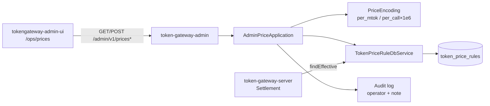
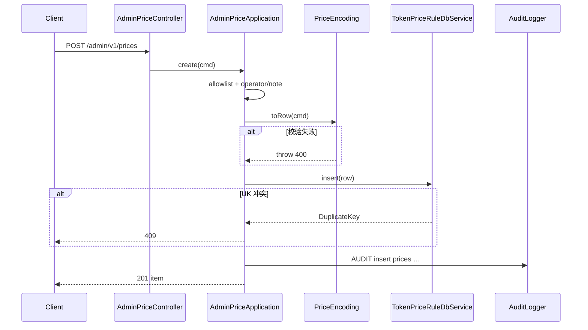

# US-G6-10 价目管理设计

> **用户故事**：[../02-用户故事.md](../02-用户故事.md) · US-G6-10  
> **状态**：编码已落地（列表 / 时间线 / 仅 INSERT；方案 A 防呆；单测通过）  
> **范围**：`token-gateway-admin` 提供价目**只读列表/时间线**与**仅 INSERT** 新版本 API；覆盖 Chat 两档（厘/MTok）与 `tavily.search` 按次（方案 A）；内网响应可含上游 COGS；**禁止** UPDATE/DELETE 历史行  
> **需求映射**：执行计划 [../16-管理端执行计划.md](../16-管理端执行计划.md) 阶段 C6 / A13～A16；[../01-需求.md](../01-需求.md) FR-PRICE-01/05/07、FR-ADMIN（G6）；价目语义 [US-G0-09](./US-G0-09-价目表与两档计价设计.md)、[US-G5-03](./US-G5-03-搜索按次计量与结算设计.md)  
> **依赖**：US-G6-01（admin 可启动、共库、`/admin/v1`）；US-G0-02（`token_price_rules`）；US-G0-09（取价约定）；US-G5-03（方案 A）  
> **后续衔接**：US-G6-09（价目页 UI，须遵守本设计 §7）；应急 SQL 仍保留 `ops/insert_*_price_*.sql`  
> **交互参考**：[`../designs/token-gateway-admin.pen`](../designs/token-gateway-admin.pen) · `screen/Prices`  
> **文档位置**：`token-gateway/docs/design/`

---

## 0. 相对故事 / 执行计划的澄清

| 原文措辞 | 本设计约定 |
|----------|------------|
| 「查看当前/历史价目」 | `GET /admin/v1/prices`（可按 model 过滤、可选历史）；`GET /admin/v1/prices/{model}` 为单 model 时间线 |
| 「INSERT 新版本」 | **仅** `POST /admin/v1/prices` → `INSERT token_price_rules`；**不提供** PUT/PATCH/DELETE |
| 「Chat 两档 + tavily 按次」 | 请求体用 `billing_unit` 区分：`per_mtok` / `per_call`；`tavily.search` **强制** `per_call`，服务端按方案 A ×1e6 写入 input 列 |
| 「tavily 方案 A 防呆」 | 拒绝把 Chat 量级当 per_mtok 写入 `tavily.search`；UI/API 标签必须是「厘/次或元/次」 |
| 「内网可看 COGS」 | Admin 响应**含**三档 upstream；与 G4/G5-04 用户面板（禁 COGS）分离 |
| 「operator/note」 | 请求**必填**；本期**不改表**加列（见 Q7）；写结构化审计日志 |
| 「替代插价 SQL」 | 日常走本 API；`ops/insert_price_rule_example.sql` / `ops/insert_tavily_search_price_example.sql` 降为应急 |

---

## 1. 已确认选型

| 项 | 决定 |
|----|------|
| **Q1 进程与前缀** | 仅 `token-gateway-admin`；路径一律 `/admin/v1/prices*`；**禁止**挂到 server |
| **Q2 鉴权** | 与 G6-01 一致：内网匿名；写操作靠 `operator`+`note` + 审计日志追责（执行计划 O1） |
| **Q3 表结构** | **复用**现有 `token_price_rules` 五档单价 + `effective_from`；**本期不加** `operator`/`note` 列、**不**新 Flyway |
| **Q4 取价语义** | 与 G0-09 一致：`effective_from <= asOf` 最大一行；已 `charged` 行**不回算** |
| **Q5 asOf** | 列表/时间线默认 `asOf=UTC now`；查询参数可覆盖（ISO-8601，按 UTC 解析） |
| **Q6 行状态** | 相对 `asOf` 标注：`current`（生效中）/ `history`（已被更新的旧版）/ `scheduled`（`effective_from > asOf`） |
| **Q7 审计（拍板 O7）** | `operator`、`note` **API 必填**；落 **应用审计日志**（含 `id`、`model`、五档、`effective_from`、client IP）；表内不存。后续若要查库审计再开迁移 |
| **Q8 model 允许集（拍板 O8）** | **白名单**：配置 `token-gateway.admin.prices.allowed-models`（默认含 `deepseek-v4-flash`、`deepseek-v4-pro`、`tavily.search`）；拒绝未登记 model（防拼写幽灵价）。扩容只改配置，**不**依赖 server 的 `ModelWhitelist` 类 |
| **Q9 Chat 入参单位** | 优先整数 **`*_li_per_mtok`**；可选 `*_yuan_per_mtok`（×1000→厘，HALF_UP 到 long）。同一字段组二者勿混传冲突值 |
| **Q10 搜索入参单位** | **仅** `billing_unit=per_call`：`price_li_per_call` 或 `price_yuan_per_call`；COGS 同理 `cogs_li_per_call` / `cogs_yuan_per_call`。落库：`input = li_per_call × 1_000_000`，`output/cache/output_up=0`（除 upstream_input） |
| **Q11 tavily 防呆** | `model=tavily.search` 且 `billing_unit≠per_call` → **400**；`per_mtok` 路径**永不**接受该 model |
| **Q12 数量级护栏** | Chat：单档 `li_per_mtok` ∈ `[0, 10_000_000]`（1 万元/MTok 上限，防多写零）；按次：`li_per_call` ∈ `[0, 100_000]`（100 元/次）。越界 400 |
| **Q13 唯一冲突** | `(model, effective_from)` 重复 → **409**（映射 UK `uk_token_price_model_from`） |
| **Q14 effective_from** | 必填；允许过去/此刻/未来；毫秒精度与列 `DATETIME(3)` 对齐；语义 **UTC** |
| **Q15 共享逻辑** | admin **不**依赖 `token-gateway-server`；编码/解码在 admin 应用层自洽；`TokenPriceRuleDbService` 可增 `listByModel` / `listAll`（放 `token-gateway-db`） |
| **Q16 只读聚合** | MVP **不做**「按日毛利」；本故事只价目 CRUD 中的 **CR**（无 U/D） |
| **Q17 错误体** | JSON：`{ "code", "message", "details?" }`；与后续 admin 全局异常对齐时可再统一，本故事控制器可先本地 `@ControllerAdvice` 或复用若已有 |

---

## 2. 目标与非目标

### 2.1 目标

1. 运营可在内网列出各 model **当前生效价**（含用户价 + COGS），并展开**历史/预约**版本。  
2. 运营可 **INSERT** Chat 或 `tavily.search` 新版本；插入后结算取价仍走 G0-09 `findEffective`。  
3. API/契约层杜绝「改历史」「按 Chat 量级误写 tavily」。  
4. 写操作可审计到人（operator）与原因（note）。  
5. 为 US-G6-09 价目页提供稳定契约（无「编辑历史行」字段/接口）。

### 2.2 非目标

| 不做 | 归属 |
|------|------|
| Vue 价目页交互实现 | US-G6-09（契约见 §7） |
| 管理端登录 / RBAC | 后续阶段 |
| `UPDATE` / `DELETE` 价目行 | **永久禁止**（本迭代与产品原则） |
| 改 G0-10 结算算法 / 回算已 charged | 禁止 |
| 用户面板 prices / 暴露 COGS 给终端用户 | G4 / G5-04 保持现状 |
| 任意新 model 字符串（未登记） | Q8；扩容改配置 |
| 价目表加 operator 列 / 审计表 | 本期不做（Q7）；可列后续 |
| 依赖或复制 server `PricingService` 进 admin | 禁止拉 server 模块 |

---

## 3. 架构



### 3.1 包职责（建议）

| 包 / 类 | 职责 |
|---------|------|
| `…admin.api.AdminPriceController` | HTTP 映射、校验注解入口 |
| `…admin.api.dto` | 请求/响应 DTO |
| `…admin.application.AdminPriceApplication` | 列表、时间线、插入编排 |
| `…admin.domain.price.PriceBillingUnit` | `PER_MTOK` / `PER_CALL` |
| `…admin.domain.price.PriceEncoding` | 元↔厘、按次×1e6、护栏 |
| `…admin.config.AdminPriceProperties` | `allowed-models` |
| `…db…TokenPriceRuleDbService` | 增补查询方法（共享给 admin） |

### 3.2 与 server 边界

- admin **只写库**；不触发结算、不清 server 缓存（G0-09 取价每次查库，无缓存失效问题）。  
- 新行一旦 `effective_from <= 结算 asOf`，下一笔 pending 结算自然用新价。  
- **禁止** admin 调用 server HTTP 或依赖其 jar。

---

## 4. 数据与编码

### 4.1 表（只读约定）

沿用 G0-02：

| 列 | 语义 |
|----|------|
| `model` | Chat model id 或 `tavily.search` |
| `input_price_li_per_mTok` / `output_price_li_per_mTok` | 用户价；Chat=厘/MTok；搜索方案 A 下 input=厘/次×1e6 |
| `upstream_*_cost_li_per_mTok` | COGS；搜索仅 `upstream_input` 有意义 |
| `effective_from` | UTC；与 `model` 唯一 |
| `created_at` | 插入时间；API 只读回显 |

**无** `operator`/`note` 列（Q7）。

### 4.2 Chat（`billing_unit=per_mtok`）

```
落库五档 = 请求提供的五档 li/MTok
（若用 yuan：li = round_half_up(yuan * 1000)）
```

展示：

```
yuan_per_mtok = li_per_mtok / 1000
```

### 4.3 `tavily.search`（`billing_unit=per_call`，方案 A）

```
li_per_call          = 请求厘/次（或 yuan*1000）
cogs_li_per_call     = 同上

input_price_li_per_mTok          = li_per_call * 1_000_000
output_price_li_per_mTok         = 0
upstream_input_cost_li_per_mTok  = cogs_li_per_call * 1_000_000
upstream_cache_cost_li_per_mTok  = 0
upstream_output_cost_li_per_mTok = 0
```

展示解码（与 G5-04 一致，admin 额外解 COGS）：

```
price_yuan_per_call = input_price_li_per_mTok / 1_000_000_000
cogs_yuan_per_call  = upstream_input_cost_li_per_mTok / 1_000_000_000
```

**运维禁忌（写入文档与 400 文案）**：切勿把 DeepSeek「厘/百万 Token」数量级直接填进 `tavily.search`。

### 4.4 行状态算法

对同一 `model`、给定 `asOf`：

1. 取该 model 全部行，按 `effective_from` 降序。  
2. 在 `effective_from <= asOf` 的集合中，**第一条** → `current`；其余 → `history`。  
3. `effective_from > asOf` → `scheduled`。  
4. 若无 `<= asOf` 行：无 `current`（仅 scheduled 或空）。

---

## 5. HTTP API

基址：admin `:8089`；开发经 Vite proxy。统一前缀 `/admin/v1`。

### 5.1 `GET /admin/v1/prices`

**Query**

| 参数 | 默认 | 说明 |
|------|------|------|
| `model` | 空 | 可选精确过滤 |
| `include_history` | `false` | `false`：每 model 最多 1 条 `current`（无 current 则跳过或返回 scheduled 最近？→ **仅返回 current**；无则该 model 不出现） |
| `include_scheduled` | `true` | 为 true 且 `include_history=true` 时一并返回 scheduled；仅 current 模式不返回 scheduled |
| `as_of` | now UTC | ISO-8601 |

**推荐默认（运营首页）**：`include_history=false` → 当前生效价一览（含 COGS）。  
**历史/预约**：`include_history=true`（含 history + scheduled）。

**响应 200（示意）**

```json
{
  "as_of": "2026-08-09T12:00:00.000Z",
  "items": [
    {
      "id": 12,
      "model": "deepseek-v4-flash",
      "billing_unit": "per_mtok",
      "status": "current",
      "effective_from": "2026-08-01T00:00:00.000Z",
      "created_at": "2026-07-28T10:00:00.000Z",
      "input_price_li_per_mtok": 1200,
      "output_price_li_per_mtok": 2300,
      "upstream_input_cost_li_per_mtok": 1008,
      "upstream_cache_cost_li_per_mtok": 20,
      "upstream_output_cost_li_per_mtok": 2016,
      "input_price_yuan_per_mtok": "1.200",
      "output_price_yuan_per_mtok": "2.300",
      "upstream_input_cost_yuan_per_mtok": "1.008",
      "upstream_cache_cost_yuan_per_mtok": "0.020",
      "upstream_output_cost_yuan_per_mtok": "2.016"
    },
    {
      "id": 20,
      "model": "tavily.search",
      "billing_unit": "per_call",
      "status": "current",
      "effective_from": "2020-01-01T00:00:00.000Z",
      "created_at": "…",
      "price_li_per_call": 0,
      "cogs_li_per_call": 60,
      "price_yuan_per_call": "0.000",
      "cogs_yuan_per_call": "0.060",
      "input_price_li_per_mtok": 0,
      "output_price_li_per_mtok": 0,
      "upstream_input_cost_li_per_mtok": 60000000,
      "upstream_cache_cost_li_per_mtok": 0,
      "upstream_output_cost_li_per_mtok": 0
    }
  ]
}
```

约定：

- `billing_unit` 由 model 判定：`tavily.search` → `per_call`，其余白名单 → `per_mtok`。  
- per_call 项**同时**回传原始五档（便于对账）与解码后的按次字段。  
- 金额字符串字段用十进制文本，避免 JSON float。

### 5.2 `GET /admin/v1/prices/{model}`

- `{model}` URL 编码；须在白名单内，否则 **404**（或 400「model 未登记」——采用 **400** 以区分「无价目行」）。  
- 无任何行 → **200** + `items: []`（model 合法但尚未插价）。  
- 返回该 model 全时间线（等价 `include_history=true&include_scheduled=true&model=`）。

### 5.3 `POST /admin/v1/prices`

**Body（Chat）**

```json
{
  "model": "deepseek-v4-flash",
  "billing_unit": "per_mtok",
  "effective_from": "2026-09-01T00:00:00.000Z",
  "operator": "zhangsan",
  "note": "九月复核上游牌价",
  "input_price_li_per_mtok": 1200,
  "output_price_li_per_mtok": 2300,
  "upstream_input_cost_li_per_mtok": 1008,
  "upstream_cache_cost_li_per_mtok": 20,
  "upstream_output_cost_li_per_mtok": 2016
}
```

**Body（tavily）**

```json
{
  "model": "tavily.search",
  "billing_unit": "per_call",
  "effective_from": "2026-09-01T00:00:00.000Z",
  "operator": "lisi",
  "note": "上游按次成本调整",
  "price_li_per_call": 100,
  "cogs_li_per_call": 60
}
```

也可用 `price_yuan_per_call` / `cogs_yuan_per_call`（与 li 二选一，勿冲突）。

**成功 201**

```json
{
  "id": 21,
  "model": "tavily.search",
  "billing_unit": "per_call",
  "status": "scheduled",
  "effective_from": "2026-09-01T00:00:00.000Z",
  "...": "同 GET item 字段"
}
```

`status` 按插入时刻的 `asOf=now` 计算（未来生效多为 `scheduled`）。

**错误**

| HTTP | code（建议） | 场景 |
|------|--------------|------|
| 400 | `validation_error` | 缺 operator/note、缺档、单位冲突 |
| 400 | `model_not_allowed` | 未在白名单 |
| 400 | `billing_unit_mismatch` | tavily 非 per_call；或 Chat 用了 per_call |
| 400 | `price_out_of_range` | 护栏越界 |
| 409 | `price_version_conflict` | UK 冲突 |
| 405 | — | PUT/PATCH/DELETE 本资源（若误配路由） |

### 5.4 明确不提供的方法

| 方法 | 路径 | 说明 |
|------|------|------|
| PUT/PATCH | `/admin/v1/prices/**` | 不实现 |
| DELETE | `/admin/v1/prices/**` | 不实现 |

---

## 6. 应用层行为

### 6.1 插入流程



### 6.2 DbService 增补（建议）

```java
List<TokenPriceRule> listAllOrderByModelFromDesc();
List<TokenPriceRule> listByModelOrderByFromDesc(String model);
boolean insertNew(TokenPriceRule row); // 或 save；捕获 DuplicateKeyException
```

不改变 `findEffective` 语义。

### 6.3 审计日志格式（建议）

```
AUDIT price_insert operator={} note={} id={} model={} effective_from={} 
  input={} output={} up_in={} up_cache={} up_out={} billing_unit={} client={}
```

级别 INFO；禁止把无关密钥打进日志（本接口无 sk）。

### 6.4 配置

```yaml
token-gateway:
  admin:
    prices:
      allowed-models:
        - deepseek-v4-flash
        - deepseek-v4-pro
        - tavily.search
```

环境变量可覆盖列表（实现时用逗号分隔或标准 Boot 集合绑定即可）。

---

## 7. 与前端（US-G6-09）契约

> 本故事**不实现** Vue；下列约束供 G6-09 / Pencil `screen/Prices` 对齐。

| 项 | 约定 |
|----|------|
| 路由 | `/ops/prices`（与现脚手架占位一致即可） |
| 主区 | 左：价目表（当前+可展开历史）；右：**仅**「新增价目版本」表单 |
| 禁止 | 「编辑」「删除」「覆盖」历史行按钮与抽屉 |
| Chat 表单 | 标签「厘/百万 Token」或「元/百万 Token」；五档含 COGS |
| 搜索表单 | model 固定/可选 `tavily.search`；标签 **「厘/次」「元/次」**；说明方案 A 由服务端编码 |
| 切换 | 选 model 后切换表单字段集（勿混用 MTok 与按次输入框） |
| 必填 | operator、note、effective_from、单价 |
| 成功 | Toast + 刷新列表；展示新行 `status` |
| 错误 | 展示 `message`（尤其 `billing_unit_mismatch` / 409） |
| COGS | **展示**（内网）；G4 用户面板仍不展示 |

---

## 8. 验收用例

对齐执行计划 A13～A16，并细化：

| ID | 步骤 | 期望 |
|----|------|------|
| P1 | `GET /prices` 默认 | 含 flash/pro/tavily 当前行（有种子时）；含 COGS 字段 |
| P2 | `GET /prices?include_history=true` | 同 model 多版本；状态 current/history/scheduled 正确 |
| P3 | `GET /prices/{model}` | 时间线按 `effective_from` 降序 |
| P4 | POST Chat 新价，`effective_from=now` | 201；旧行仍在；`findEffective` 得新行 |
| P5 | POST Chat，`effective_from` 未来 | 201；`status=scheduled`；当前结算仍用旧 current |
| P6 | POST 相同 `(model, effective_from)` | 409 |
| P7 | POST `tavily.search` + `per_call` | 库内 input=`li×1e6`；output 等为 0；解码元/次正确 |
| P8 | POST `tavily.search` + `per_mtok` | 400 `billing_unit_mismatch` |
| P9 | POST 未登记 model | 400 `model_not_allowed` |
| P10 | 缺 operator 或 note | 400 |
| P11 | 护栏越界 | 400 `price_out_of_range` |
| P12 | 审计日志 | 含 operator/note/id/model/五档 |
| P13 | 不存在 PUT/DELETE 成功路径 | 无映射或 405 |
| P14 |（联调）插入后跑一笔结算 asOf≥新 from | 扣费按新用户价（Chat 或按次） |

单测重点：`PriceEncoding`（Chat 换算、tavily×1e6、护栏、mismatch）；Application（白名单、409）；Controller MockMvc 契约。

---

## 9. 编码任务清单

1. `AdminPriceProperties` + 默认白名单。  
2. `PriceEncoding` + 单测（含方案 A 与错误路径）。  
3. `TokenPriceRuleDbService` 列表/插入方法 +（可选）db 模块单测。  
4. DTO + `AdminPriceApplication` + `AdminPriceController`。  
5. 审计日志；409/400 错误码。  
6. MockMvc / 切片测试覆盖 P1～P13。  
7. README / admin 说明：价目只 INSERT、tavily 防呆、应急 SQL 链接。  
8. 编码完成后：更新 `02` 故事状态行、执行计划 C6 勾选。

---

## 10. 开放问题（本详设后残留）

| ID | 项 | 倾向 |
|----|----|------|
| O1 | operator 是否日后落库 | **可**；优先独立审计表或加可空列，不阻塞本期 |
| O2 | 白名单是否自动同步 server `allowed-models` | 本期**手工配置对齐**；避免跨模块依赖 |
| O3 | `include_history=false` 时「仅有 scheduled、无 current」的 model | **不出现在列表**；详情 API 仍可查空/仅 scheduled |
| O4 | 是否允许用 yuan 与 li 同时传且相等 | 允许（一致则过）；不一致 400 |
| O5 | 全局 `@ControllerAdvice` 错误体 | 可与 G6-04 等写路径故事统一；本故事先保证 code/message |

---

## 11. 文档同步（详设评审通过后）

| 文档 | 动作 |
|------|------|
| [02-用户故事.md](../02-用户故事.md) US-G6-10 | 增加「详细设计」链接 |
| [16-管理端执行计划.md](../16-管理端执行计划.md) | 阶段 B US-G6-10 标详设已写；O7/O8 指向本设计 Q7/Q8 |
| [US-G0-09](./US-G0-09-价目表与两档计价设计.md) §8.2 | 补一句：日常调价见 US-G6-10 |
| [US-G5-03](./US-G5-03-搜索按次计量与结算设计.md) §3 | 补一句：管理端 INSERT 见 US-G6-10 |
| `ops/insert_*_price_*.sql` 头注释 | 标明「应急；日常走管理端」 |
| US-G6-09 详设（待写） | 引用本设计 §5 / §7 |

---

## 12. 本故事不做 / 后续

| 不做 | 后续 |
|------|------|
| 价目页 Vue 实现 | US-G6-09 |
| 登录后按人授权调价 | 后续鉴权阶段 |
| 经营分析 / 毛利大屏用价 | US-G6-02/03 或 G2 |
| 改历史价纠错工具 | 产品原则禁止；错价只能再 INSERT 纠正未来取价 |

---

## 13. 已拍板摘要（评审可用）

1. **只 INSERT，不改不删**历史行。  
2. **Chat = per_mtok**；**tavily.search = per_call → ×1e6 方案 A**。  
3. **COGS 对 admin 可见**；对用户面板仍不可见。  
4. **operator/note 必填但不落价目表**（审计日志）。  
5. **model 白名单配置**；默认 flash / pro / tavily.search。  
6. 取价与结算语义 **零改动**（仍 G0-09 `findEffective`）。
