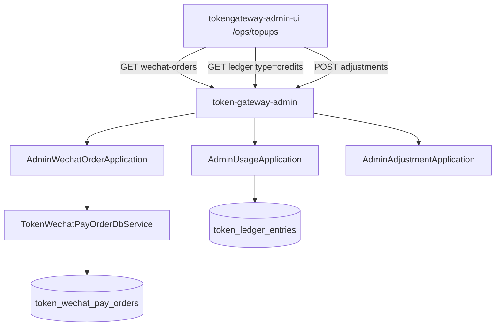

# US-G6-11 充值页微信订单联动设计

> **用户故事**：[../02-用户故事.md](../02-用户故事.md) · US-G6-11  
> **状态**：编码已落地（单测通过；`/ops/topups` 上下双表；待联调验收）  

> **范围**：`token-gateway-admin` **只读**分页查询 `token_wechat_pay_orders`；`/ops/topups` 改为**上表订单 / 下表 ledger credits** 联动，便于运营在人工调账前核对微信充值状态  
> **需求映射**：执行计划 [../16-管理端执行计划.md](../16-管理端执行计划.md)；充值写路径 [US-G6-07](./US-G6-07-用户充值与调账设计.md)；订单表 [US-G3-01](./US-G3-01-微信支付自助充值下单设计.md) / 入账 [US-G3-02](./US-G3-02-微信支付回调幂等入账设计.md)；面板对照 [US-G4-04](./US-G4-04-充值入账记录设计.md)（本用户，不复用路径）  
> **依赖**：US-G6-01、US-G6-07（`/ops/topups` 与 ledger credits）  
> **后续衔接**：US-G6-03（看板）；G3-03 补单仍在 server（本故事**不**触发 sync）  
> **文档位置**：`token-gateway/docs/design/`

---

## 0. 相对 G6-07 的澄清

| G6-07 原文 | 本故事约定 |
|------------|------------|
| Q8「列表不读微信订单表」 | **账本仍是余额真相**（下表）；**增补**订单上表作决策上下文；不合并成一张宽表 |
| 「一眼覆盖人工+微信入账」 | 已入账微信仍在 ledger（`source=wechat`）；**未入账/失败/关闭**单仅订单表可见 |
| 面板 G4-04 | 仅本人 ticket；admin 跨用户只读，字段可含 `user_id`/`user_code` 与排障摘要 |

---

## 1. 已确认选型

| 项 | 决定 |
|----|------|
| **Q1 路径** | `GET /admin/v1/wechat-orders`；仅 admin；禁止挂 server |
| **Q2 鉴权** | 内网匿名；只读，无 operator/note |
| **Q3 分页** | `page`/`size`/`total`；默认 size 20、最大 100；同 G6-06 |
| **Q4 时间窗** | 按订单 `created_at`；默认近 **7** 天；跨度 ≤ **90** 天 → 否则 400 `invalid_time_range` |
| **Q5 排序** | `created_at DESC, id DESC` |
| **Q6 筛选** | 可选：`user_id`、`status`、`out_trade_no`（精确）、`from`/`to` |
| **Q7 status** | `created` / `paid` / `credited` / `failed` / `closed`（与 G3/G4 一致） |
| **Q8 金额** | 回 `amount_yuan`（`amount_li/1000`）；UI **禁止**写「厘」；可不回 `amount_li`/`amount_fen` |
| **Q9 敏感字段** | **永不**回 `code_url`、`notify_url` |
| **Q10 排障字段** | Should：`last_notify_trade_state` / `last_notify_result` / `last_sync_trade_state` / `last_sync_result` |
| **Q11 联动键** | 派生 `ledger_request_id`：有 `wx_transaction_id` 时为 `wechat:{wx_transaction_id}`；前端高亮下表 `request_id`；无则用 note 含 `out_trade_no` 兜底 |
| **Q12 UI** | `/ops/topups`：上订单、下 ledger credits；共享 `user_id` + 时间窗；上表可筛 status；下表可筛 type/operator |
| **Q13 写路径** | **不**改；人工调账仍 `POST …/adjustments`（G6-07） |
| **Q14 非目标写** | **禁止** admin 触发 sync/补单/退款 |

---

## 2. 目标与非目标

### 2.1 目标

1. 运营在 `/ops/topups` 同时看到微信订单状态与账本入账，决定是否人工补充/调账。  
2. 选中上表订单可高亮关联 ledger 行；无流水时提示「尚未入账」。  
3. 替代日常「查 `token_wechat_pay_orders`」SQL。

### 2.2 非目标

| 不做 | 归属 |
|------|------|
| 改 G3 回调 / 查单入账 | G3-02/03 |
| admin 触发 sync / 退款 | G3-03/05 |
| 合并宽表分页 | — |
| 用户面板改版 | G4-04 |
| 依赖 `token-gateway-server` | **禁止** |

---

## 3. 架构



---

## 4. API

### 4.1 请求

```http
GET /admin/v1/wechat-orders?user_id=&status=&out_trade_no=&from=&to=&page=1&size=20
```

| Query | 必填 | 规则 |
|-------|------|------|
| `user_id` | 否 | 精确 |
| `status` | 否 | 见 Q7；非法 → 400 |
| `out_trade_no` | 否 | 精确 trim |
| `from` / `to` | 否 | ISO-8601；默认近 7 天；跨度 ≤ 90 天 |
| `page` / `size` | 否 | 同 G6-06 |

### 4.2 成功响应

```json
{
  "page": 1,
  "size": 20,
  "total": 2,
  "window": { "from": "…Z", "to": "…Z" },
  "items": [
    {
      "id": 1,
      "user_id": 10,
      "user_code": "u_demo",
      "tenant_id": "t1",
      "out_trade_no": "TG…",
      "status": "credited",
      "amount_yuan": 10,
      "wx_transaction_id": "4200…",
      "ledger_request_id": "wechat:4200…",
      "fail_reason": null,
      "description": "官方服务预付费充值",
      "created_at": "…Z",
      "paid_at": "…Z",
      "credited_at": "…Z",
      "last_notify_trade_state": "SUCCESS",
      "last_notify_result": "CREDITED",
      "last_sync_trade_state": null,
      "last_sync_result": null
    }
  ]
}
```

### 4.3 错误

复用 `{code,message}`：`invalid_time_range`、`validation_error`。

---

## 5. 前端契约（`/ops/topups`）

| 项 | 约定 |
|----|------|
| 布局 | **上**：微信订单；**下**：ledger credits（现有列 + 高亮） |
| 共享筛 | `user_id`、时间窗；查询同时刷新两表（各自 page） |
| 上表列 | 下单时间、用户、状态、金额(元)、`out_trade_no`、微信单号、`fail_reason` |
| 联动 | 点击上表行 → 记录选中；下表行 `request_id === ledger_request_id` 或 `note` 含 `out_trade_no` 高亮；无匹配 → 页内提示「该单尚未入账」 |
| 调账 | 主按钮仍打开现有弹窗；可选预填 `user_id` / note 带 `out_trade_no`（Should） |
| 文案 | 金额人民币元；脚注可写「上表为微信订单；下表为账本」 |

---

## 6. 编码任务

1. ~~`TokenWechatPayOrderDbService.pageForAdmin`~~  
2. ~~`AdminWechatOrderApplication` + Controller + DTO + 单测~~  
3. ~~`TopupsView` 上下双表 + API client~~  
4. ~~更新 `02` / `16` / G6-07 衔接；本文状态 → 编码已落地~~  

---

## 7. 验收用例

| ID | 步骤 | 期望 |
|----|------|------|
| T1 | GET 无参 | 近 7 天订单分页；无 `code_url` |
| T2 | `user_id` + `status=created` | 仅该用户待支付 |
| T3 | `out_trade_no` 精确 | 0～1 条 |
| T4 | 时间窗 > 90 天 | 400 |
| T5 | credited 单含 `wx_transaction_id` | `ledger_request_id=wechat:…` |
| T6 | UI 选中 credited 单 | 下表对应 topup 高亮 |
| T7 | UI 选中未入账单 | 提示尚未入账；可打开调账 |

---

## 8. 一句话冻结

**充值页 = 上微信订单（决策）+ 下 ledger credits（真相）；只读订单 API 与调账写路径分离；用 `wechat:{transaction_id}` 联动高亮。**
