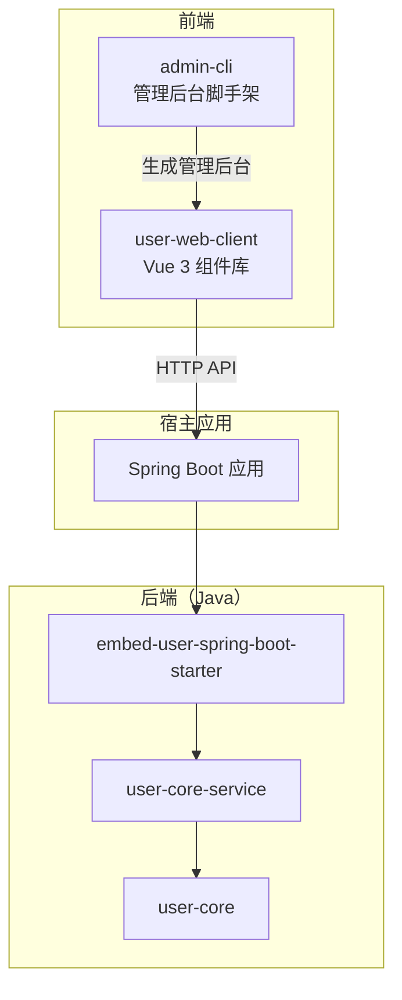
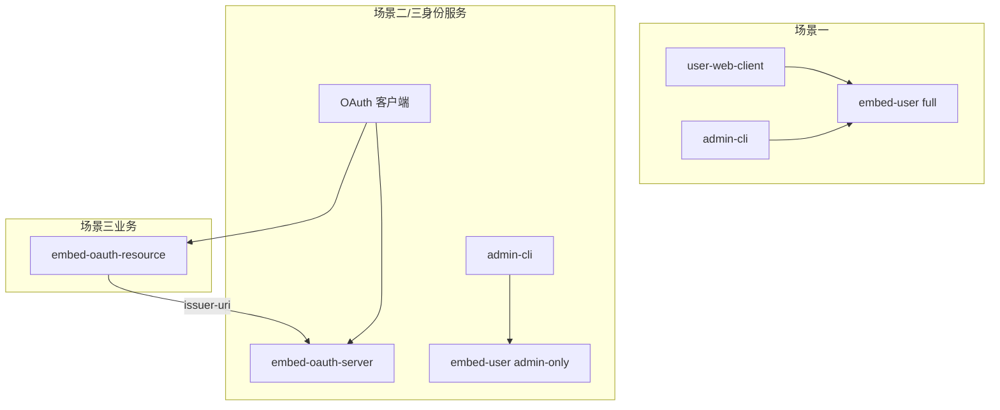

# 用户中心（User Center）

一套完整的用户中心解决方案（**双预置租户** + RBAC），包含 **Spring Boot 后端服务**、**Vue 3 前端组件库** 和 **管理后台脚手架工具**。业务系统通过 Starter 嵌入式集成用户能力；**管理端租户**始终使用 UC（Cookie JWT），**客户端租户**可选用 UC 或 OAuth 2.0（见 [OAuth 扩展计划](docs/requirements/oauth-extension-plan.md)）。

## 项目结构

```
user/
├── user-core/                        # UC 与 OAuth 共享契约（注解、路径常量、运行时配置接口）
├── user-db/                          # 共享持久化层 + DDL/种子/菜单脚本
├── user-core-service/                # UC 业务实现
├── user-as-service/                  # OAuth AS 能力实现（Security/UI、Client 管理、SAS 集成）
├── user-rs-service/                  # OAuth RS 能力实现（JWT 验签、Security 链）
├── embed-user-spring-boot-starter/   # UC 的 Spring Boot 集成
├── embed-oauth-server-starter/       # OAuth AS 的 Spring Boot 集成（/oauth2/*、内置 UI）
├── embed-oauth-resource-starter/     # OAuth RS 的 Spring Boot 集成（场景三业务 Bearer 验签）
├── oauth-as-release/                 # 场景二 授权服务器最小发行版（MySQL，US-021）
├── user-web-client/                  # Vue 3 前端组件库（C 端）
├── admin-cli/                        # 管理后台脚手架（管理端租户）
└── docs/requirements/                # OAuth 扩展计划与评审
```

**模块分层（与 `user-core-service` / `user-as-service` / `user-rs-service` 对称）**

| 层级 | UC | OAuth AS | OAuth RS |
| --- | --- | --- | --- |
| 共享契约 | `user-core` | 同上 | 同上 |
| 共享持久化 | `user-db`（`com.mfs.user.db`） | 同上 | — |
| 能力实现 | `user-core-service`（`com.mfs.user.service`） | `user-as-service`（`com.mfs.oauth.service`） | `user-rs-service`（`com.mfs.oauth.rs.service`） |
| Spring Boot 集成 | `embed-user-spring-boot-starter` | `embed-oauth-server-starter` | `embed-oauth-resource-starter` |

Starter **仅**负责自动配置、Security 分轨、Thymeleaf 页等宿主装配；业务逻辑在 `*-service` 模块。

## 架构概览



## 技术栈

| 层级 | 技术 |
|------|------|
| 后端 | Java 21、Spring Boot 3.4.5、MyBatis-Plus、Spring AOP |
| 前端组件库 | Vue 3、TypeScript、Element Plus、Vite |
| 管理脚手架 | Node.js、Commander、Inquirer、EJS |
| 数据存储 | MySQL（JDBC） |
| 认证（现状 / 扩展） | UC：JWT Cookie `jwt-token`；OAuth（规划）：客户端租户 AS + 业务 RS Bearer |

## 核心能力

- **双预置租户**（非 SaaS 无限扩展）：系统初始化固定两类租户——**客户端租户**（C 端终端用户）与**管理端租户**（后台管理员）；数据仍用 `tenant_id` 隔离，但不支持运营方随意增删租户。角色与两端分工见 `user-core` 中 [`SysRoleEnum`](user-core/src/main/java/com/mfs/user/core/enums/SysRoleEnum.java)
- **多种登录方式**：用户编码 + 密码、邮箱/手机 + 验证码；可按管理端/客户端租户分别开关（US-023）
- **RBAC 权限模型**：用户、角色、资源类型、资源权限的完整管理
- **双 Web 栈支持**：同时提供 Spring MVC 与 WebFlux 控制器实现
- **嵌入式集成**：引入 Starter 即可在现有 Spring Boot 项目中启用用户中心 API
- **三种集成场景**：全 UC；或 C 端 OAuth + 管理端 UC；或再叠加各业务服务的 RS Starter（详见下文）
- **前端开箱即用**：`user-web-client` 面向客户端租户；`admin-cli` 面向管理端租户（始终 UC 登录）

### 双租户与内置角色（与 `SysRoleEnum` 一致）

| 维度 | 客户端租户 | 管理端租户 |
|------|------------|------------|
| 面向 | 终端用户（注册、业务登录） | 站点管理员（`admin-cli` 等） |
| 认证 | UC **或** OAuth（由集成场景决定） | **仅 UC**（不走 OAuth 授权码） |
| 典型前端 | `user-web-client` / 手机 APP | `admin-cli`（`VITE_USER_TENANT_ID`） |
| 典型 API | `/user/*`、`/right`；OAuth 时为 `/oauth2/*` | `/user/login`、`/manage/*`、`/admin/*`、`/right` |
| 关联 | 管理端系统参数「客户端租户号」指向本租户 ID | 内置用户 `admin` 及角色 `1`/`2`/`3` |

内置角色编号 `1`/`2`/`3` 分别对应系统管理员、客户端系统管理员、业务系统管理员，权限边界见 `SysRoleEnum` 类注释。

## 集成场景与 Starter

认证能力按**租户域**组合，而非在 UC 与 OAuth 之间全局二选一。

| 场景 | 客户端租户 | 管理端租户 | 后端依赖（用户中心侧） |
|------|------------|------------|------------------------|
| **一、全 UC** | UC | UC | `embed-user-spring-boot-starter`（`uc.profile=full`，默认） |
| **二、C 端 OAuth + 管理端 UC** | OAuth（AS） | UC | `embed-oauth-server-starter` + `embed-user`（`uc.profile=admin-only`） |
| **三、+ 业务 RS** | OAuth + 各业务 Bearer | UC（同场景二） | 场景二身份服务 + 各业务 `embed-oauth-resource-starter` |



- **场景一**：单体或同域项目，C 端与管理端均 `POST /user/login` + Cookie。
- **场景二**：同一身份服务进程可同时暴露 `/oauth2/*`（仅客户端租户）与 `/user/login`（仅管理端租户）；C 端不再使用客户端租户的 UC 登录。
- **场景三**：订单、商品等业务服务自行集成 RS，用 access_token 调 `/api/*`；用户中心 `/manage/*`、`/admin/*` 仍为管理端 UC。

完整设计见 [OAuth 2.0 扩展计划](docs/requirements/oauth-extension-plan.md)。

## 后端模块说明

### user-core

UC 与 OAuth **共享**的核心契约（`com.mfs.user.core`），不含具体业务实现：

- `@Auth` / `@AuthRole`、MVC/WebFlux `AuthAspect`
- `@RequireScope` / `@RequireRole`（OAuth RS 业务 API 授权，US-013）
- `CurrentUserInfo`、租户与角色枚举
- Security 分轨路径常量（`UcSecurityPathPatterns`、`SecurityFilterChainOrders`）
- `AdminOnlyTenantSettings`、`OauthServerRuntimeSettings`、`OAuthIntegrationMarkers`
- `OauthJwkSupport`、`OAuthBearerPrincipal`、`OAuthAccessTokenClaimNames`（AS/RS 共用 JWT 契约）

### user-db

UC 与 OAuth **共享**的 MyBatis-Plus 持久化层（`com.mfs.user.db`），由 `UserDbAutoConfiguration` 自动装配：

- **DDL / 种子 / 菜单**：权威脚本位于本模块 `src/main/resources/`（`1.ddl.sql`、`2.oauth.ddl.sql`、`3.tenant_template.sql`、`管理端默认菜单.csv`、`sas-reference/`）
- **UC 表**：`UserPO`、`TenantPO`、`RolePO`、`UserFeedbackPO`、站内信相关 PO 等对应的 Mapper / DbService
- **OAuth 表**：`Oauth2RegisteredClientPO` 等三张 SAS 表（`2.oauth.ddl.sql`）对应的 PO / Mapper / DbService
- **包约定**：`com.mfs.user.db.po`、`com.mfs.user.db.mapper`、`com.mfs.user.db.dbservice`；业务模块（`user-core-service`、`user-as-service`）只依赖 DbService，不写 Mapper XML

### user-core-service

UC 业务实现（`com.mfs.user.service`）：用户、角色、权限、资源、用户反馈管理（US-022 `/manage/feedback`）、站内信（US-024 `/manage/message`）、`UserCenterRuntimeConfig`（实现 `user-core` 中 `AdminOnlyTenantSettings`、`OauthServerRuntimeSettings`）等。由 `embed-user-spring-boot-starter` 通过 `@ComponentScan("com.mfs.user")` 加载；表访问经 `user-db` 模块。

主要 API 分组：

### user-as-service

OAuth **授权服务器（AS）** 领域逻辑（`com.mfs.oauth.service`），供 `embed-oauth-server-starter` 与 US-014 管理 API 依赖；OAuth / UC 表访问经 **`user-db`**：

| 能力 | 说明 |
|------|------|
| `TenantBoundRegisteredClientRepository` | 替代 SAS `JdbcRegisteredClientRepository` 的**运行时只读**（`find*`）；`save` 不支持 |
| `Oauth2RegisteredClientWriter` | 管理端（US-014）写入 Client：Policy + Converter + `user-db` DbService |
| `Oauth2ClientTenantPolicy` | 禁止将 OAuth Client 绑定到管理端租户；与 `com.mfs.user.oauth.client-tenant-id` 对齐 |
| `ManageOAuthClientService` | US-014：`/manage/oauth/client/*` CRUD（仅 `admin-only` profile）；经 `TenantDbService` 校验租户存在 |

Client **种子**由 SQL/运维脚本维护，亦可通过管理 API 维护；授权会话默认由 `OauthPersistenceConfiguration` 注册 SAS `JdbcOAuth2AuthorizationService`（随 `embed-oauth-server-starter` 引入；`@ConditionalOnMissingBean`：集成方可自行声明 `OAuth2AuthorizationService` Bean 覆盖，须保证 authorize/token/refresh/revoke 共用同一实例）。

### embed-oauth-server-starter

OAuth 2.0 授权服务器的 **Spring Boot 集成**（`com.mfs.oauth.server`，US-008）；场景二/三与 `embed-user`（`admin-only`）同进程使用。**不**包含 AS 领域逻辑（见 `user-as-service`）：

| 能力 | 说明 |
| --- | --- |
| 标准端点 | `/oauth2/authorize`、`/oauth2/token`、`/oauth2/jwks`、`/oauth2/revoke`（US-015：refresh_token grant + revoke 已验收） |
| OIDC | `GET /.well-known/openid-configuration`、`GET /oauth2/userinfo`（US-016 已验收）；`scope` 含 `openid` 时 token 响应含 `id_token`（HS256） |
| 密钥 / issuer | 仅使用 `com.mfs.user.oauth.jwk-key`、`oauth.issuer`；**不得**用 UC `jwk-key` 签发 access_token |
| 内置 UI | `/oauth2/login`（密码 / **邮箱验证码**，可按 `auth.client-tenant` 开关隐藏）、`/oauth2/register`、`/oauth2/forgot-password`、`/oauth2/feedback`、`/oauth2/consent`；能力查询 `GET /oauth2/login-methods` |
| 注册验证码 | `POST /oauth2/register/send-code`（表单字段 `email`）；Redis key 与 UC 注册一致（`{redisPrefix}:register:{tenantId}:{email}`，TTL 5 分钟）；须配置 `spring.mail.*` 与 Redis |
| 登录验证码 | `POST /oauth2/login/send-code`（表单字段 `email`）；须该邮箱已在客户端租户注册；Redis key `{redisPrefix}:login:{tenantId}:{email}`（与 UC 登录验证码一致） |
| 忘记密码 | `GET /oauth2/forgot-password`；`POST /oauth2/forgot-password/send-code`（表单字段 `email`）；`POST /oauth2/forgot-password`（`email`、`verificationCode`、`password`）；Redis key `{redisPrefix}:forgot-password:{tenantId}:{email}`（TTL 5 分钟）；**不**走 UC `/user/modifyPassword` |
| 用户反馈 | `GET /oauth2/feedback?client_id&email&returnUrl`（免登录；`email` 由业务 App 从本地登录态传入）；`POST /oauth2/feedback`（`clientId`、`email`、`content`、可选 `imageUrls`）；图片先 `POST /file/upload`（宿主提供）再提交文件名；`returnUrl` 须与 Client `redirect_uri` 同 scheme+authority；提交成功后按 Client `settings.feedback.notify.emails` **异步发信**（须配置 `spring.mail.*` 与 Client 通知邮箱） |
| Security | `@Order(1)` 匹配 `/oauth2/**` 与 `/.well-known/openid-configuration`，替换 embed-user 占位链；须 classpath 存在 `spring-boot-starter-web`（SAS 为 Servlet） |
| 持久化 | 经 `OauthServiceConfiguration` 加载 `user-as-service` 中的 Repository / SAS JDBC 服务 |

Maven（与 `embed-user` 并列引入）：

```xml
<dependency>
    <groupId>com.mfs</groupId>
    <artifactId>embed-oauth-server-starter</artifactId>
    <version>${user.version}</version>
</dependency>
```

### user-rs-service

OAuth **资源服务器（RS）** 能力实现（`com.mfs.oauth.rs.service`），供 `embed-oauth-resource-starter` 依赖：

| 能力 | 说明 |
| --- | --- |
| JWT 验签 | `OAuthResourceJwtConfiguration` / Reactive 对等；`iss` + HS256 或 `jwk-set-uri` |
| Security 链 | Servlet + WebFlux 成对；默认保护 `/api/**`，UC 管理面路径 `permitAll` |
| Principal | `OAuthBearerJwtAuthenticationConverter` → `OAuthBearerPrincipal` |
| scope / role 授权 | `@RequireScope`（AND）、`RequireRole`（OR）；先 scope 后 role；不足 **403**（US-013） |
| 启动校验 | `OAuthResourceStartupValidator`（缺 issuer、AS+RS 同进程等 fail-fast） |

### embed-oauth-resource-starter

OAuth 2.0 资源服务器的 **Spring Boot 集成**（`com.mfs.oauth.resource`，US-012）；用于**场景三业务服务**，**不**与 AS 同进程。**不**包含 RS 领域逻辑（见 `user-rs-service`）：

| 能力 | 说明 |
| --- | --- |
| Bearer 验签 | `com.mfs.user.oauth.jwk-key` 本地 HS256，或 `{issuer}/oauth2/jwks` 拉取 JWK（**不**依赖 OIDC Discovery） |
| 默认保护路径 | `/api/**`（可配置 `com.mfs.user.oauth.resource.protected-patterns`） |
| UC 面豁免 | `/manage/**`、`/admin/**` 等 UC 路径固定 `permitAll` |
| Principal | 验签后映射 `OAuthBearerPrincipal`；实现见 `user-rs-service` |
| scope / role | 业务 Controller 使用 `@RequireScope` / `@RequireRole`（见下）；默认**不**调 `RightService` |
| 装配 | 经 `OauthRsServiceConfiguration` 加载 `user-rs-service` 中的 Security / JwtDecoder |

Maven（业务服务，**勿**与 `embed-oauth-server-starter` 同进程）：

```xml
<dependency>
    <groupId>com.mfs</groupId>
    <artifactId>embed-oauth-resource-starter</artifactId>
    <version>${user.version}</version>
</dependency>
```

配置示例：

```yaml
com.mfs.user.oauth:
  issuer: https://auth.example.com
  jwk-key: ${OAUTH_JWK_KEY}
  resource:
    protected-patterns:
      - /api/**
```

| 路径前缀 | 说明 | 权限 |
|----------|------|------|
| `/user` | 用户接口：注册、登录、个人信息、改密（`tenantId` 区分客户端/管理端；场景二下客户端租户不走 UC 登录） | 部分接口需登录 |
| `/right` | 通用权限：查询用户授权资源 | 需登录 |
| `/manage/*` | 管理端登录后，治理**客户端租户**的用户、角色、权限、资源（`/manage/resource`）、OAuth Client（`/manage/oauth/client`，US-014）、系统参数等 | 系统管理员 `1` 或 客户端系统管理员 `2`（`@AuthRole`；`admin-only` 下须**管理端租户** JWT，US-005） |
| `/admin/*` | **管理端租户**内系统级配置（管理端用户/行为、客户端租户号等） | 仅系统管理员 `1` |

**C 端主要接口（`/user`）：**

| 方法 | 路径 | 说明 |
|------|------|------|
| POST | `/user/register` | 用户注册（字段随租户登录方式变化：验证码/密码） |
| POST | `/user/sendMessageForRegister` | 发送注册验证码 |
| POST | `/user/sendMessageForLogin` | 发送登录验证码 |
| GET | `/user/login-methods` | 查询租户可用登录方式（公开，US-023） |
| POST | `/user/login` | 用户登录，成功后写入 `jwt-token` Cookie |
| POST | `/user/currentUserInfo` | 获取当前登录用户信息 |
| GET | `/user/sendMessageForModifyPassword/{type}` | 发送改密验证码（`email` / `phone`） |
| POST | `/user/modifyPassword` | 修改密码 |
| POST | `/user/modify` | 修改用户名、头像 |

**OAuth Client 管理（`/manage/oauth/client`，US-014，仅 `admin-only`）：**

| 方法 | 路径 | 说明 |
|------|------|------|
| POST | `/manage/oauth/client/create` | 创建 Client；`tenantId` 须为客户端租户；PKCE 公开客户端默认无 secret；默认 `requireAuthorizationConsent=true`（展示 consent 页）；可选 `feedbackNotifyEmails` |
| POST | `/manage/oauth/client/list` | 按 `tenantId` 列出 Client（不含 secret；含 `feedbackNotifyEmails` 供列表展示） |
| POST | `/manage/oauth/client/detail/{id}` | Client 详情（含 `feedbackNotifyEmails`，供编辑表单加载；US-022） |
| POST | `/manage/oauth/client/update` | 更新 Client（不可改绑 `tenantId` / `clientId`）；可选 `feedbackNotifyEmails`（写入 `client_settings.settings.feedback.notify.emails`） |
| POST | `/manage/oauth/client/delete/{id}` | 删除 Client；存在 `oauth2_authorization` 时拒绝 |

**用户反馈管理（`/manage/feedback`，US-022，仅 `admin-only`，只读，实现于 `user-core-service`）：**

| 方法 | 路径 | 说明 |
|------|------|------|
| POST | `/manage/feedback/list` | 分页列表；数据范围为 `com.mfs.user.oauth.client-tenant-id`；可选筛选 `clientId`、`email`（模糊）、`startTime`/`endTime` |
| POST | `/manage/feedback/detail/{id}` | 详情（完整正文、`imageUrls`、关联 `userCode`）；**无**更新/删除接口 |

**站内信管理（`/manage/message`，US-024，仅 `admin-only`，实现于 `user-core-service`）：**

| 方法 | 路径 | 说明 |
|------|------|------|
| POST | `/manage/message/create` | 创建草稿（`DRAFT`）；`@AuthRole` `1`/`2`/`3` |
| POST | `/manage/message/update` | 更新草稿 |
| POST | `/manage/message/delete/{id}` | 删除草稿 |
| POST | `/manage/message/send/{id}` | 发送 → `SENDING`，异步 fan-out 后 `SENT` |
| POST | `/manage/message/revoke/{id}` | 撤回（`SENT`/`SENDING` → `REVOKED`） |
| POST | `/manage/message/list` | 分页列表；可选 `status`、时间范围 |
| POST | `/manage/message/detail/{id}` | 详情（含 blocks、`fanoutCount`） |
| POST | `/manage/message/stats/{id}` | 作答统计（到达/已读/选项分布/文本回复分页） |

管理端 UI：`admin-cli` / `oauth-as-release/admin-ui` 路由 `#/client/site-message`（列表、编辑、详情、统计）；菜单 CSV 资源值 `/client/site-message`。

**站内信 C 端（`/oauth2/message`，US-024，Bearer access_token，实现于 `user-as-service` 窄域链）：**

| 方法 | 路径 | 说明 |
|------|------|------|
| POST | `/oauth2/message/pull` | 拉取本渠道未 ack、未过期、`SENT` 消息；`clientId` 须等于 JWT `aud`；可选 `limit` |
| POST | `/oauth2/message/ack` | 消费（可选 `answers`）；不带则仅已读；带则须一次答全；同渠道幂等成功 |

统一 `BaseResponse`（`code` / `message` / `data`）。**pull** 成功时 `data.items[]`：`messageId`、`createTime`、`expireAt`、`blocks`（`TEXT` / `SINGLE` / `MULTI` / `TEXT_REPLY`）。**ack** 成功时 `data` 为 null，以 `code == 0` 为准。发行版首页 `/`「站内信」节有完整 JSON 示例。

身份：`sub`=userId，`tenant_id`，`aud`=clientId。AS 内 `@Order(0)` 窄域 Bearer 链，**不**引入完整 `embed-oauth-resource-starter`。

**C 端反馈跳转 URL 示例**（业务 App 从本地登录态读取 `email` 后跳转）：

```
GET {issuer}/oauth2/feedback?client_id={clientId}&email={urlEncodedEmail}&returnUrl={可选，须与 Client redirect_uri 同 scheme+authority}
```

示例：`https://auth.example.com/oauth2/feedback?client_id=my-app&email=user%40example.com&returnUrl=https%3A%2F%2Fapp.example.com%2Fhome`

### embed-user-spring-boot-starter

UC 的 Spring Boot 集成：自动扫描 `com.mfs.user` 并注册 UC Bean 与 MyBatis Mapper。

| 配置项 | 适用场景 | 说明 |
|--------|----------|------|
| `com.mfs.user.uc.profile` | 全部 | `full`（默认）或 `admin-only` |
| `com.mfs.user.uc.jwk-key` | 全部 | UC Cookie JWT 签名密钥（推荐） |
| `com.mfs.user.jwk-key` | 场景一兼容 | 根级密钥，等价于未设置 `uc.jwk-key` 时的回退；建议迁移至 `uc.jwk-key` |
| `com.mfs.user.uc.admin-tenant-id` | `admin-only` | **必填**；管理端租户 ID，与 `admin-cli` 的 `tenantId` 一致 |
| `com.mfs.user.oauth.client-tenant-id` | 场景二 / 三 | 建议配置；用于拒绝 C 端租户走 UC 登录（US-004） |
| `com.mfs.user.oauth.jwk-key` | 场景二 / 三 | 启用 `embed-oauth-server-starter` 时 **必填**；AS/RS Bearer，与 UC 密钥分离 |
| `com.mfs.user.oauth.issuer` | 场景二 / 三 | 启用 `embed-oauth-server-starter` 时 **必填**；AS issuer（US-008 fail-fast）。若配置 `server.servlet.context-path`，issuer **须包含该前缀**（SAS 端点 URL = `{issuer}/oauth2/authorize` 等，**不会**自动拼接 context-path） |
| `com.mfs.user.feedback.enabled` | 场景二（反馈） | 默认 `true`；`false` 时关闭 `/oauth2/feedback` 与 `/manage/feedback/*` |
| `com.mfs.user.message.enabled` | 场景二（站内信） | 默认 `true`；`false` 时关闭 `/manage/message/*`（及后续 C 端 message API） |
| `com.mfs.user.message.max-ttl` | 场景二（站内信） | 默认 `30d`；发送时 `expireAt` 上限 |
| `com.mfs.user.message.max-user-ids` | 场景二（站内信） | 默认 `500`；`USER_IDS` 目标用户数上限 |
| `com.mfs.user.message.max-client-ids` | 场景二（站内信） | 默认 `20`；渠道数上限 |
| `com.mfs.user.message.pull-default-limit` | 场景二（站内信） | 默认 `20`；C 端 pull 默认条数 |
| `com.mfs.user.message.pull-max-limit` | 场景二（站内信） | 默认 `50`；C 端 pull 单次上限 |
| `com.mfs.user.message.max-blocks` | 场景二（站内信） | 默认 `20`；内容 block 数上限 |
| `com.mfs.user.message.max-options` | 场景二（站内信） | 默认 `20`；单选题选项数上限 |
| `com.mfs.user.message.max-text-length` | 场景二（站内信） | 默认 `2000`；TEXT / TEXT_REPLY 长度上限 |
| `com.mfs.user.message.fanout-batch-size` | 场景二（站内信） | 默认 `500`；`ALL_TENANT` 按 Client 授权历史分页大小 |
| `com.mfs.user.message.allow-question-blocks` | 场景二（站内信） | 默认 `true`；`false` 时仅允许纯文本 block |
| `com.mfs.user.feedback.public-base-url` | 场景二（反馈） | 可选；邮件/详情图片链接前缀，空则用 `oauth.issuer` |
| `com.mfs.user.auth.admin-tenant.password-login-enabled` | 全部 | 默认 `true`；管理端租户是否允许密码登录 |
| `com.mfs.user.auth.admin-tenant.code-login-enabled` | 全部 | 默认 `true`；管理端租户是否允许邮箱/手机验证码登录 |
| `com.mfs.user.auth.client-tenant.password-login-enabled` | 全部 | 默认 `true`；客户端租户是否允许密码登录 |
| `com.mfs.user.auth.client-tenant.code-login-enabled` | 全部 | 默认 `true`；客户端租户是否允许验证码登录 |

同一租户域下 `password-login-enabled` 与 `code-login-enabled` **不能同时为 false**（启动 fail-fast）。关闭密码登录后：注册不落库密码；改密/忘密拒绝；**存量有密码用户亦不可**再密码登录。关闭验证码登录后：注册不强制验码。公开能力查询：`GET /user/login-methods?tenantId=`、`GET /oauth2/login-methods`（OAuth 隐式客户端租户）。

| `uc.profile` | 场景 | 说明 |
|--------------|------|------|
| `full`（默认） | 场景一 | 客户端 + 管理端租户；全部 UC API |
| `admin-only` | 场景二 / 三 | 仅管理端租户 UC；须 `uc.admin-tenant-id`；建议 `oauth.client-tenant-id`；暴露 `/user`（管理端）、`/right`、`/manage/*`、`/admin/*`（见上表） |

**启动校验（fail-fast）**：`admin-only` 未配置 `admin-tenant-id` → 启动失败；类路径存在 OAuth Server 且 `profile=full` → 启动失败；启用 OAuth Server 须 `admin-only` + `oauth.jwk-key` + `oauth.issuer`。未配置 UC 密钥（`uc.jwk-key` 或兼容 `jwk-key`）→ 启动失败。同一租户域 `auth.*.password-login-enabled` 与 `code-login-enabled` 同时为 false → 启动失败（US-023）。

**Spring Security 分轨（US-006）**：Starter 引入 `spring-boot-starter-security`，注册两条 `SecurityFilterChain`：`@Order(1)` 匹配 `/oauth2/**`（无 `embed-oauth-server-starter` 时为占位 `permitAll`）；`@Order(2)` 匹配其余路径且 `permitAll`。**UC 登录与 `@Auth` / `@AuthRole` 仍由 Cookie JWT + AOP 完成**，不由 Security 表单登录。场景二同进程须再依赖 `embed-oauth-server-starter`（US-008）替换 OAuth 链。集成方若自定义 Security 链，须协调 `securityMatcher` 与 Order，避免覆盖 `/oauth2/**` 或把 UC 路径设为 `authenticated()`。路径常量见 `com.mfs.user.core.security.UcSecurityPathPatterns`；Servlet/WebFlux 匹配器分别为 `...security.webmvc.UcSecurityServletMatchers`、`...security.webflux.UcSecurityWebFluxMatchers`。

**Maven 依赖（场景一）：**

```xml
<dependency>
    <groupId>com.mfs</groupId>
    <artifactId>embed-user-spring-boot-starter</artifactId>
    <version>1.0.0-SNAPSHOT</version>
</dependency>
```

**配置示例（场景一 · 全 UC）：**

```yaml
spring:
  datasource:
    url: jdbc:mysql://localhost:3306/your_db?useUnicode=true&characterEncoding=utf-8
    username: root
    password: your_password
    driver-class-name: com.mysql.cj.jdbc.Driver

com.mfs.user:
  jwk-key: ${USER_JWK_KEY}   # 兼容；推荐 uc.jwk-key
  uc:
    profile: full
    jwk-key: ${USER_JWK_KEY}
```

**场景二 / 三（身份服务）** 另需 `embed-oauth-server-starter`，示例：

```yaml
com.mfs.user:
  uc:
    profile: admin-only
    admin-tenant-id: "2"
    jwk-key: ${UC_JWK_KEY}
  oauth:
    client-tenant-id: "1"
    jwk-key: ${OAUTH_JWK_KEY}
    issuer: https://auth.example.com
```

详见 [oauth-extension-plan.md](docs/requirements/oauth-extension-plan.md) §12。

引入 Starter 后无需额外 `@ComponentScan`，API 会自动挂载到宿主 Web 容器。

### OAuth 扩展模块

| Starter | 状态 | 作用 |
|---------|------|------|
| `embed-oauth-server-starter` | **已有**（US-008） | 授权服务器；仅**客户端租户**发证 |
| `embed-oauth-resource-starter` | **已有**（US-012/013） | 业务服务 RS；默认保护 `/api/**`；Bearer 验签 + `@RequireScope` / `@RequireRole` |

管理端租户**不**使用上述 RS 保护 `/manage`、`/admin`；管理 API 仍为 `@Auth` / `@AuthRole`。

**RS 与 AS 不得同进程**：误将 `embed-oauth-resource-starter` 与 `embed-oauth-server-starter` 引入同一应用将 **启动失败**；场景三请在独立业务服务使用 RS Starter。

**revoke 边界**：RS 默认仅 JWT 本地验签至 `exp`；AS `POST /oauth2/revoke` 后，未过期 access_token 仍可能被 RS 接受（强撤销需 introspect 或 blocklist，单独立项）。

## 数据库初始化

DDL 脚本位于 `user-db/src/main/resources/`：

| 脚本 | 说明 |
|------|------|
| `1.ddl.sql` | UC 核心表（场景一必执行） |
| `2.oauth.ddl.sql` | OAuth 2.0 表（场景二/三或 OAuth 联调时，在 `1.ddl.sql` 之后执行） |
| `3.tenant_template.sql` | 双租户种子数据（参数化） |

**UC 核心表**（`1.ddl.sql`）：

| 表名 | 说明 |
|------|------|
| `user_ttenant` | 租户（预置：客户端租户 + 管理端租户，见 `3.tenant_template.sql`） |
| `user_tuser` | 用户 |
| `user_trole` | 角色 |
| `user_tuserrole` | 用户-角色关系 |
| `user_tresourcetype` | 资源类型 |
| `user_tresource` | 资源 |
| `user_tuserresourceright` | 用户资源权限 |
| `user_troleresourceright` | 角色资源权限 |
| `user_tsysparam` | 系统参数 |
| `user_tfeedback` | 用户反馈（US-022；C 端 `/oauth2/feedback` 提交的文字与图片文件名） |
| `user_tmessage` | 站内信定义（US-024；草稿/发送/撤回与内容 blocks） |
| `user_tmessage_inbox` | 站内信投递箱（US-024；按用户×渠道 fan-out） |
| `user_tmessage_answer` | 站内信作答（US-024；按用户跨渠道共享） |

**OAuth 表**（`2.oauth.ddl.sql`，对齐 Spring Authorization Server 1.4.3 JDBC schema）：

| 表名 | 说明 |
|------|------|
| `oauth2_registered_client` | 注册客户端（含 `tenant_id` 绑定客户端租户） |
| `oauth2_authorization` | 授权码 / access_token / refresh_token 等会话；含索引 `idx_oauth2_auth_client_principal (registered_client_id, principal_name)`（US-024 `ALL_TENANT` fan-out） |
| `oauth2_authorization_consent` | 用户 consent 记录 |

```bash
mysql -u user -p your_db < user-db/src/main/resources/1.ddl.sql
mysql -u user -p your_db < user-db/src/main/resources/2.oauth.ddl.sql
```

已有库若早于本索引版本建表，须手工补：

```sql
ALTER TABLE oauth2_authorization
  ADD KEY idx_oauth2_auth_client_principal (registered_client_id, principal_name);
```

## 认证机制

### UC（管理端租户 · 所有场景；客户端租户 · 场景一）

- `POST /user/login` 须传入对应 `tenantId`（管理端或客户端租户）
- 成功后写入 Cookie `jwt-token`（支持「记住我」7 天；租户可配置 `domain` / `path`）
- `@Auth` / `@AuthRole` 从 Cookie 或请求体 `token` 解析用户；角色码 `1` / `2` / `3` 见 `SysRoleEnum`

### OAuth（仅客户端租户 · 场景二 / 三）

- C 端：`/oauth2/authorize` → `/oauth2/token`，业务调用 `Authorization: Bearer`
- 管理端租户仍走 UC，**不**改为 OAuth 客户端登录
- 用户中心 `/manage/*`、`/admin/*` 在 OAuth 场景下仍为 UC + Cookie，不由业务 RS 替代

## 前端模块说明

### user-web-client

基于 Vue 3 + Element Plus 的用户中心组件库，提供：

- `UserLogin` — 登录（页面模式 / 弹窗模式，支持密码与验证码）
- `UserRegister` — 注册
- `UserNavbar` — 用户导航栏
- `UserSettings` — 用户设置（头像、用户名、改密）
- `showLoginDialog` / `showRegisterDialog` — 命令式弹窗 API

详细用法见 [user-web-client/README.md](user-web-client/README.md)。

**快速开始：**

```bash
cd user-web-client
npm install
npm run build
```

```typescript
import UserCenterComponents from 'user-center-components'
import 'user-center-components/dist/style.css'

app.use(UserCenterComponents)
```

### admin-cli

Vue 3 + TypeScript 管理后台脚手架生成工具，采用登录应用与管理后台双应用架构。

```bash
cd admin-cli
npm install
node bin/admin-cli.js
```

详细说明见 [admin-cli/README.md](admin-cli/README.md)。场景二可配置 `VITE_OAUTH_CLIENT_TENANT_ID` 使用模板内 **OAuth 客户端** 页（`/manage/oauth/client/*`）；部署后须导入 `user-db/src/main/resources/管理端默认菜单.csv` 以显示侧栏菜单。

## 快速开始

### 环境要求

- **后端**：JDK 21+、Maven 3.8+、MySQL 5.7+
- **前端**：Node.js 18+、npm

### 构建后端

```bash
# 在项目根目录
mvn clean install -Pdev
```

Maven Profile：

| Profile | 版本号 | 说明 |
|---------|--------|------|
| `dev`（默认） | `1.0.0-SNAPSHOT` | 开发环境 |
| `prod` | `1.0.0` | 生产环境 |

### 集成到 Spring Boot 项目

1. 配置 Maven 仓库（项目依赖 `com.mfs:common` 等内部包，仓库地址见根 `pom.xml`）
2. 执行 DDL（`1.ddl.sql`；OAuth 场景另执行 `2.oauth.ddl.sql`，见 [数据库初始化](#数据库初始化)）
3. 按场景选择 Starter（见 [集成场景与 Starter](#集成场景与-starter)）
4. 配置数据源与 `com.mfs.user.*`（含 `jwk-key`、`uc.profile`、租户 ID）
5. 启动应用

### 集成前端组件

| 前端 | 租户 | 场景一 | 场景二 / 三 |
|------|------|--------|-------------|
| `user-web-client` | 客户端 | UC 登录 `tenantId` + `baseUrl` | OAuth 授权 / 宿主自建登录流 |
| `admin-cli` | 管理端 | UC 登录 | 同左（始终 UC） |

## 典型集成流程

**场景一 · 全 UC**

```
1. embed-user-spring-boot-starter（profile=full）
2. 执行 1.ddl.sql
3. user-web-client（客户端 tenantId）+ admin-cli（管理端 tenantId）
```

**场景二 · C 端 OAuth + 管理端 UC**

```
1. 执行 1.ddl.sql + 2.oauth.ddl.sql
2. 身份服务：embed-oauth-server-starter + embed-user（profile=admin-only）
3. admin-cli → 同一身份服务的 /user/login、/manage/*、/admin/*
4. 手机 APP / SPA → /oauth2/*（客户端租户）
```

**场景三 · 叠加业务 RS**

```
1. 完成场景二身份服务
2. 各业务服务引入 embed-oauth-resource-starter，配置 com.mfs.user.oauth.issuer（及 jwk-key 或 jwk-set-uri）
3. APP 用 Bearer 调业务 /api/*；运营后台仍走 admin-cli + UC
```

**RS 验权顺序**（Bearer 已验签后）：① OAuth **scope**（`@RequireScope`，AND）→ ② C 端 **`role_codes`**（`@RequireRole`，OR）→ ③ 细粒度 RBAC（`RightService`，**非默认**，业务自行扩展）。

```java
@GetMapping("/api/orders/{id}")
@RequireScope("orders:read")
public OrderDto get(@PathVariable String id,
                    @AuthenticationPrincipal OAuthBearerPrincipal principal) { ... }

@PostMapping("/api/orders")
@RequireScope("orders:write")
@RequireRole("vip")   // 客户端租户 user_trole.role_code，非 SysRoleEnum 1/2/3
public OrderDto create(@RequestBody CreateOrderRequest req) { ... }
```

- 认证失败（无 Bearer / JWT 无效）→ **401**（Spring Security 惯例）
- 认证通过、scope 或 role 不足 → **403**（**非** UC `ResponseUtil` 业务 JSON）
- 管理端 `/manage/*`、`/admin/*` 仍用 UC `@Auth` / `@AuthRole`，**不**走 RS Bearer

### 授权服务器最小发行版（US-021）

集成方开箱验收请使用 **`oauth-as-release`**（场景二：C 端 OAuth + 管理端 UC，**仅 MySQL**）。模块内提供建库/用户 SQL（`scripts/`）与表结构种子（`sql/`），启动见 [oauth-as-release/README.md](oauth-as-release/README.md)。**客户端集成**以 OAuth 2.0 授权码 + PKCE 为主；OIDC Discovery / UserInfo 已验收（US-016），scope / refresh 约定见发行版首页 `/` 与上述 README「客户端集成说明」。

```bash
# 见 oauth-as-release/README.md：先按顺序执行 scripts/ 与 sql/ 下 SQL，再配置 application-local.yml 与 admin-ui 构建
mvn clean package -Pdev -pl oauth-as-release -am
mvn -pl oauth-as-release spring-boot:run -Dspring-boot.run.profiles=local
```

## 依赖说明

后端依赖 MFS 内部基础库：

- `com.mfs:common` — 通用工具、响应封装、Token 工具
- `com.mfs:key-value-spring-boot-starter` — 键值存储（验证码等）

Artifacts 发布至阿里云 Maven 私有仓库（配置见根 `pom.xml` 的 `distributionManagement`）。

## 子项目文档

- [README 维护映射（README-map）](docs/README-map.md)（代码变更后对照更新本文档）
- [user-web-client 组件库文档](user-web-client/README.md)
- [admin-cli 脚手架文档](admin-cli/README.md)
- [OAuth 2.0 扩展计划](docs/requirements/oauth-extension-plan.md)（v3.0：三场景、客户端 OAuth + 管理端 UC）
- [OAuth 扩展需求评审](docs/requirements/reviews/REQ-REVIEW-oauth-extension-20260525.md)

## 许可证

MIT License
